# Mermaid diagrams in Markdown

Mermaid diagrams live inside a fenced code block whose language tag is `mermaid`. The renderer (GitHub, GitLab, Obsidian, Docusaurus, MkDocs, etc.) replaces the block with an SVG at display time. The raw `.md` file always contains the plain-text Mermaid source.

```
```mermaid
<diagram type keyword>
    <body>
```
```

The opening fence must be exactly three backticks followed immediately by `mermaid` — no spaces, no quotes. The closing fence is three backticks on their own line. Indenting the fence itself is fine; indenting the diagram keyword or body is also fine and encouraged for readability.

---

## Universal rules (apply to every diagram type)

| Rule | Detail |
|---|---|
| **No generic type parameters** | `List<T>` in a class name or attribute crashes the parser. Write `ListT`, `List~T~`, or just `List`. |
| **No `?` nullable markers in names** | `string?` in a class attribute is not valid Mermaid syntax. Write `string` or note nullability in a comment. |
| **No `()` in node labels** | Use `[label]` shapes, not bare `label()`. |
| **Comments** | `%% comment text` — double-percent, rest of line. Block comments are not supported. |
| **Spaces in labels** | Wrap in quotes: `A["my label with spaces"]`. |
| **Special characters** | `<`, `>`, `{`, `}` inside labels must be inside quotes or replaced with HTML entities `&lt;` `&gt;`. |
| **Direction keyword** | Only valid on flowchart/graph. Other diagram types ignore or reject it. |
| **No trailing commas** | Some parsers accept them, others fail. Omit. |
| **Indentation** | Spaces or tabs, consistent within a diagram. Mermaid ignores indentation for semantics but it is required to be syntactically consistent per block. |
| **Long lines** | No hard limit, but keep node IDs short; long IDs proliferate into every edge definition. |

---

## Class diagram (`classDiagram`)

Documents object-oriented structure: classes, interfaces, enumerations, and their relationships.

### Skeleton

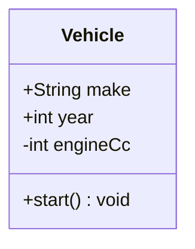

### Visibility prefixes

| Symbol | Meaning |
|---|---|
| `+` | public |
| `-` | private |
| `#` | protected |
| `~` | package / internal |

### Classifiers (append to method signature)

| Symbol | Meaning |
|---|---|
| `$` | static |
| `*` | abstract |

Example: `+drive()* void` = public abstract method.

### Stereotypes

Placed immediately after the class name declaration on the next line or inline:

```
class ISensor {
    <<interface>>
    +sense() SensorReading
}

class Color {
    <<enumeration>>
    RED
    GREEN
    BLUE
}

class BaseRepo {
    <<abstract>>
}

class DataService {
    <<service>>
}
```

`<<interface>>`, `<<enumeration>>`, `<<abstract>>` are the three canonical stereotypes. Any string is accepted inside `<<…>>` but only those three render with special styling in most tools.

### Relationships

```
A --|> B        %% inheritance (A extends B)
A ..|> B        %% realization / implements
A --> B         %% association (A uses B)
A ..> B         %% dependency (dashed)
A --* B         %% composition (A owns B, B cannot exist alone)
A --o B         %% aggregation (A has B, B can exist alone)
A -- B          %% plain link (no direction)
```

Multiplicity on either end:

```
Customer "1" --> "0..*" Order : places
```

Relationship label after a colon at the end of the line.

### Namespace grouping

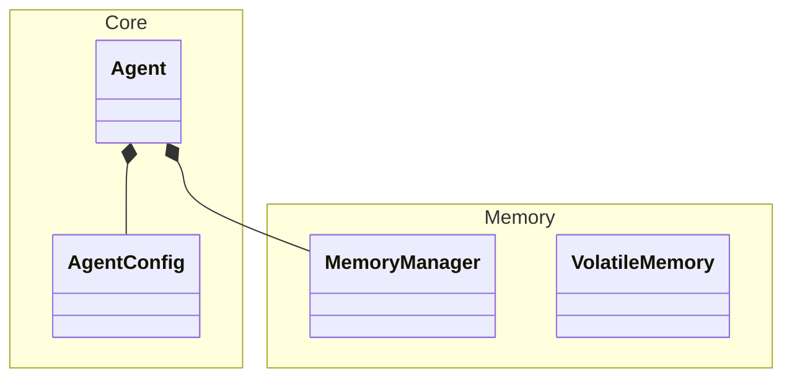

### Critical pitfalls

- **`ClassName<T>` crashes the parser.** Use `ClassNameT` or `ClassName~T~` (tilde syntax renders as angle brackets in some tools but is parser-safe).
- **`Map<K,V>` in an attribute:** write `Map` or `map: JsonObject`.
- **`string?` optional marker:** not valid. Drop the `?`.
- **Two classes with the same name** in one diagram silently merge their members — always use unique class names.
- **`<<enumeration>>` members:** list values as plain attribute lines with no visibility prefix and no type.
- **Long attribute lists:** break the class body into logical groups with blank-line comments (`%% --- identity ---`).

---

## Sequence diagram (`sequenceDiagram`)

Documents time-ordered message exchanges between participants.

### Skeleton

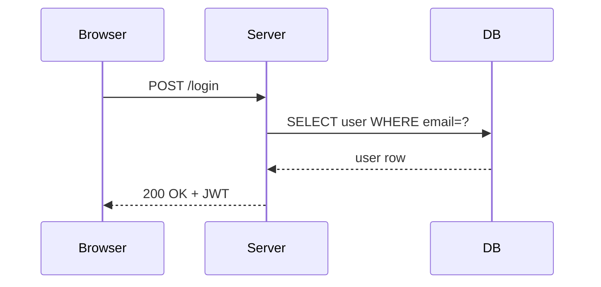

### Arrow types

| Syntax | Meaning |
|---|---|
| `A->B` | solid line, no arrowhead |
| `A-->B` | dashed line, no arrowhead |
| `A->>B` | solid line, open arrowhead |
| `A-->>B` | dashed line, open arrowhead |
| `A-xB` | solid line, cross at B (async / lost message) |
| `A--xB` | dashed line, cross at B |
| `A-)B` | solid line, half-open arrowhead (async) |
| `A--)B` | dashed line, half-open arrowhead |

### Activation boxes

```
activate Server
deactivate Server
```

Or shorthand `+`/`-` on the arrow:

```
Browser->>+Server: request
Server-->>-Browser: response
```

### Loops, alternatives, options, breaks

```
loop Every 30s
    Agent->>Monitor: heartbeat
end

alt success
    Server-->>Client: 200 OK
else failure
    Server-->>Client: 500 Error
end

opt optional header
    Client->>Server: X-Trace-Id
end

break on auth failure
    Server-->>Client: 401 Unauthorized
end
```

### Notes

```
Note right of Server: validates JWT
Note over Client,Server: TLS 1.3
```

### Autonumber

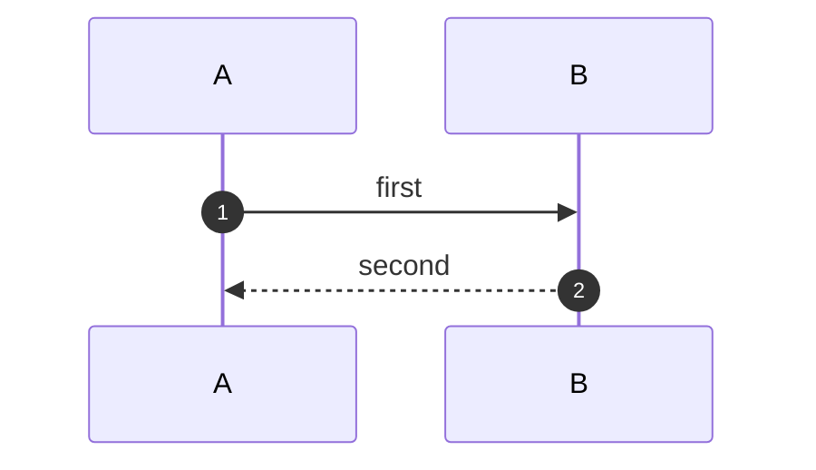

Adds sequential numbers to every arrow automatically.

### Critical pitfalls

- **Participant names with spaces:** declare them explicitly: `participant Load Balancer as LB` then use `LB` in arrows.
- **Aliases must be declared before use.** You cannot use an alias that appears only in an arrow.
- **Nested `alt`/`loop` blocks** must be closed with `end` in the right order — Mermaid is not forgiving of unclosed blocks.
- **`autonumber` resets** if you re-open the block. Put it once at the top.

---

## Flowchart / activity diagram (`flowchart` or `graph`)

`flowchart` is the modern keyword; `graph` is the legacy alias. Both work identically.

### Direction

```
flowchart TD    %% top-down
flowchart LR    %% left-right
flowchart BT    %% bottom-top
flowchart RL    %% right-left
```

### Node shapes

| Syntax | Shape | Use for |
|---|---|---|
| `id[Label]` | rectangle | process / step |
| `id(Label)` | rounded rect | start / end (terminal) |
| `id([Label])` | stadium | start / end alternative |
| `id[[Label]]` | subroutine | predefined process |
| `id[(Label)]` | cylinder | database |
| `id((Label))` | circle | connector / junction |
| `id>Label]` | asymmetric | document / note |
| `id{Label}` | diamond | decision |
| `id{{Label}}` | hexagon | preparation |
| `id[/Label/]` | parallelogram | input / output |
| `id[\Label\]` | reverse parallelogram | output |
| `id[/Label\]` | trapezoid | manual operation |
| `id[\Label/]` | reverse trapezoid | |

### Edge types

| Syntax | Meaning |
|---|---|
| `A --> B` | arrow |
| `A --- B` | line (no arrowhead) |
| `A -->|label| B` | labelled arrow |
| `A -.-> B` | dashed arrow |
| `A ==> B` | thick arrow |
| `A ~~~B` | invisible link (for layout) |
| `A --o B` | circle at B |
| `A --x B` | cross at B |
| `A <--> B` | bidirectional |

### Subgraphs

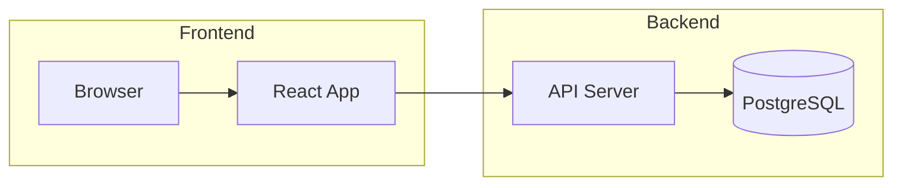

Subgraphs can have a direction override:

```
subgraph id [Title]
    direction TB
    ...
end
```

### Styling

```
classDef hot fill:#E8593C,stroke:#A83020,color:#fff
class A,B hot
```

Or inline: `A[step]:::hot`

### Critical pitfalls

- **Node ID reuse:** if you write `A[Login]` and later `A[Logout]`, Mermaid uses the second label silently. Keep node IDs unique and stable.
- **Parentheses in labels:** `id(process())` is ambiguous. Quote: `id["process()"]`.
- **`{` in labels:** diamond shape. To put braces in a label: `id["{label}"]`.
- **Long IDs in edges:** `VeryLongNodeName --> AnotherLongNodeName` is legal but bloats edge definitions. Use short IDs (`vln`) and put display labels in the node declaration.
- **`graph` vs `flowchart`:** `graph` does not support `direction` inside subgraphs. Use `flowchart` for that feature.

---

## State diagram (`stateDiagram-v2`)

Documents finite-state machines and lifecycle states.

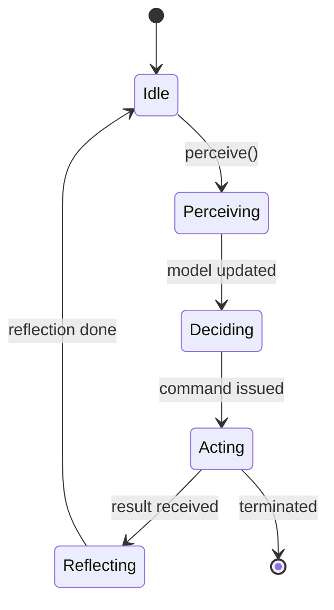

`[*]` is the special start/end pseudostate.

### Composite states (nested)

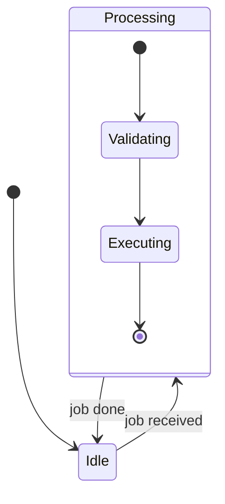

### Fork / join (concurrent)

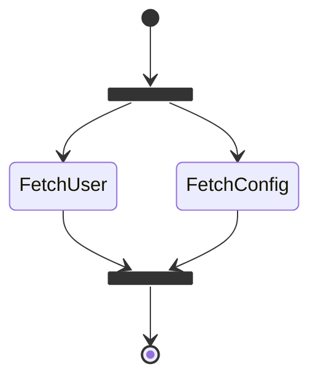

### Choice pseudostate

```
state check <<choice>>
Validating --> check
check --> Accepted : valid
check --> Rejected : invalid
```

### Notes

```
note right of Idle
    Waiting for trigger
end note
```

### Critical pitfalls

- **Use `stateDiagram-v2`**, not `stateDiagram`. v1 is deprecated and has fewer features.
- **`[*]` as both start and end:** the same token can appear as both the initial transition target and the final transition source. This is intentional.
- **Transition labels** go after a colon on the transition line: `A --> B : event / action`.
- **Spaces in state names:** quote them: `state "Order Placed" as op`.

---

## Entity-relationship diagram (`erDiagram`)

Documents database schemas and domain models.

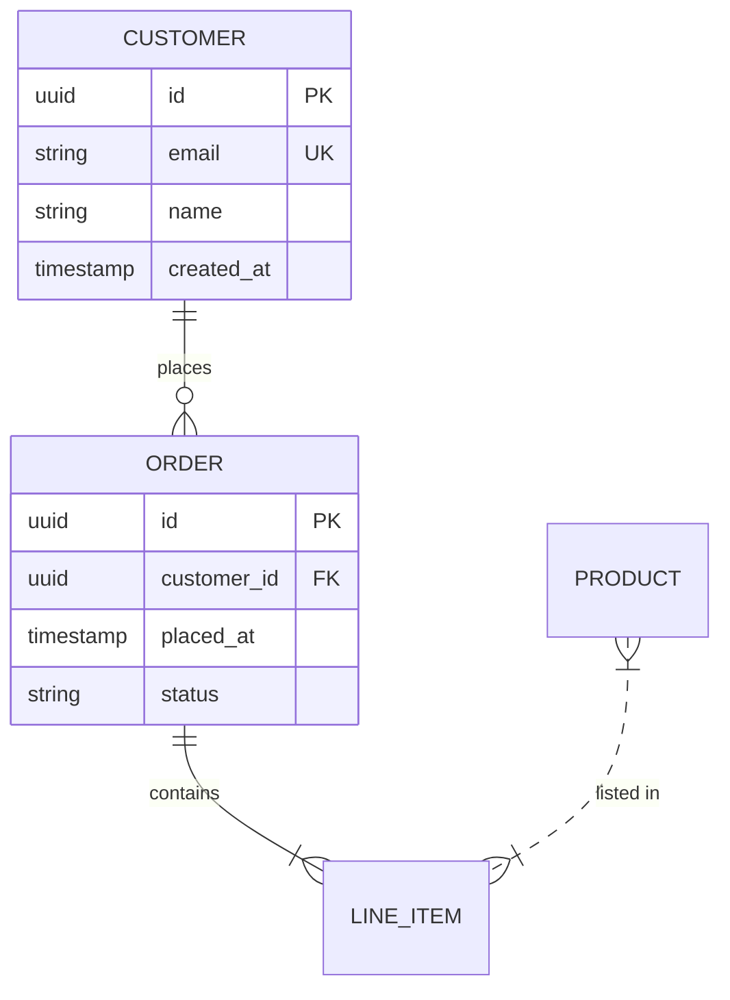

### Relationship syntax

```
EntityA <cardinality>--<cardinality> EntityB : "label"
```

| Symbol | Meaning |
|---|---|
| `\|\|` | exactly one |
| `o\|` | zero or one |
| `\|\{` | one or more |
| `o\{` | zero or more |
| `--` | solid line (identifying) |
| `..` | dashed line (non-identifying) |

### Attribute types and keys

Any word is a valid type. Conventional types: `string`, `int`, `uuid`, `boolean`, `timestamp`, `float`, `json`.

Key suffixes after the attribute name:

| Suffix | Meaning |
|---|---|
| `PK` | primary key |
| `FK` | foreign key |
| `UK` | unique key |

### Critical pitfalls

- **Entity names must be uppercase** or at least consistent — mixing case creates duplicate entities.
- **Attribute names with spaces:** not supported. Use `snake_case`.
- **Relationship labels with spaces** must be quoted: `CUSTOMER ||--o{ ORDER : "placed by"`.
- **No method syntax** inside entity blocks — attributes only.
- **Cardinality symbols are not intuitive:** `||` is "exactly one", `o{` is "zero or more". Memorise or keep this table open.

---

## Use case diagram

Mermaid does not have a native `usecaseDiagram` keyword. Model use cases with a flowchart instead:

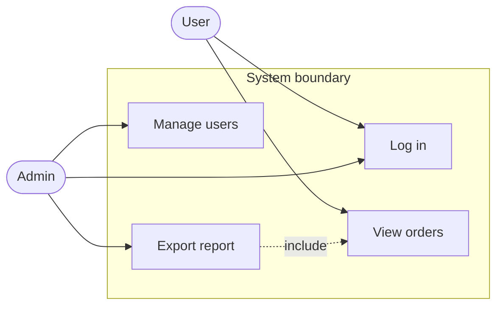

Convention:
- Actors: stadium shape `([Actor Name])` to suggest a person silhouette.
- Use cases: rectangle `[Use case name]` inside a subgraph representing the system boundary.
- `include` / `extend` relationships: dashed arrows with a label.

---

## Component diagram

Mermaid has no `componentDiagram` keyword. Use flowchart with subgraphs:

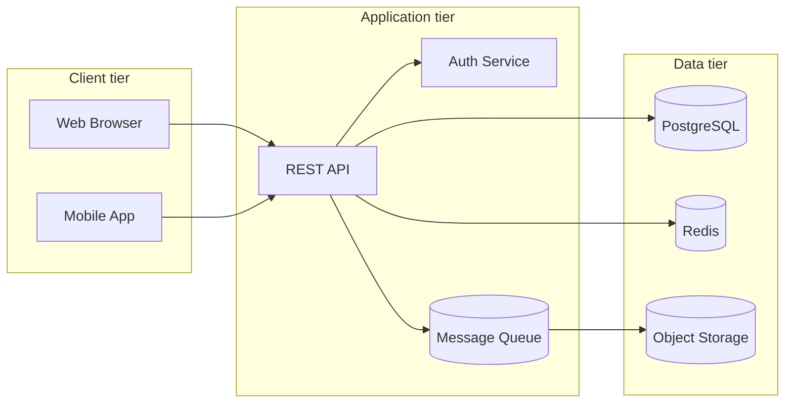

Convention:
- Use `[(name)]` cylinder shape for infrastructure components (databases, queues, caches).
- Use subgraphs for tiers or bounded contexts.
- Interface / port labels go on the edge: `API -->|REST| Auth`.

---

## Deployment diagram

No native keyword. Use flowchart with subgraphs representing environments:

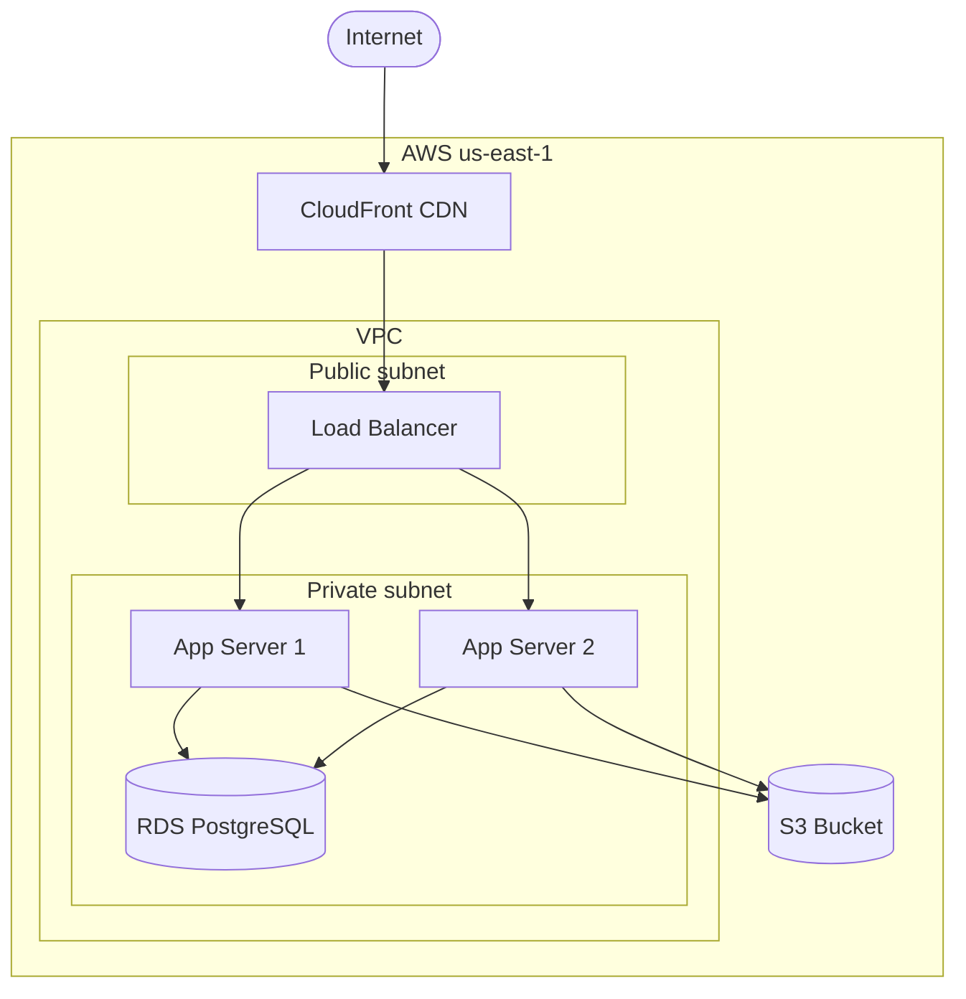

---

## Object diagram

No native keyword. Use classDiagram with instance-style naming and no methods:

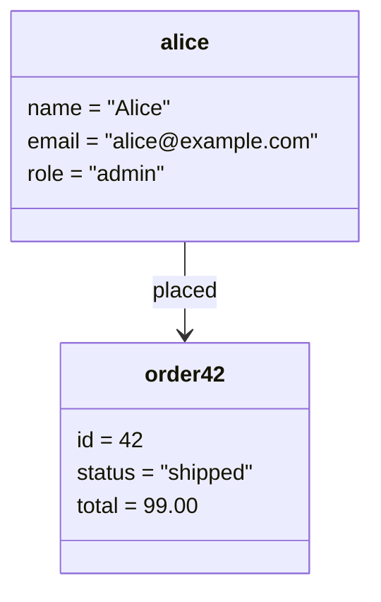

Convention: class names in lowercase to signal instances, attribute lines use `=` instead of type declarations.

---

## Timing diagram (`timeDiagram`)

Documents state changes of signals over time. Supported since Mermaid v9.

```mermaid
timeDiagram
    title Agent lifecycle
    dateFormat s
    axisFormat %S

    section AgentState
        INITIALIZING : 0, 2
        PERCEIVING   : 2, 5
        DECIDING     : 5, 7
        ACTING       : 7, 10
        REFLECTING   : 10, 13
        IDLE         : 13, 20
```

### Critical pitfalls

- `timeDiagram` requires Mermaid ≥ 9.3. Older renderers (older GitHub, some Obsidian plugins) will silently blank the block.
- `dateFormat` and `axisFormat` follow the same tokens as Gantt charts (moment.js format).
- State names with spaces must be quoted.

---

## Gantt chart (`gantt`)

Not a UML artifact but commonly embedded alongside UML in documentation.

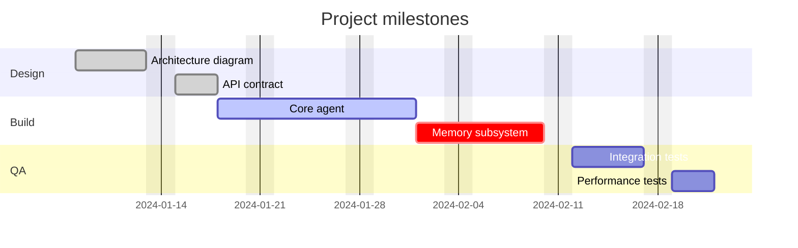

Task statuses: `done`, `active`, `crit` (critical path), blank (pending). `after <id>` sets a dependency.

---

## Mindmap (`mindmap`)

Documents hierarchical structures with indentation depth.

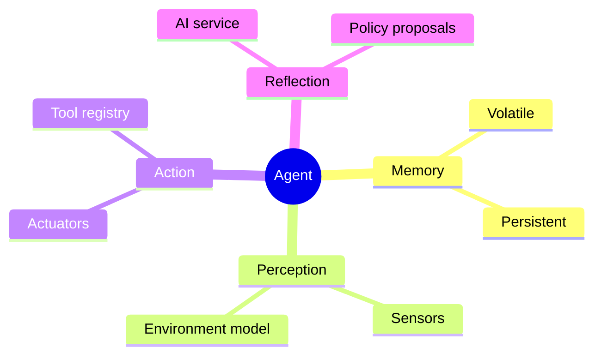

Indentation defines parent–child. Node shapes:

| Syntax | Shape |
|---|---|
| `((text))` | circle |
| `(text)` | rounded rect |
| `[text]` | square |
| `{{text}}` | hexagon |
| plain `text` | default |

---

## Quadrant chart (`quadrantChart`)

Positions items on a 2×2 grid. Useful for priority / impact matrices.

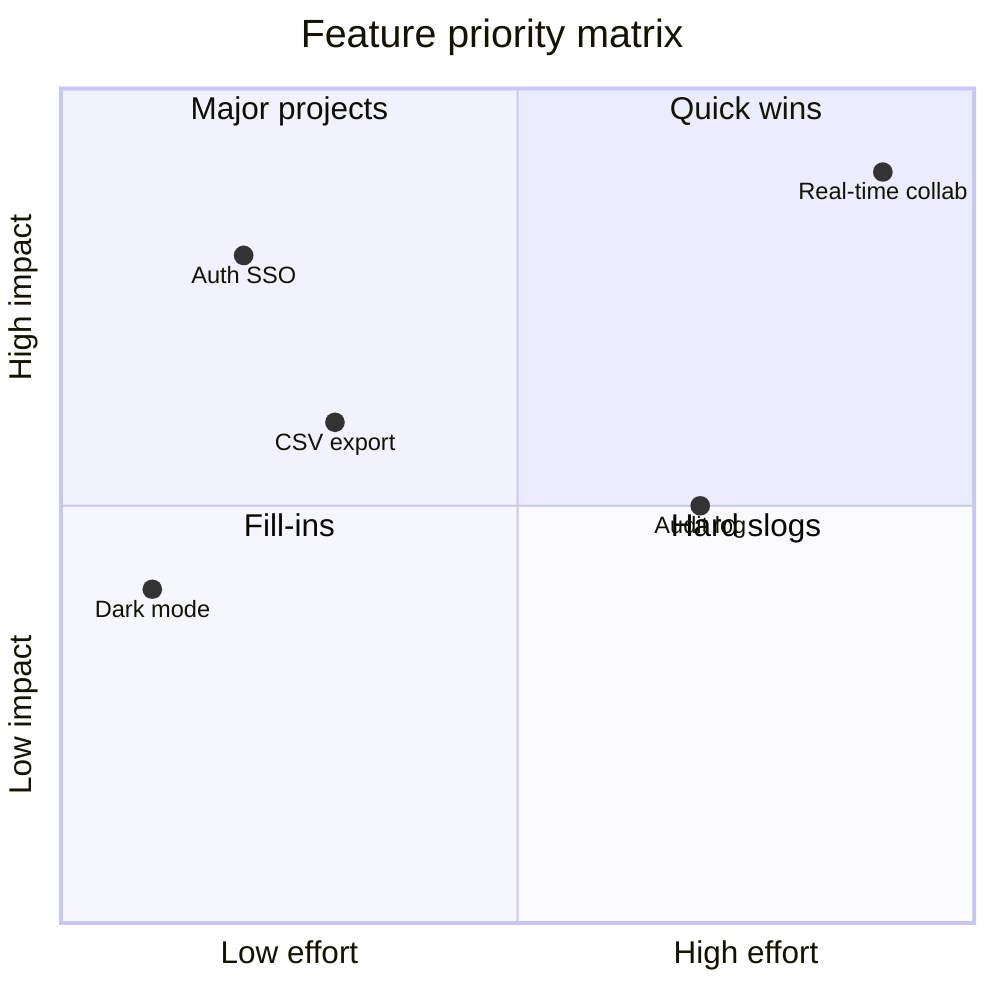

---

## XY chart (`xychart-beta`)

Bar and line charts. Still beta as of Mermaid v11.

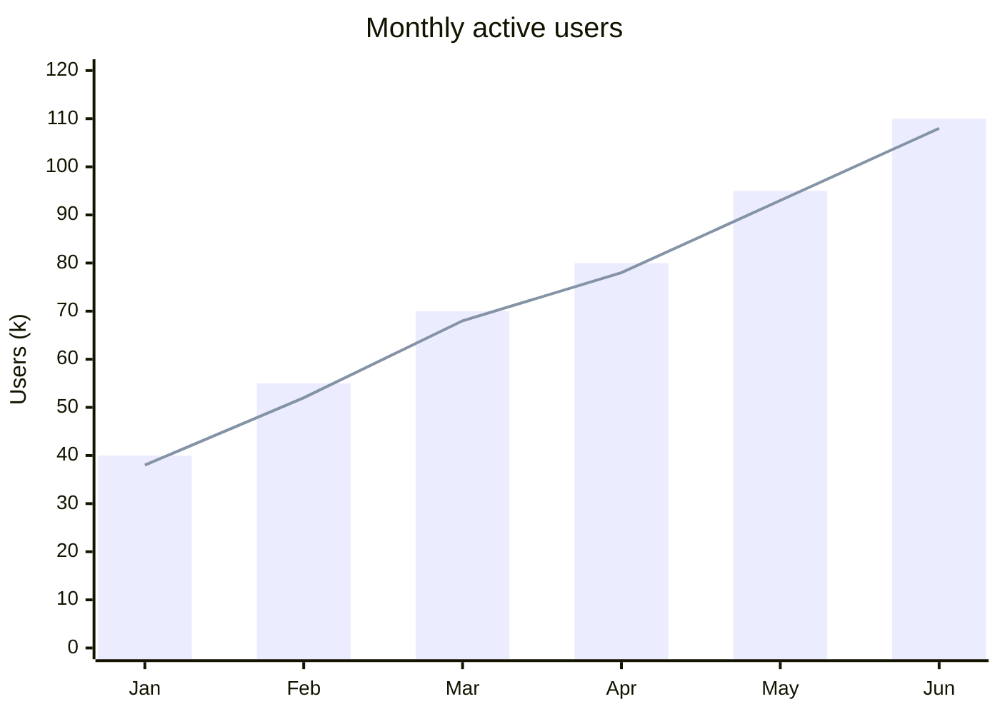

---

## Packet diagram (`packet-beta`)

Documents network packet structure (binary protocol fields).

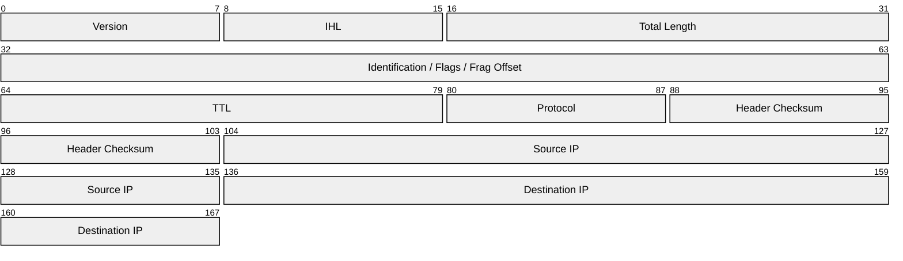

Field ranges are bit positions. Label in quotes.

---

## Block diagram (`block-beta`)

Lays out blocks in a grid. Useful for hardware or system partitioning.

```mermaid
block-beta
    columns 3
    A["CPU"] B["RAM"] C["GPU"]
    D["Storage"]:2 E["NIC"]
```

`:2` makes a block span 2 columns.

---

## Architecture diagram (`architecture-beta`)

Positions named service icons in a spatial layout with groups. Mermaid v11+.

```mermaid
architecture-beta
    group cloud(cloud)[Cloud]

    service db(database)[Database] in cloud
    service api(server)[API Server] in cloud
    service queue(server)[Message Queue] in cloud

    db:L -- R:api
    api:R -- L:queue
```

Services use `(icon_name)` from the built-in icon set. Connections use cardinal directions: `L`, `R`, `T`, `B`.

---

## Embedding rules for Markdown

### Renderer compatibility matrix

| Renderer | Class | Sequence | Flowchart | State | ER | Timing | Mindmap | Notes |
|---|---|---|---|---|---|---|---|---|
| GitHub | ✓ | ✓ | ✓ | ✓ | ✓ | ✓ | ✓ | Mermaid version pinned by GitHub; some beta features lag |
| GitLab | ✓ | ✓ | ✓ | ✓ | ✓ | partial | ✓ | Uses older Mermaid, `timeDiagram` may not render |
| Obsidian | ✓ | ✓ | ✓ | ✓ | ✓ | ✓ | ✓ | Plugin version matters; update regularly |
| Docusaurus | ✓ | ✓ | ✓ | ✓ | ✓ | ✓ | ✓ | Requires `@docusaurus/theme-mermaid` |
| MkDocs Material | ✓ | ✓ | ✓ | ✓ | ✓ | ✓ | ✓ | Requires `pymdownx.superfences` + mermaid config |
| Notion | — | — | — | — | — | — | — | Not supported natively |
| VS Code | ✓ | ✓ | ✓ | ✓ | ✓ | ✓ | ✓ | Via Markdown Preview Mermaid Support extension |

### Front matter / config block

Some renderers accept a global Mermaid config at the top of the file (Docusaurus, MkDocs):

```yaml
---
mermaid:
  theme: default
---
```

Inside a diagram, per-diagram config goes in an `%%{init: ...}%%` directive on the first line of the code block:

````
```mermaid
%%{init: {"theme": "dark", "themeVariables": {"primaryColor": "#1a1a2e"}}}%%
classDiagram
    ...
```
````

### Themes

Built-in Mermaid themes: `default`, `dark`, `neutral`, `forest`, `base`.

`base` is required when you want to override individual `themeVariables`:

```
%%{init: {"theme": "base", "themeVariables": {
    "primaryColor": "#E1F5EE",
    "primaryTextColor": "#04342C",
    "lineColor": "#0F6E56"
}}}%%
```

### File organisation for large diagrams

When a file contains more than three or four diagrams, consider:

1. **One diagram per section** — each diagram immediately follows the prose that references it.
2. **Separate diagram files** — `diagrams/class-model.md` imported or linked from the main doc. MkDocs and Docusaurus support `--8<--` or `mdx_include` for this pattern.
3. **Caption convention** — place a sentence or short paragraph above every diagram explaining what it shows; never leave a bare diagram block with no surrounding context.

### Accessibility

Mermaid-generated SVGs do not automatically include ARIA roles or `<title>` elements. For published documentation, add a short `alt`-style caption above or below every diagram in Markdown so screen readers have context.

---

## Checklist before committing a Mermaid diagram

- [ ] Fenced with ` ```mermaid ` and closed with ` ``` ` on its own line
- [ ] Diagram type keyword on the first non-blank line after the fence
- [ ] No `<T>` generic parameters in class or node names
- [ ] No `?` nullable markers in attribute types
- [ ] No unquoted labels containing spaces, `{`, `}`, `<`, `>`
- [ ] All `alt`, `loop`, `opt`, `break`, `subgraph`, `state` blocks closed with `end`
- [ ] Participant / actor names declared before use in sequence diagrams
- [ ] Node IDs are unique within the diagram
- [ ] `stateDiagram-v2` used, not `stateDiagram`
- [ ] `erDiagram` entity names are uppercase and consistent
- [ ] Diagram tested in the target renderer before merging
