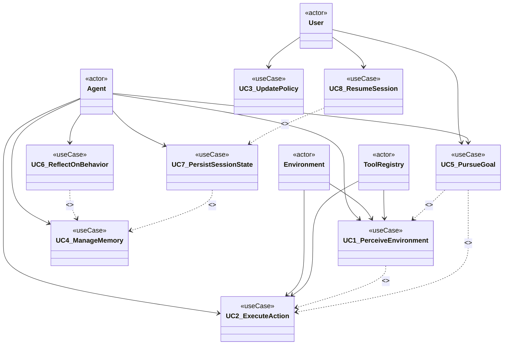

# Analysis 002: Use Cases — feature_007.agentx_intelligent_agent_behaviour

> **Phase:** Analysis | **Artifact:** analysis_002_use_cases.md
> **Feature:** feature_007.agentx_intelligent_agent_behaviour | **Task:** A1

---

## Actors

| Actor | Description |
|-------|-------------|
| **User** | Human operator who initiates sessions, provides objectives, observes agent behavior |
| **Agent** | The intelligent agent instance with persistent identity, sensors, actuators, memory, policies |
| **Environment** | The runtime context: file system, agentx application, repositories, databases, UI |
| **Tool Registry** | Catalog of available sensors/actuators the agent can use |

---

## Use Case Diagram (Mermaid)

> **Note:** Mermaid does not support native `useCaseDiagram`. This is modeled as a `classDiagram` with `<<useCase>>` stereotypes for structural clarity and renderability.

---

## Use Case Specifications

### UC1: Perceive Environment
**Primary Actor:** Agent  
**Secondary Actors:** Environment, Tool Registry  
**Preconditions:** Agent is initialized; sensors registered  
**Postconditions:** Sensor readings stored in volatile memory; environment model updated  
**Main Flow:**
1. Agent triggers perception cycle (periodic or event-driven)
2. For each registered sensor tool:
   - Invoke sensor's `sense()` method
   - Receive `SensorReading` (data + timestamp + confidence)
3. Aggregate readings into `EnvironmentModel`
4. Store in volatile memory (`WorkingContext`)
5. Notify Policy Engine of environment change

**Alternate Flows:**
- Sensor fails → log error, use cached reading, continue
- No sensors registered → skip perception, use last known model

---

### UC2: Execute Action
**Primary Actor:** Agent  
**Secondary Actors:** Environment, Tool Registry  
**Preconditions:** Policy Engine has selected an action; actuator tools available  
**Postconditions:** Actuator command executed; result stored in memory; environment potentially changed  
**Main Flow:**
1. Policy Engine produces `ActuatorCommand` (tool + parameters + expected outcome)
2. Agent resolves tool from Tool Registry
3. Validate preconditions (permissions, resources)
4. Invoke actuator's `act(command)` method
5. Receive `ActuatorResult` (success/failure, side effects, observations)
6. Store result in volatile memory
7. Update Environment Model if needed
8. Trigger Reflection Engine for outcome analysis

**Alternate Flows:**
- Tool not found → log error, select alternative action
- Actuator fails → store failure, trigger re-planning
- Confirmation required → pause, request User confirmation, resume

---

### UC3: Update Policy
**Primary Actor:** User (or Agent via Reflection)  
**Secondary Actors:** Policy Engine  
**Preconditions:** Policy Rule or adaptation signal exists  
**Postconditions:** Policy store updated; future decisions use new rules  
**Main Flow (User-driven):**
1. User provides new policy rule (via UI or config file)
2. Validate rule syntax and semantics
3. Check for conflicts with existing rules
4. Assign priority; resolve conflicts
5. Persist to Policy Store
6. Notify Policy Engine of update

**Main Flow (Agent-driven adaptation):**
1. Reflection Engine proposes policy change (from UC6)
2. Agent evaluates proposal against safety constraints
3. If approved: persist, notify Policy Engine
4. If rejected: log rationale, retain current policy

---

### UC4: Manage Memory
**Primary Actor:** Agent  
**Secondary Actors:** Memory Store (Volatile + Persistent)  
**Preconditions:** Memory stores initialized  
**Postconditions:** Memory state consistent; relevant data accessible  
**Main Flow (Volatile → Persistent Consolidation):**
1. Periodic consolidation trigger (time-based or significance-based)
2. Select volatile entries meeting persistence criteria (importance, frequency, user-marked)
3. Transform for persistent storage (compress, link, summarize)
4. Write to Persistent Memory Store
5. Update indices; maintain cross-references
6. Optionally evict from volatile memory

**Main Flow (Retrieval):**
1. Agent requests memory by query (semantic, temporal, goal-related)
2. Search volatile memory first (fast)
3. If not found, search persistent memory (semantic index)
4. Return `MemoryEntry` with metadata (source, age, relevance)

**Alternate Flows:**
- Memory full → evict lowest-priority volatile entries
- Corruption detected → recover from backup, log incident

---

### UC5: Pursue Goal
**Primary Actor:** Agent  
**Secondary Actors:** Goal Manager, Policy Engine, UC1, UC2  
**Preconditions:** Goal (user-given or agent-derived) exists in Goal Tree  
**Postconditions:** Goal achieved, failed, or decomposed; sub-goals created  
**Main Flow:**
1. Goal Manager selects active goal (priority, dependencies, readiness)
2. If goal is atomic:
   - Decompose into `ActuatorCommand` via Policy Engine
   - Execute via UC2
   - Evaluate outcome; mark goal complete/failed
3. If goal is composite:
   - Decompose into sub-goals (AND/OR decomposition)
   - Add sub-goals to Goal Tree
   - Recurse for each sub-goal
4. Monitor progress; re-plan if environment changes (via UC1)
5. On completion: update Goal Tree, trigger Reflection (UC6)

**Alternate Flows:**
- Goal blocked → create "unblock" sub-goal, retry
- Goal obsolete → mark abandoned, clean up sub-goals
- Resource exhausted → pause, request User intervention

---

### UC6: Reflect on Behavior
**Primary Actor:** Agent (Reflection Engine)  
**Secondary Actors:** Memory Store, Policy Engine, AI Service  
**Preconditions:** Recent action/decision history available; AI Service configured  
**Postconditions:** Reflection log entry created; potential policy/memory updates proposed  
**Main Flow:**
1. Trigger: periodic, post-goal, post-failure, or User-requested
2. Collect reasoning trace: decisions, sensor readings, actions, outcomes
3. Construct reflection prompt (template + trace + context)
4. Invoke AI Service for self-critique
5. Parse response: insights, proposed policy changes, improvement ideas
6. Create `ReflectionEntry` (trace + critique + proposals)
7. Store in Reflection Log (persistent)
8. If proposals pass safety check: forward to UC3 (Update Policy) or UC4 (Manage Memory)

**Alternate Flows:**
- AI Service unavailable → skip reflection, log deferred
- Low confidence critique → flag for User review, don't auto-apply

---

### UC7: Persist Session State
**Primary Actor:** Agent  
**Secondary Actors:** Persistence Layer (SQLite/JSON)  
**Preconditions:** Session active; dirty state exists  
**Postconditions:** All agent state saved; session resumable  
**Main Flow:**
1. Trigger: periodic, on goal completion, on User request, on shutdown
2. Collect state: AgentConfig, volatile memory, Policy Store, Goal Tree, Reflection Log position
3. Serialize to session directory (versioned JSON/SQLite)
4. Write atomically (temp file + rename)
5. Update session index

---

### UC8: Resume Session
**Primary Actor:** User  
**Secondary Agents:** Agent, Persistence Layer  
**Preconditions:** Valid session directory exists  
**Postconditions:** Agent restored to last state; ready for interaction  
**Main Flow:**
1. User selects session to resume
2. Load SessionConfig and AgentConfig
3. Restore Persistent Memory, Policy Store, Goal Tree, Reflection Log
4. Initialize volatile memory (empty or from last checkpoint)
5. Re-register sensors/actuators from Tool Registry
6. Initialize Policy Engine with restored rules
7. Resume Goal Manager with active goals
8. Agent enters Perceiving state (UC1)

---

## Traceability to Requirements (FEATURE.md)

| Requirement (FEATURE.md) | Use Cases |
|--------------------------|-----------|
| Persistent identity across sessions | UC7, UC8 |
| Perceive environment state | UC1 |
| Configurable policies | UC3 |
| Goal-directed behavior | UC5 |
| Memory system (volatile + persistent) | UC4 |
| Tool integration | UC1, UC2 |
| Observable decision-making | UC6 |

---

## Notes

- Use cases follow the **Sensor → Decide → Act → Reflect** cycle
- Each use case maps to a distinct component in the class diagram (A2)
- Non-functional requirements (latency, memory bounds) documented in A7
- State diagram (A5) shows Agent lifecycle across these use cases