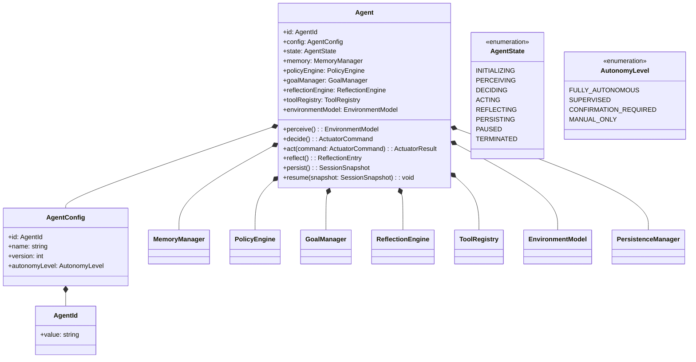
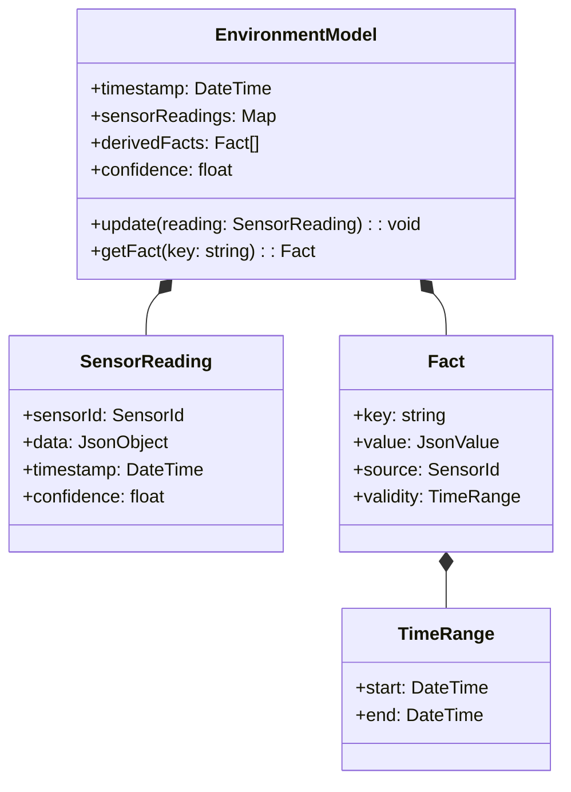
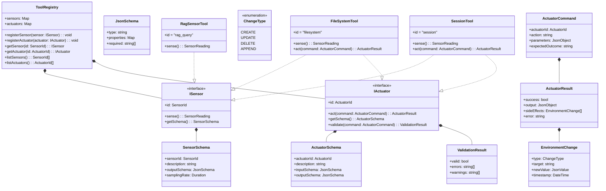
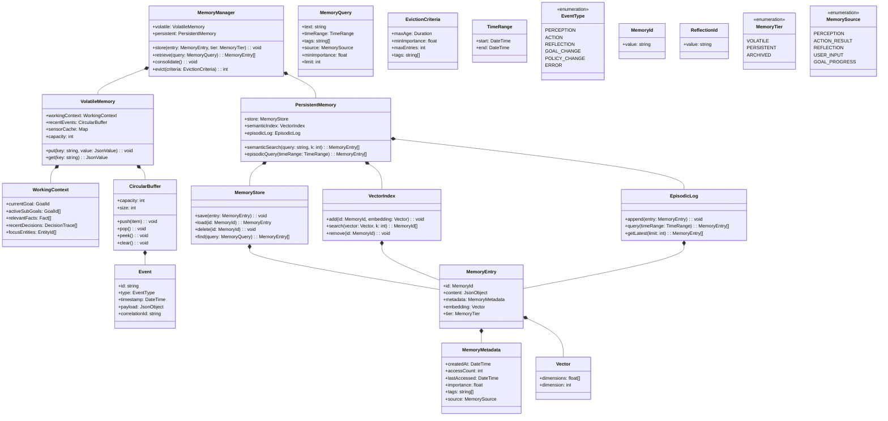
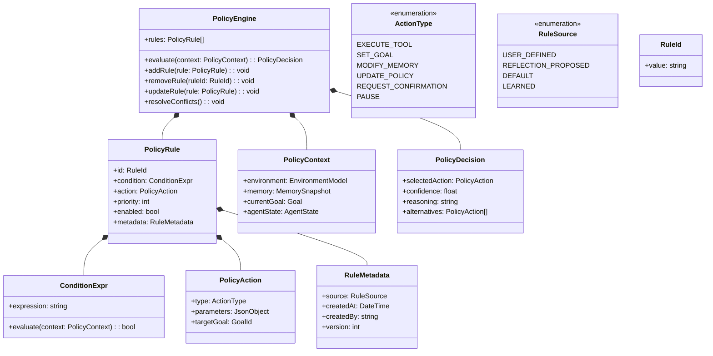
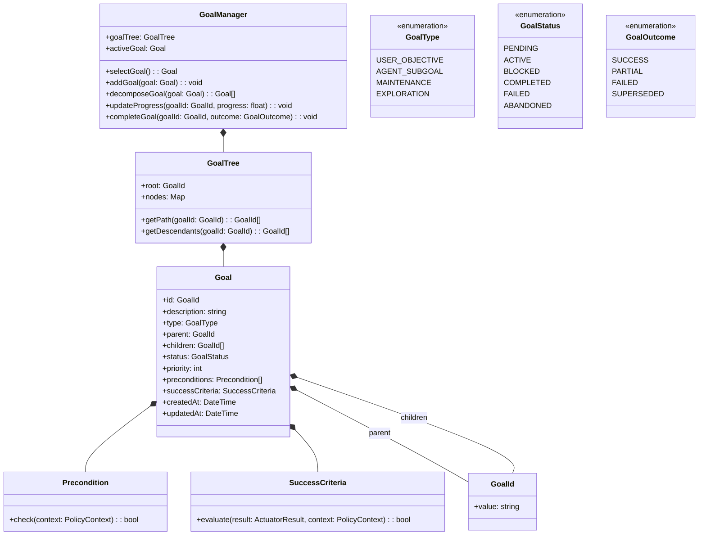
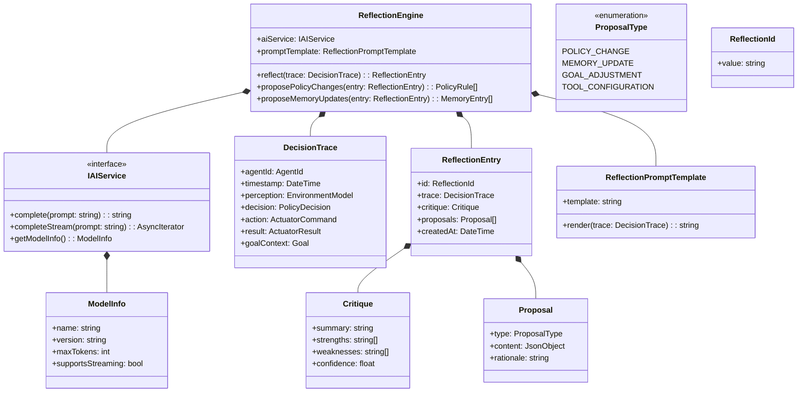
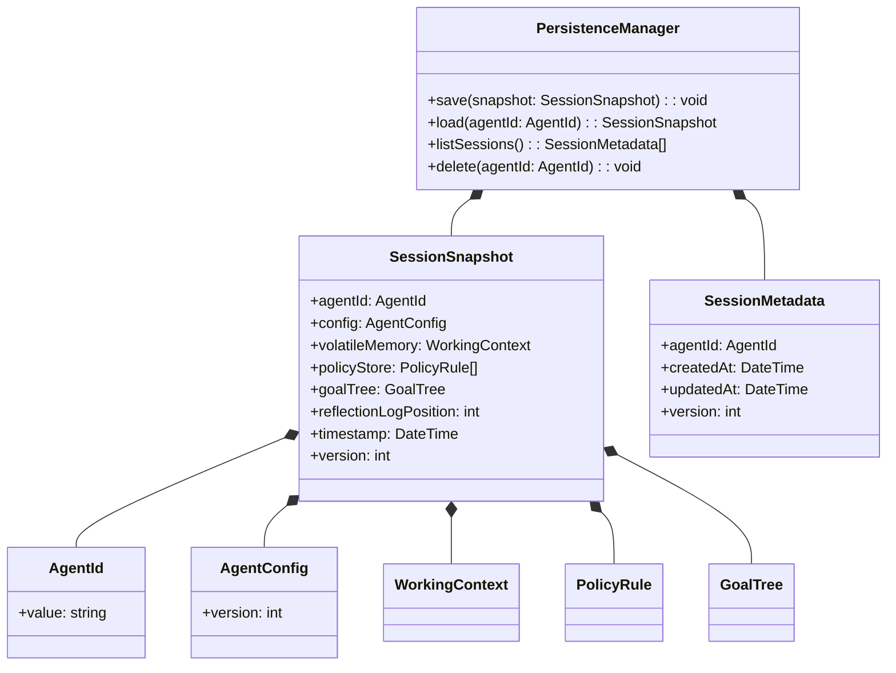
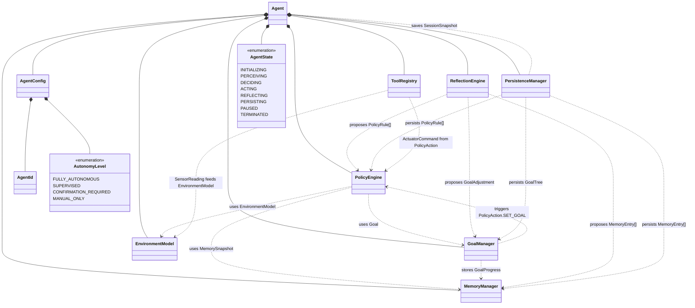

# Analysis 003: Class Diagram — feature_007.agentx_intelligent_agent_behaviour

> **Phase:** Analysis | **Artifact:** analysis_003_class_diagram.md
> **Feature:** feature_007.agentx_intelligent_agent_behaviour | **Task:** A2

---

## Core Class Diagram — Overview (Mermaid)

High-level view showing the Agent facade and its 7 core subsystems.



---

## 1. Configuration & Identity (Mermaid)

```mermaid
classDiagram
    %% Configuration & Identity
    class AgentConfig {
        +id: AgentId
        +name: string
        +version: int
        +sensors: SensorConfig[]
        +actuators: ActuatorConfig[]
        +policyConfig: PolicyConfig
        +memoryConfig: MemoryConfig
        +goalConfig: GoalConfig
        +reflectionConfig: ReflectionConfig
        +autonomyLevel: AutonomyLevel
        +createdAt: DateTime
        +updatedAt: DateTime
    }

    class SensorConfig {
        +id: SensorId
        +type: string
        +enabled: bool
        +parameters: JsonObject
    }

    class ActuatorConfig {
        +id: ActuatorId
        +type: string
        +enabled: bool
        +parameters: JsonObject
    }

    class PolicyConfig {
        +rulesFile: string
        +conflictResolution: ConflictResolutionStrategy
        +defaultAutonomy: AutonomyLevel
    }

    class MemoryConfig {
        +volatileCapacity: int
        +persistentPath: string
        +consolidationInterval: Duration
        +embeddingModel: string
    }

    class GoalConfig {
        +maxActiveGoals: int
        +defaultPriority: int
        +autoDecompose: bool
    }

    class ReflectionConfig {
        +enabled: bool
        +interval: Duration
        +promptTemplate: string
        +aiServiceId: string
    }

    class ConflictResolutionStrategy {
        <<enumeration>>
        PRIORITY_WINS
        MOST_RECENT
        USER_PROMPT
        DENY_ALL
    }

    class AgentId { +value: string }
    class SensorId { +value: string }
    class ActuatorId { +value: string }
    class RuleId { +value: string }
    class GoalId { +value: string }
    class MemoryId { +value: string }
    class ReflectionId { +value: string }

    class AgentState {
        <<enumeration>>
        INITIALIZING
        PERCEIVING
        DECIDING
        ACTING
        REFLECTING
        PERSISTING
        PAUSED
        TERMINATED
    }

    class AutonomyLevel {
        <<enumeration>>
        FULLY_AUTONOMOUS
        SUPERVISED
        CONFIRMATION_REQUIRED
        MANUAL_ONLY
    }

    AgentConfig *-- SensorConfig
    AgentConfig *-- ActuatorConfig
    AgentConfig *-- PolicyConfig
    AgentConfig *-- MemoryConfig
    AgentConfig *-- GoalConfig
    AgentConfig *-- ReflectionConfig
```



---

## 2. Perception & Environment Model (Mermaid)



---

## 3. Tools & Tool Registry (Mermaid)



---

## 4. Memory System (Mermaid)



---

## 5. Policy Engine (Mermaid)



---

## 6. Goal Management (Mermaid)



---

## 7. Reflection Engine (Mermaid)



---

## 8. Persistence (Mermaid)



---

## Key Relationships Summary (Mermaid)

Cross-cutting relationships between the 8 subsystems.



---

## Key Design Decisions

| Decision | Rationale |
|----------|-----------|
| **Agent as Facade** | Single entry point orchestrating all subsystems; follows MVC++ Controller pattern |
| **Tool Registry with ISensor/IActuator** | Clear separation of perception vs. action; enables tool composition; testable via mocks |
| **Two-tier Memory** | Volatile for low-latency working context; Persistent for long-term knowledge; consolidation bridge |
| **Policy Engine as Rule Evaluator** | Declarative, inspectable, hot-reloadable; supports User-defined + Reflection-proposed rules |
| **Goal Tree with AND/OR Decomposition** | Hierarchical planning; supports User objectives → Agent sub-goals; tracks progress |
| **Reflection Engine using AIService** | Reuses existing AI infrastructure; LLM-based self-critique; produces actionable proposals |
| **Versioned Session Snapshots** | Atomic persistence; migration-friendly; supports resume + audit trail |

---

## Interface Contracts (for MVC++ Compliance)

### Abstract Partners (to be implemented in Design phase)

| Partner | Purpose | Implemented By |
|---------|---------|----------------|
| `IAgentViewPartner` | View → Agent: user input, display requests | TUI/Console adapters |
| `IAgentModelPartner` | Model → Agent: persistence events, config changes | SessionDatabase, ConfigStore |
| `IToolRegistryPartner` | Agent → Tools: discovery, health checks | ToolRegistry |
| `IMemoryStorePartner` | Agent → Memory: CRUD, indexing | SQLiteVectorStore, JSONStore |
| `IPolicyStorePartner` | Agent → Policy: CRUD, versioning | PolicyDatabase |

### Agent as Abstract Partner (to Controllers/Views)

```python
class IAgentPartner(ABC):
    @abstractmethod
    def start_session(self, config: AgentConfig) -> AgentId: ...
    @abstractmethod
    def resume_session(self, agent_id: AgentId) -> AgentId: ...
    @abstractmethod
    def submit_goal(self, agent_id: AgentId, goal: Goal) -> GoalId: ...
    @abstractmethod
    def get_status(self, agent_id: AgentId) -> AgentStatus: ...
    @abstractmethod
    def get_reflection_log(self, agent_id: AgentId, limit: int) -> list[ReflectionEntry]: ...
    @abstractmethod
    def update_policy(self, agent_id: AgentId, rule: PolicyRule) -> void: ...
    @abstractmethod
    def set_autonomy(self, agent_id: AgentId, level: AutonomyLevel) -> void: ...
```

---

## Integration Points with Existing Codebase

| Feature | Integration Point | Approach |
|---------|------------------|----------|
| **feature_004 (Modern UI)** | `TUIProvider` → register `AgentAdapter` | New `AgentTUIScreen` implementing `IAgentView` |
| **feature_002 (RAG)** | `Rag` class → wrap as `RagSensorTool` | Implement `ISensor` using `Rag.query()` |
| **feature_001 (Session Objectives)** | `IGoalManager` interface | Stub implementation now; swap when 001 lands |
| **Session Persistence** | Extend `SessionDatabase` | Add Agent tables; reuse SQLite pattern |
| **AI Service** | Reuse `AIService` for Reflection | Existing streaming + provider abstraction |

---

## Traceability to Use Cases (A1)

| Class / Component | Primary Use Case(s) |
|-------------------|---------------------|
| Agent | All (orchestrator) |
| ToolRegistry, ISensor, IActuator | UC1, UC2 |
| EnvironmentModel, SensorReading | UC1 |
| MemoryManager, VolatileMemory, PersistentMemory | UC4 |
| PolicyEngine, PolicyRule | UC3, UC5 |
| GoalManager, Goal, GoalTree | UC5 |
| ReflectionEngine, ReflectionEntry | UC6 |
| PersistenceManager, SessionSnapshot | UC7, UC8 |
| FileSystemTool, RagSensorTool, SessionTool | UC1, UC2 (concrete tools) |

---

## Notes

- All interfaces marked `<<interface>>` follow MVC++ Abstract Partner pattern
- Concrete tools (FileSystemTool, etc.) implement both ISensor and IActuator where applicable
- PolicyEngine is stateless (rules passed in) → highly testable
- ReflectionEngine depends on `IAIService` abstraction (not concrete provider)
- AgentConfig versioning enables migration across schema changes