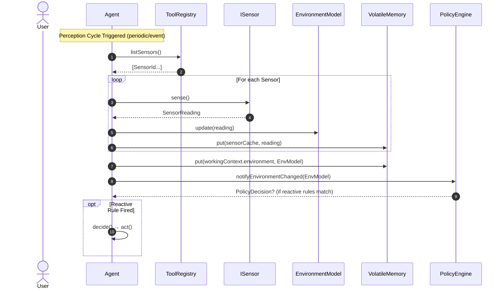
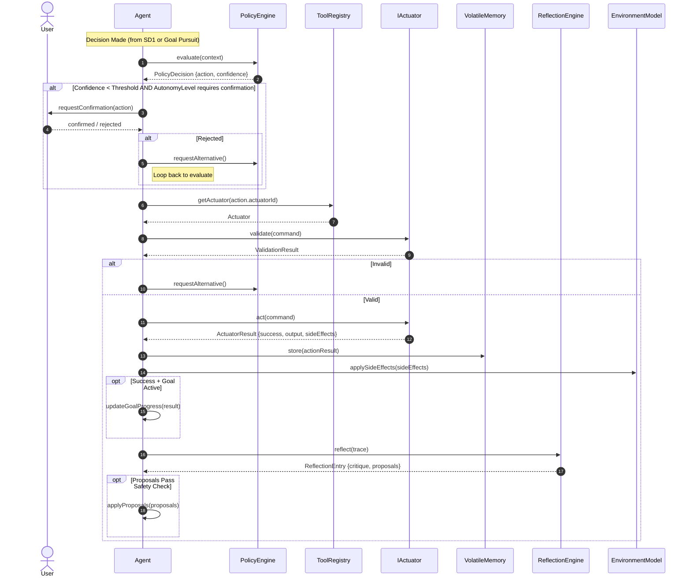
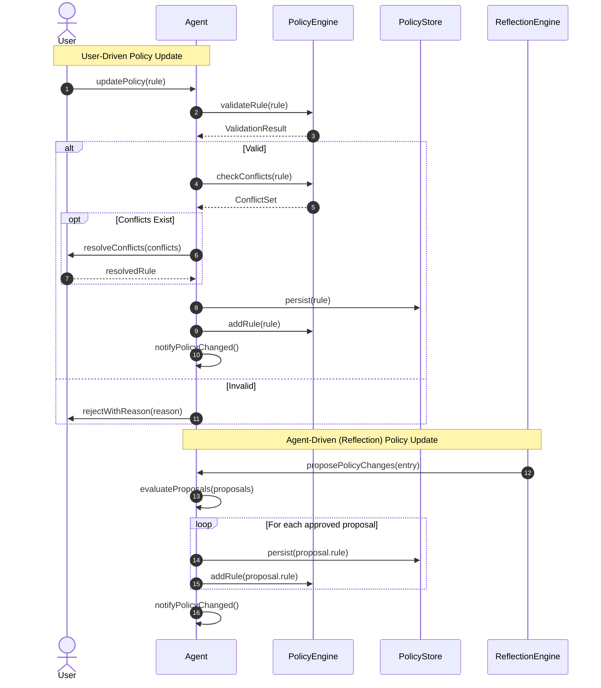
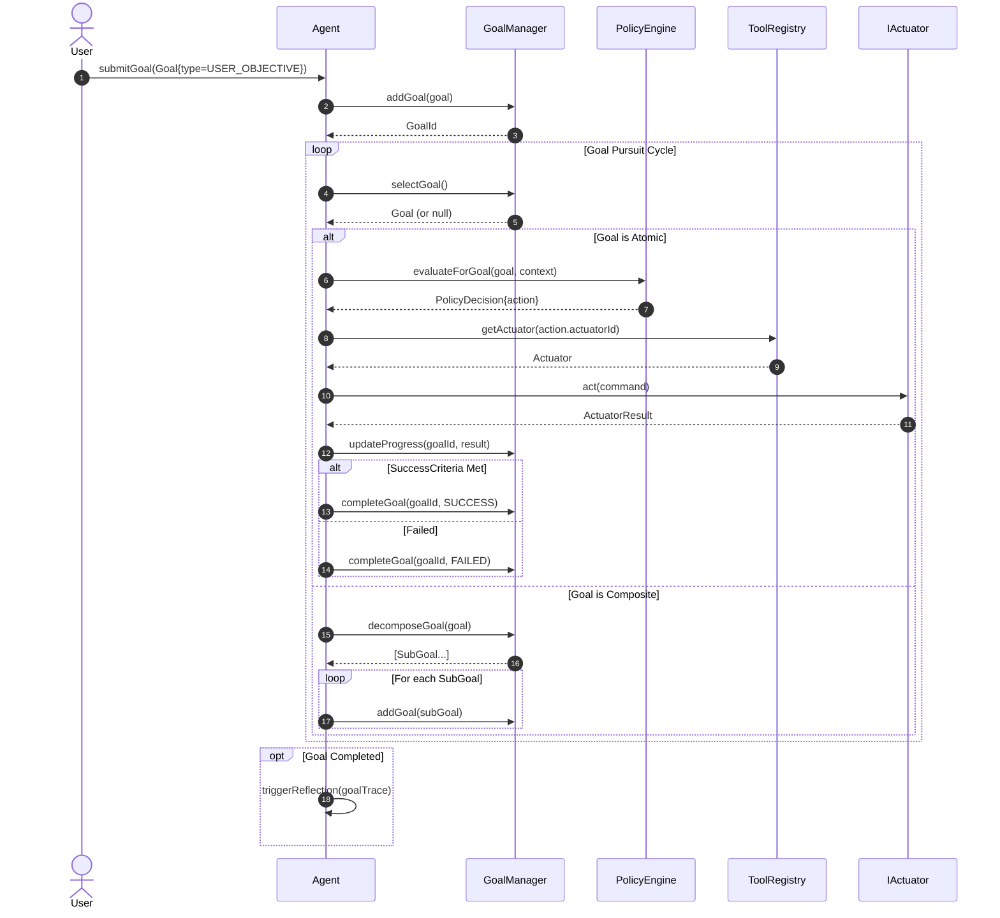
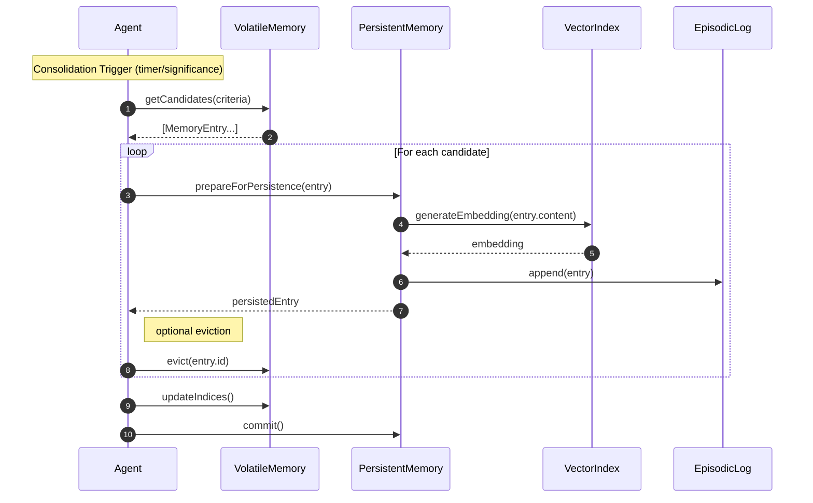
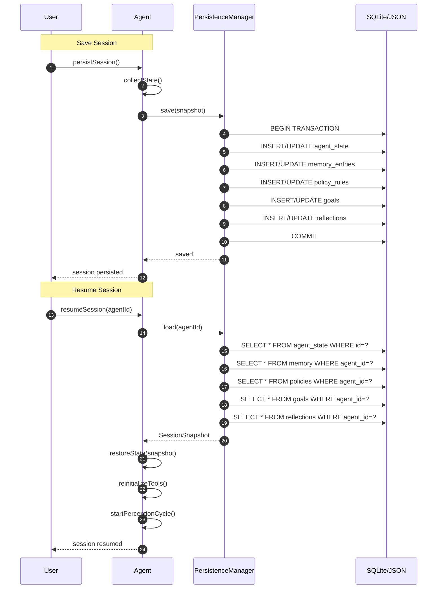
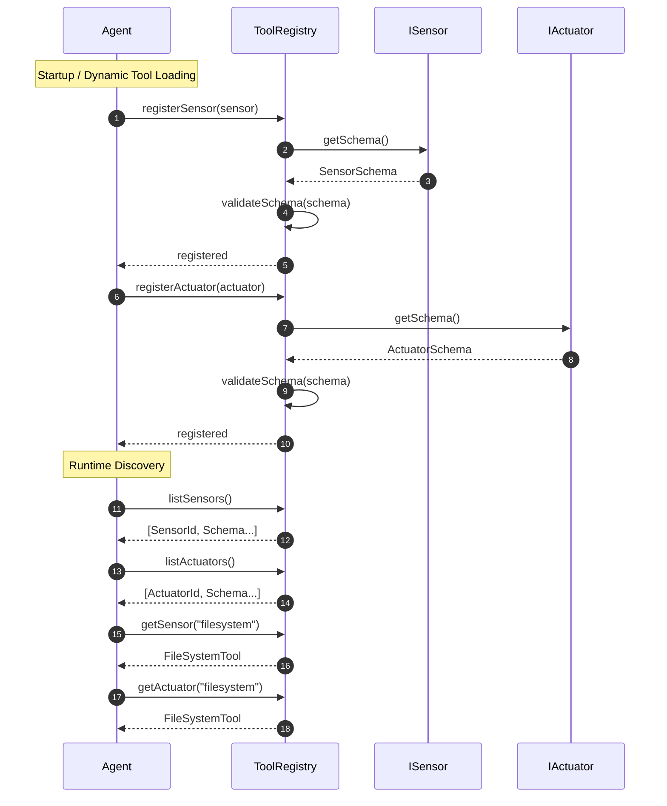

# Analysis 004: Sequence Diagrams — feature_007.agentx_intelligent_agent_behaviour

> **Phase:** Analysis | **Artifact:** analysis_004_sequence_diagrams.md
> **Feature:** feature_007.agentx_intelligent_agent_behaviour | **Task:** A3

---

## Sequence Diagram Overview

Key flows showing the **Sensor → Decide → Act → Reflect** cycle and session management.

---

## SD1: Agent Perception Cycle



---

## SD2: Action Execution Flow



---

## SD3: Policy Evaluation & Update



---

## SD4: Goal Decomposition & Pursuit



---

## SD5: Memory Consolidation (Volatile → Persistent)



---

## SD6: Reflection Cycle

```mermaid
sequenceDiagram
    autonumber
    participant Agent
    participant ReflectionEngine
    participant AIService as IAIService
    participant PolicyEngine
    participant MemoryManager
    participant ReflectionLog

    Note over Agent: Reflection Triggered (periodic/post-goal/post-failure/user)
    Agent->>ReflectionEngine: reflect(trace)
    
    ReflectionEngine->>ReflectionEngine: buildPrompt(trace)
    ReflectionEngine->>AIService: complete(prompt)
    AIService-->>ReflectionEngine: Response (streaming or batch)
    
    ReflectionEngine->>ReflectionEngine: parseResponse(response)
    ReflectionEngine-->>Agent: ReflectionEntry {critique, proposals}
    
    Agent->>ReflectionLog: append(entry)
    
    loop For each proposal
        alt ProposalType.POLICY_CHANGE
            Agent->>PolicyEngine: evaluateProposal(proposal)
            opt Approved
                Agent->>PolicyEngine: addRule(proposal.rule)
        else ProposalType.MEMORY_UPDATE
            Agent->>MemoryManager: store(proposal.entry, PERSISTENT)
        else ProposalType.GOAL_ADJUSTMENT
            Agent->>GoalManager: adjustGoal(proposal.goalId, proposal.changes)
        end
    end
```

---

## SD7: Session Persistence



---

## SD8: Tool Registration & Discovery



---

## Summary of Participants per Flow

| Sequence | Primary Participants |
|----------|---------------------|
| SD1: Perception | Agent, ToolRegistry, ISensor, EnvironmentModel, VolatileMemory, PolicyEngine |
| SD2: Action | Agent, PolicyEngine, ToolRegistry, IActuator, VolatileMemory, ReflectionEngine |
| SD3: Policy Update | User, Agent, PolicyEngine, PolicyStore, ReflectionEngine |
| SD4: Goal Pursuit | User, Agent, GoalManager, PolicyEngine, ToolRegistry, IActuator |
| SD5: Memory Consolidation | Agent, VolatileMemory, PersistentMemory, VectorIndex, EpisodicLog |
| SD6: Reflection | Agent, ReflectionEngine, IAIService, PolicyEngine, MemoryManager, ReflectionLog |
| SD7: Session Persistence | User, Agent, PersistenceManager, SQLite/JSON |
| SD8: Tool Registration | Agent, ToolRegistry, ISensor, IActuator |

---

## Traceability to Use Cases (A1) & Class Diagram (A2)

| Sequence | Use Case | Key Classes |
|----------|----------|-------------|
| SD1 | UC1: Perceive Environment | Agent, ToolRegistry, ISensor, EnvironmentModel |
| SD2 | UC2: Execute Action | Agent, PolicyEngine, IActuator, ReflectionEngine |
| SD3 | UC3: Update Policy | Agent, PolicyEngine, PolicyStore, ReflectionEngine |
| SD4 | UC5: Pursue Goal | Agent, GoalManager, PolicyEngine, ToolRegistry |
| SD5 | UC4: Manage Memory (consolidate) | VolatileMemory, PersistentMemory, VectorIndex |
| SD6 | UC6: Reflect on Behavior | ReflectionEngine, IAIService, PolicyEngine |
| SD7 | UC7: Persist Session, UC8: Resume Session | Agent, PersistenceManager, SessionSnapshot |
| SD8 | UC1, UC2 (tool setup) | ToolRegistry, ISensor, IActuator |

---

## Notes

- All sequences follow MVC++: Agent acts as Controller; Tools/Models as Model; Views not shown (separate)
- ReflectionEngine uses `IAIService` abstraction → testable with mock
- PolicyEngine is stateless → pure function `evaluate(context)` → Decision
- Session persistence is atomic (transaction) → crash-safe
- ToolRegistry validates schemas at registration → fail-fast