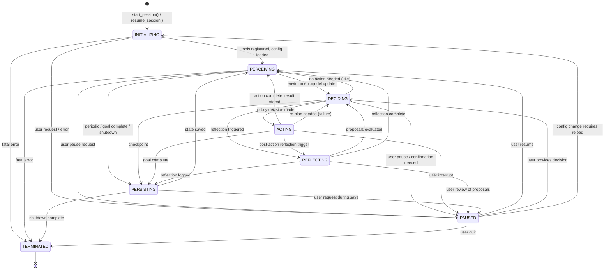
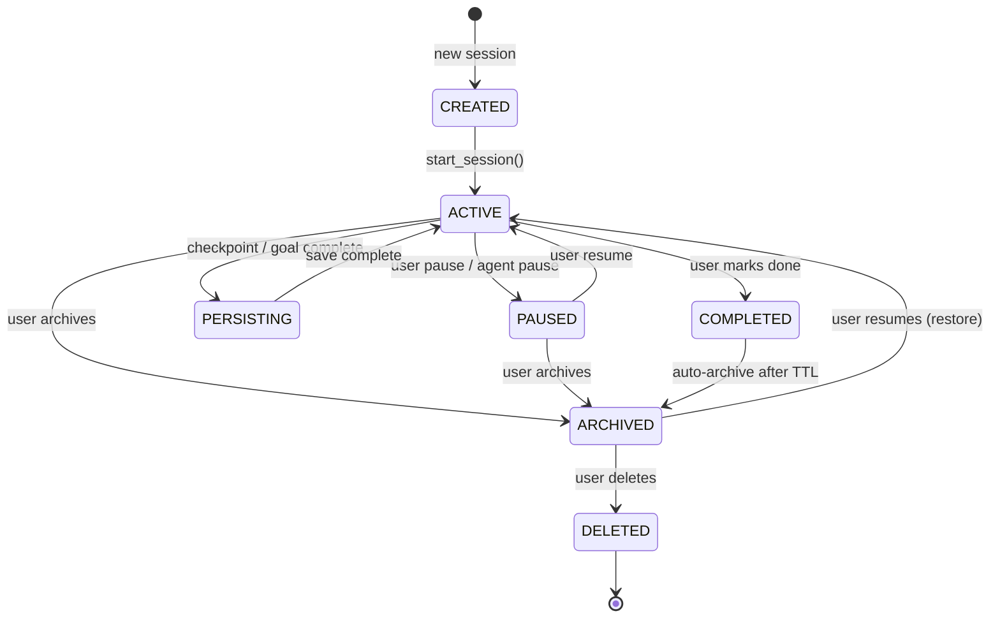
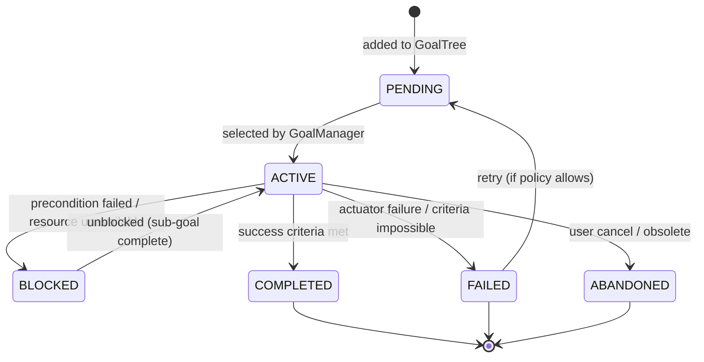
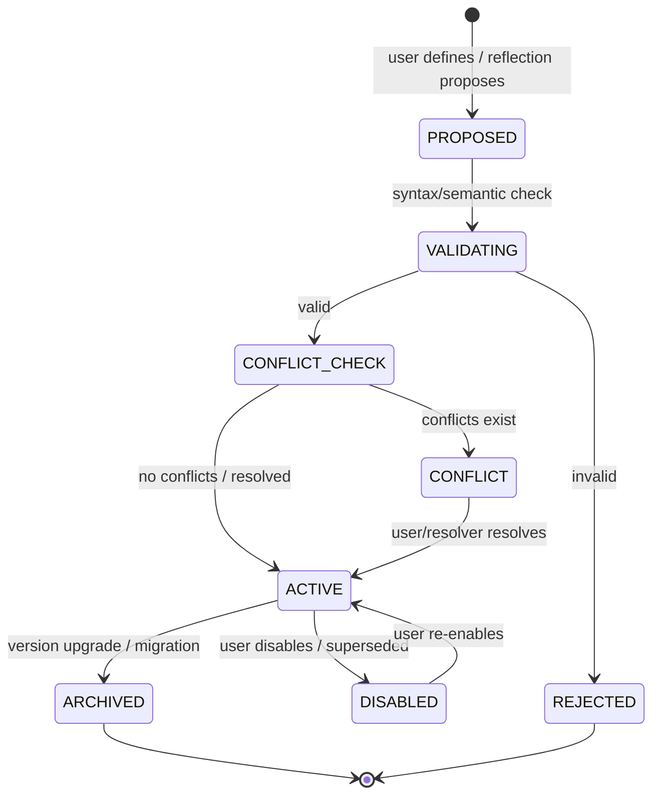
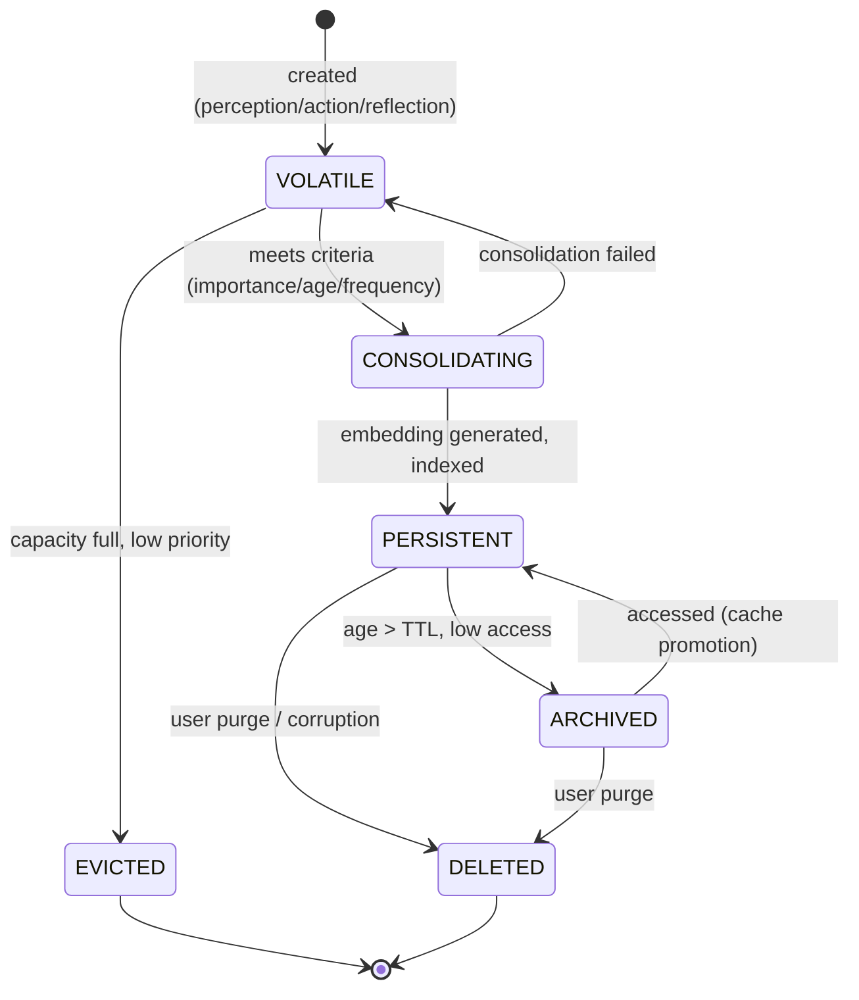
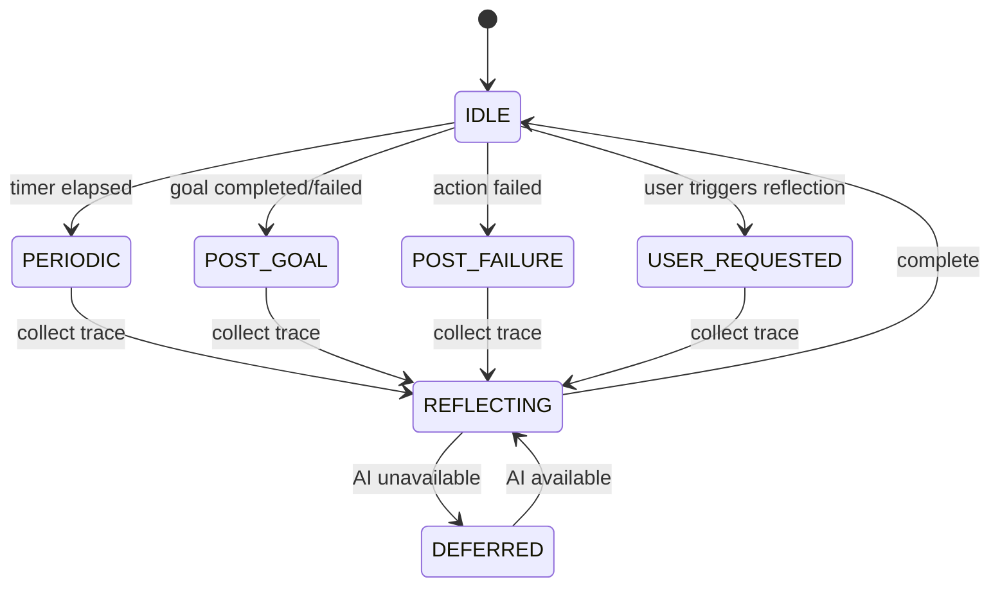
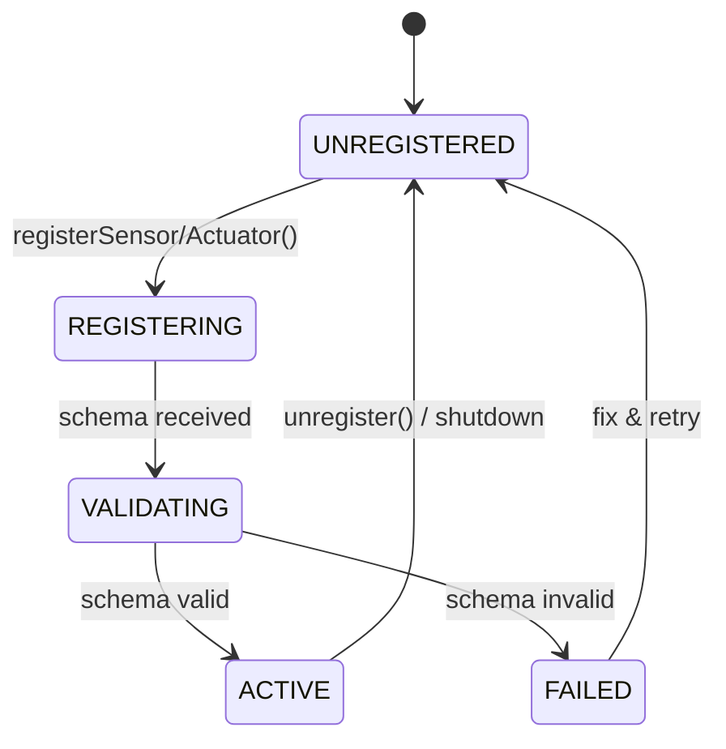
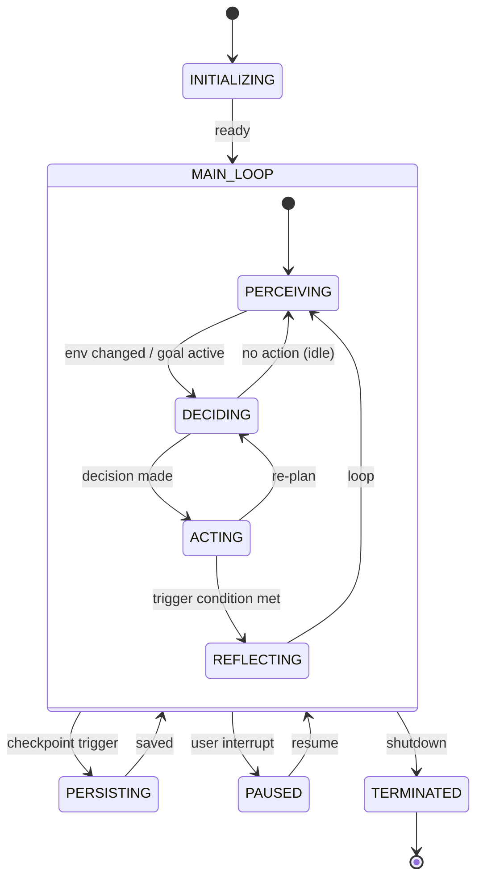

# Analysis 005: State Diagrams — feature_007.agentx_intelligent_agent_behaviour

> **Phase:** Analysis | **Artifact:** analysis_005_state_diagram.md
> **Feature:** feature_007.agentx_intelligent_agent_behaviour | **Task:** A5

---

## 1. Agent Lifecycle State Machine

### State Descriptions

| State | Description | Entry Actions | Exit Actions |
|-------|-------------|---------------|--------------|
| **INITIALIZING** | Loading config, restoring state, registering tools | Load AgentConfig, restore PersistentMemory, PolicyStore, GoalTree; register sensors/actuators | Start perception timer |
| **PERCEIVING** | Active sensor cycle, building EnvironmentModel | Trigger perception cycle (SD1); update EnvironmentModel; notify PolicyEngine | Cancel perception timer |
| **DECIDING** | Policy evaluation, goal selection, action planning | Evaluate PolicyEngine; select goal; produce PolicyDecision | Clear decision cache |
| **ACTING** | Executing actuator command via ToolRegistry | Validate command; invoke actuator; store result; update EnvModel | Trigger reflection if needed |
| **REFLECTING** | AI-powered self-critique of recent trace | Build prompt; call AIService; parse proposals; safety check | Log ReflectionEntry |
| **PERSISTING** | Atomic session snapshot to storage | Collect all state; serialize; transactional write | Release persistence lock |
| **PAUSED** | User intervention, waiting for input | Stop all cycles; preserve volatile state | Resume from interruption point |
| **TERMINATED** | Clean shutdown | Final persist; cleanup resources; close connections | — |

---

## 2. Session Lifecycle

---

## 3. Goal State Machine

---

## 4. Policy Rule Lifecycle

---

## 5. Memory Entry Lifecycle (Volatile → Persistent)

---

## 6. Reflection Trigger States

---

## 7. Tool Registration States

---

## 8. Composite: Agent Main Loop (Perception-Decision-Action-Reflection)

---

## Traceability to Use Cases (A1) & Class Diagram (A2)

| State Machine | Use Case | Key Classes |
|---------------|----------|-------------|
| Agent Lifecycle | All UC | Agent, AgentState enum |
| Session Lifecycle | UC7, UC8 | SessionSnapshot, PersistenceManager |
| Goal State | UC5 | Goal, GoalStatus, GoalManager |
| Policy Rule Lifecycle | UC3 | PolicyRule, RuleSource, PolicyEngine |
| Memory Entry Lifecycle | UC4 | MemoryEntry, MemoryTier, MemoryManager |
| Reflection Triggers | UC6 | ReflectionEngine, DecisionTrace |
| Tool Registration | UC1, UC2 | ToolRegistry, ISensor, IActuator |
| Composite Main Loop | All UC | Agent (orchestrator) |

---

## Notes

- All state machines use **hierarchical states** where applicable (MAIN_LOOP composite)
- Transitions are **event-driven** (not polling) — events from Tools, User, Timers, PolicyEngine
- **PAUSED** state is the primary user-intervention point across all machines
- **TERMINATED/DELETED** are final states — no transitions out
- State persistence (PERSISTING) captures full composite state for resume fidelity