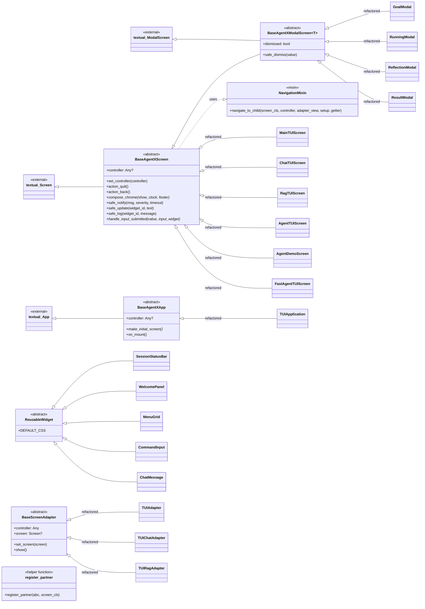

# Analysis 003 — TUI Framework: Analysis Class Diagram

> **Phase:** Analysis (static path) — `omt_agent_guide.md §3, §5` | **Feature:** feature_012.tui_framework

This is the **analysis** class diagram: it models the *concepts* of the framework
and how the existing screens relate to them, independent of file layout. The
design class diagram (in Design phase) adds methods, signatures, and file
mapping.

## Conceptual model

## Concept dictionary

| Concept | Kind | Responsibility |
|---|---|---|
| `BaseAgentXScreen` | abstract base (View) | Absorbs the boilerplate shared by all full screens: controller storage, quit/back, chrome compose, safe notify/update/log, input hook. Inherits Textual `Screen`. |
| `BaseAgentXModalScreen[T]` | abstract base (View) | Adds the centered-box + dismiss-guard pattern (`dismissed` flag, `safe_dismiss`) on top of `BaseAgentXScreen`. Inherits Textual `ModalScreen[T]`. |
| `BaseAgentXApp` | abstract base (View) | TTY detection + initial-screen push + default CSS. Provides `make_initial_screen()` override hook. Inherits Textual `App`. |
| `BaseScreenAdapter` | abstract base (View) | Adapter skeleton: stores controller + optional screen, `set_screen()`, no-op `show()`. Concrete adapters implement an `IXxxView` by delegating to `screen`. |
| `NavigationMixin` | mixin (View) | Provides `navigate_to_child(...)` collapsing the 4 navigation-glue copies. Mixed into `BaseAgentXScreen`. |
| `ReusableWidget` | abstract widget | Tag base for the extracted widgets; carries `DEFAULT_CSS`. |
| `SessionStatusBar` / `WelcomePanel` / `MenuGrid` / `CommandInput` / `ChatMessage` | widgets | Extracted from `main_screen.py` / `chat_screen.py`, importable by any screen. |
| `register_partner(abc, screen_cls)` | helper function | Metaclass-safe `abc.register(screen_cls)` wrapper for the Textual/ABC conflict. |

## Analysis relationships (why these, and not more)

- `BaseAgentXModalScreen` **extends** `BaseAgentXScreen` (a modal is a screen +
  dismiss guard), not the reverse — modals are the special case.
- `NavigationMixin` is a **mixin**, not a base, so a screen can use navigation
  without being forced into the modal/non-modal hierarchy. It is mixed into
  `BaseAgentXScreen` so every screen gets it by default.
- `BaseScreenAdapter` is **not** a screen; it lives in the adapter layer and
  delegates to a screen the controller/main-screen pushed. It is the
  consolidation of the 3 existing adapters' skeleton.
- Widgets are a **flat** hierarchy under `ReusableWidget` (a tag); they don't
  share behaviour beyond CSS, so no deeper taxonomy.

## Key analysis constraints (carry into Design)

1. **View-only**: no framework class imports `agentx.model.*` or any controller
   concrete class. Controllers are duck-typed `Any` (matches current code).
2. **Metaclass-safe**: framework must not force screens to inherit `abc.ABC`
   (Textual's `_MessagePumpMeta` conflicts with `ABCMeta`). Partner registration
   stays via `register()`.
3. **Backward-compatible API**: existing `IMainView`/`IChatView`/`IRagView`
   interfaces unchanged; adapters still implement them.
4. **Fast-agent threading untouched**: `RunningModal`'s worker/queue/poll logic
   stays in the modal subclass; only its skeleton is lifted to the base.
5. **CSS scoping**: each widget keeps its own `DEFAULT_CSS` keyed by class name
   so extraction causes no style collision.
