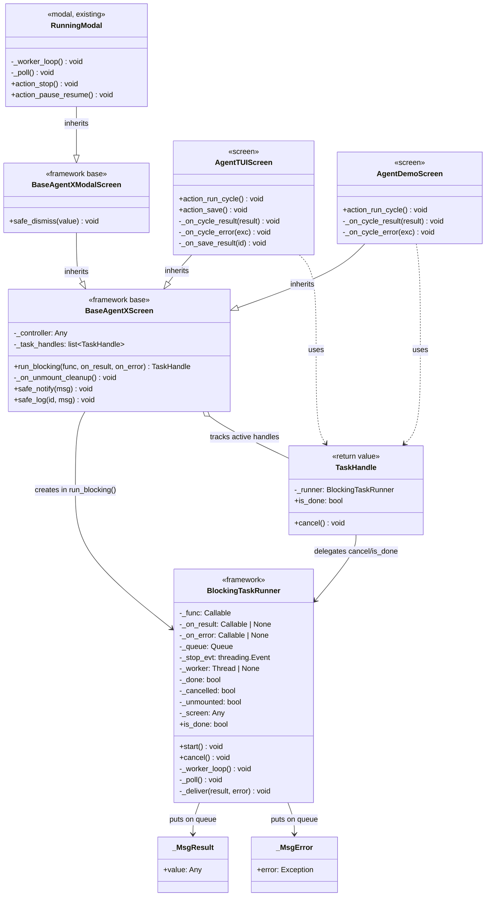

# Analysis 003 — TUI Nonblocking Runner: Analysis Class Diagram

> **Phase:** Analysis — `omt_agent_guide.md §3 (static path)` | **Feature:** feature_014.tui_nonblocking_runner
> **Task type:** major_feature

## 1. Key domain concepts

| Concept | Role | Responsibility |
|---------|------|----------------|
| `BlockingTaskRunner` | Framework component | Manages a worker thread + queue + poller for one blocking callable. Created by `run_blocking()`. |
| `TaskHandle` | Return value of `run_blocking()` | Lets the caller cancel the task and check completion. Holds the stop event. |
| `_MsgResult` | Worker→UI message | Carries the return value of the blocking callable. |
| `_MsgError` | Worker→UI message | Carries the exception raised by the blocking callable. |
| `BaseAgentXScreen` | Framework base screen | Gains `run_blocking()` + unmount cleanup. The public API. |
| `BaseAgentXModalScreen` | Framework base modal | Inherits `run_blocking()` from `BaseAgentXScreen`. |
| `AgentTUIScreen` | Screen (consumer) | Uses `run_blocking()` for `action_run_cycle` + `action_save`. |
| `AgentDemoScreen` | Screen (consumer) | Uses `run_blocking()` for `action_run_cycle`. |
| `RunningModal` | Modal (existing consumer) | Has its own inline threading; optionally migrates to `run_blocking()`. |

## 2. Analysis class diagram



## 3. Concept relationships

### 3.1 Creation: `BaseAgentXScreen.run_blocking()`

When a screen calls `self.run_blocking(func, on_result, on_error)`:

1. A `BlockingTaskRunner` is constructed with `func`, `on_result`, `on_error`, and a
   reference to the screen (for `set_timer` scheduling).
2. A `TaskHandle` wrapping the runner is returned to the caller and tracked in
   `self._task_handles`.
3. `runner.start()` spawns the daemon worker thread + schedules the first `_poll()` via
   `screen.set_timer(0.05, ...)`.

### 3.2 Worker → UI communication

```
Worker thread                    UI thread
─────────────                    ─────────
_worker_loop():
  try:
    result = self._func()          _poll():
    queue.put(_MsgResult(result))    msg = queue.get_nowait()
  except Exception as exc:          if _MsgResult → _deliver(result)
    queue.put(_MsgError(exc))        if _MsgError  → _deliver(error=None, error=exc)
  finally:                          if not done → set_timer(0.05, _poll)
    self._done = True
```

`_deliver()` checks `_cancelled` / `_unmounted`; if neither, it calls `on_result(result)`
or `on_error(exc)` on the UI thread.

### 3.3 Cancellation: `TaskHandle.cancel()`

```
cancel():
  _stop_evt.set()
  _cancelled = True
```

The worker checks `_stop_evt` before starting `func`. If already in flight, the result is
discarded (the poller sees `_cancelled` and skips the callback).

### 3.4 Unmount cleanup: `BaseAgentXScreen._on_unmount_cleanup()`

```
_on_unmount_cleanup():
  for handle in self._task_handles:
    handle.cancel()
  # The poller checks _unmounted and exits without callbacks.
```

Textual's `on_unmount` calls this. All active workers are signalled to stop; the poller
suppresses callbacks.

## 4. Design constraints (carried to Design phase)

1. **`BlockingTaskRunner` is not a Textual widget** — it's a plain Python class that
   holds a reference to the screen for `set_timer` scheduling. This keeps it testable
   without a Textual app context (the screen ref is duck-typed `Any`).

2. **`TaskHandle` is a thin wrapper** — it delegates to `BlockingTaskRunner.cancel()` /
   `is_done`. This allows future extension (e.g. `join()`, `add_progress_callback()`)
   without changing the `run_blocking()` signature.

3. **Message objects are plain data** — `_MsgResult` / `_MsgError` use `__slots__` for
   minimal overhead, matching the existing `_MsgCycle` / `_MsgDone` pattern in
   `RunningModal`.

4. **The runner does not import any Model type** — `func` is `Callable[[], Any]`,
   `on_result` is `Callable[[Any], None]`. MVC++ pure View.

5. **`BaseAgentXScreen.on_unmount`** — the base class does not currently override
   `on_unmount`. The runner adds a lightweight override (or hook) that calls
   `_on_unmount_cleanup()`. Subclasses that override `on_unmount` must call
   `super().on_unmount()`.
