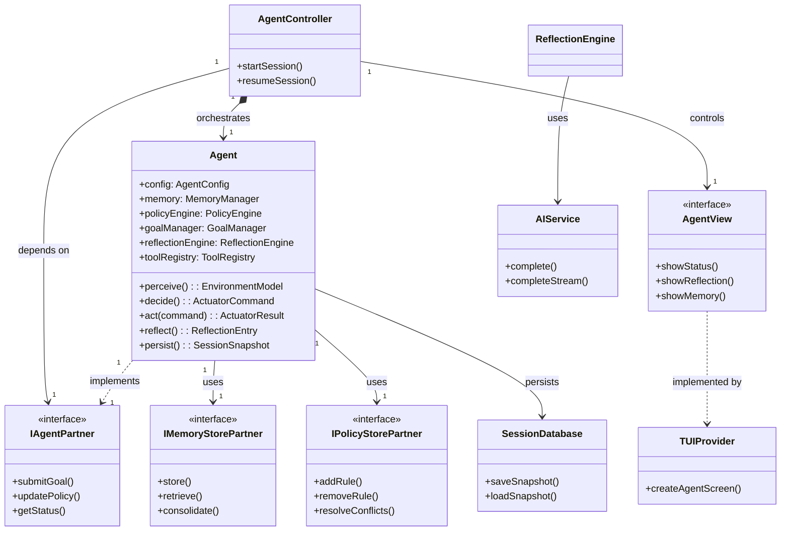

# DESIGN 001: Agent Framework Architecture

**Feature:** feature_007.agentx_intelligent_agent_behaviour
**Date:** 2026-06-29
**Phase:** Design
**Status:** Draft
**Analysis Reference:** 
- `3.analysis/features/feature_007.agentx_intelligent_agent_behaviour/analysis_001_agent_architecture.md`
- `3.analysis/features/feature_007.agentx_intelligent_agent_behaviour/analysis_002_use_cases.md`
- `3.analysis/features/feature_007.agentx_intelligent_agent_behaviour/analysis_003_class_diagram.md`

---

## 1. Overview

This document defines the **component architecture**, **interface contracts**, **data models**, and **implementation strategy** for the **intelligent agent framework** in agentx. It transforms the reactive command processor into an **autonomous, stateful, policy-driven agent** with memory, perception, and adaptive behavior.

**Core Principles:**
- **MVC++ Compliance**: Strict separation via Abstract Partners
- **Modularity**: Seven independent, testable subsystems
- **Extensibility**: Tool registry for sensors/actuators
- **Intelligence**: Policy engine + reflection for adaptive behavior
- **Persistence**: Versioned session snapshots

---

## 2. High-Level Component Architecture



---

## 3. MVC++ Triad - Agent Subsystem

### 3.1 Model: Agent (Facade)
```python
class Agent:
    """MVC++ Model: Facade orchestrating all agent subsystems."""

    def __init__(self, config: AgentConfig):
        self.id = config.id
        self.config = config
        self.state = AgentState.INITIALIZING
        self.tool_registry = ToolRegistry()
        self.environment_model = EnvironmentModel()
        self.memory = MemoryManager(config.memory_config)
        self.policy_engine = PolicyEngine()
        self.goal_manager = GoalManager()
        self.reflection_engine = ReflectionEngine()
        self.persistence = PersistenceManager()

    def perceive(self) -> EnvironmentModel:
        """Sensor → EnvironmentModel → VolatileMemory → PolicyEngine."""
        ...

    def decide(self) -> PolicyDecision:
        """PolicyEngine.evaluate() → PolicyDecision."""
        ...

    def act(self, command: ActuatorCommand) -> ActuatorResult:
        """PolicyDecision → Actuator.act() → Update Memory/Environment/Goals."""
        ...

    def reflect(self) -> ReflectionEntry:
        """ReflectionEngine.reflect() → Actionable proposals."""
        ...

    def persist(self) -> None:
        """Save SessionSnapshot to SessionDatabase."""
        ...
```

### 3.2 Controller: AgentController
```python
class AgentController(IAgentController):
    """MVC++ Controller: Mediates View ↔ Agent interactions."""

    def __init__(self, agent: IAgentPartner):
        self._agent = agent
        self._view: IAgentViewPartner | None = None

    def set_view(self, view: IAgentViewPartner) -> None:
        self._view = view

    def start_session(self, config: AgentConfig) -> AgentId:
        """Initialize new Agent from AgentConfig."""
        agent_id = self._agent.start_session(config)
        if self._view:
            self._view.show_message(f"Session started: {agent_id}")
        return agent_id

    def submit_goal(self, goal: Goal) -> GoalId:
        """Delegate goal submission to Agent."""
        goal_id = self._agent.submit_goal(goal)
        if self._view:
            self._view.refresh_goal_tree()
        return goal_id
```

### 3.3 View: AgentView (Abstract Partner)
```python
class IAgentViewPartner(ABC):
    """MVC++ Abstract Partner: View → Controller contract."""

    @abstractmethod
    def show_status(self, status: AgentStatus) -> None:
        """Display agent status (state, autonomy, goals, etc.)."""
        pass

    @abstractmethod
    def show_reflection_log(self, entries: list[ReflectionEntry]) -> None:
        """Display reflection history."""
        pass

    @abstractmethod
    def show_memory_view(self, query: MemoryQuery) -> None:
        """Search/show memory entries."""
        pass

    @abstractmethod
    def show_policy_editor(self, rules: list[PolicyRule]) -> None:
        """Display policy rule editor."""
        pass

    @abstractmethod
    def refresh_goal_tree(self) -> None:
        """Redraw goal tree after changes."""
        pass
```

---

## 4. Subsystem Interfaces & Abstract Partners

### 4.1 Memory Subsystem
**Abstract Partner:** `IMemoryStorePartner`
```python
class IMemoryStorePartner(ABC):
    @abstractmethod
    def store(self, entry: MemoryEntry, tier: MemoryTier) -> None:
        """Store MemoryEntry in volatile or persistent memory."""
        pass

    @abstractmethod
    def retrieve(self, query: MemoryQuery) -> list[MemoryEntry]:
        """Search memory by semantic/temporal criteria."""
        pass

    @abstractmethod
    def consolidate(self) -> None:
        """Volatile → Persistent consolidation cycle."""
        pass

    @abstractmethod
    def evict(self, criteria: EvictionCriteria) -> int:
        """Evict low-importance entries."""
        pass
```

**Concrete Implementation:** `MemoryManager`
```python
class MemoryManager(IMemoryStorePartner):
    def __init__(self, config: MemoryConfig):
        self.volatile = VolatileMemory(config.volatile_capacity)
        self.persistent = SQLiteMemoryStore(config.persistent_path)
        self.vector_index = FAISSVectorIndex(config.embedding_model)
        self.episodic_log = EpisodicLog("agent_memory.log")
```

### 4.2 Policy Subsystem
**Abstract Partner:** `IPolicyStorePartner`
```python
class IPolicyStorePartner(ABC):
    @abstractmethod
    def add_rule(self, rule: PolicyRule) -> None:
        """Add new PolicyRule to engine."""
        pass

    @abstractmethod
    def remove_rule(self, rule_id: RuleId) -> None:
        """Remove PolicyRule by ID."""
        pass

    @abstractmethod
    def resolve_conflicts(self) -> dict[str, PolicyRule]:
        """Detect/resolve rule conflicts; return conflict map."""
        pass
```

**Concrete Implementation:** `PolicyEngine`
```python
class PolicyEngine(IPolicyStorePartner):
    def __init__(self):
        self.rules: dict[RuleId, PolicyRule] = {}
        self.resolver = ConflictResolver()

    def evaluate(self, context: PolicyContext) -> PolicyDecision:
        """Evaluate rules → highest-priority PolicyDecision."""
        candidates = [rule for rule in self.rules.values() if rule.condition.evaluate(context)]
        return self._select_winner(candidates)
```

---

## 5. Data Models & Persistence Schema

### 5.1 AgentConfig
**Pydantic Model (in-memory; no ORM):**
```python
class AgentConfig(BaseModel):
    id: AgentId = Field(..., description="Unique agent identifier")
    name: str = Field("Unnamed Agent", description="Human-readable name")
    version: int = 1
    sensors: list[SensorConfig]
    actuators: list[ActuatorConfig]
    policy_config: PolicyConfig
    memory_config: MemoryConfig
    goal_config: GoalConfig
    autonomy_level: AutonomyLevel
    created_at: datetime
    updated_at: datetime

    class Config:
        json_schema_extra = {
            "example": {
                "id": "agent_1",
                "name": "Code Assistant",
                "autonomy_level": "SUPERVISED",
                ...
            }
        }
```

> **Note — persistence strategy:** All persistence uses Python's standard-library
> `sqlite3` module only. There is **no SQLAlchemy, no ORM, and no Alembic**. Schema is
> defined declaratively as `Table*` descriptor classes (DDL string constants) and created
> idempotently via `CREATE TABLE IF NOT EXISTS` on first use — exactly the pattern already
> established by `src/agentx/model/session/session_db.py` (`SessionDatabase`) and
> `src/agentx/model/rag/rag_db.py` (`RagDatabase`). In-memory objects are plain
> Pydantic models / dataclasses; the persistence layer (DP classes under
> `src/agentx/agent/persistence/`) maps them to/from `sqlite3` rows manually.

### 5.2 SessionSnapshot
**In-memory data model (dataclass):**
```python
@dataclass
class SessionSnapshot:
    snapshot_id: str
    agent_id: str
    timestamp: datetime
    config_version: int
    volatility_data: dict          # serialized WorkingContext (JSON text in DB)
    policy_store: list[dict]       # serialized PolicyRule[] (JSON text in DB)
    goal_tree: dict                # serialized GoalTree (JSON text in DB)
    reflection_log_position: int
```

### 5.3 SQLite Schema (stdlib `sqlite3`, no migrations)
**`persistence/schema.py` — `Table*` descriptor classes (DDL as string constants):**
```python
import sqlite3
from pathlib import Path

class TableAgents:
    TABLE_NAME = "agents"
    TABLE_QUERY = f"""\
    CREATE TABLE IF NOT EXISTS {TABLE_NAME} (
      id TEXT PRIMARY KEY,
      created_at TIMESTAMP DEFAULT CURRENT_TIMESTAMP
    )
    """
    INSERT = f"INSERT INTO {TABLE_NAME} (id, created_at) VALUES (?, ?)"

class TableSessionSnapshots:
    TABLE_NAME = "session_snapshots"
    TABLE_QUERY = f"""\
    CREATE TABLE IF NOT EXISTS {TABLE_NAME} (
      snapshot_id TEXT PRIMARY KEY,
      agent_id TEXT NOT NULL,
      timestamp TIMESTAMP DEFAULT CURRENT_TIMESTAMP,
      config_version INTEGER,
      volatility_data TEXT,   -- JSON-serialized WorkingContext
      policy_store TEXT,      -- JSON-serialized PolicyRule[]
      goal_tree TEXT,         -- JSON-serialized GoalTree
      reflection_log_position INTEGER
    )
    """
    INSERT = f"INSERT INTO {TABLE_NAME} (snapshot_id, agent_id, timestamp, config_version, volatility_data, policy_store, goal_tree, reflection_log_position) VALUES (?, ?, ?, ?, ?, ?, ?, ?)"
    SELECT_LATEST_BY_AGENT = f"SELECT * FROM {TABLE_NAME} WHERE agent_id = ? ORDER BY timestamp DESC LIMIT 1"

# TableMemoryEntries, TablePolicyRules, TableGoals, TableReflectionEntries
# follow the same pattern (see data dictionary analysis_006 for columns).

class SessionDatabase:
    """SQLite-backed persistence (stdlib sqlite3; no ORM, no migrations).

    Mirrors the existing SessionDatabase/RagDatabase convention: schema is created
    idempotently via CREATE TABLE IF NOT EXISTS on first connection.
    """
    DB_FILENAME = "agent_session.db"

    def __init__(self, db_path: str):
        self.path = db_path
        self._ensure_schema()

    def _ensure_schema(self) -> None:
        Path(self.path).parent.mkdir(parents=True, exist_ok=True)
        with sqlite3.connect(self.path) as conn:
            conn.execute(TableAgents.TABLE_QUERY)
            conn.execute(TableSessionSnapshots.TABLE_QUERY)
            conn.execute(TableMemoryEntries.TABLE_QUERY)
            conn.execute(TablePolicyRules.TABLE_QUERY)
            conn.execute(TableGoals.TABLE_QUERY)
            conn.execute(TableReflectionEntries.TABLE_QUERY)
            conn.commit()

    def save_snapshot(self, snapshot: SessionSnapshot) -> bool:
        with sqlite3.connect(self.path) as conn:
            conn.execute(TableSessionSnapshots.INSERT, (
                snapshot.snapshot_id, snapshot.agent_id, snapshot.timestamp,
                snapshot.config_version,
                json.dumps(snapshot.volatility_data),
                json.dumps(snapshot.policy_store),
                json.dumps(snapshot.goal_tree),
                snapshot.reflection_log_position,
            ))
            conn.commit()
        return True
```

> **Schema evolution:** No migration framework is used. Additive changes are handled by
> extending `_ensure_schema()` with additional `CREATE TABLE IF NOT EXISTS` / `ALTER TABLE`
> statements guarded by existence checks. This keeps the agent subsystem dependency-free
> (stdlib only) and consistent with the rest of the codebase.

---

## 6. Tool Registry Protocol

### 6.1 ISensor Interface
```python
class ISensor(ABC):
    id: SensorId  # unique, e.g. "filesystem", "rag_query"

    @abstractmethod
    def sense(self) -> SensorReading:
        """Read data from environment → SensorReading{sensorId, data, timestamp, confidence}."""
        pass

    @abstractmethod
    def get_schema(self) -> SensorSchema:
        """Return SensorSchema{sensorId, description, outputSchema, samplingRate}."""
        pass
```

### 6.2 IActuator Interface
```python
class IActuator(ABC):
    id: ActuatorId  # unique, e.g. "filesystem", "session"

    @abstractmethod
    def get_schema(self) -> ActuatorSchema:
        """Return ActuatorSchema{actuatorId, description, inputSchema, outputSchema}."""
        pass

    @abstractmethod
    def validate(self, command: ActuatorCommand) -> ValidationResult:
        """Check command safety/resources BEFORE execution → ValidationResult{valid, errors, warnings}."""
        pass

    @abstractmethod
    def act(self, command: ActuatorCommand) -> ActuatorResult:
        """Execute command → ActuatorResult{success, output, sideEffects, error, durationMs}."""
        pass
```

### 6.3 ToolSpec & Schema Formalization
A **ToolSpec** is the unified, serializable descriptor the registry stores for every tool
(sensor, actuator, or both). It is the single source of truth used for schema validation,
policy references (`tool_id`), and TUI display.

```python
class ToolKind(Enum):
    SENSOR = "sensor"
    ACTUATOR = "actuator"
    HYBRID = "hybrid"   # implements both ISensor and IActuator (e.g. FileSystemTool)

@dataclass
class ToolSpec:
    tool_id: str                       # matches ISensor.id / IActuator.id
    name: str                          # human-readable
    description: str
    kind: ToolKind
    input_schema: JsonSchema | None    # ActuatorSchema.inputSchema (None for pure sensors)
    output_schema: JsonSchema          # SensorSchema.outputSchema / ActuatorSchema.outputSchema
    side_effects: bool                 # True if actuator mutates environment
    sampling_rate: float | None        # seconds; sensors only (None = event-driven)
    enabled: bool = True
    metadata: dict = field(default_factory=dict)   # version, health, config
```

`JsonSchema` is a lightweight dataclass mirror of the data-dictionary `JsonSchema`
(`{type, properties, required}`) — **no external JSON-Schema library**. Validation is
structural (required keys present, type matches) and runs in `ToolRegistry` at registration
(fail-fast, per SD8).

### 6.4 ToolRegistry Implementation
```python
class ToolRegistry(IToolRegistryPartner):
    """Model-layer registry. Dict-backed (O(1) lookup, <5ms per NFR P3)."""

    def __init__(self) -> None:
        self._sensors: dict[SensorId, ISensor] = {}
        self._actuators: dict[ActuatorId, IActuator] = {}
        self._specs: dict[str, ToolSpec] = {}

    # --- registration (fail-fast: schema validated before insert) ---
    def register_sensor(self, sensor: ISensor) -> None:
        schema = sensor.get_schema()
        self._validate_schema(schema.output_schema)
        self._sensors[sensor.id] = sensor
        self._specs[sensor.id] = self._build_spec(sensor, kind=ToolKind.SENSOR)

    def register_actuator(self, actuator: IActuator) -> None:
        schema = actuator.get_schema()
        self._validate_schema(schema.input_schema)
        self._validate_schema(schema.output_schema)
        self._actuators[actuator.id] = actuator
        kind = ToolKind.HYBRID if actuator.id in self._sensors else ToolKind.ACTUATOR
        self._specs[actuator.id] = self._build_spec(actuator, kind=kind)

    # --- discovery ---
    def get_sensor(self, sid: SensorId) -> ISensor: ...
    def get_actuator(self, aid: ActuatorId) -> IActuator: ...
    def list_sensors(self) -> list[SensorId]: ...
    def list_actuators(self) -> list[ActuatorId]: ...
    def get_spec(self, tool_id: str) -> ToolSpec: ...

    # --- health (IToolRegistryPartner) ---
    def health_check(self) -> dict[str, bool]:
        """Ping each tool's get_schema(); report liveness for TUI/dashboard."""

    def _validate_schema(self, schema: JsonSchema) -> None:
        """Structural validation; raise ToolSchemaError on mismatch (fail-fast)."""
```

### 6.5 Discovery Mechanism
Two complementary discovery paths, both dependency-free:

1. **Explicit registration** (default): `Agent.__init__` registers built-in tools from
   `AgentConfig.sensors` / `AgentConfig.actuators`. Deterministic; used by tests and the TUI.
2. **Entry-point scanning** (optional, lazy): a thin `discover_tools()` helper walks
   `importlib.metadata.entry_points(group="agentx.tools")` and instantiates any declared
   ISensor/IActuator. Stdlib only. Disabled by default; enabled via
   `AgentConfig.tool_config.auto_discover`. Third-party tools register via pyproject entry
   points — no change to the agent core.

Built-in tools (§6.6) are always available and registered unless explicitly disabled.

### 6.6 Built-in Tools
| Tool | Kind | id | Sensor output / Actuator action |
|------|------|----|---------------------------------|
| `FileSystemTool` | HYBRID | `filesystem` | sense: dir listing + stat; act: create/read/update/delete (sandboxed) |
| `RagSensorTool` | SENSOR | `rag_query` | sense: `Rag.query()` → retrieved docs (wraps feature_002) |
| `SessionTool` | HYBRID | `session` | sense: current session meta; act: persist/restore snapshot |

```python
class FileSystemTool(ISensor, IActuator):
    """Filesystem sensor/actuator. Sandboxed to AgentConfig.sandbox_root."""

    def __init__(self, sandbox_root: Path):
        self.id = SensorId("filesystem")
        self._root = sandbox_root

    def sense(self) -> SensorReading:
        files = {str(p.relative_to(self._root)): p.stat().st_size
                 for p in self._root.rglob("*") if p.is_file()}
        return SensorReading(sensor_id=self.id, data=files,
                             timestamp=datetime.now(timezone.utc), confidence=0.95)

    def validate(self, command: ActuatorCommand) -> ValidationResult:
        target = self._root / command.parameters["path"]
        if not str(target.resolve()).startswith(str(self._root.resolve())):
            return ValidationResult(valid=False, errors=["path escapes sandbox"])
        return ValidationResult(valid=True)

    def act(self, command: ActuatorCommand) -> ActuatorResult:
        vr = self.validate(command)
        if not vr.valid:
            return ActuatorResult(success=False, error="; ".join(vr.errors))
        # dispatch on command.action: create|read|update|delete ...
        ...

    def get_schema(self) -> ActuatorSchema: ...   # covers SensorSchema via kind=HYBRID
```

> **MVC++ note:** `RagSensorTool` wraps the existing `Rag` model (feature_002) behind
> `ISensor`, so the agent depends on the tool contract, not on `Rag` internals.

---

## 7. Policy Engine DSL

The Policy Engine selects one `PolicyAction` per `decide()` cycle from the enabled
`PolicyRule` set. Rules are declared in YAML, compiled to an AST, evaluated against a
`PolicyContext`, and conflicts are resolved by priority. Reflection-proposed rules enter the
same store via an adaptation hook (§7.5).

### 7.1 Rule Syntax (YAML)
```yaml
# agent/policies/default_rules.yaml
- id: "policy_001"
  condition: "goal.active AND environment.memory_pressure < 0.8"
  action:
    type: "EXECUTE_TOOL"        # ActionType enum
    params:
      tool_id: "rag_query"
      query: "{{goal.description}}"
    targetGoal: null
  priority: 500                 # 0-1000, higher wins
  enabled: true
  metadata:
    source: "DEFAULT"           # USER_DEFINED | REFLECTION_PROPOSED | DEFAULT | LEARNED
    createdBy: "default"
    version: 1
```

### 7.2 Condition DSL
A small expression language compiled to an AST and evaluated by a visitor against
`PolicyContext{environment, memory, currentGoal, agentState}`.

- **Atoms:** `goal.active`, `environment.memory_pressure`, `agent.state == 'DECIDING'`,
  `has_observation('error')`
- **Arithmetic:** `{a} > {b}`, `{a} + {b}`, with `<=`, `>=`, `==`, `!=`
- **Logic:** `{expr} AND|OR {expr}`, `NOT {expr}` (parens for grouping)
- **Functions:** `has_observation(tag)`, `goal.is_blocked()`, `memory.contains(query)`

```python
class PolicyEvaluationVisitor:
    def visit_binary_op(self, expr: BinaryOp, ctx: PolicyContext) -> bool:
        left = self.visit(expr.left, ctx)
        right = self.visit(expr.right, ctx)
        if expr.op == 'AND': return left and right
        if expr.op == 'OR':  return left or right
        ...
    def visit_comparison(self, expr: Comparison, ctx: PolicyContext) -> bool: ...
    def visit_function(self, expr: FunctionCall, ctx: PolicyContext) -> bool: ...
```

Compilation is cached per rule (`ConditionExpr` → AST) so repeated evaluations skip parsing
(<50ms per evaluation, NFR P2). Unknown identifiers/functions raise `ConditionCompileError`
at load time — fail-fast, never at `decide()` time.

### 7.3 Evaluation & Priority Resolution
```python
class PolicyEngine(IPolicyStorePartner):
    def evaluate(self, context: PolicyContext) -> PolicyDecision:
        # 1. filter enabled rules whose condition matches
        candidates = [r for r in self.rules.values()
                      if r.enabled and r.condition.evaluate(context)]
        if not candidates:
            return PolicyDecision(selectedAction=NOOP, confidence=0.0,
                                  reasoning="no matching rule")
        # 2. resolve by priority (highest wins)
        winner, alternatives = self._select_winner(candidates)
        return PolicyDecision(selectedAction=winner.action,
                              confidence=self._confidence(winner, candidates),
                              reasoning=f"rule {winner.id} (priority {winner.priority})",
                              alternatives=[a.action for a in alternatives])
```

**Priority resolution rules** (deterministic — no ties left to chance):
1. Highest `priority` wins (0-1000).
2. Tie on priority → `RuleSource` precedence: `USER_DEFINED > REFLECTION_PROPOSED > LEARNED > DEFAULT`.
3. Still tied → earliest `metadata.createdAt` (stable, FIFO).
4. Still tied → rule `id` lexicographic (total-order guarantee).

### 7.4 Conflict Detection
`ConflictResolver` runs on every `add_rule` and on demand via `resolve_conflicts()`
(`IPolicyStorePartner`). It detects two classes of conflict without executing side effects:

- **Overlapping condition + divergent action:** two enabled rules whose conditions can be
  simultaneously true and whose actions target the same tool/goal with different params.
- **Direct contradiction:** one rule `EXECUTE_TOOL rag_query`, another `PAUSE` for the same
  condition.

```python
class ConflictResolver:
    def detect(self, rules: list[PolicyRule]) -> dict[tuple[RuleId, RuleId], float]:
        """Return conflict pairs with a 0.0-1.0 conflict_score."""
        conflicts: dict[tuple[RuleId, RuleId], float] = {}
        for a, b in combinations(rules, 2):
            if not (a.enabled and b.enabled):
                continue
            score = self._overlap(a.condition, b.condition)
            if score > 0 and self._divergent(a.action, b.action):
                conflicts[(a.id, b.id)] = score
        return conflicts

    def resolve_conflicts(self) -> dict[str, PolicyRule]:
        """Surface conflicts; high-score pairs reported to the view (no auto-delete)."""
```

`add_rule_safely` (see §11.3) rejects a new rule whose conflict_score > 0.8 and logs a
warning otherwise. Conflicts are **reported, not silently auto-resolved** — the user /
reflection decides.

### 7.5 Adaptation Hooks
Reflection-proposed rules (`ProposalType.POLICY_CHANGE`) enter the store through the same
`add_rule_safely` path, tagged `metadata.source = REFLECTION_PROPOSED` and
`createdBy = "reflection:<id>"` for full traceability.

- **Versioning:** each rule carries `metadata.version`; an update increments the version and
  keeps the previous version in an audit list (persisted via `TablePolicyRules`).
- **Toggle:** `enabled` flips without deletion, so reflection can A/B test a rule.
- **Rollback:** `revert_rule(rule_id)` restores the prior version — used when a reflection
  proposal degrades performance (detected by §8.4 safety hook + goal regression).

---

## 8. Reflection Engine

The Reflection Engine turns completed `decide → act` cycles into actionable self-improvement.
After each cycle (or on schedule) it builds a `DecisionTrace`, asks the `AIService` to
critique it via a Jinja2 prompt, parses the JSON response into `Critique` + `Proposal[]`,
runs a safety gate, and routes approved proposals to the right subsystem.

### 8.1 Critique Prompt Template
(`templates/reflection_critique.jinja2`)
````jinja2
You are an AI critic reviewing an agent's decision trace.

Decision Trace:
- Perception: {{ perception }}
- Decision: {{ decision.reasoning }}
- Action: {{ action }}
- Outcome: {{ outcome }}
- Goal: {{ goal.description }}

Critique Requirements:
1. Strengths: Identify 1-3 positive aspects
2. Weaknesses: Identify 1-3 flaws/risks
3. Confidence: High/Medium/Low
4. Recommendations: 1-3 actionable improvements

Response Format (JSON):
```json
{
    "critique": {
        "summary": "str",
        "strengths": ["str"],
        "weaknesses": ["str"],
        "confidence": "High|Medium|Low"
    },
    "proposals": [
        {"type": "POLICY_CHANGE", "content": {}, "rationale": "str"}
    ]
}
```
````

### 8.2 Built-in Proposal Types
- `POLICY_CHANGE` → new/modified `PolicyRule` (routed to `PolicyEngine.add_rule_safely`)
- `MEMORY_UPDATE` → new `MemoryEntry` or importance adjustment (routed to `MemoryManager`)
- `GOAL_ADJUSTMENT` → goal priority/status change (routed to `GoalManager`)
- `TOOL_CONFIGURATION` → sensor/actuator parameter change (routed to `ToolRegistry`)

### 8.3 Critique Parser
```python
class CritiqueParser:
    """Parse AIService JSON into typed Critique + Proposal[]. Resilient to malformed output."""

    def parse(self, raw: str, trace: DecisionTrace) -> ReflectionEntry:
        try:
            payload = json.loads(self._extract_json(raw))   # strips ```json fences
        except json.JSONDecodeError:
            return ReflectionEntry(
                id=new_id(), trace=trace,
                critique=Critique(summary="(unparseable reflection)", strengths=[],
                                  weaknesses=["AI returned non-JSON"], confidence=0.0),
                proposals=[])
        critique = self._parse_critique(payload["critique"])
        proposals = [self._parse_proposal(p) for p in payload.get("proposals", [])]
        return ReflectionEntry(id=new_id(), trace=trace,
                               critique=critique, proposals=proposals)

    def _parse_proposal(self, p: dict) -> Proposal:
        ptype = ProposalType(p["type"])          # ValueError → skip unknown type
        return Proposal(type=ptype, content=p["content"], rationale=p["rationale"])
```

The parser **never raises** into the agent loop — a failed parse degrades to a
low-confidence `Critique` with zero proposals, so reflection is always non-fatal.

### 8.4 Safety Evaluation Hook
Every proposal passes through an `ISafetyEvaluator` before routing. The evaluator encodes
the agent's `AutonomyLevel` and a small deny-list.

```python
class ProposalStatus(Enum):
    APPROVED = "approved"
    NEEDS_CONFIRMATION = "needs_confirmation"
    REJECTED = "rejected"

@dataclass
class ProposalVerdict:
    status: ProposalStatus
    reason: str

class ISafetyEvaluator(ABC):
    @abstractmethod
    def evaluate(self, proposal: Proposal, ctx: PolicyContext) -> ProposalVerdict: ...

class DefaultSafetyEvaluator(ISafetyEvaluator):
    """SUPERVISED autonomy → most proposals need user confirmation;
    AUTONOMOUS → auto-apply safe ones."""

    DANGEROUS = {"TOOL_CONFIGURATION:delete", "GOAL_ADJUSTMENT:abandon_root"}

    def evaluate(self, proposal, ctx):
        key = f"{proposal.type}:{proposal.content.get('op', '')}"
        if key in self.DANGEROUS:
            return ProposalVerdict(ProposalStatus.REJECTED, "deny-listed operation")
        if ctx.agentState.autonomy_level == AutonomyLevel.SUPERVISED:
            return ProposalVerdict(ProposalStatus.NEEDS_CONFIRMATION, "supervised mode")
        return ProposalVerdict(ProposalStatus.APPROVED, "autonomous mode, safe")
```

Rejected proposals are logged but not routed. `NEEDS_CONFIRMATION` proposals surface to the
view (`IAgentViewPartner.show_reflection_log`) and wait for user action.

### 8.5 Proposal Routing
Approved (or user-confirmed) proposals are routed by type to the owning subsystem. Routing
is a dispatch table — each route returns an apply/rollback pair so a bad proposal can be
reverted (feeds §7.5 rollback).

```python
class ProposalRouter:
    def __init__(self, policy: PolicyEngine, memory: MemoryManager,
                 goals: GoalManager, tools: ToolRegistry):
        self._routes = {
            ProposalType.POLICY_CHANGE:     (policy.add_rule_safely,    policy.revert_rule),
            ProposalType.MEMORY_UPDATE:      (memory.apply_update,       memory.revert_update),
            ProposalType.GOAL_ADJUSTMENT:    (goals.apply_adjustment,    goals.revert_adjustment),
            ProposalType.TOOL_CONFIGURATION: (tools.apply_config,        tools.revert_config),
        }

    def route(self, proposal: Proposal) -> ProposalOutcome:
        apply_fn, revert_fn = self._routes[proposal.type]
        try:
            token = apply_fn(proposal.content)
            return ProposalOutcome(status=ProposalStatus.APPROVED, token=token)
        except Exception as e:
            return ProposalOutcome(status=ProposalStatus.REJECTED, reason=str(e))
```

Each `ReflectionEntry` is persisted to `TableReflectionEntries`; its `proposals` carry their
final status (`PROPOSED → APPROVED/NEEDS_CONFIRMATION/REJECTED → APPLIED/REVERTED`) for full
auditability and to close the reflection → policy → behavior loop.

---

## 9. MVC++ Compliance Checklist

| Check | Implementation Strategy | Verification |
|-------|--------------------------|--------------|
| **View ↔ Model Isolation** | Abstract Partners (`IAgentViewPartner`, `IAgentModelPartner`) | `mvc_check.py` detects leaks |
| **Controller Layer** | `AgentController` orchestrates `View ↔ Agent` | Controllers under `src/agentx/agent/controller/` |
| **SQL in Model** | `SessionDatabase` using stdlib `sqlite3` (DDL + parameterized queries) | SQL only in `src/agentx/agent/persistence/` |
| **Partner ABC** | All Partners inherit from `abc.ABC` | `@abstractmethod` decorator present |
| **No God Controller** | Small controllers (<300 loc) | Verify via `mvc_check.py` |

**Anti-Patterns to Avoid:**
- ✅ `AgentView` importing `MemoryManager` → Use `IAgentPartner` instead
- ✅ SQL queries in `AgentController` → Delegate to `SessionDatabase`
- ✅ `PolicyEngine` config in UI → Configure via `AgentConfig`

---

## 10. Integration Points

| Feature | Integration Point | Design |
|---------|-------------------|--------|
| **feature_004 (Modern UI)** | `AgentTUIScreen` | New screen implements `IAgentViewPartner` |
| **feature_002 (RAG)** | `RagSensorTool` | Wrap `Rag.query()` as `ISensor` |
| **feature_001 (Goals)** | `IGoalManager` | Stub interface; swap at runtime |
| **Persistence** | SQLite `SessionDatabase` (stdlib `sqlite3`) | Idempotent DDL, no ORM, no migrations |
| **AI Service** | `ReflectionEngine` | Reuse `AIService` abstraction |

**Integration Pattern:**
```python
# feature_002: RAG integration
class RagSensorTool(ISensor):
    def __init__(self, rag: Rag):
        self.id = SensorId("rag_query")
        self._rag = rag
    
    def sense(self) -> SensorReading:
        docs = self._rag.query("recent observations")
        return SensorReading(
            sensor_id=self.id,
            data=docs,
            timestamp=datetime.utcnow(),
            confidence=0.85,
        )
```

---

## 11. Error Handling & Resilience

### 11.1 Tool Error Recovery
```python
class ToolRegistry:
    def execute_safely(self, command: ActuatorCommand) -> ActuatorResult:
        actuator = self.get_actuator(command.actuator_id)
        try:
            return actuator.act(command)
        except Exception as e:
            self._on_tool_failure(command, str(e))
            return ActuatorResult(
                success=False,
                output={},
                error=f"Tool {command.actuator_id} failed: {e}",
            )
```

### 11.2 Persistence Failure Recovery
```python
class PersistenceManager:
    def save_with_retry(self, snapshot: SessionSnapshot, max_retries=3) -> bool:
        for attempt in range(max_retries):
            try:
                self._db.save_snapshot(snapshot)
                return True
            except sqlite3.Error:
                if attempt == max_retries - 1:
                    log_error("Persistence failed after retries")
                    return False
                time.sleep(1)
```

### 11.3 Policy Safety Validation
```python
class PolicyEngine:
    def add_rule_safely(self, rule: PolicyRule) -> bool:
        if rule.conflict_score() > 0.8:
            log_warning(f"Rule conflict score too high: {rule.id}")
            return False
        if len(rule.action.parameters) > 10:
            log_warning(f"Rule too complex: {rule.id}")
            return False
        self.add_rule(rule)
        return True
```

---

## 12. Performance Optimizations

| Subsystem | Strategy | Metric |
|-----------|----------|--------|
| **Perception** | Sensor batching | <200ms per cycle |
| **Decision** | Rule caching | <50ms per evaluation |
| **Memory** | Tiered storage | 1 million entries scalable |
| **Persistence** | Async checkpoint save | <100ms per save |

**Optimization Example:**
```python
class MemoryManager:
    def __init__(self):
        self._volatile_cache = LRUCache(10_000)

    def find_least_valuable(self, k: int) -> list[MemoryEntry]:
        """Efficient eviction: O(n) → O(1) via priority queue."""
        return heapq.nsmallest(k, volatile_memory, key=lambda x: x.importance)
```

---

## 13. Implementation Module Structure

```
src/agentx/agent/
├── __init__.py
│   └── AgentFacade
├── interfaces.py            # Abstract Partners
│   ├── IAgentViewPartner
│   ├── IMemoryStorePartner
│   ├── IPolicyStorePartner
│   └── ...
├── model/
│   ├── memory/               # MemoryManager + implementations
│   │   ├── __init__.py
│   │   ├── volatile.py
│   │   ├── persistent.py
│   │   ├── episodic_log.py
│   │   └── vector_index.py
│   ├── policy/               # PolicyEngine
│   │   ├── __init__.py
│   │   ├── rule.py
│   │   ├── evaluator.py
│   │   └── conflict_resolver.py
│   ├── tools/                # Tool Registry
│   │   ├── __init__.py
│   │   ├── spec.py            # ToolSpec, ToolKind, JsonSchema
│   │   ├── registry.py        # ToolRegistry (IToolRegistryPartner)
│   │   ├── discovery.py       # entry-point scanner (stdlib importlib)
│   │   ├── filesystem_tool.py
│   │   ├── rag_sensor_tool.py
│   │   └── session_tool.py
│   ├── reflection/           # ReflectionEngine
│   │   ├── __init__.py
│   │   ├── critique_parser.py    # CritiqueParser (§8.3)
│   │   ├── safety_evaluator.py   # ISafetyEvaluator, DefaultSafetyEvaluator (§8.4)
│   │   └── proposal_router.py    # ProposalRouter (§8.5)
│   └── goal/                 # GoalManager
│
├── controller/
│   └── agent_controller.py  # AgentController
│
├── view/
│   ├── agent_view.py        # Console view
│   └── tui/                  # Textual screens
│       ├── agent_screen.py
│       ├── memory_viewer.py
│       └── reflection_viewer.py
│
└── persistence/
    ├── schema.py              # Table* DDL descriptor classes (sqlite3, no ORM)
    ├── database.py            # SessionDatabase (sqlite3 connection + CRUD)
    └── repositories.py        # SessionRepository, MemoryRepository, PolicyRepository
```

---

## 14. Testing Strategy

### 14.1 Unit Tests
| Component | Tests |
|-----------|-------
| `ISensor` | Mock sensor returns predictable data
| `IActuator` | Validate action preconditions + outcomes
| `PolicyEngine` | Rule evaluation correctness
| `MemoryManager` | Volatile ↔ persistent consolidation
| `GoalTree` | AND/OR decomposition logic

**Example:**
```python
class TestFileSystemTool:
    def test_sense_returns_valid_schema(self):
        sensor = FileSystemTool(sandbox_path="/tmp")
        reading = sensor.sense()
        assert isinstance(reading.data, dict)
        assert reading.confidence > 0.8
```

### 14.2 Integration Tests
| Scenario | Verification |
|----------|--------------|
| Perceive → Decide → Act cycle | End-to-end outcome matches policy expectations |
| Agent persistence → resume | Restored state ≡ original state |
| Tool registration → discovery | New tools usable in policies |
| Reflection proposal → policy | Proposed rule validates + integrates |

**Example:**
```python
@pytest.mark.integration
class TestAgentLifecycle:
    def test_persistence_cycle_consistency(self, tmpdir):
        snapshot = self.agent.persist()
        self.persistence.save(snapshot, str(tmpdir))
        restored_agent = self.persistence.load(str(tmpdir))
        assert_agent_state_equals(self.agent, restored_agent)
```

### 14.3 MVC++ Compliance Tests
```bash
# Run after every commit
uv run scripts/omt/mvc_check.py src/agentx/agent/ --json
echo "Above command must return >= 0 errors and 0 warnings"
```

---

## 15. Work Plan

| Task | Work Item | Files | Time |
|------|----------|-------|------|
| **D1** | Scaffold design document | `design_001_agent_framework.md` | ✅ |
| **D2** | Component diagram | Add Mermaid | 1h |
| **D3** | Abstract Partners | `interfaces.py` | 2h |
| **D4** | Data models | `models.py` | 2h |
| **D5** | Persistence schema | `schema.py`, `database.py` | 3h |
| **D6** | Tool registry | `tools/registry.py` | 2h |
| **D7** | Policy DSL | `policy/evaluator.py` | 3h |
| **D8** | Reflection templates | `templates/reflection_*.jinja2` | 1h |
| **D9** | MVC++ checklist | Add section to DESIGN.md | 30m |
| **D10** | Design summary | Refine DESIGN.md | 30m |
| **Cleanup** | Verify `mvc_check.py` | Run compliance check | 15m |

**Total:** ~15 hours

---

## 16. Success Metrics

✅ **Agent autonomy**: Persistent state + goal-directed behavior
✅ **Tool extensibility**: 3+ ISensors/IActuators registered
✅ **Policy-driven**: 5+ PolicyRules evaluate correctly
✅ **Memory tiering**: Volatile + persistent tests pass
✅ **Reflective**: Reflection generates proposal JSON
✅ **MVC++ compliant**: `mvc_check.py 0 errors, 0 warnings`
✅ **Performance**: Perception <200ms, Decision <50ms, Reflection <30s
✅ **Integration**: Modern UI, RAG, existing controllers work

---

*Design Document 001 — feature_007.agentx_intelligent_agent_behaviour*
*Generated: 2026-06-29*
*OMT++ Methodology v2.0*