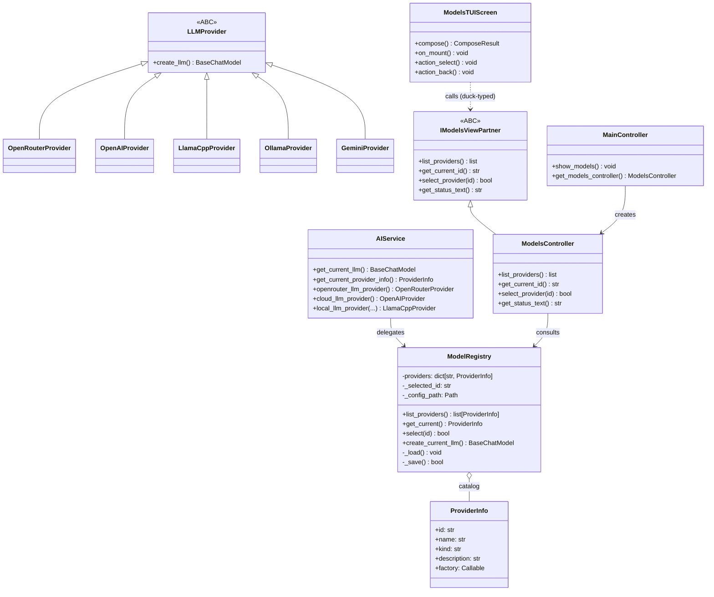
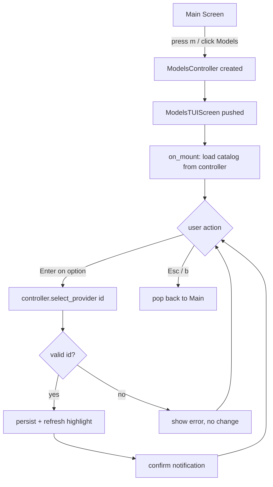
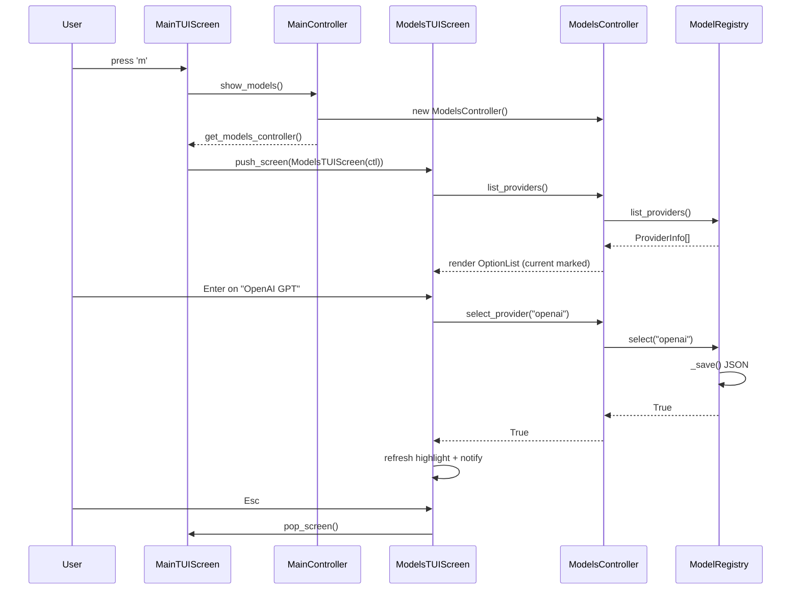
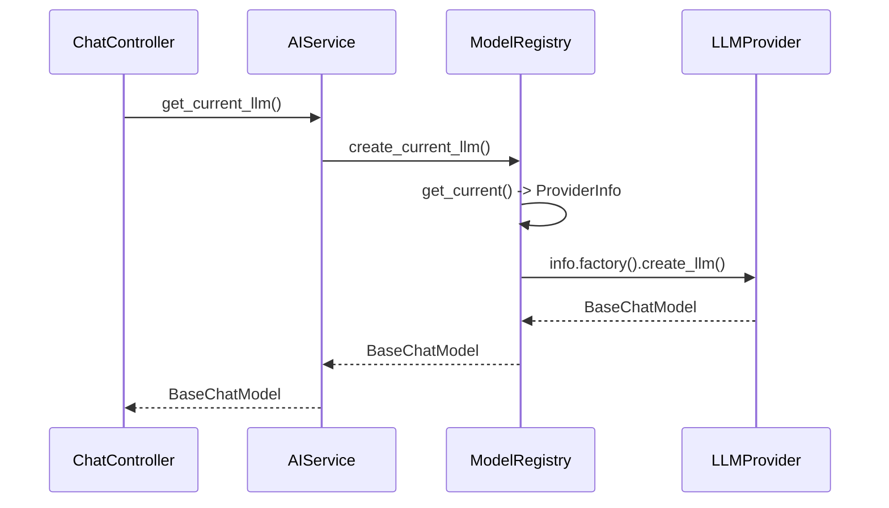

# Design 001: AI Model Provider Selector

> **Phase:** Design — `omt_agent_guide.md §2`, §5–§10 | **Feature:** feature_013.ai_model_provider_selector

## Components / screens affected

| Component | Layer | Action |
|---|---|---|
| `model/ai/providers.py` | Model | **Extend** — add `OllamaProvider`, `GeminiProvider` (unify ad-hoc code under `LLMProvider`). |
| `model/ai/model_registry.py` | Model | **NEW** — `ProviderInfo` dataclass + `ModelRegistry` (catalog + selection + JSON persistence + factory). |
| `model/ai/service.py` | Model | **Refactor** — add `get_current_llm()` / `get_current_provider_info()` delegating to the registry; keep legacy methods. |
| `ui/screens/models/models_controller.py` | Controller | **NEW** — `IModelsViewPartner` ABC + `ModelsController`. |
| `ui/tui/screens/models_screen.py` | View | **NEW** — `ModelsTUIScreen(BaseAgentXScreen)`. |
| `ui/screens/main/main_controller.py` | Controller | **Extend** — `show_models()` + `get_models_controller()`. |
| `ui/tui/screens/main_screen.py` | View | **Extend** — `m` binding + `action_open_models()` + 6th menu button. |
| `ui/tui/framework/widgets.py` | View | **Extend** — add 6th button to `MenuGrid`. |
| `chat_controller.py`, `rag_chat_controller.py`, `rag.py`, `agent/ai_adapter.py` | Model/Controller | **Refactor** — replace hardcoded `openrouter_llm_provider().create_llm()` with `AIService().get_current_llm()`. |

## Static structure (classes & files)

| File | Layer | Responsibility |
|------|-------|----------------|
| `model/ai/providers.py` | Model | `LLMProvider` ABC + 5 subclasses (`OpenRouterProvider`, `OpenAIProvider`, `LlamaCppProvider`, `OllamaProvider`, `GeminiProvider`). |
| `model/ai/model_registry.py` | Model | `ProviderInfo` dataclass; `ModelRegistry` — static catalog, current selection, JSON persistence, `create_current_llm()`. Module-level `default_registry`. |
| `model/ai/service.py` | Model | `AIService` facade — `get_current_llm()` delegates to registry; legacy methods unchanged. |
| `ui/screens/models/models_controller.py` | Controller | `IModelsViewPartner(ABC)` + `ModelsController` — list/select/query providers. |
| `ui/tui/screens/models_screen.py` | View | `ModelsTUIScreen` — Textual `OptionList` of providers, select on Enter, back on Esc. |
| `ui/tui/framework/widgets.py` | View | `MenuGrid` gains a 6th button "🎛️ Models". |

## Design class diagram



## Abstract Partner interface

```python
# ui/screens/models/models_controller.py
from abc import ABC, abstractmethod

class IModelsViewPartner(ABC):
    """Abstract Partner for the Models View (implemented by ModelsController)."""

    @abstractmethod
    def list_providers(self) -> list:
        """Return the catalog of available providers (ProviderInfo list)."""
        ...

    @abstractmethod
    def get_current_id(self) -> str:
        """Return the id of the currently selected provider."""
        ...

    @abstractmethod
    def select_provider(self, provider_id: str) -> bool:
        """Set + persist the current provider. Returns True on success."""
        ...

    @abstractmethod
    def get_status_text(self) -> str:
        """Return a one-line human-readable status of the current selection."""
        ...
```

## Dialog diagram (Models screen)



## Functional flow (sequence)

### Flow 1 — Open Models screen & select a provider



### Flow 2 — A feature uses the selected provider



## Persistence design

- **Format:** JSON, single key `{"selected": "<provider_id>"}`.
- **Default path:** `Path.home() / ".agentx" / "model_selection.json"`.
- **Behaviour:** `_load()` is best-effort (missing/corrupt file → default
  `openrouter`, no crash). `_save()` is best-effort (unwritable → in-memory
  only; `select()` still returns `True` because the in-memory selection
  succeeded, but the controller's `get_status_text()` notes persistence state
  only if needed — kept simple: selection always succeeds in-memory).
- **Injectable:** `ModelRegistry(config_path=...)` so tests use `tmp_path`.
- **Why JSON not sqlite:** selection is one scalar, not entity CRUD. The
  project's sqlite DP pattern is for entities (Session, RAG). A single-value
  JSON file is the proportionate choice (guide §1 "practical over theoretical").

## Provider catalog (static)

| id | name | kind | description | factory |
|---|---|---|---|---|
| `openrouter` | OpenRouter | cloud | Auto-routing across models | `OpenRouterProvider()` |
| `openai` | OpenAI GPT | cloud | gpt-3.5-turbo | `OpenAIProvider()` |
| `gemini` | Google Gemini | cloud | gemini-2.5-flash-lite | `GeminiProvider()` |
| `ollama` | Ollama | local | qwen3.5:0.8b (local server) | `OllamaProvider()` |
| `llamacpp` | LlamaCpp | local | local GGUF model | `LlamaCppProvider(default_model, 4096)` |

Default selection: `openrouter` (preserves current behaviour).

## Operation specifications

See `operation_spec_001_model_selector.md` for the full pre/exceptions/post
specs of: `select_provider`, `list_providers`, `get_current_id`,
`get_status_text`, `ModelRegistry.select`, `ModelRegistry.create_current_llm`,
`MainController.show_models`.

## MVC++ self-check

- [x] View (`ModelsTUIScreen`, `widgets.py`) does not import `agentx.model.*`
- [x] Model (`model_registry.py`, `providers.py`, `service.py`) does not import `ui`
- [x] Abstract Partner `IModelsViewPartner` is an `ABC` with `@abstractmethod`
- [x] No SQL in this feature (JSON persistence; no `*_db.py` needed for a scalar)
- [x] No `*Controller` under `model/` (`ModelRegistry` is a registry, not a controller)
- [x] `uv run scripts/omt/mvc_check.py` passes for touched files (verify in Testing)
- [x] View receives partner via construction (`BaseAgentXScreen.__init__(controller)`)
