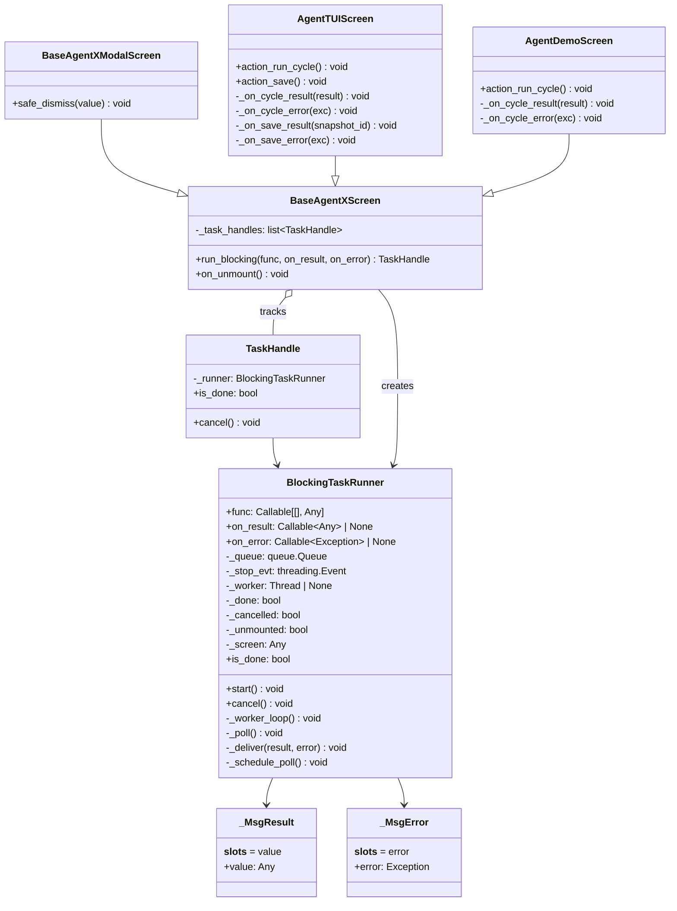
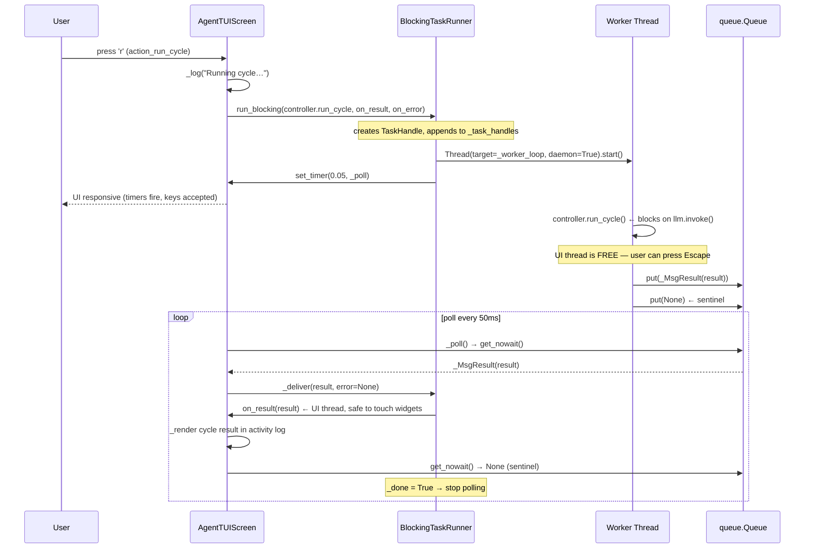
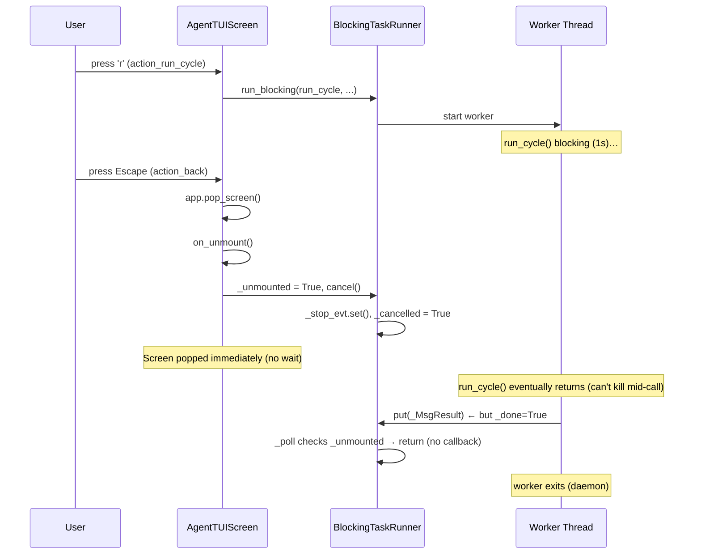
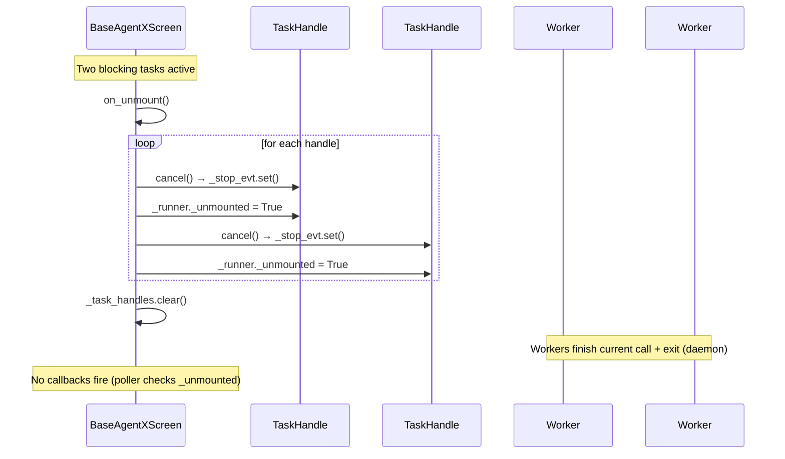

# Design 001 — TUI Nonblocking Runner

> **Phase:** Design — `omt_agent_guide.md §2, §5, §6, §7` | **Feature:** feature_014.tui_nonblocking_runner
> **Task type:** major_feature
> **Analysis:** `3.analysis/.../analysis_001_overview.md`, `analysis_002_use_cases.md`, `analysis_003_class_diagram.md`

## 1. Component overview

```
src/agentx/ui/tui/framework/
├── __init__.py            ← export BlockingTaskRunner, TaskHandle
├── base_screen.py         ← +run_blocking(), +on_unmount override
├── base_modal.py          ← (inherits run_blocking, no change)
├── async_runner.py        ← NEW: BlockingTaskRunner + TaskHandle + _Msg*
├── base_app.py            ← (no change)
├── base_adapter.py        ← (no change)
├── partner.py             ← (no change)
└── widgets.py             ← (no change)

src/agentx/agent/view/tui/
├── agent_screen.py        ← refactor action_run_cycle + action_save
├── demo_screen.py         ← refactor action_run_cycle
└── fast_agent_modals.py   ← (optional refactor of RunningModal)
```

**MVC++:** The runner is pure View — it imports no `agentx.model.*` module. The blocking
callable (`func`), the result (`Any`), and the callbacks are all duck-typed. Controllers
are accessed via `self._controller: Any` (existing convention).

## 2. Design class diagram



## 3. `BlockingTaskRunner` — detailed design

### 3.1 File: `src/agentx/ui/tui/framework/async_runner.py`

```python
"""Reusable non-blocking work runner for the AgentX TUI framework.

Runs a blocking callable on a daemon worker thread and delivers the result
(or exception) to the UI thread via a ``queue.Queue`` + ``set_timer`` poller.
The worker never touches Textual widgets; only plain data crosses the queue.

Design: ``design_001_nonblocking_runner.md`` §3.
Operation spec: ``operation_spec_001_nonblocking_runner.md`` O1–O5.
MVC++: pure View — no Model import.
"""
```

### 3.2 Message objects

```python
class _MsgResult:
    """Worker → UI: the callable returned a value."""
    __slots__ = ("value",)
    def __init__(self, value: Any) -> None:
        self.value = value

class _MsgError:
    """Worker → UI: the callable raised an exception."""
    __slots__ = ("error",)
    def __init__(self, error: Exception) -> None:
        self.error = error
```

### 3.3 `BlockingTaskRunner` class

| Attribute | Type | Purpose |
|-----------|------|---------|
| `_func` | `Callable[[], Any]` | The blocking callable to run. |
| `_on_result` | `Callable[[Any], None] \| None` | Called on the UI thread when `func` returns. |
| `_on_error` | `Callable[[Exception], None] \| None` | Called on the UI thread when `func` raises. |
| `_queue` | `queue.Queue[Any]` | Worker → UI message channel. |
| `_stop_evt` | `threading.Event` | Set by `cancel()` / unmount. Worker checks before starting. |
| `_worker` | `Thread \| None` | The daemon worker thread. |
| `_done` | `bool` | `True` after the worker finishes (result delivered or discarded). |
| `_cancelled` | `bool` | `True` if `cancel()` was called. Suppresses callbacks. |
| `_unmounted` | `bool` | `True` if the screen unmounted. Suppresses callbacks. |
| `_screen` | `Any` | The screen (duck-typed) — used for `set_timer`. |

| Method | Visibility | Purpose |
|--------|-----------|---------|
| `__init__(func, on_result, on_error, screen)` | public | Store config; init queue/events. |
| `start()` | public | Spawn the daemon worker; schedule the first `_poll`. |
| `cancel()` | public | Set `_stop_evt` + `_cancelled = True`. |
| `is_done` (property) | public | Return `_done`. |
| `_worker_loop()` | private | Run `func` on the worker thread; put result/error on queue. |
| `_poll()` | private | UI-thread poller: drain queue, deliver, re-schedule. |
| `_deliver(result, error)` | private | Invoke `on_result` / `on_error` unless cancelled/unmounted. |
| `_schedule_poll()` | private | `screen.set_timer(0.05, self._poll)` (wrapped in try/except). |

### 3.4 `TaskHandle` class

```python
class TaskHandle:
    """Handle returned by ``run_blocking()`` — allows cancellation + completion check."""
    def __init__(self, runner: BlockingTaskRunner) -> None:
        self._runner = runner

    def cancel(self) -> None:
        self._runner.cancel()

    @property
    def is_done(self) -> bool:
        return self._runner.is_done
```

### 3.5 Worker loop (off the UI thread)

```python
def _worker_loop(self) -> None:
    try:
        if self._stop_evt.is_set():
            return  # cancelled before starting
        result = self._func()
        self._queue.put(_MsgResult(result))
    except Exception as exc:  # noqa: BLE001 — surface to UI thread
        self._queue.put(_MsgError(exc))
    finally:
        self._done = True
        # Put a sentinel so the poller knows the worker is done even if
        # the queue was empty (edge case: func returned None instantly).
        self._queue.put(None)
```

### 3.6 Poller (on the UI thread)

```python
def _poll(self) -> None:
    if self._unmounted:
        return  # screen gone — stop polling
    drained_any = False
    while True:
        try:
            msg = self._queue.get_nowait()
        except queue.Empty:
            break
        drained_any = True
        if msg is None:
            # sentinel — worker is done
            pass
        elif isinstance(msg, _MsgResult):
            self._deliver(result=msg.value, error=None)
        elif isinstance(msg, _MsgError):
            self._deliver(result=None, error=msg.error)
    if not self._done:
        # Worker still running — keep polling.
        self._schedule_poll()
    # If _done is True, the final result/error was already delivered;
    # no need to poll again.
```

### 3.7 Deliver

```python
def _deliver(self, result: Any, error: Exception | None) -> None:
    if self._cancelled or self._unmounted:
        return  # suppress callbacks after cancel/unmount
    try:
        if error is not None:
            if self._on_error is not None:
                self._on_error(error)
        else:
            if self._on_result is not None:
                self._on_result(result)
    except Exception:
        pass  # never let a callback crash the poller
```

## 4. `BaseAgentXScreen` — integration

### 4.1 New attributes + methods

```python
class BaseAgentXScreen(Screen, NavigationMixin):
    def __init__(self, controller=None) -> None:
        super().__init__()
        self._controller = controller
        self._task_handles: list[TaskHandle] = []  # NEW

    def run_blocking(
        self,
        func: Callable[[], Any],
        *,
        on_result: Callable[[Any], None] | None = None,
        on_error: Callable[[Exception], None] | None = None,
    ) -> TaskHandle:
        """Run func on a daemon worker thread; deliver result/error on the UI thread."""
        runner = BlockingTaskRunner(func, on_result, on_error, screen=self)
        handle = TaskHandle(runner)
        self._task_handles.append(handle)
        runner.start()
        return handle

    def on_unmount(self) -> None:
        """Cancel all active blocking tasks when the screen is popped."""
        for handle in self._task_handles:
            handle.cancel()
        # Mark all runners as unmounted so the poller suppresses callbacks.
        # (Done via cancel() which sets _cancelled; the poller also checks
        #  _unmounted which we set on each runner.)
        for handle in self._task_handles:
            handle._runner._unmounted = True
        self._task_handles.clear()
```

**Note on `on_unmount`:** `BaseAgentXScreen` currently does not override `on_unmount`.
Adding this override is safe — subclasses that also override `on_unmount` must call
`super().on_unmount()`. We audit all subclasses during implementation.

### 4.2 `BaseAgentXModalScreen`

No change needed — it inherits `run_blocking()` + `on_unmount()` from `BaseAgentXScreen`.

## 5. Sequence diagrams

### 5.1 UC1: Run a blocking cycle without freezing



### 5.2 UC2: Cancel during a blocking cycle



### 5.3 UC3: Unmount cleanup



## 6. Screen refactors

### 6.1 `AgentTUIScreen.action_run_cycle()` — before → after

**Before** (freezes):
```python
def action_run_cycle(self) -> None:
    if not self._controller:
        return
    self._log("[bold blue]═══ Running cycle ═══[/bold blue]")
    try:
        result = self._controller.run_cycle()  # ← BLOCKS UI
        self._log(f"  Decision: {result.decision.reasoning} ...")
        # ... render ...
    except Exception as exc:
        self._log(f"[red]Cycle error: {exc}[/red]")
    self._refresh_status()
```

**After** (non-blocking):
```python
def action_run_cycle(self) -> None:
    if not self._controller:
        return
    self._log("[bold blue]═══ Running cycle ═══[/bold blue]")
    self.run_blocking(
        self._controller.run_cycle,
        on_result=self._on_cycle_result,
        on_error=self._on_cycle_error,
    )

def _on_cycle_result(self, result: Any) -> None:
    """Called on the UI thread when run_cycle completes."""
    try:
        self._log(f"  [bold]Decision:[/bold] {result.decision.reasoning} ...")
        # ... render decision, action, reflection (same as before) ...
    except Exception as exc:
        self._log(f"[red]Render error: {exc}[/red]")
    self._refresh_status()

def _on_cycle_error(self, exc: Exception) -> None:
    self._log(f"[red]Cycle error: {exc}[/red]")
```

### 6.2 `AgentTUIScreen.action_save()` — before → after

**Before:**
```python
def action_save(self) -> None:
    if not self._controller:
        return
    try:
        snapshot_id = self._controller.save_snapshot()  # ← blocks
        self._log(f"[green]Snapshot saved: {snapshot_id[:8]}…[/green]")
    except Exception as exc:
        self._log(f"[red]Save error: {exc}[/red]")
```

**After:**
```python
def action_save(self) -> None:
    if not self._controller:
        return
    self._log("[dim]Saving snapshot…[/dim]")
    self.run_blocking(
        self._controller.save_snapshot,
        on_result=self._on_save_result,
        on_error=self._on_save_error,
    )

def _on_save_result(self, snapshot_id: str) -> None:
    self._log(f"[green]Snapshot saved: {snapshot_id[:8]}…[/green]")

def _on_save_error(self, exc: Exception) -> None:
    self._log(f"[red]Save error: {exc}[/red]")
```

### 6.3 `AgentDemoScreen.action_run_cycle()` — before → after

Same pattern as 6.1 — extract the rendering into `_on_cycle_result` and the error
handling into `_on_cycle_error`.

### 6.4 `RunningModal` — optional refactor

**Decision: defer.** The `RunningModal` has a specialised multi-cycle loop with
pause/resume/progress that doesn't map cleanly to single-shot `run_blocking()`. Its 4
freeze-fix regression tests are the gate. Refactoring it risks destabilising proven
code for marginal duplication reduction. The primary deliverable (fixing
`AgentTUIScreen` + `AgentDemoScreen`) is achieved without touching the modal.

If a future feature needs the multi-step loop pattern in the framework, a
`run_loop(step_func, on_step, should_continue)` variant can be added then.

## 7. Edge cases & error handling

| Edge case | Handling |
|-----------|----------|
| `func` returns instantly (no blocking) | Worker puts `_MsgResult` + sentinel; poller delivers on next tick (~50ms). |
| `func` raises `SystemExit` / `KeyboardInterrupt` | Caught by `except Exception` — **no**, these are `BaseException` not `Exception`. The worker will exit; the poller sees no message and eventually stops when `_done` is set by `finally`. Actually, we catch `except Exception` which does NOT catch `KeyboardInterrupt`. This is correct — we don't want to swallow interrupts. But the `finally: self._done = True; queue.put(None)` ensures the poller stops. |
| Screen unmounts before worker starts | `on_unmount` sets `_unmounted` + `_stop_evt`; `_worker_loop` checks `_stop_evt` first and returns without calling `func`. |
| `on_result` callback raises | Caught by `_deliver`'s try/except — the poller continues. |
| Multiple `run_blocking` calls concurrently | Each creates its own runner + worker + handle. All tracked in `_task_handles`. All cancelled on unmount. |
| `set_timer` fails (no app context) | `_schedule_poll` wraps in try/except — polling stops, but the worker still finishes (result discarded). |

## 8. Testing strategy (for the Testing phase)

| Test group | What | Count (est.) |
|-----------|------|-------------|
| **Unit: BlockingTaskRunner** | `start`/`cancel`/`is_done`/`_deliver` with mock screen; result delivery; error delivery; cancellation suppresses callback; unmount suppresses callback | ~10 |
| **Unit: TaskHandle** | `cancel` delegates; `is_done` delegates | ~3 |
| **Unit: BaseAgentXScreen.run_blocking** | Creates runner + handle; tracks handle; returns handle | ~3 |
| **Freeze regression: AgentTUIScreen** | `run_cycle` runs off-thread; event loop responsive during block; Escape during block dismisses quickly | ~4 (mirror `TestRunningModalFreezeFix`) |
| **Freeze regression: AgentDemoScreen** | Same as above for the demo screen | ~3 |
| **Integration: AgentTUIScreen** | Full cycle → result rendered in log; save → snapshot ID logged | ~3 |
| **Integration: AgentDemoScreen** | Auto-run on mount → result rendered; reset works | ~2 |
| **MVC++ compliance** | `mvc_check.py` on new file; runner imports no Model; screens still pure View | ~2 |
| **Regression: RunningModal** | All 4 `TestRunningModalFreezeFix` tests pass unchanged | (existing) |
| **Total new tests** | | ~30 |

## 9. Non-goals (reiterated)

- No async/await rewrite (threads only).
- No Textual `@work`/`run_worker` migration.
- No controller/model changes.
- No `RunningModal` refactor (deferred — see §6.4).
- No new dependencies.
