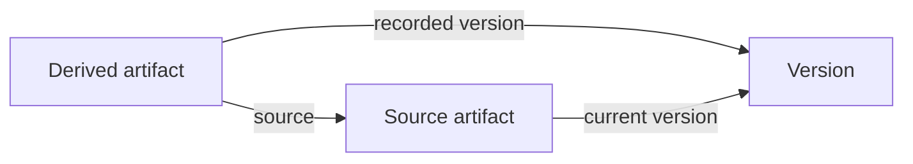
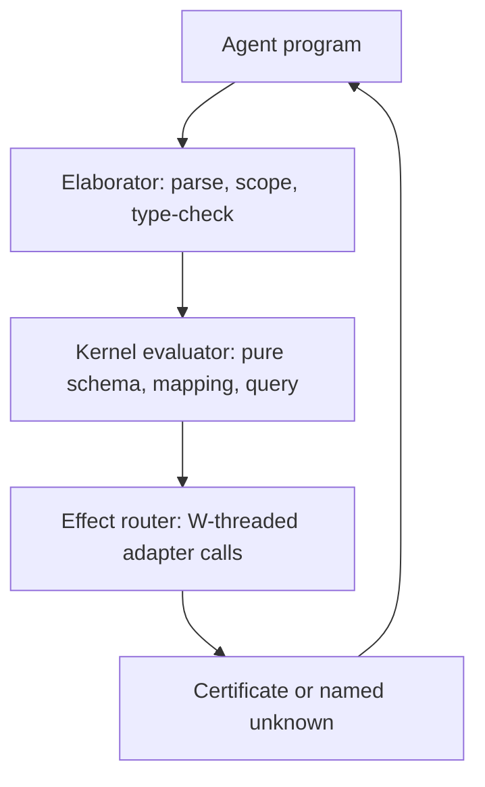
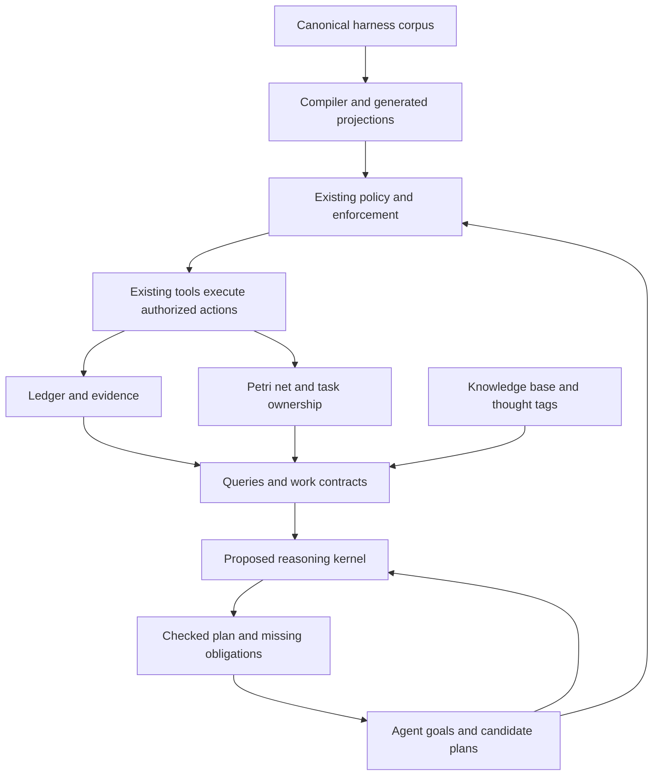
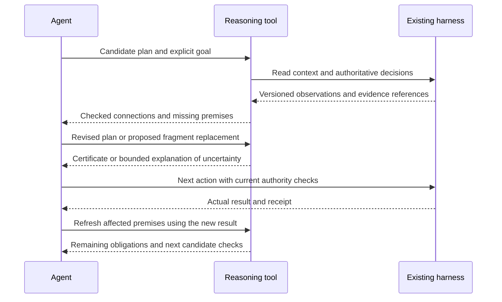

# Category Theory as an Active Reasoning Engine for Meta Harness

Date: 2026-09-26

Status: specification. This document is one cohesive specification: Part A defines the product, Part B records the background and analysis that justify it, Part C plans delivery. Earlier draft iterations are superseded throughout; no iteration history remains.

Scope: research and a concrete design proposal. No engine implementation is authorized by this document. All proposed paths, tools, and registrations are suggestions; none are created by this document.

## Product decision

Build one product: a **typed interaction language (§2) evaluated by a small categorical kernel plus harness adapters, exposed as `harness.reason`** via toolbox discovery.

In one sentence: the agent writes a program (schemas, models, mappings, queries, computations); the interpreter elaborates and type-checks it, the kernel evaluates pure fragments, the effect router calls existing harness adapters in `W` order, and every run returns a digest-bound certificate or a named unknown.

Categories model structure, functors interpret and translate, one worked adjunction answers abstraction/realization questions (§3), and one monadic `compute` carries state and failure explicitly (§4). The validation-centered checker (§11: `check/explain/compare/plan`) is the stage-1 subset of this language: `check` runs a query plus its compute premises, `explain` slices its certificate, `compare` checks two programs under a named observation contract, `plan` fills a typed hole. Where Part B conflicts with Part A or Part C, Parts A and C take precedence.

The entry point is `harness.reason`, discovered through the toolbox. Its operations concern modeling, abstraction, mapping, relational queries, and concretization. Existing Meta Harness enforcement remains the execution boundary. This document proposes the engine; it does not register or deploy one.

## How to read

- Part A — Product (§§1–7): definition, language, adjunction, semantics, certificates, use cases, plugin integration.
- Part B — Background and analysis (§§8–12): baseline, foundations, harness context, workbench, examples.
- Part C — Delivery (§§13–16): rollout, evaluation, feasibility and gates, project plan.

## Investigation method and boundaries

1. Learn the relevant mathematical foundations from primary sources.
2. Inspect the current harness's canonical artifacts and read-only toolbox outputs.
3. Distinguish capabilities already present from capabilities genuinely missing.
4. Design the smallest useful engine, including mathematical semantics and an agent-facing protocol.
5. Challenge the proposal with failure cases, alternatives, and measurable acceptance criteria.

This follows the research portion of the repository's [harness evolution workflow](../.workflows/meta_harness/loops/meta_harness_evolution.md). The workflow directs investigation through artifacts and the toolbox, and permits parallel analysis. Its suggested output location is adapted to the user's explicit request for a document under `.sandbox`. It does not authorize applying a proposed harness change.

The workflow prohibits source-code investigation. Initial startup discovery read the navigation and net tool wrappers to establish how to call them; subsequent architecture research uses the canonical corpus, documentation, and tool observations. Findings will distinguish documented contracts from directly observed behavior and design inferences. This is not an implementation audit.

The [Mermaid-in-Markdown skill](../.agents/skills/mermaid-in-markdown/SKILL.md) governs diagrams in this document.


## Part A — Product

### 1. Product definition

### 1.1 What the agent should be able to do

The important output is a reusable account of **how things relate**, with explicit ways to move between levels of detail. An agent should be able to ask:

- Which relationships make these two apparently different problems instances of one structure?
- What can I forget while preserving the question I need to answer?
- What additional conclusions follow by composing the relationships I already have?
- Can a pattern learned in one domain be interpreted in another, and where does that interpretation fail?
- Which concrete possibilities satisfy this abstract description? What information would distinguish them?
- How do I carry this reasoning into computations that read, change, or fail in the world?

The LLM proposes meanings, hypotheses, and candidate abstractions. The engine materializes them as data, computes their consequences, finds witnesses or counterexamples, and records what was preserved or forgotten. This gives the agent an inspectable model it can revise, rather than requiring it to reconstruct all relationships in prose each time.

### 1.2 Distinguish the model, its data, and its computations

Three levels must remain explicit:

| Level | Representation in the proposed program | Example |
|---|---|---|
| Relational schema | A small category presented by object sorts, generating arrows, and declared path equations | `DerivedArtifact`, `SourceArtifact`, `Version`, and their relations |
| Observed model | A functor from that schema to sets and functions; initially finite tables | Actual receipts, files, digests, and which source each receipt concerns |
| Effectful computation | A typed arrow `A → T(B)` in the chosen computation model | Read a file, run a check, update a modeled state, return a result and log |

Here a schema object is a **sort**, while actual files or receipts are elements in an instance. A schema arrow is a composable, typed relation represented as a function at this level. Many-to-many relations must be represented explicitly—for example by a `Dependency` sort with source and target arrows—rather than silently pretending they are single-valued functions.

Free-text edges such as “related to” can be retained as hypotheses or annotations. They become computational arrows only when their domain, codomain, interpretation, and composition meaning are specified. The schema/instance distinction and functorial migration approach are supported by [Spivak, *Functorial Data Migration*](https://arxiv.org/pdf/1009.1166).

### 1.3 A reusable abstraction with a computable relationship

Consider a small observation schema with three sorts and three arrows:

```text
source:   DerivedArtifact → SourceArtifact
recorded: DerivedArtifact → Version
current:  SourceArtifact  → Version
```

The diagram gives two ways to reach a version from a derived artifact. Its arrows are relationships in the model; traversing an arrow does not execute a tool.



For a particular observed item `d`, the engine can compute:

```text
recorded(d) == current(source(d))
```

Interpretation: the derived artifact names the current version of its source. This is a useful relationship, not yet a claim that the artifact is semantically correct or sufficient for every task.

Crucially, do **not** impose this equation on every observation by definition: that would exclude stale examples from the data model. Instead, compute the subset on which the two paths agree. In `Set`, this is an equalizer:

```text
Aligned = { d in DerivedArtifact
            | recorded(d) == current(source(d)) }
```

Items outside the equalizer provide concrete mismatch witnesses. If a source or version is unknown, represent that partial information explicitly and return an unresolved case; do not manufacture a value to make the functions total.

### 1.4 Interpret one abstraction in several domains

| Abstract role | Harness interpretation | Another possible interpretation |
|---|---|---|
| DerivedArtifact | Verification receipt | Search-index entry |
| SourceArtifact | Candidate code artifact | Source document |
| Version | Relevant content digest | Document revision |
| source | Subject of the receipt | Document indexed by the entry |
| recorded | Digest covered by the check | Revision used during indexing |
| current | Current candidate digest | Current document revision |

This second interpretation is illustrative, not an assertion about the current application implementation. The abstraction also appears in generated documentation, compiled assets, and caches when their real dependency structure fits it.

The mappings must preserve types and declared compositions. Define a schema interpretation `F: AbstractSchema → HarnessSchema`. Given concrete harness data `I: HarnessSchema → Set`, extract the abstract view by composition:

```text
AbstractView = I ∘ F
```

Another domain can supply `G: AbstractSchema → IndexSchema` and `J: IndexSchema → Set`. The same abstract query then runs on `J ∘ G`. The agent reuses the relationship and query, while each domain retains its own interpretation and observations.

This is more precise than saying two problems “look similar.” The program contains the mapping, can reject an ill-typed one, and can return a particular item whose paths disagree. Yet agreement after forgetting information does not establish agreement in the full domain. For example, the version abstraction deliberately says nothing about permission, coverage, or the quality of a test.

### 1.5 What this specification delivers

§2 defines the language. §3 works one adjunction end-to-end on the staleness schema. §4 fixes `compute` semantics and partial-data handling. §5 fixes the certificate schema. Together they are the product; §§11–14 are their stage-1 subset. Naming a class `Functor` or `Monad` without these sections is insufficient by definition.

## 2. Interaction language: program plus interpreter

The agent does not call the categorical kernel with ad-hoc JSON blobs. It writes a small, typed **program** in a formal interaction language; a pure **interpreter** elaborates, type-checks, and evaluates that program against the kernel and harness adapters. The program is data the agent can inspect, revise, and reuse; the interpreter is what gives it meaning.

Design intent:

1. **Make relationships writable.** The agent states sorts, arrows, equations, mappings, and queries as terms, not prose. The interpreter rejects ill-typed or ill-scoped terms before any kernel work.
2. **Separate pure modeling from effectful observation.** Pure fragments (`schema`, `model`, `mapping`, `query`) evaluate without touching the world. Only `compute` touches adapters, threading the explicit world wire `W`. A `query` never validates; it names the `compute` premises it needs.
3. **Keep every run replayable.** A program plus its catalog version, context manifest, and interpreter version determines its verdict. The interpreter emits a certificate (§6.9) or a named unknown, never a bare boolean.
4. **Stay small.** No general-purpose scripting, no arbitrary Python predicates, no new `.omt` grammar in the first slice. A JSON IR first; a surface syntax only when the IR proves useful.

The interaction below is a proposed language design, not an installed tool or syntax:

```text
program      := decl*
decl         := schema_decl | model_decl | mapping_decl | query_decl | compute_decl
schema_decl  := schema Name { sort* ; arrow* ; equation* }
model_decl   := model Name : Schema { table* }
mapping_decl := mapping Name : SchemaA -> SchemaB { sort_map* ; arrow_map* ; preserves* }
query_decl   := query Name on ModelOrView needs Compute* { equalizer | path_compare | concretize }
compute_decl := compute Name in IO_Fail { step* }  // semantics in §6.8
```

Representative operations the language must express, matching the engine's central questions:

| Program form | Engine meaning | Example |
|---|---|---|
| `schema Obs { ... }` | Declare relational schema as small presented category | `DerivedArtifact`, `source`, `recorded`, `current` |
| `model HarnessObs : Obs { ... }` | Observed instance as functor `Obs -> Set` (finite tables, `Maybe` cells per §6.8) | Receipts, digests, file bindings |
| `mapping F : Abstract -> Harness { ... ; preserves ... }` | Structure-preserving interpretation; each `preserves eq` carries its check (§6.7) | Abstract staleness pattern to harness receipts |
| `query aligned on HarnessObs needs refresh { ... }` | Pure equalizer / path agreement / witnesses over current tables | `recorded(d) == current(source(d))` plus counterexamples |
| `abstract A from M via Forget` / `concretize C from A via Realize` | The one worked adjunction (§6.7): forget detail vs. enumerate realizations | Version-only view vs. detailed possibilities differing in permission/coverage |
| `compute refresh in IO_Fail { ... }` | Monadic computation per §6.8 with explicit read/check/fail effects | Import context, run validator, return result plus log |

An illustrative program, using symbolic digests rather than live artifacts. The `preserves` clause is machine-checked, not a comment:

```text
schema Obs {
  sorts DerivedArtifact, SourceArtifact, Version;
  arrows source: DerivedArtifact -> SourceArtifact,
         recorded: DerivedArtifact -> Version,
         current: SourceArtifact -> Version;
}
model HarnessObs : Obs {
  tables { DerivedArtifact = [d1, d2, d3]; /* Maybe cells per §6.8; bindings omitted */ }
}
mapping F : AbstractStale -> Obs {
  sorts AbstractStale.Derived -> Obs.DerivedArtifact;
  arrows AbstractStale.rec -> Obs.recorded; /* etc., total on sorts+arrows */
  preserves stale_eq : rec == cur o src  by finite_table_check;
}
query aligned on HarnessObs needs refresh {
  equalizer recorded vs current o source -> Aligned, Mismatched, Unresolved;
}
compute refresh in IO_Fail {
  import context manifest;
  validate each d in Mismatched via existing_test_receipt_adapter/v1;
  return witnesses + unknowns;
}
```

Interpreter architecture (proposed, three stages plus effect router):



- **Elaborator** is pure: parsing, scope resolution, sort/arrow kind checking, equation well-formedness, mapping totality (every source sort/arrow mapped) and per-equation `preserves` obligations. An ill-typed or partial mapping fails here with a location and the missing sort/arrow/equation ID — never deep in the kernel.
- **Kernel evaluator** runs pure fragments only: path composition, equalizer computation on finite tables with `Maybe` semantics (§6.8), functorial migration `I o F`, the §6.7 unit/counit checks, and certificate assembly (§6.9) with digests of program, catalog, and model versions.
- **Effect router** handles only `compute` blocks per §6.8: threads `W` linearly in order, calls existing harness adapters (evidence, policy, net observations), enforces capability threading, and returns tagged outcomes `pass|fail|blocked|timeout|error` plus fresh unknowns on missing validators or inconsistent snapshots.
- **Result discipline** follows §3.6 and §4.5: `proved_in_model` with replayable derivation vs. `observed` with receipt; `no_candidate_within_bounds` with bounds; `unknown` with exact reason; `snapshot_inconsistent` on epoch mix. Freshness, permission, resource, and semantic uncertainty are never collapsed into one score.

What the language refuses:

- Arbitrary control flow, recursion, or general theorem search in the first slice; bounded `do` with declared effects only.
- Natural-language `requires` as executable proof; every predicate must resolve to a registered validator or return `unknown`.
- Silent promotion of `Hypothesis` to `Evidence`, of a warm-cache hit to a fresh check, or of net-projection equality back to diagram equality.
- Execution authority: programs advise via `harness.reason`; grants, leases, and `Done` remain with existing enforcement.

`harness.reason` operations are interpreter entry points on this language: `check` evaluates a `query` plus its named `compute` premises; `explain` slices the §6.9 certificate by node ID; `compare` checks two programs under a named observation contract; `plan` fills a typed hole with bounded search. The language is the agent-facing surface; the kernel plus adapters remain the trusted core described in §3.2.

## 3. Worked adjunction: forget detail vs. enumerate realizations

This is the only adjunction in the MVP. Natural transformations have no MVP role: a future cross-interpretation comparison (`F` vs `G` on two domains) would need one, but the pilot compares programs under named observation contracts (§3.7) instead. All other “abstraction” talk must reduce to this pattern or be labeled documentation, not engine behavior.

**Schemas.** Detailed schema `D` extends the §6.3 observation schema with the detail the version abstraction forgets:

```text
schema D {
  sorts DerivedArtifact, SourceArtifact, Version, Permission, Coverage;
  arrows source: DerivedArtifact -> SourceArtifact,
         recorded: DerivedArtifact -> Version,
         current: SourceArtifact -> Version,
         perm: DerivedArtifact -> Permission,
         cover: DerivedArtifact -> Coverage;
}
schema A {
  sorts DerivedArtifact, SourceArtifact, Version;
  arrows source, recorded, current;  // same names, no perm/cover
}
```

**Functors.** `Forget: Mod(D) -> Mod(A)` drops the `perm`/`cover` columns (projection). `Realize: Mod(A) -> Mod(D)` sends an abstract model `N` to the set of all detailed extensions consistent with it — bounded in the pilot to the finite permission/coverage vocabularies in the catalog (`Permission = [allow, deny]`, `Coverage = [full, partial]`), plus `unknown` where the adapter cannot establish a value. Concretization therefore returns possibilities plus the distinguishing information that would separate them, never invented facts.

**Finite example.** Detailed tables (symbolic digests; `perm`/`cover` may be `unknown`):

```text
D.DerivedArtifact:
  d1: source=s1, recorded=v3, current(s1)=v3, perm=allow, cover=full      // aligned
  d2: source=s1, recorded=v2, current(s1)=v3, perm=allow, cover=partial   // stale
  d3: source=s2, recorded=unknown, current(s2)=v1, perm=unknown, cover=unknown  // unresolved
A view = Forget(D):
  d1: (s1, v3, v3)  d2: (s1, v2, v3)  d3: (s2, unknown, v1)
```

**Unit and counit, operationalized (checked by the kernel, not asserted):**

- Unit `eta_M: M -> Realize(Forget(M))`: every detailed row embeds into the concretization of its own abstraction. Check: `d1` appears among `Realize(Forget(D))` rows for `(s1,v3,v3)`; the extra rows in that fiber are exactly the forgotten variation (`perm` × `cover` combos). What was forgotten is listed: `[perm, cover]`. If a row does not reappear, the adjunction implementation is wrong — fail the run.
- Counit `eps_N: Forget(Realize(N)) -> N`: abstracting a concretization recovers at most the abstract row — nothing invented. Check: `Forget(Realize(row (s1,v3,v3))) == {(s1,v3,v3)}`. If abstraction invents a new version, fail the run.
- Triangle identities are checked on the finite pilot vocabularies by enumeration; they are replayable derivations in the certificate, not general proofs.

**Concretize output contract.** `concretize C from abstract_row via Realize` returns:

```text
realizations: [detailed rows consistent with abstract_row, bounded by catalog vocabs]
distinguishing_info: [perm?, cover?, recorded? for unknown cells]
```

For `(s1,v2,v3)` (stale): realizations vary only in `perm`/`cover`; distinguishing info says version agreement already decides staleness — permission does not rescue it. For `(s2,unknown,v1)`: distinguishing info requires `recorded` first; permission/coverage questions are premature. This is how the engine computes “what information would distinguish them” (§6.1).

**Acceptance for §6.7:** the three-row example above replays from digests; unit/counit checks pass; `preserves stale_eq` is verified per mapping; agreement after `Forget` is never reported as agreement in `D`.

## 4. `compute` semantics and partial data (`Maybe`)

**Effect type.** `IO_Fail(A) = World -> (World × Result_A × Log)` where `Result_A = ok(A) | fail(Failure) | unknown(Reason)` and `Failure = fail|blocked|timeout|error` with the §3.3 tagged payload. `Log` is an append-only list of adapter calls with versions and digests.

**Ten-line semantics (the whole MVP effect model):**

```text
1. return x       = \w. (w, ok(x), [])
2. bind m f       = \w. let (w1, r, l1) = m w in case r of
3.                   ok(x)      -> let (w2, r2, l2) = f x w1 in (w2, r2, l1 ++ l2)
4.                   fail(e)    -> (w1, fail(e), l1)          // short-circuit, keep log
5.                   unknown(u) -> (w1, unknown(u), l1)       // unknown propagates, never guessed
6. import_ctx manifest = \w. (w, ok(ctx) | unknown(snapshot_inconsistent), [read manifest@version])
7. validate d via V   = \w. adapter V reads w, returns ok(evidence) | fail(mismatch) | unknown(reason)
8. W-linearity: every compute step consumes and returns exactly one W; no copy, drop, or split of W.
9. Capabilities thread as values alongside W; duplicating an exclusive lease is a type error, not a runtime check.
10. Failure never becomes success: no handler turns fail(e) into ok(x); recovery is a new compute with fresh W.
```

**`W` ordering rule.** All live reads, writes, test executions, and authority checks appear in program order on `W`. File-disjointness never implies independence. Pure `query` evaluation takes no `W` and cannot call adapters.

**Partial data (`Maybe`).** Every table cell is `just(v) | nothing | unknown(reason)`. Equalizer three-valued logic for `recorded(d) == current(source(d))`:

```text
just(a) == just(b)  -> aligned if a==b else mismatched
anything == unknown / unknown == anything -> unresolved (keep reason: missing_source|missing_version|missing_binding)
nothing == nothing  -> unresolved (no value to compare), never aligned
```

`Aligned`/`Mismatched`/`Unresolved` are three disjoint outputs of every equalizer query. `Unresolved` rows flow to `compute` as `unknown` premises with their reason; the router must not coerce them to `fail` or `ok`.

**Acceptance for §6.8:** §4.2 reorder program evaluates to `(h1,h1)/accepted` vs `(h1,h0)/not-accepted` with logs showing `W` order; `fail`/`unknown` propagation cases replay; the `d3`-style unresolved row stays unresolved through migration and query.

## 5. Certificates and the over-budget envelope

Every run emits exactly one of: `certificate` (checks replay from digests) or `named unknown`. No bare booleans. Verdict fields from §3.6 (`structural`, `premises`, `execution`, `goal`) are mandatory top-level keys.

```json
{
  "ok": true,
  "data": {
    "structural": "valid",
    "premises": "invalid",
    "execution": "not_attempted",
    "goal": "not_established",
    "program_digest": "sha256:example-prog",
    "catalog_version": "example-catalog-v1",
    "model_version": "example-model-v1",
    "interpreter_version": "example-interp-v1",
    "context_id": "example-context-1",
    "observation_contract": "completion-relevant-v1",
    "unit_counit": "checked",
    "issues": [{
      "node": "accept_tests",
      "code": "subject_digest_mismatch",
      "expected": "artifact:h2",
      "observed": "receipt-subject:h1",
      "via": "existing_test_receipt_adapter/v1",
      "next_obligation": "obtain applicable test evidence for h2"
    }],
    "unknowns": [{"node": "d3", "reason": "missing_version", "needed": "recorded value for d3"}],
    "derivation": [{"rule": "equalizer", "inputs": ["recorded", "current o source"], "outputs": ["Aligned", "Mismatched", "Unresolved"]}],
    "certificate_digest": "sha256:example-cert"
  }
}
```

`ok: true` means the interpreter ran; verdicts carry validity. `derivation` plus digests must suffice to replay the pure fragment without re-calling adapters.

**Over-budget rule (§5.6 binding).** Default summary ≤ ~2 KB preserves verdict, unknowns, scope, and stale dependencies. If the full certificate does not fit, emit the summary plus a mandatory `detail_ref` and never truncate:

```json
{"summary": {"structural": "valid", "goal": "not_established", "open_obligations": 2},
 "detail_ref": "cert:sha256:example-cert",
 "note": "full certificate addressable by digest; summary is not the certificate"}
```

**Acceptance for §6.9:** the §3.6 mismatch example and the §6.7 three-row example both produce replayable certificates from digests alone; truncation of a certificate fails validation.

## 6. Agent use cases — production standard

Each use case is a production contract on a §6.6 program: typed inputs, idempotent pure evaluation, bounded effectful `compute`, §6.9 certificate outputs, named failures, retry rules, budgets, and an acceptance probe. All are advisory — execution authority stays with existing enforcement. Shared contract first; per-UC deltas after.

**Shared production contract (all UCs inherit, no exceptions):**

- Preconditions: program digest + catalog/interpreter versions pinned; context manifest (§3.5) captured or explicitly waived for pure-only runs; protected secrets never hashed or read — hidden-dependency limits report as `unknown`, never bypass.
- Purity split (§6.8): `schema/model/mapping/query` are pure, deterministic, replayable from digests; only named `compute` premises touch adapters, threading single `W` linearly in program order.
- Outputs: one §6.9 certificate or named unknown per run with mandatory `structural/premises/execution/goal`, `program_digest`, versions, `observation_contract`, `unit_counit` where applicable, `issues/unknowns/derivation`, `certificate_digest`. Summaries ≤ ~2 KB preserve verdict/unknowns/scope/stale deps; overflow uses the `detail_ref` envelope, never truncation.
- Failure taxonomy (closed): `subject_digest_mismatch`, `different_under_declared_model`, `snapshot_inconsistent`, `no_candidate_within_bounds`, `unknown(<reason>)`, adapter `fail|blocked|timeout|error`. No bare booleans, no confidence scores, no `fail`-to-`ok` coercion.
- Retry/idempotency: pure re-evaluation is free and idempotent; `compute` retries only on `snapshot_inconsistent`/`timeout` with bounded retries and fresh `W`; `fail`/`blocked` never auto-retry — agent supplies a new program or premise.
- Observability: every run logs program/catalog/model/interpreter digests, adapter calls with versions, `W` order, and outcome class. Toolbox run counts are not quality metrics; quality is per-§5.5 paired measurement.
- Budgets: on-demand discovery only (39 B headroom constraint); per-call output discipline per §5.6; concretization bounded by catalog vocabs; `plan` bounds (depth/candidates/time) mandatory in output.

**UC1 — Stale-receipt triage after an edit.** Preconditions: edited artifact path + prior receipt ID. In: `query aligned on HarnessObs needs refresh` scoped to that artifact. Out: `Aligned` (proceed) or `subject_digest_mismatch{expected, observed, via, next_obligation}` or `Unresolved{reason}` for `Maybe` cells (§6.8). Failures: missing receipt version → `unknown(unsupported_receipt_version)`; env inapplicable → `unknown` + needed fingerprint. Retry: pure re-query idempotent; `validate` once per new digest. Budget: 1 query + ≤1 validate per artifact. Accept: §7.8 probe 3 agreement with existing adapter. Anti-pattern: treating `Aligned` as semantic correctness — it is version agreement only (§6.3).

**UC2 — Resume interrupted work.** Preconditions: prior program/certificate digest + manifest. In: reload program; re-evaluate pure fragments on immutable inputs; re-run only `compute` premises whose dependencies changed (§3.5 dependency-tracked invalidation). Out: preserved derivations + open obligations with stale causes. Failures: catalog/validator/policy drift → affected results marked stale, never silently kept; epoch mix → `snapshot_inconsistent`. Retry: pure replay unbounded; adapter re-import bounded. Budget: cost ∝ changed dependencies, not plan size. Accept: unrelated-input change preserves immutable derivations (§5.4 case); metric: avoided derivation steps. Anti-pattern: replaying permission/applicability from cache — always re-import.

**UC3 — Reuse a verified fragment.** Preconditions: approved macro digest (`verify_candidate`) + new bindings. In: macro expansion with exact defining-diagram match; fresh `artifact/acceptance/validator` binds. Out: replayed defining certificate + fresh obligations; refusal on `h2`-with-`h1`-evidence with location. Failures: validator substitution without equivalence proof → `unknown`; authority/lease carryover attempt → type error at elaboration. Retry: rebinding is a new run, not a retry. Budget: 1 expansion + N fresh validations. Accept: §7.8 probe 6 across two artifacts. Anti-pattern: “similar steps” substitution — only exact expansion plus named laws (§3.7).

**UC4 — Plan reorder decision.** Preconditions: two candidate programs with same boundary + named contracts. In: `compare` under `completion-relevant-v1` (default for acceptance) and optionally `files-only-v1` for diagnosis. Out: `different_under_declared_model{witness}` or contract-relative equality, contract named in certificate; surrounding-context restriction noted. Failures: missing contract → `unknown` (never default-permit). Retry: pure, idempotent. Budget: bounded by model size; no search. Accept: §7.8 probe 2 split verdicts with `(h1,h0)` witness. Anti-pattern: promoting files-only equality to completion equality.

**UC5 — Cross-domain pattern transfer.** Preconditions: source mapping `F` with passing `preserves` checks; target schema + instance available. In: `mapping G: AbstractStale -> Target` with per-equation `preserves ... by finite_table_check`; same `query aligned` on `J o G`. Out: transfer accepted with preservation evidence, or elaborator rejection with sort/arrow/equation location. Failures: partial mapping → reject; equation holds in source but not target → explicit per-equation failure, not silent drop. Retry: mapping edits are new runs. Budget: 1 preservation check per equation + 1 query per domain. Accept: at least one positive (receipts) and one negative (ill-typed) transfer case. Anti-pattern: “looks similar” transfer without `preserves`.

**UC6 — Concretize with bounded options.** Preconditions: abstract row + `Realize` vocab bounds from catalog. In: `concretize C from abstract_row via Realize`. Out: `realizations[]` + `distinguishing_info[]` ordered by information value (`recorded` before `perm/cover` for `d3`-style rows); unbounded/permission-gated fibers → `unknown(bound_exceeded|permission_gated)` with the bound. Failures: enumeration exceeds bound → truncate with stated bound + `detail_ref`, never silent cut. Retry: pure, idempotent. Budget: ≤ vocab product rows; default summary lists count + top distinguishing items. Accept: §6.7 three-row replay. Anti-pattern: presenting one realization as *the* answer.

**UC7 — Pre-mutation snapshot and capability audit.** Preconditions: manifest spec (§3.5) + required capability IDs. In: `compute` importing manifest, threading capabilities as values. Out: `ok(ctx)` with pinned versions, or `unknown(snapshot_inconsistent)` with retry guidance, or capability duplication → elaboration-time type error. Failures: dirty relevant input mid-collection → bounded retry then `unknown`; secret-gated input → `unknown(hidden_dependency)` without reading. Retry: bounded (manifest-defined, e.g. ≤3) then escalate. Budget: 1 collection + ≤3 retries. Accept: §7.8 probes 4–5. Anti-pattern: reading `ok(ctx)` as permission grant — `W` sequences, enforcement authorizes.

**UC8 — Explain and close the hole.** Preconditions: any `goal: not_established` certificate. In: `explain` by result + node/obligation ID. Out: minimal premise-to-conclusion slice, first unsupported connection, source refs, permitted acquisition path; ≤ ~2 KB or `detail_ref` envelope. Failures: unknown node ID → `unknown`; stale certificate → re-evaluate first. Retry: pure, idempotent. Budget: 1 slice per call. Accept: slice reproduces the §3.1 question (“what is the first unsupported connection?”) on the §3.6 example. Anti-pattern: dumping the full derivation as the explanation.

**Production SLOs (pilot targets, not guarantees):** elaborator rejects ill-typed programs with location on first pass; pure replay from digests is byte-stable for immutable inputs (§7.8 probe 7); stage-1 verdicts agree with existing authority on all 12 §5.4 cases; `snapshot_inconsistent` is returned — never a mixed-epoch plan; no certificate truncation passes validation.

**Runbook (agent call order):** `check` → `explain` on failure → `compare` for substitutions → `concretize` for options → bounded `plan` only after `check/compare` prove value → execute via harness → refresh affected premises. Log digests every step; cache immutable derivations separately from permission/applicability (§5.6).

When **not** to call the engine: single reads/edits with no composition, pure policy questions answered by preflight/contracts, or any step needing execution authority — call the harness directly. On-demand discovery only.

## 7. Opencode plugin integration

This section grounds the §6.6 interpreter surface in the actually observed plugin mechanics of this repository. It is a design proposal refining §5.2; no plugin file, permission block, registry row, or runtime change is made by this document. Proposed paths below are suggestions, not created files.

Observed ground rules the design must respect:

- Local plugins auto-load from `.opencode/plugins/`; the `plugin` array in `opencode.jsonc` is npm-only, so `omt_*` surfaces are deliberately not listed there. Dropping a file in that directory is sufficient to load it.
- The `omt_` filename prefix is the harness-surface boundary: a new `omt_*` plugin needs a `@tool` row in `.meta/META_HARNESS.omt`, a `harnessc` build, and a fresh e2e receipt. The existing `startup_table` plugin deliberately avoids the prefix to stay a pure prompt-side formatter with zero harness edits. Descriptions for `omt_*` tools resolve from the compiled IR after shared-lib init, with a byte-match guard between the TS fallback seed and the `.omt` payload (a 1 B drift fails the build), and the always-loaded schema budget is nearly full (39 B headroom noted in the baseline snapshot (§8)), so long documentation belongs in toolbox pages, not tool descriptions.
- The established implementation shape is a thin proxy: TypeScript registers the tool and shells out via `execFileSync` to `uv run scripts/...` Python, where the state machine lives (no `src/` import from plugins). Per-op argv is whitelisted against the Python CLI subparsers and cross-source pinned by tests. Bash policy allows `uv *` while denying bare `python`/`pip`/`pytest`, so the `uv run` invocation is the permitted path.
- The enforcer plugin is a thin composition root (hook registration plus dispatch; gate logic in `lib/` modules) with `tool.execute.before` (phase/tests/protected-file gates) and `tool.execute.after` (data-driven after-chains). A reasoning tool must pass through these hooks as a no-op: no phase requirement, no after-chain revert, no token movement.

Single-core rule: one Python SSOT owns the semantics (`scripts/reason/` core: elaborator, kernel evaluator, effect router, certificate emitter). Every surface — opencode plugin, toolbox wrapper — is a thin caller of that core. No duplicated semantics in TypeScript, no second runtime, no `uv.lock` change in research.

Three integration tiers, in order:

| Tier | Plugin shape | Harness cost | When |
|---|---|---|---|
| 0 — prompt-side renderer | `reason_table.ts`, no `omt_` prefix, stdlib only (same pattern as `startup_table`): formats §6.6 programs and §6.9 certificates/summaries as plain text, parses digests and `detail_ref`s | Zero: no registry row, no perm change, no receipt | Immediately; unblocks readable UC8 output and probe replays with no risk |
| 1 — advisory pilot tool (new project start) | `reason_check.ts`, no `omt_` prefix, closed op enum `check\|explain\|compare\|concretize` (`plan` withheld until stage 2): thin proxy to `uv run scripts/reason/check.py` with a per-op argv whitelist mirroring the Python subparsers plus pinned arg tests; TS-layer advisory guard rejects any op spelling that would write net/ledger state, move tokens, or mint grants before argv is even built; output is the §6.9 envelope (verdicts plus `detail_ref`, ≤ ~2 KB summaries) | Small, non-harness: one `reason_check: allow` line in `opencode.jsonc` outside the `harnessc` perm blocks; short tool description (budget discipline); no `@tool` row, no `harnessc` build, no e2e receipt | Pilot stages 0–1; carries UC1–UC8 except bounded `plan` |
| 2 — full harness tool | `omt_reason.ts` with `@tool` row, `harnessc` build, fresh e2e receipt, IR-sourced description with byte-match test, enforcer before/after passthrough explicitly wired and tested | Full harness-surface cost | Only after §7 gates pass (repeated utility, budgets green, user-selected promotion) |

File map (proposed, not created): `scripts/reason/` (Python SSOT: `cli.py`, `elaborate.py`, `kernel.py`, `router.py`, `certs.py`); `tests/scripts/reason/` (arg-whitelist pins, §7.8 probes 1–7 as fixtures, certificate replay tests); `.opencode/plugins/reason_check.ts` plus `lib/reason/` only if TS-side helpers outgrow one file (composition-root rule: plugin file registers hooks and dispatches; logic lives in `lib/`); optional `toolbox/reason/` wrapper reusing the same Python core. Stage 0 delivers the contracts plus Tier 0; stage 1 adds Tier 1; stage 2 adds bounded `plan` to the Tier 1 enum; Tier 2 is promotion-only.

Enforcer and permission details for Tier 1: `tool.execute.before` treats `reason_check` like a read (no `omt_phase` required, never blocked for missing phase; protected-file rules still apply to any path argument); `tool.execute.after` runs no revert or lint chain for it; failures are `OmtBlock`-free advisory JSON (the `ok:false` envelope names the reason, it never throws the session). The closed op enum is the whole public surface — composition stays inside the program document, so no new tool per operation. If a future op is proposed, it needs the same whitelist-plus-tests treatment as the `omt_net` precedent, and Tier 2 needs the full registry plus receipt path.

Kill line back to §7: if Tier 1 cannot carry probes 1–7 without widening the enum, adding `src/` imports, or touching net/ledger writes, the integration is over-scoped — shrink to Tier 0 rather than promoting to Tier 2.

## Part B — Background and analysis

### 8. Baseline and evidence

### 8.1 Repository snapshot

- Repository HEAD: `c43b3140a7edcfa979592a35e693b771206ad3f3`.
- Pre-existing tracked modifications: `.meta/META_HARNESS.omt`, `.meta/.omt/nav.index.jsonl`, and `AGENTS.md`. The research preserves them and treats the working tree, not HEAD alone, as the current observation.
- Startup probe: `uv run scripts/omt/net_check.py probe --max-states 0`.
- Observed net revision: `60`; state: `drained_complete`; pool: no pending or active work, seven completed tasks.
- Verification and integration lanes are free; the menu reports four of four resources free.
- `WORK.compiled.md` recommends `proj:agentx_concurrent_development`, but the live probe reports `next: none`. Its revision stamp is fresh even though the NEXT values differ. This is an observed projection discrepancy, not yet a diagnosed bug.
- The compiler check printed `275 records, 0 errors`; it warned that tool argument descriptions have only `39 B` of budget headroom. A proposed engine must account for existing context and schema budgets.

### 8.2 Evidence

| Evidence | What it establishes | Limit |
|---|---|---|
| [Canonical harness corpus](../.meta/META_HARNESS.omt), `@phase`, `@fsm`, `@gate`, `@state`, `@tool` | Existing phase and TDD machines, gates, ledger, tool vocabulary, compiler projections | Some behavior remains implementation-owned; declarations alone do not prove runtime conformance |
| [Compiled work header](../WORK.compiled.md) and the live startup probe | Current menu, pool state, resource availability, and the NEXT discrepancy | A point-in-time observation; zero-state probe does not explore reachability |
| [Workflow catalog](../.workflows/META.md) | Workflows are agent-read procedures above the harness; proposed changes have a selection boundary | Workflow prose is not automatically an executable formal model |
| `omt_nav` queries `CMD_`, `comp.`, `comp.think`, `q.` | Existing navigation, thought tags, read-only interrogation, net operations, and completion checks | Navigation describes tools; deeper behavior still requires bounded read-only queries |

### 8.3 Design questions

1. What can a categorical engine check that current gate preflight, dependency graphs, and Petri-net analysis do not already check?
2. What are the objects and arrows, exactly? Are they artifacts, contexts, transformations, contracts, or executions?
3. How do claims and hypotheses remain distinguishable from checked evidence?
4. What makes two plans equivalent, and under which observable behavior?
5. How are shared state, resource exclusivity, revisions, and failed actions represented?
6. Can useful reasoning traces be compact enough to save agent tokens overall?
7. What experiment would disprove the need for category theory here?

### 8.4 Design hypothesis

A useful addition would let the agent ask: “Given this goal and these observed facts, what is the smallest admissible plan, what is missing from it, and which parts can I safely reuse?”

The engine should support the agent's deliberate, external reasoning about work. It should not claim to expose the model's internal thinking, make unsupported beliefs true, or guarantee arbitrary program correctness.

### 9. Mathematical foundations

### 9.1 The small mathematical foundation

A category specifies objects, arrows with domains and codomains, identities, and associative composition. If `f: A → B` and `g: B → C`, their composite is `g ∘ f: A → C`. Identities preserve an object. Associativity permits regrouping a sequence; it does **not** permit reordering it.

A functor maps objects and arrows between categories while preserving identities and composition. A commutative diagram asserts equality of the composite arrows along its compared paths. A natural transformation relates two functors through components that satisfy a compatibility equation for every arrow. These are mathematical obligations, not names for arbitrary links between documents. [Riehl, *Category Theory in Context*, §§1.1, 1.3–1.4](https://emilyriehl.github.io/files/context.pdf).

For this proposal, the useful engineering translation is:

| Mathematical idea | Proposed role in agent work | What must actually be checked |
|---|---|---|
| Typed objects | Interfaces describing available artifacts, claims, evidence, and capabilities | Identity, version, scope, and evidence class, not merely a string label |
| Generating arrows | Registered actions or inference rules | Inputs, outputs, premises, effects, and authority |
| Composition | Build a larger plan from smaller plans | Every input is provided by an admissible output or the initial context |
| Identity | Carry an existing item through a plan | Carrying it does not refresh it or strengthen its claim |
| Equations between plans | Explicitly justified substitutions | A named law and its applicable conditions |
| Interpretation | Evaluate a plan in a declared model | The interpretation preserves every law the checker uses |

An arrow in this proposal is a transformation with a contract. It is not simply a semantic association such as “this document mentions that feature.” A knowledge graph can supply facts to the engine; its ordinary edges do not automatically become composable reasoning steps.

### 9.2 Multiple inputs, resources, and effects

A monoidal category adds a tensor `A ⊗ B` and a unit `I`; the tensor lets us describe inputs and processes side by side. A symmetric structure allows swapping interfaces coherently. This supports explicit resource accounting. It does not automatically supply an operation that copies or discards every resource. [Fong and Spivak, *Seven Sketches*, chapters 2 and 4](https://arxiv.org/abs/1803.05316).

Proposed application:

- Immutable artifact references may be shared through explicitly allowed copy operations.
- A task claim, write capability, or exclusive verification slot cannot be copied.
- A test consumes access to a workspace and a verification slot, and returns the slot plus a result; it does not manufacture a successful receipt merely because the plan expects one.
- A permission snapshot describes what was allowed at a particular point. Carrying that snapshot forward does not preserve permission after a relevant state change.

There is a serious trap here: arbitrary filesystem or ledger actions are not independent. An unrestricted tensor would justify interchanges that can change program behavior. Román and Sobociński formalize effectful diagrams by threading an additional runtime wire through effectful operations; their premonoidal treatment makes ordering explicit. [*String Diagrams for Premonoidal Categories*, §§2–3](https://arxiv.org/pdf/2305.06075).

**Design consequence:** use explicit state and capability wires in a small typed diagram language. Serialize actions sharing a mutable-state wire. Permit a parallel composition only after a declared independence check. A full premonoidal implementation is an alternative if the explicit-wire representation becomes unwieldy; it is not an MVP prerequisite.

### 9.3 Why the existing Petri net matters

Open Petri nets have input and output boundaries that can be glued. Baez and Master's operational semantics composes categorically. Their reachability semantics is weaker: composing endpoint reachability relations can miss behaviors introduced by interaction across the joined boundary. In their notation:

```text
R(Q) ∘ R(P) ⊆ R(Q ⊙ P)
```

The inclusion can be strict. Checking component summaries is therefore insufficient to conclude that the joined net has exactly those behaviors. [Baez and Master, *Open Petri Nets*, Theorems 17 and 23, §6](https://arxiv.org/pdf/1808.05415).

Ordinary anonymous-token Petri nets and systems retaining individual token identities also have different categorical semantics. [Baez, Genovese, Master, and Shulman, *Categories of Nets*](https://arxiv.org/abs/2101.04238).

**Design consequence:** preserve evidence identity, artifact digests, task ownership, and generation numbers in the reasoning model. A projection that forgets these details may help analyze scheduling but cannot certify evidence validity or permission. Existing guarded actions and external filesystem effects require additional contracts beyond the theorems for ordinary Petri nets.

### 9.4 The proposed mathematical core

The following is an original design hypothesis, informed by the sources above.

Start from a finite signature `Σ` of typed generators. Separate pure processing of immutable inputs from actions that observe or change the live world. For the pure fragment, introduce only a small, versioned set `E` of sound equations:

```text
Pure diagram syntax = FreeSymmetricMonoidalCategory(Σ_pure) / E_pure
Effectful generator = W ⊗ A → W ⊗ B
```

`W` is one explicit runtime wire. The MVP has no operation that copies or splits `W`: all live reads, writes, test execution, and authority checks thread it in order. Processing already captured immutable data can remain pure. Effectful plans are represented using the runtime-wire construction; they are not given unrestricted monoidal interchange. File-disjoint actions can still interact through configuration, a ledger, external services, or the test runner, so disjoint file names are not a proof of independence.

The elaborator also checks concrete capability identity and multiplicity as resource refinements. An atomic type can contain a tagged result; the first kernel need not add general categorical coproducts or arbitrary feedback. Partitioned mutable-state wires and parallel effectful execution are deferred until their separation rules have a sound semantics.

For a small formal model, interpret objects as sets of admissible valuations and arrows as relations between them:

```text
F(A)       = admissible values of interface A
F(f)       ⊆ F(A) × F(B)
F(g ∘ f)   = F(g) ∘ F(f)
F(id_A)    = identity relation on F(A)
```

For effectful generators, these relations are on `S × F(A)` and `S × F(B)`, where `S` is the modeled world state. Sequential composition threads the same `S`. For the pure fragment, a monoidal interpretation additionally requires `F(A ⊗ B)` to correspond to `F(A) × F(B)` and must preserve tensor and symmetry. The two equations above establish only ordinary functoriality; they do not establish those extra laws.

**Review correction:** the initial draft combined a constrained resource product with ordinary `Rel` without defining its tensor. The MVP now claims sequential relational semantics for effectful plans and product semantics only for the pure fragment. Resource refinement checks are explicit checks outside that pure interpretation. There is no claimed general theorem about a resource-sensitive monoidal semantics.

Relations describe modeled possible outcomes. A successful path is a **may-achieve** witness. A **must-achieve** result would additionally need a totality/termination argument and a demonstration that every allowed outcome satisfies the goal. A test failure, timeout, or tool error remains a real outcome; the agent must replan after it.

This model deliberately separates three questions:

1. **Is the diagram structurally valid?** Types and resource flow fit.
2. **Are its premises established?** Required evidence and policy conditions hold in the observed context.
3. **Will execution achieve the goal?** This depends on action outcomes and the accuracy of the model; a valid diagram alone cannot establish it.

Finding an arrow gives a candidate derivation. It does not by itself prove that an effectful tool will terminate, pass a test, or satisfy the user's intended requirement.

### 9.5 What the core should refuse to claim

| Tempting claim | Required correction |
|---|---|
| “Every requirement-to-test link is a functor” | Specify source and target categories and prove preservation laws, or call it a traceability link |
| “Two green test runs make the paths commute” | Tests provide evidence on particular inputs; equality requires a specified semantics and sufficient proof |
| “Renaming a workflow is a natural transformation” | Naturality requires a family of components and compatible squares, not a renamed identifier |
| “A summary of a subprocess preserves everything” | Declare which observations it preserves and what information it forgets |
| “An elegant categorical model improves agent reasoning” | Measure the task outcome and total cost against a simpler typed-planner baseline |

Do not begin with toposes, unrestricted higher categories, arbitrary theorem search, or a universal ontology of thoughts. Those may be interesting research directions, but the current use case does not yet justify their implementation cost.

### 10. Harness context and the gap

### 10.1 Current architecture

Meta Harness is a development-process control system around an agent. The canonical `.omt` corpus describes rules and projections; enforcement evaluates allowed actions; the ledger and net track process state; query tools expose that state to the agent. The toolbox provides a growing, discoverable operational surface.

The diagram distinguishes canonical data, observation, proposed reasoning, and the existing execution boundary. The reasoning component is proposed; the other boxes summarize documented components.



### 10.2 Capability map and overlap check

“Documented” below means supported by current repository artifacts, including feature verification reports. It does not mean the implementation was re-audited or its reported tests rerun in this investigation.

| Existing capability | Evidence | Consequence for the proposal |
|---|---|---|
| Phase/TDD machines, ordered gates, generated rules | [Canonical corpus](../.meta/META_HARNESS.omt), `@phase`, `@fsm`, `@gate`, `@state` | Import the existing requirements and decisions; do not create another authority evaluator |
| Shared typed policy, task preparation, gate preflight, compact work contracts | [Thin-contract analysis](../.meta/software_development_process/3.analysis/features/feature_100.mh9_s3_thin_work_contract/analysis_001_thin_contract.md), §§1–3 | “Tell me the next clearing action” is substantially existing functionality |
| Content-bound receipts and behavioral completion checks | [Feature 075 report](../.meta/software_development_process/6.testing/features/feature_075.completion_hardening_content_bound_evidence/test_report.md), Scope, What changed, Suite evidence | Detecting a stale or failed receipt is an integration example, not a new categorical capability |
| Dependency pins include task, accepted commit, and evidence digest; verification and integration recheck them | [Feature 085 report](../.meta/software_development_process/6.testing/features/feature_085.evidence_dependency_completion/test_report.md), Scope verified | The existing system already goes beyond a simple task DAG; preserve its dependency authority |
| Template-based goal-to-net synthesis | [Feature 042 report](../.meta/software_development_process/6.testing/features/feature_042.goal_net_synthesis/test_report.md), Scope | Do not propose ordinary task/dependency/resource-to-net compilation as new work |
| Ledger-to-observed-net mining | [Feature 044 report](../.meta/software_development_process/6.testing/features/feature_044.mined_behavioral_net/test_report.md), Scope | Observed workflows can suggest patterns; they cannot establish valid reasoning laws |
| Read-only `omt_q` interrogation | `CMD_` registry; live `state`, `plan`, `graph`, and `audit` queries | Reuse its inputs. `graph` is a KB symbol-dependency view; `plan` predicts gates for an action, not arbitrary semantic plan equivalence |
| Discoverable and metered tools | [Meta Harness 12 project](../.projects/meta/meta_harness_12/PROJECT.md), Scope and Decisions; live toolbox `list`, `show`, `query` | An on-demand toolbox adapter is the best first integration surface |
| Inline thought tags and KB consultation | [Canonical corpus](../.meta/META_HARNESS.omt), `comp.think`, `think.*`, `g.kb` | Notes are useful context, but consulting a note does not prove its claims |

Corrections that matter:

- No existing `@op` categorical or typed-action DSL was found through the navigation and artifact searches. The typed-policy capability is documented as a shared evaluator and contracts; do not invent an existing declaration language.
- The thin-contract artifact uses `path@HEAD` as candidate identity. A live `omt_q` envelope also reports `as_of_commit`. HEAD alone does not identify the dirty working tree observed in this session. This is a limit of those identifiers, not evidence that every current receipt or gate has the same limit.
- Older artifacts contain warnings about lifecycle and crash behavior subsequently addressed by later projects. This proposal does not promote those historical warnings into current defects.
- “Proposal-only” is not synonymous with “no writes”: synthesis is ledger-audited; mining also writes draft artifacts. Neither operation was invoked for this investigation.

### 10.3 Toolbox observations

Read-only discovery returned six registered tools:

```text
git.recent_log
git.status_summary
harness.budget_check
ledger.window_slice
session.pause_note_append
text.json_split
```

`query 'reasoning category compose' --format json` returned an empty result. This is evidence that no matching tool was discoverable in that query and catalog, not a proof that no related experiment exists anywhere in the repository.

The toolbox contract already supplies `TOOL.md`, a command wrapper, structured output, and usage records. The project explicitly keeps toolbox operations advisory and reuses the existing enforcers. Its recorded growth process includes review and promotion. The near-full always-loaded schema budget makes this a materially better pilot location than expanding every agent's `omt_*` prompt surface.

### 10.4 The gap worth testing

The investigated surfaces do not expose a reusable algebra of **multi-step reasoning fragments** with typed boundaries, explicit assumptions, sound substitution laws, and a checked account of which conclusions survive a change of context.

That is a narrower and more defensible gap than “the harness lacks reasoning,” “it lacks planning,” or “it lacks evidence.” It motivates three candidate additions:

1. **Compose a derivation:** combine observations, hypotheses, checks, and action fragments while preserving their contracts.
2. **Explain a hole:** identify exactly which premise prevents a proposed conclusion, including its source and a permitted way to obtain it.
3. **Reuse a validated pattern:** instantiate a previously checked fragment for a new task, retaining its conditions and generating fresh evidence obligations.

Category theory is most useful for the composition and substitution rules. Ordinary schemas, dependency analysis, and finite constraint checking still do much of the implementation work.

### 11. Workbench architecture

### 11.1 The idea in one sentence

Give the active agent a tool that checks an explicit reasoning diagram, points to unsupported conclusions, and validates reusable plan substitutions against named laws and current harness evidence.

Call the proposed toolbox entry **`harness.reason`**. This is a proposed name, not an installed command. Its first useful question is:

> Does this proposed derivation actually connect my observed context to my stated goal, and what is the first unsupported connection?

The agent remains responsible for interpreting the user, generating hypotheses, choosing experiments, and deciding what to propose. The kernel checks the relationships it has formal contracts for. Unformalized judgment is returned as an unresolved assumption.

This is an external reasoning aid. It records premises, action dependencies, conclusions, and compact certificates that another session can inspect. It neither requires nor claims access to private model reasoning.

### 11.2 Five parts, with a small trusted core

| Part | Responsibility | Boundary |
|---|---|---|
| Signature catalog | Versioned types, generators, effects, validators, and law IDs | Human-reviewed contracts; an LLM suggestion is not automatically trusted |
| Pure kernel | Type unification, composition, resource identity checks, and certificate replay | No filesystem writes, tool execution, arbitrary Python predicates, or policy grants |
| Harness adapters | Resolve evidence references and import existing policy, preflight, dependency, and net observations | Preserve provenance and unknowns; do not reimplement decisions |
| Optional bounded search | Fill a hole from registered generators; rank feasible candidates by declared cost | Returns bounds and remaining assumptions; cannot invent a missing transformation |
| Toolbox adapter | Accept a request and return a compact answer with detail references | Advisory; toolbox metering may write usage records, but checking does not move net tokens or mint authority |

The trusted computing base consists of the small kernel, the approved signature/law catalog, and the adapters/validators on which a particular result depends. The LLM's proposed diagram and imported free text are inputs to check. Calling the kernel deterministic does not make its contracts correct; adapter conformance and rule soundness need independent verification.

### 11.3 Make epistemic distinctions visible

These are proposed type families, with parameters abbreviated for readability:

```text
Artifact[path, content_digest]
Observation[subject, source, snapshot]
Hypothesis[id, proposition]
Question[id, required_predicate]
ExperimentSpec[id, inputs, expected_discriminating_outcomes]
Result[experiment, pass|fail|blocked|timeout|error]
Evidence[subject_digest, validator_version, environment_digest, receipt_id]
Capability[scope, owner, generation]
ModelConclusion[proposition, premises, model_version, derivation]
```

An imported assertion does not become evidence because it carries the right JSON field. The adapter must resolve its recorded producer and validate its applicability. In particular:

- `propose_hypothesis` outputs a `Hypothesis`, never a checked fact.
- `run_experiment` outputs a `Result`; success is an outcome to observe.
- `validate_result` can produce evidence only after its registered validator accepts the result and input binding.
- `derive` uses a registered rule and explicit premises, and states the model in which the conclusion follows.
- Passing one test does not yield `CorrectForAllInputs`.
- A valid receipt remains an authentic historical record after an edit, but may cease to apply to the current artifact.

Arrows must preserve the identity of subjects. `Evidence[artifact_h1]` cannot discharge a requirement for `Evidence[artifact_h2]` merely because both concern the same file name.

### 11.4 A generator contract

Use a small JSON schema first. Adding new `.omt` grammar before proving value would enlarge the compiler and migration problem unnecessarily. The following is **illustrative proposed data**, not the syntax of a current harness tool:

```json
{
  "id": "evidence.accept_existing_test_result",
  "version": 1,
  "inputs": [
    "Artifact[path,h_artifact]",
    "Result[test,result_id,pass]",
    "Receipt[receipt_id,test,h_receipt,env,validator,result_id]",
    "ObservationContext[context_id,manifest_digest]"
  ],
  "outputs": [
    "Artifact[path,h_artifact]",
    "Evidence[h_artifact,validator,env,receipt_id,context_id]"
  ],
  "requires": [
    "receipt.producer_verified",
    "h_receipt == h_artifact",
    "receipt.environment_applicable_to_imported_context",
    "receipt.result_is_accepted"
  ],
  "effects": "pure_after_authoritative_snapshot_import",
  "validator_ref": "existing_test_receipt_adapter/v1",
  "unknown_if": ["missing_binding", "unsupported_receipt_version"]
}
```

The shared `result_id` binds the result to the one recorded by the receipt. Separate artifact and receipt digest variables make their equality an explicit premise; this is why the mismatch example below is structurally valid but fails a premise. An alternative design could enforce their equality during indexed-type unification, but its verdict would then be a structural failure.

The fixed predicate vocabulary must be executable through registered validators. Neither natural-language `requires` text nor an agent-authored script is executable proof. If an existing harness API cannot establish a predicate, the adapter returns `unknown`; it does not infer the answer from a matching string.

A live test-running generator would include `W` and the required capabilities in its interface. The generator above merely processes already imported evidence; it does not run tests or authorize completion. A validator that needs a new live filesystem, ledger, or authority read belongs in the effectful adapter and must thread `W`. Existing harness acceptance remains a separate operation.

### 11.5 Snapshot and applicability contract

Use a manifest referencing existing truth, not another authoritative state store:

```text
context_id:
  repository and worktree identity
  HEAD plus content digests of relevant tracked and untracked inputs
  compiled policy and signature-catalog versions
  net revision and task owner/generation when relevant
  consulted ledger position or identified source records
  toolchain, test configuration, and environment fingerprints as needed
```

Hash only permitted task inputs; protected secret files are excluded. If a hidden dependency prevents establishing applicability, report that limit rather than reading a denied file or declaring the result valid.

Inputs must form a consistent observation. If revisions change while adapters gather them, retry a bounded number of times or return `snapshot_inconsistent`. A collection of individually fresh reads is not necessarily one coherent snapshot. An unchanged `net_rev` does not cover concurrent filesystem edits; use immutable captured inputs or validate versions covering all relevant inputs.

Execution changes context. A plan must therefore carry per-step expected inputs and obtain fresh authoritative checks before each action. It cannot reuse the initial net revision unchanged throughout a mutating sequence. Recompute only downstream obligations affected by changed dependencies; an unrelated file edit need not invalidate all mathematical work on immutable inputs.

The planned `W` wire is a sequencing device, not a lock or an ownership grant. Existing transactions, generation checks, and enforcement remain necessary at execution time.

### 11.6 Agent-facing protocol (stage-1 subset of §2)

One toolbox entry can expose a closed operation field without expanding the always-loaded `omt_*` registry:

| Proposed operation | Input | Output | Stage |
|---|---|---|---|
| `check` | Candidate diagram, goal predicate, context references | Structural verdict, known/unknown premises, concrete incompatibilities, admissible next checks | First pilot |
| `explain` | Result ID and node/obligation ID | Small premise-to-conclusion slice with source references | First pilot |
| `compare` | Two diagrams plus a named observation contract | Checked structural rewrite certificate, a modeled counterexample, or unknown | Second pilot |
| `plan` | A bounded hole or goal plus available generators | Candidate completions, limits, costs, and unresolved assumptions | Only after check/compare demonstrate value |

Do not start with autonomous execution, general goal synthesis, or a growing list of independent tools. Composition is represented in the input diagram; it does not require its own public tool.

An illustrative result, using symbolic example digests rather than this session's real artifacts:

```json
{
  "ok": true,
  "data": {
    "structural": "valid",
    "premises": "invalid",
    "execution": "not_attempted",
    "goal": "not_established",
    "context_id": "example-context-1",
    "issues": [{
      "node": "accept_tests",
      "code": "subject_digest_mismatch",
      "expected": "artifact:h2",
      "observed": "receipt-subject:h1",
      "via": "existing_evidence_adapter",
      "next_obligation": "obtain applicable test evidence for h2"
    }],
    "unknowns": [],
    "certificate": null
  }
}
```

`ok: true` means the query executed successfully. It does not mean the plan is valid or the goal is achieved. Verdicts are separate: a plan may be structurally valid but have an unknown premise, no current permission, or an unobserved outcome.

In a bounded model, report `proved_in_model` with its proposition, assumptions, model version, and replayable derivation. An observed tool outcome is `observed`, with its receipt. Neither label is silently promoted into the other.

### 11.7 Equality, replacement, and reuse

The category-specific experiment should focus here. Given two fragments with the same boundary, ask whether one can replace the other under a **declared observation contract**.

Examples of observations include artifact contents, test subjects, required capabilities, permission-check order, failure outcomes, and retained evidence. A projection that forgets ledger or authorization effects may establish a weaker equivalence, but it cannot justify substitution where those effects matter. Even observational equality authorizes replacement only in a checked surrounding context that respects that observation contract; a later continuation may inspect information the projection discarded.

The first checker should accept only:

- identity elimination and regrouping that preserve the same typed boundaries;
- wire permutations and pure structural equations with explicit rule IDs;
- expansion of an approved macro into its exact defining diagram;
- domain equations accompanied by reviewed side conditions and a checkable derivation in a specified model.

Each certificate identifies the input and output diagram digests, observation contract, law and catalog versions, macro definition digest when applicable, substitutions, side conditions, and relevant context dependencies. Verifying a supplied finite proof can be much smaller than searching for one. Do not promise a complete equality solver or a terminating canonical normalizer for arbitrary equations. The graphical coherence results motivate the structural fragment, not arbitrary program equivalence. [Selinger, *A Survey of Graphical Languages for Monoidal Categories*, §3](https://arxiv.org/pdf/0908.3347).

Reusable patterns are parameterized diagrams with contracts and fresh obligations. A past successful execution can suggest a candidate pattern; promotion requires checking its abstraction and applicability. Reusing a pattern does not reuse old grants, leases, or test success.

### 11.8 How it participates in active work

The cycle below is proposed agent behavior. The kernel advises; the existing harness remains on the action path.



This can reduce repeated reconstruction of why a workflow is valid, particularly after an interruption or a changed artifact. The benefit is still a hypothesis until measured.

### 12. Worked examples and design challenges

### 12.1 Investigating an ambiguity before changing anything

Use this session's real observation: the compiled header recommends a project, the live net has no pending work, and both report revision 60.

An unstructured conclusion might be “the menu is broken; synchronize it.” A checked reasoning fragment would keep the observed discrepancy separate from possible explanations:

```text
Observation O1: compiled NEXT = a project recommendation
Observation O2: live next = none; net is drained
Observation O3: revision stamps match

Hypothesis H1: the projection is stale in some dependency not covered by net_rev
Hypothesis H2: project recommendation and enabled net transition mean different things
Hypothesis H3: the projection has a defect

Missing premise: the semantic contract of each NEXT field and its complete inputs
Next investigation: read those contracts and compare on one consistent snapshot
Unestablished conclusion: which hypothesis explains the discrepancy
```

The agent proposes these hypotheses; the kernel does not invent them through category axioms. Its useful contribution is preventing `Observation → Defect` without a supporting rule and premises. If the two NEXT fields inhabit different types, comparing them as equal outputs is itself ill-typed until an explicit alignment is provided.

The next observation is useful because it discriminates among the hypotheses. Choosing the most informative experiment remains an agent/domain-planning task unless an explicit uncertainty model is added. This investigation has not diagnosed or repaired the menu.

### 12.2 Rejecting an unsafe “equivalent” plan

Consider a miniature model whose state is `(current_artifact_digest, tested_digest)`:

```text
initial state          = (h0, none)
edit                   = change current artifact to h1; keep old evidence
test                   = record evidence for the current artifact
accepted               = current_artifact_digest equals tested_digest

edit ; test            = (h1, h1), accepted
test ; edit            = (h1, h0), not accepted
```

The files-only projection makes the outcomes look identical. The completion-relevant projection distinguishes them. This is a concrete reason to state the observations preserved by a rewrite certificate.

The example was executed with `uv run --no-sync -- python -c ...`; its two assertions passed: the resulting file digests match, while evidence applicability differs. It is a finite illustrative model, not an implementation of `harness.reason` and not a test of the production harness.

An appropriate proposed response to the reordered plan is:

```text
comparison: different_under_declared_model
witness: artifact h1 is paired with evidence for h0
failed obligation: applicable_test_evidence
repair candidate: obtain evidence after the final relevant edit
authority: existing harness still decides whether the next test/action is allowed
```

Existing receipt/dependency checks already catch the applicability problem at their boundaries. The proposed value is explaining it while comparing whole plans, and preserving that explanation through a later plan substitution.

### 12.3 Reusing a fragment without reusing its conclusions

Define a proposed macro with parameters for the task, target artifact, acceptance reference, and validator:

```text
verify_candidate(task, artifact, acceptance, validator)
  = obtain_current_context
  ; obtain_existing_harness_decision
  ; run_registered_check
  ; validate_result_binding
  ; assemble_evidence_reference
```

This pseudocode shows the success branch. Other outcomes return their tagged result and capabilities without producing accepted evidence. Its inputs and outputs expose the world wire and all consumed/returned capabilities. Failure, timeout, blocked, and success results remain explicit. Expanding the macro into exactly its registered definition yields a small equality certificate; substituting arbitrary “similar” steps does not.

When reused for another artifact, the checker rebinds the parameters and generates fresh obligations. It cannot instantiate `artifact:h2` with a receipt for `h1`, remove an authority check through identity elimination, or treat a newly chosen validator as equivalent to the old one.

The first potential saving is in repeated construction and review of the fragment. This is closely related to ordinary typed functions and workflow templates. A categorical implementation earns its extra complexity only if certificates for composing and replacing such fragments produce measurable value.

### 12.4 A shared dependency is not always a consumable resource

The goal-net synthesis report documents a diamond-dependency limitation: two successors using the same predecessor's done place compete for a token consumed by the dependency arc. This suggests a useful modeling distinction:

```text
AcceptedEvidence[A@h] → reference for B ⊗ reference for C
ExclusiveLease[L]     → lease for B ⊗ lease for C    INVALID
```

Copying references to immutable evidence may be admissible, provided each consumer still validates its applicability. Copying an exclusive lease is not. A candidate compiler must preserve this distinction instead of lowering both concepts into an anonymous “ready” token.

This is a prospective adapter/compilation experiment. It does not assert that the current scheduler is wrong, that its live net has this diamond shape, or that the correct repair is to add arbitrary tokens. Read arcs, preserved evidence references, separate control tokens, or a different lowering may be appropriate after inspecting the target model. No net was changed here.

### 12.5 Bounded reasoning and honest unknowns

Model exploration must declare whether it underapproximates or overapproximates concrete behavior. An overapproximation can support certain safety conclusions but may include infeasible behavior. An incomplete search that finds no path does not prove there is no path. These distinctions come from program-analysis soundness, not from the diagram notation itself. [Cousot and Cousot, *Abstract Interpretation*, §§5–9](https://www.di.ens.fr/~cousot/COUSOTpapers/POPL77.shtml).

For this engine:

- A finite derivation can establish a result under its recorded model and premises.
- A counterexample in an abstraction must be checked for realizability before it is reported as an actual failure.
- A bounded search returns `no_candidate_within_bounds`, with the bounds, unless a complete decision procedure established impossibility in the specified model.
- A missing adapter, expired observation, unsupported action, or unproven rule returns `unknown` with an exact reason.
- Freshness, resource, permission, and semantic uncertainty must not be collapsed into a single confidence score.

### 12.6 Incorporated review corrections

Parallel review challenged the draft rather than implementing it. The following corrections have been incorporated:

| Challenge | Design correction |
|---|---|
| A free SMC allows interchange that arbitrary tool effects do not obey | One shared runtime wire for live effects; pure/effectful fragments separated |
| Ordinary `Rel` does not supply the proposed constrained resource tensor automatically | Sequential relational claim only for effects; pure product semantics and external resource refinements are explicit |
| A successful relation path can hide failing outcomes | Separate may-achieve, actual outcome, and must-achieve claims; retain failure outcomes |
| Same endpoints or files do not imply interchangeable plans | Named observation contracts and replayable, bounded rewrite certificates |
| A copied receipt may be authentic but inapplicable now | Separate authenticity, applicability, and execution-time authority |
| Most proposed features also belong to a capable typed planner | Give that baseline the same contracts and evidence; require category-specific incremental value |

## Part C — Delivery

### 13. Implementation and rollout

### 13.1 Three implementation alternatives

| Alternative | What changes | Benefit | Cost and risk | Recommendation |
|---|---|---|---|---|
| Extend the current typed planner | Richer action contracts, explanation slices, reusable templates | Much of the immediate usefulness with familiar machinery | May provide everything needed; lacks a deliberate cross-fragment equivalence calculus unless one is added | Required baseline and viable final outcome |
| Small categorical kernel behind `harness.reason` | Typed diagrams, explicit effects, small law catalog, certificate checking, existing-harness adapters | A common way to check composition and justified fragment replacement | Contract maintenance, adapter fidelity, and proof/search overhead | **Recommended bounded pilot** |
| Broad categorical reasoning platform | General theories, arbitrary rewrites, multiple semantic backends, large knowledge formalization | Potential research platform for many domains | Large modeling burden; unproven token savings; much broader trust and migration problem | Defer |

The pilot is a small engine with category-theoretic semantics, not a mandate to expose mathematical terminology in every agent response. A useful result can simply say “step 4 needs evidence for the new artifact; this receipt names the old one.”

### 13.2 Implementation choices

The current Python/`uv` harness favors a pure Python kernel with a small JSON IR and an on-demand wrapper. Proposed eventual locations are `toolbox/harness/reason/` for the wrapper and a harness-side library for the checker. Those paths are design suggestions; no directories or implementation files were created.

[DisCoPy's official documentation](https://docs.discopy.org/en/main/_api/discopy.symmetric.html) provides Python representations for symmetric diagrams and functors. It is a plausible representation/prototype option. Its mathematical structures do not supply Meta Harness's provenance, policy, freshness, or resource contracts; those still require adapters and checks.

[Catlab's official wiring-diagram documentation](https://algebraicjulia.github.io/Catlab.jl/latest/apis/wiring_diagrams/) provides diagram substitution and operadic composition. It is useful prior art for reusable fragments and a possible later research backend. Adding Julia to this harness would need a concrete benefit; it is not the first integration recommendation. The documented default port-validation method is a no-op, which is a useful reminder that a categorical data structure alone does not establish the application's typing guarantees.

Choose between a tiny purpose-built term representation and a library-backed prototype by comparing implementation size, dependency cost, law coverage, and inspectability. Do not modify `uv.lock` or introduce a second runtime as part of this research task.

Do not add an e-graph, general theorem prover, SMT solver, or a new `.omt` parser in the first slice. Introduce one only when an actual acceptance case needs it and its cost is measured.

### 13.3 Staged rollout

| Stage | Concrete deliverable | Exit condition |
|---|---|---|
| 0 — Contract extraction | A sandbox catalog for roughly 6–10 existing operations, explicit effects, evidence bindings, and unsupported predicates | Every contract points to its authoritative source; unsupported behavior remains unknown |
| 1 — Advisory check and explain | Pure checker, immutable context import, compact counterexample/premise slices | Detect the bounded negative cases below; agree with existing authority; make no execution decisions of its own |
| 2 — Composition and replacement | Parameterized fragments and replayable certificates for a small law set | Demonstrate safe reuse across at least two distinct task contexts and reject an unsafe substitution |
| 3 — Paired agent experiment | Existing harness vs enhanced typed planner vs categorical variant | Measure total cost and task outcome with the same contracts, tasks, and limits |
| 4 — Conditional promotion | Register the toolbox tool through the existing review/promotion process | Evidence of repeated utility; budgets pass; user selects implementation/promotion |

Net compilation is optional later work. First prove which information a plan-to-net projection preserves and which it forgets. Equality of two simplified net projections must not be reflected back as equality of their richer reasoning diagrams without a separate argument. Recheck the composed model; endpoint summaries alone are insufficient.

## 14. Evaluation

### 14.1 Acceptance cases

These are proposed tests for a future implementation, not tests run against a new engine in this investigation:

| Case | Required result |
|---|---|
| A hypothesis is supplied where checked evidence is required | Reject the unsupported promotion and name the missing validator/premise |
| A receipt names the old content digest | Preserve the authoritative stale verdict and identify the exact mismatch |
| A caller submits fabricated `passed: true` metadata | Require a resolvable trusted producer/record; do not accept the caller's assertion |
| Two slots refer to the same exclusive claim or lease | Reject duplication even if the labels differ |
| Two consumers share a permitted immutable evidence reference | Allow reference sharing while retaining per-consumer applicability obligations |
| A test times out or fails | Preserve that outcome; do not mark the planned success branch established |
| A plan moves a test before an edit | Reject equivalence under the completion-relevant observation contract |
| An approved macro is expanded with the same bindings | Replay the defining certificate and preserve effects, evidence, and boundaries |
| An unrelated input changes | Preserve unaffected immutable derivations; invalidate only dependencies that changed |
| A relevant dirty file, policy, task generation, or validator changes | Mark affected results stale and re-import authoritative decisions |
| The context changes during collection | Return/retry `snapshot_inconsistent`; never report a coherent enabled plan from mixed epochs |
| Search reaches its bound or a validator is absent | Return a specific unknown, not impossible or proved |

Tests should include adapter disagreement and temporal races, not only category-law identities that mirror the implementation. The proposed kernel also needs contract conformance checks against the existing harness. Observational examples can test that implementation, but must not be represented as a proof of arbitrary rule soundness.

### 14.2 A fair comparison

Use three arms: the current harness, an enhanced conventional typed planner, and the categorical kernel. The last two receive the same generator catalog, evidence adapters, candidate fragments, task inputs, model/tool budgets, and acceptance oracle. Otherwise an improvement might come from better inputs rather than the categorical structure.

Begin with the 12 cases above, each with a valid and invalid/unknown variant where appropriate. Add held-out, real task scenarios after the fixtures are stable. Capture a common initial snapshot and vary execution order across repeated runs so warm caches and reused context do not favor one arm.

Measure:

- correctness of accepted plans and final task results;
- missed stale evidence, unsupported conclusions, and unsafe substitutions;
- extra user interventions and false blockers;
- total calls, latency, tokens, and checker runtime;
- cost of creating and maintaining signatures, adapters, and certificates;
- number of repeated derivation/review steps avoided through fragment reuse.

Use actual host token measurements when available. If only bytes or estimated tokens are available, label them as proxies. The toolbox's existing successful-run count measures execution of the tool, not reasoning quality.

Keep conditions should be agreed before the experiment. A reasonable initial target is a material reduction in end-to-end effort on composition/reuse tasks, with no loss of correctness and no authority divergence. For example, a 15% median cost reduction can be a **proposed decision threshold**, not a predicted result or a statistical guarantee. Report per-case outcomes and variability; a small pilot cannot establish universal safety or broad productivity gains.

If the enhanced typed planner performs equally well at lower complexity, keep that design and retain category theory as its semantic explanation. If signatures are mostly hand-written assertions that validators cannot establish, shrink the scope instead of accumulating an uncheckable ontology.

### 14.3 Token and maintenance discipline

- Discover the reasoning tool on demand. Use it for nontrivial composition, interrupted work, or a proposed fragment replacement, not every read or edit.
- Start with a default summary around 2 KB, following the existing work-contract precedent. Detail remains addressable by result/node IDs.
- Always preserve the verdict, unknowns, scope, and stale dependencies when shortening output. If they do not fit, return a compact incomplete-result envelope with a mandatory detail reference; never truncate a JSON certificate.
- Cache only against the relevant content, context dependencies, catalog version, and observation contract. Cache immutable derivations separately from current permission/applicability checks.
- Promote a recurring pattern only after checking its contract. Observed frequency is a prioritization signal, not a new law.
- Keep one authoritative policy/evidence source. A reasoning cache is disposable; it cannot mint a grant, accepted dependency, or Done state.

### 15. Feasibility, risks, and decision gates

Scope: decide whether the abstraction-first engine (§6), the formal interaction language (§6.6), and the bounded pilot (§5) are feasible as a next step. This is a design judgment on evidence, not an implementation authorization. Verdict labels below mean: **feasible now** (small pure work, existing surfaces suffice), **conditionally feasible** (needs a bounded probe plus a kill criterion), **infeasible now** (defer until a dependency or proof exists).

### 15.1 Verdict in one table

| Subsystem | Verdict | Why | Kill criterion |
|---|---|---|---|
| Pure kernel: schemas, path composition, equalizers, functorial migration `I o F` on finite tables | Feasible now | Finite sets, explicit equations, no world effects; ordinary data structures suffice | If even 6–10 ops cannot be given versioned contracts pointing to authoritative sources, stop |
| Interaction language (§6.6) IR + elaborator (type-check, scope, mapping preservation obligations) | Feasible now | Pure JSON IR, no new `.omt` grammar, no execution authority | If the IR cannot reject the §5.4 negative cases as ill-typed or premise-failed in a sandbox probe, stop |
| Kernel evaluator certificates + `explain` slices | Conditionally feasible | Needs replay format, digest binding, 2 KB summary discipline; small but must be measured | If certificates do not survive an unrelated-input change without spurious invalidation, redesign |
| Adjunction unit/counit checks (what was forgotten, which realizations remain) | Conditionally feasible | Finite concretization is enumerable; infinite or permission-gated concretization is not | If concretization cannot enumerate distinguishing information for the staleness example, narrow scope |
| Monadic `compute` with `W` wire + capability threading | Conditionally feasible | Sequencing device only, not a lock; real authority stays in existing enforcement | If any `compute` result is read as a grant/lease/`Done`, stop and restore advisory boundary |
| Harness adapters (evidence, policy, net observations, snapshot manifest) | Conditionally feasible | Existing `omt_q`, toolbox, ledger, and receipt surfaces exist; snapshot coherence is the hard part | If `snapshot_inconsistent` rate makes stage-1 unusable on real tasks, stop before stage 2 |
| Bounded `plan` search + fragment reuse across two task contexts | Conditionally feasible | Needs cost model, bounds, and observation contracts; value unproven until paired experiment | If the enhanced typed planner matches the kernel at lower cost (§5.5), keep the planner |
| Broad platform (arbitrary rewrites, e-graph/SMT/prover, new `.omt` parser, Julia runtime) | Infeasible now | Cost, migration, and trust burden exceed the demonstrated gap | Defer until pilot shows repeated utility and budgets pass |

Overall: **conditional-go for stages 0–1, gated go for stage 2, no-go for the broad platform.** The rest of this section justifies that split.

### 15.2 Technical feasibility — what builds, what breaks

**What is small and well-understood:**

- Presentations: sorts, generating arrows, declared path equations. Checking well-formedness is syntactic. Evaluating on finite tables is joins plus equality filters. The staleness equalizer in §6.3 is a two-path join; cost is linear in `DerivedArtifact` rows times the cost of resolving `source`, `recorded`, and `current`. Partial information (unknown source or version) yields an explicit unresolved partition, not a failure of the whole query.
- Functorial migration: given `F: Abstract -> Concrete` and `I: Concrete -> Set`, `I o F` is substitution plus table lookup. The check that matters is not the composition itself but the **preservation obligation**: every declared equation in the abstract schema must hold (or be reported as not holding) in the migrated view. That check is per-equation and finite.
- Structural rewrite certificates (§3.7): identity elimination, regrouping, wire permutations, macro expansion to an exact defining diagram. These are checkable by digest comparison plus boundary comparison. No equality solver is needed for the first slice.

**What is genuinely hard:**

1. **Effect ordering.** Arbitrary tool effects do not satisfy unrestricted interchange. The design threads one `W` wire and serializes live actions (§9.2). Feasibility hinges on discipline, not on a theorem: every live read/write/test/authority check must appear in `W` order, and file-disjointness must never be read as independence (config, ledger, runner, and services are shared). A purpose-built term check for `W`-linearity is feasible; a general premonoidal implementation is not needed for the pilot and is deferred.
2. **Resource identity.** Copying an immutable evidence reference is admissible with per-consumer applicability; copying an exclusive lease or claim is invalid even under renaming (§4.4). The kernel needs tagged capabilities with owner/generation, not anonymous tokens. This is a small refinement check outside the pure `Rel` interpretation (§9.4 correction), and its feasibility depends on adapters preserving owner/generation instead of projecting to a ready-bit.
3. **Approximation direction.** Overapproximation can support safety claims but admits infeasible paths; underapproximation/bounded search that finds nothing proves nothing (§4.5). The language (§6.6) must label every result with its direction and bounds. Feasibility risk: callers ignore labels and treat `no_candidate_within_bounds` as impossible. Mitigation is in the output contract (mandatory bounds + detail reference), not in more mathematics.
4. **Representation choice.** Tiny purpose-built terms vs. DisCoPy vs. Catlab (§5.2). DisCoPy gives symmetric diagrams and functors in Python with no new runtime; Catlab gives substitution/operadic composition but adds Julia. The feasibility judgment: start with purpose-built JSON IR plus optional DisCoPy-backed prototype for diagram manipulation only if it reduces code without importing provenance/policy semantics that DisCoPy does not supply. Do not modify `uv.lock` or add a runtime in research. Measure IR size, dependency cost, law coverage, and inspectability before committing.

**Scale bounds for the pilot:**

- Catalog: 6–10 operations (§5.3 stage 0). Each contract needs inputs, outputs, effects, validator reference, and `unknown_if` conditions (§3.4). If contracts balloon past ~15 or predicates lack validators, the pilot is over-scoped.
- Tables: harness observations relevant to one task (receipts, digests, task/generation pins). Equalizers and migrations run per-task, not over the whole ledger. Full-ledger scans are out of scope.
- Search: bounded hole-filling only after `check`/`compare` prove value. Bounds (depth, candidates, time) are part of every `plan` result.
- Output: ~2 KB default summary with detail by ID (§5.6). Certificates are never truncated; emit an incomplete-envelope plus reference instead.


### 15.3 Semantic feasibility — soundness and what must not be claimed

The pilot does not need a grand soundness theorem. It needs four narrow, checkable properties plus honest unknowns:

1. **Pure-fragment soundness:** structural validity (types/resource flow fit) implies the derivation replays in the declared finite model. Check by replaying certificates against immutable inputs plus catalog/model digests. Threat: version drift (validator, policy, catalog) silently changing meaning. Control: bind every certificate to those digests; re-import on change (§3.5).
2. **Mapping preservation:** a `mapping F` is accepted only with its per-equation preservation evidence or explicit failures. Threat: an ill-typed mapping that “looks similar” passes. Control: elaborator rejects it with a location; the kernel never infers preservation from names.
3. **Observation-contract-relative equivalence:** two fragments are interchangeable only under a named contract listing preserved observations (contents, subjects, capabilities, order, failure outcomes, retained evidence) (§3.7). The files-only vs. completion-relevant example (§4.2) is the feasibility probe: the pilot must reject `test;edit` for `edit;test` under the completion contract while permitting it under a weaker files-only contract, with the contract named in the certificate. Threat: later continuations inspect forgotten information. Control: replacement is authorized only in a checked surrounding context respecting that contract.
4. **Effect/must separation:** a successful relational path is may-achieve; actual outcomes are observed receipts; must-achieve needs totality/termination plus every-outcome coverage (§9.4). Threat: treating a plan as a guarantee. Control: separate verdict fields (`structural`, `premises`, `execution`, `goal` in §3.6); test failure/timeout/tool error stays a real outcome requiring replanning.

**Monad and adjunction obligations, now discharged in §§3–4 (not future work):**

- `compute` follows the §6.8 ten-line semantics (`return`/`bind`, short-circuiting `fail`, propagating `unknown`, `W`-linearity, no `fail`-to-`ok` handler). Full monad-law proofs across the live harness remain out of scope; what is required is law-checking on the finite model plus adapter conformance tests for the effect router, including the §4.2 reorder replay.
- The single MVP adjunction is the §6.7 `Forget ⊣ Realize` on the staleness schema with enumerated unit/counit checks and the concretize output contract (realizations plus distinguishing info). Any other abstraction claim without its unit/counit is documentation, not engine behavior, and the pilot must label it so.

### 15.4 Integration feasibility — harness, budgets, and concurrency

**Where the engine touches the harness (advisory only):**

| Touchpoint | Existing surface | Feasibility note |
|---|---|---|
| Policy/phase/TDD decisions | Canonical corpus, `@phase`, `@gate`, `@state` | Import, do not reimplement (§2.2). Adapter returns the decision plus version; kernel treats it as a premise |
| Evidence applicability | Existing receipt/dependency checks (features 075/085) | Preserve stale verdicts; mismatch example must agree with existing authority or the pilot has diverged |
| Net/task ownership | Live probe, `omt_q plan/graph/audit`, net revision + owner/generation | Projection `R(Q) o R(P) ⊆ R(Q⊙P)` can be strict (§9.3); endpoint summaries never certify evidence or permission |
| Toolbox registration | `toolbox/harness/reason/` proposal, review/promotion process | Near-full always-loaded schema budget (39 B headroom noted in the baseline snapshot (§8)) favors on-demand discovery over new `omt_*` surface |
| Ledger/KB/thoughts | Ledger windows, KB nav, thought tags | Context only; consulting a note proves nothing (§2.2) |

**Snapshot and concurrency — the highest integration risk:**

- A manifest must capture repository/worktree identity, HEAD plus digests of relevant inputs, policy/catalog versions, net revision plus owner/generation, ledger position, and toolchain fingerprints (§3.5). Collecting individually fresh reads is not a coherent snapshot. The adapter must retry bounded times or return `snapshot_inconsistent`.
- The live session already shows why: compiled NEXT recommends a project while the live probe reports `next: none` at the same revision stamp (§8/§12.1). Whether that is a stale projection input, a type mismatch between two NEXT meanings, or a defect is undiagnosed. The pilot must treat that discrepancy as its first integration probe: keep observations separate from hypotheses, demand the semantic contract of each NEXT field, and refuse `Observation -> Defect` without a rule. If the pilot cannot model that case, it cannot model harder races.
- Execution mutates context. Plans carry per-step expected inputs and re-check before each action; unrelated edits must not invalidate immutable derivations, while dirty files, policy, generation, or validator changes must mark affected results stale (§3.5, §5.4 cases). `W` sequences actions but grants no lock; transactions, generation checks, and enforcement remain at execution time.

**Budget feasibility:**

- Always-loaded schema is nearly full; the pilot must live behind toolbox discovery, not in every prompt (§2.3, §5.6).
- Per-call output defaults to ~2 KB with verdict/unknowns/scope/stale dependencies preserved; detail by ID. Caching splits immutable derivations from permission/applicability checks, keyed on content, dependencies, catalog version, and observation contract.

### 15.5 Operational feasibility — maintenance, tokens, and failure behavior

- **Catalog maintenance:** 6–10 versioned generator contracts, a small law set with IDs, and macro definitions with digests. Cost driver is not writing them once but tracking validator/policy/adapter changes. Mitigation: contracts point to authoritative sources; unsupported behavior stays `unknown` rather than accumulating an uncheckable ontology (§5.5).
- **Adapter fidelity:** the trusted base is kernel plus catalog plus the adapters/validators a result depends on (§3.2). Calling the kernel deterministic does not make contracts correct. Each adapter needs conformance probes, including disagreement and race cases (§5.4), not just happy-path identities.
- **Token economics:** the engine costs tokens to build programs, run checks, and maintain contracts. It saves tokens only by avoiding repeated reconstruction of why a workflow is valid (interruptions, changed artifacts, fragment reuse in §3.8). Net savings are unproven until the paired experiment (§5.5) with actual host token measurements. Proxy bytes/estimates must be labeled as proxies. Toolbox run counts do not measure reasoning quality.
- **Failure behavior:** every failure mode has a named output — `subject_digest_mismatch` with expected/observed plus next obligation (§3.6 example), `different_under_declared_model` with witness (§4.2), `snapshot_inconsistent`, `no_candidate_within_bounds`, specific `unknown`. The pilot is infeasible as an operator aid if any failure collapses to a bare boolean, a single confidence score, or a truncated certificate.

### 15.6 Cost-benefit and the fair comparison

The comparison in §5.5 is the feasibility gate, not an afterthought. Three arms (current harness, enhanced typed planner, categorical kernel) share the same catalog, adapters, fragments, tasks, budgets, and oracle. Twelve acceptance cases (§5.4) run first in valid and invalid/unknown variants; held-out real tasks follow. Vary execution order; capture one initial snapshot per run.

Report per-case outcomes plus variability: correctness of accepted plans and final results; missed stale evidence/unsupported conclusions/unsafe substitutions; extra interventions and false blockers; calls/latency/tokens/checker runtime; signature/adapter/certificate maintenance cost; avoided derivation steps via reuse. The 15% median cost-reduction threshold is a proposed decision rule, not a prediction. If the enhanced typed planner matches at lower complexity, keep it and retain category theory as explanation. If signatures are mostly hand-written assertions validators cannot establish, shrink scope.

### 15.7 Risks, unknowns, and mitigations

| Risk / unknown | Effect if realized | Mitigation / probe |
|---|---|---|
| Snapshot incoherence under concurrent edits | Coherent-looking but mixed-epoch enabled plans | Bounded retry + `snapshot_inconsistent`; first probe is the NEXT discrepancy (§4.1) |
| Adapter divergence from existing authority | Kernel says valid, harness says blocked (or reverse) | Agreement gate in stage 1: every pilot verdict must match existing authority on the 12 cases |
| Over-broad equations or forgotten effects | Unsafe substitution justified by a weak contract | Named observation contracts + surrounding-context check; §4.2 reorder must fail |
| Uncheckable ontology growth | Many predicates, few validators, everything `unknown` | Cap catalog; require validator reference per predicate; shrink on validator gaps |
| Certificate rot after policy/validator change | Stale proofs treated as live | Digest-bound certificates; dependency-tracked invalidation (§5.4 cases) |
| Token/cognitive overhead exceeds reuse saving | Net cost increase | On-demand use only (§5.6); paired measurement; kill on threshold miss |
| Library mismatch (DisCoPy/Catlab semantics ≠ harness contracts) | Elegant diagrams, wrong guarantees | Representation bake-off on size/dependency/law-coverage/inspectability; no runtime change in research |
| Concretization explosion or permission-gated realizations | `concretize` never terminates usefully | Bound enumeration; return distinguishing information needed, not all realizations |
| Broad-platform temptation (provers, e-graphs, new grammar) | Budget/migration blowup | Explicit deferral (§5.2); introduce only on a named acceptance case with measured cost |

### 15.8 Minimal feasibility probes (no production change)

1. **NEXT-discrepancy model (ill-typedness handling only):** encode the compiled-NEXT field and the live-next field with distinct types plus their claimed inputs from §4.1 (O1–O3, H1–H3). Pass = the pilot cites both NEXT contracts, refuses the equality comparison until an explicit alignment is supplied, and reports the missing premise (semantic contract of each NEXT field). Pass does **not** diagnose a harness bug, authorize a menu repair, or claim which hypothesis (H1/H2/H3) holds.
2. **Reorder rejection:** run the §4.2 edit/test model through `compare` under files-only vs. completion contracts; require split verdicts with witness.
3. **Stale-receipt agreement:** submit the §3.6 mismatch program; require the pilot's `subject_digest_mismatch` to agree with the existing receipt adapter on expected/observed/next-obligation.
4. **Lease non-duplication:** submit two slots sharing one exclusive claim under different labels; require rejection (§5.4).
5. **Snapshot race:** interleave a relevant dirty-file change during context collection; require `snapshot_inconsistent` or bounded retry, never a mixed-epoch plan.
6. **Reuse across two contexts:** expand `verify_candidate` (§4.3) for two artifacts; require fresh obligations per instantiation and refusal to carry the old receipt/grant.
7. **IR round-trip:** serialize the §6.6 example to JSON IR, re-elaborate, re-evaluate, and replay the certificate from digests alone; require byte-stable replay for immutable inputs.

Passing 1–7 does not prove broad value; failing any of them fails feasibility for the dependent stage.

### 15.9 Decision gate and resumption

- **Proceed to stage 0–1** if: 6–10 contracts with authoritative sources exist, probes 1–5 pass in sandbox, output/caching discipline holds, and advisory-only boundary is demonstrable.
- **Proceed to stage 2** if: stage-1 agreement with existing authority holds on all 12 cases, probes 6–7 pass, reuse succeeds in two distinct task contexts, and an unsafe substitution is rejected with witness.
- **Promote** only through the existing toolbox review with evidence of repeated utility, passing budgets, and user-selected implementation.
- **Stop or shrink** if: any kill criterion in §7.1 fires, the typed-planner baseline matches at lower cost, predicates outrun validators, or token/correctness thresholds miss.

Resumption: stage 0 begins with contract extraction and probes 1–7 in sandbox. No engine, source, test, policy, net, project, or toolbox-registration change is authorized by this study.

## Appendix A — References and evidence

### Primary mathematical and implementation references

| Reference | Sections used | Role in this proposal |
|---|---|---|
| Emily Riehl, [Category Theory in Context](https://emilyriehl.github.io/files/context.pdf) | §§1.1, 1.3, 1.4 | Precise meaning of category, functor, and naturality |
| Brendan Fong and David I. Spivak, [Seven Sketches in Compositionality](https://arxiv.org/abs/1803.05316) | Chapters 2–5; [MIT course chapter guide](https://ocw.mit.edu/courses/18-s097-applied-category-theory-january-iap-2019/pages/lecture-videos-and-readings/chapter-3-databases-categories-functors-and-co-limits/) | Resource composition, presentations, applied interpretations |
| Peter Selinger, [A Survey of Graphical Languages for Monoidal Categories](https://arxiv.org/pdf/0908.3347) | §3, including Theorems 3.3 and 3.12 | Structural diagram equality and its scope |
| Mario Román and Paweł Sobociński, [String Diagrams for Premonoidal Categories](https://arxiv.org/pdf/2305.06075) | §§2–3, Definition 3.8, Theorem 3.14 | Explicit runtime wire and ordering of effects |
| John C. Baez and Jade Master, [Open Petri Nets](https://arxiv.org/pdf/1808.05415) | Theorems 17, 23–24; §6 | Operational composition versus lax reachability summaries |
| John C. Baez, Fabrizio Genovese, Jade Master, and Michael Shulman, [Categories of Nets](https://arxiv.org/pdf/2101.04238) | §§1–3, 5–7 | Individual versus collective token semantics |
| Patrick Cousot and Radhia Cousot, [Abstract Interpretation](https://www.di.ens.fr/~cousot/COUSOTpapers/POPL77.shtml) | §§5–9; authors' publication page | Scope and direction of approximation guarantees |
| [DisCoPy symmetric-diagram documentation](https://docs.discopy.org/en/main/_api/discopy.symmetric.html) | Symmetric diagrams and functors | Python prototype candidate |
| [Catlab wiring-diagram documentation](https://algebraicjulia.github.io/Catlab.jl/latest/apis/wiring_diagrams/) | Composition, substitution, port validation | Prior art and possible later backend |

Repository evidence is linked alongside the capability claims in §2.2. Feature test reports are historical verification artifacts supporting the documented design; their numerical test results have not been presented as current runs.

### Verification performed for this research

- Read the compiled work header and obtained the startup `max_states=0` probe; no reachability theorem is inferred from that brief probe.
- Used navigation and documented query/toolbox surfaces to identify current contracts and capabilities.
- Observed the harness compiler check report `275 records, 0 errors`, with the tool-argument budget warning recorded in the baseline snapshot (§8). It ran during CLI discovery, not after an implementation change.
- Executed the finite edit/test ordering counterexample in §4.2; both assertions passed.
- Completed independent mathematical and harness-overlap reviews, and corrected the effect model, resource semantics, failure interpretation, and example signature.
- Document validation (2026-09-26 fix pass): all 31 fenced code blocks balanced (62 fences: 5 `mermaid`, 4 `json`, 22 `text`), all 4 JSON examples parse, all 11 unique local document links resolve. The whitespace check reported no errors. The five Mermaid diagrams passed fence/structure checks and manual syntax review per the Mermaid-in-Markdown skill; visual rendering was not tested because no local Mermaid renderer is installed.

The current session made no engine, source, test, policy, net, project, or toolbox-registration change. Query tools can emit their normal audit metadata. Existing dirty files were preserved; an unrelated new `.opencode/plugins/startup_table.ts` appeared during the investigation and was left untouched. No production test suite was rerun or claimed green for this documentation-only proposal.

### 16. Project plan

The investigation recommends one product: the typed interaction language (§2) evaluated by the small kernel plus adapters as `harness.reason`, with the §§11–14 checker as its stage-1 subset, the §3 adjunction and §§4–5 semantics as its normative core, and the §15 feasibility gate (conditional-go stages 0–1, gated 2, no-go broad platform with kill criteria).

Its defensible added value is checked composition and reusable derivations with replayable certificates; it must reuse the substantial reasoning support already present in Meta Harness and must not mint authority.

Resumption (actionable): stage 0 begins with (a) 6–10 versioned generator contracts pointing to authoritative sources, (b) JSON IR for the §6.6 example plus the §6.7 three-row adjunction tables, (c) probes 1–7 in sandbox — probe 1 passes only on cited NEXT contracts plus refused comparison, never a bug diagnosis. No engine, source, test, policy, net, project, or toolbox-registration change is authorized by this proposal; promotion follows the existing toolbox review after measured value.
