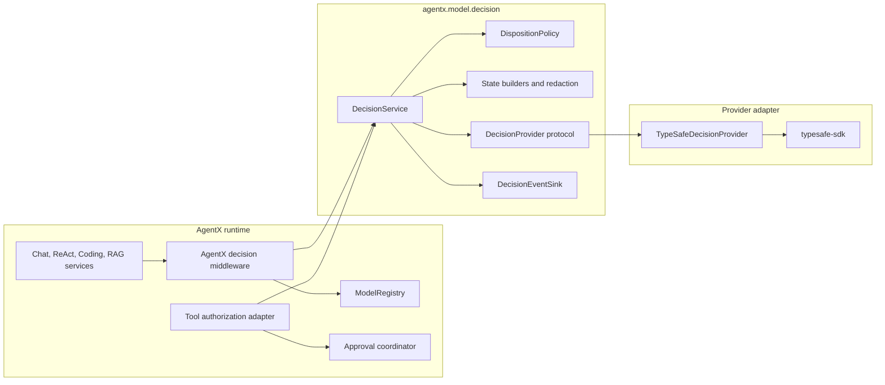
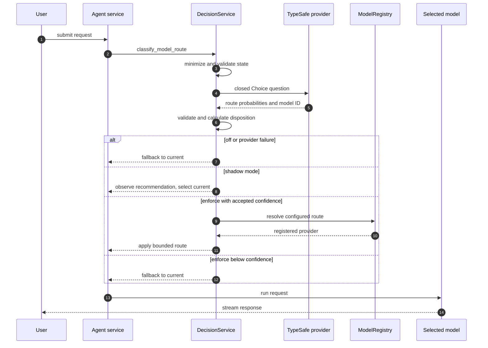
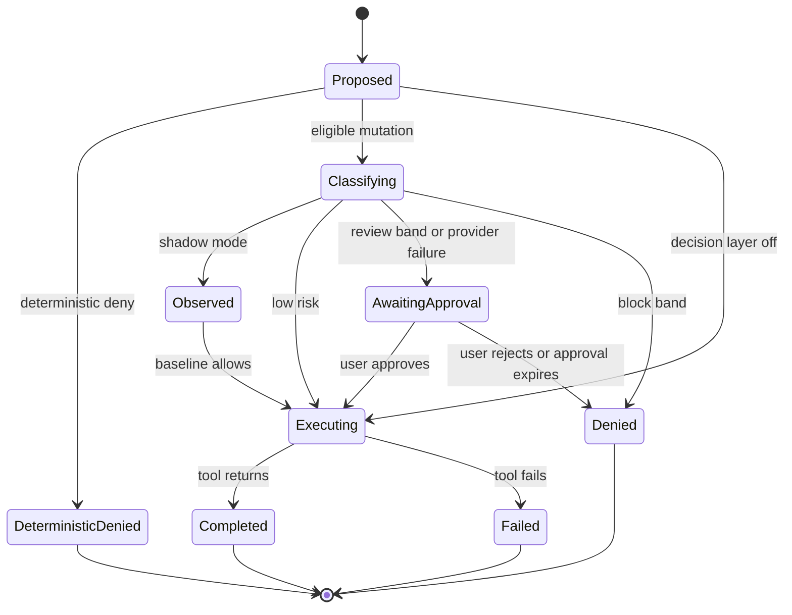

# Architecture and contracts

## Architectural stance

The decision layer is a hexagonal boundary inside `agentx.model.decision`. Application code depends on AgentX-owned protocols and immutable value objects. A TypeSafe adapter translates those values to the provider SDK. LangChain middleware is an integration adapter, not the domain API.

This prevents three forms of coupling:

- provider response models do not escape into controllers or agents;
- LangChain middleware types do not define AgentX policy;
- the domain-agent `PolicyEngine` is not implicitly treated as if it already guards LangChain tools.

## Component view

The component diagram shows ownership and allowed dependency direction.



## Responsibility split

| Component | Owns | Must not own |
|---|---|---|
| `DecisionService` | mode handling, state building, provider call, validation, disposition, event emission | provider-specific response objects; UI prompts |
| `DecisionProvider` | typed classification transport | application thresholds; permissions; persistence |
| `DispositionPolicy` | translating valid evidence and deterministic context into `observe`, `apply`, `review`, `deny`, `fallback`, or `skip` | network calls; raw state |
| State builders | data minimization, normalization, budgets, redaction | final authorization |
| `DecisionEventSink` | sanitized, schema-versioned telemetry | raw input or secrets |
| Routing middleware | run-time model override from validated route mapping | arbitrary model construction |
| Tool authorization adapter | deterministic checks and composition with risk evidence | assuming `PolicyEngine` already covers LangChain calls |
| Approval coordinator | interrupt, display, resume, reject, expiry | changing classifier evidence |

## Type model

### Enums

```python
class DecisionMode(str, Enum):
    OFF = "off"
    SHADOW = "shadow"
    ENFORCE = "enforce"

class DecisionKind(str, Enum):
    MODEL_ROUTE = "model_route"
    TOOL_RISK = "tool_risk"
    RAG_RELEVANCE = "rag_relevance"
    CITATION_SUPPORT = "citation_support"

class ModelRoute(str, Enum):
    CURRENT = "current"
    FAST = "fast"
    POWERFUL = "powerful"
    LOCAL = "local"

class DispositionAction(str, Enum):
    SKIP = "skip"
    OBSERVE = "observe"
    APPLY = "apply"
    REVIEW = "review"
    DENY = "deny"
    FALLBACK = "fallback"
```

`DecisionKind` and its output type are statically paired by specific service methods. Avoid a public `decide(kind, dict) -> dict` API because it shifts schema mistakes to runtime.

### Inputs

```python
@dataclass(frozen=True)
class ModelRouteInput:
    user_request: str
    current_provider_id: str
    available_routes: tuple[ModelRoute, ...]
    requires_local: bool

@dataclass(frozen=True)
class ToolRiskInput:
    explicit_user_instruction: str
    tool_name: str
    normalized_path: str
    path_scope: Literal["inside", "outside", "unknown"]
    operation: Literal["create", "replace"]
    change_size: int
    deterministic: "AuthorizationResult"

@dataclass(frozen=True)
class PassageRelevanceInput:
    query: str
    passage_id: str
    passage_text: str
```

The public inputs are rich enough for local validation. Provider state builders create smaller transport objects and attach redaction statistics.

### Primitive-specific evidence and disposition

Do not force every Jev primitive into one “probabilities plus confidence” record. A `Choice` and a `Noul` have different semantics and calibration. Preserve that distinction in the type system:

```python
T = TypeVar("T", bound=Enum)

@dataclass(frozen=True)
class EvidenceMeta:
    decision_id: str
    kind: DecisionKind
    provider: str
    model_id: str
    provider_request_id: str | None
    latency_ms: float
    input_tokens: int | None
    schema_version: str

@dataclass(frozen=True)
class ChoiceEvidence(Generic[T]):
    meta: EvidenceMeta
    choice: T
    probabilities: Mapping[T, float]
    confidence: float

@dataclass(frozen=True)
class ProbabilityEvidence:
    meta: EvidenceMeta
    probability: float

AnswerT = TypeVar("AnswerT")
EvidenceT = TypeVar("EvidenceT")

@dataclass(frozen=True)
class DecisionDisposition(Generic[AnswerT, EvidenceT]):
    evidence: EvidenceT | None
    action: DispositionAction
    selected: AnswerT | None
    reason_code: str
    threshold_policy_version: str
    actual_effect: bool
```

This separation fixes two ambiguities in the original draft. `choice=FAST` or `probability=0.81` describes provider evidence. `action=APPLY` or `action=REVIEW` describes what AgentX decided to do. `actual_effect=False` records shadow behavior without pretending it was applied. A route service returns `DecisionDisposition[ModelRoute, ChoiceEvidence[ModelRoute]]`; a risk service returns `DecisionDisposition[None, ProbabilityEvidence]`. Callers never downcast a generic dictionary.

### Batched provider port

The provider boundary is batch-shaped because TypeSafe's System One API evaluates a mapping of questions over one shared state. The AgentX service may still expose narrow methods such as `classify_model_route()` and `classify_tool_risk()`; only the adapter port understands a provider batch.

```python
class DecisionProvider(Protocol):
    def evaluate(
        self,
        *,
        state: Mapping[str, object],
        questions: tuple[ProviderQuestion, ...],
        model_id: str,
        deadline_seconds: float,
        cancel: CancellationToken,
    ) -> ProviderBatchResult: ...

    def close(self) -> None: ...
```

`ProviderQuestion` is an AgentX-owned tagged union of `ChoiceQuestion`, `ProbabilityQuestion`, and only later `ScoreQuestion`. `ProviderBatchResult` is keyed by stable question ID and returns an equally explicit tagged result. Validation rejects missing, duplicate, or unexpected question IDs. This permits the optional route Choice plus promotion Noul to share one provider request without weakening the public type-safe methods.

### Errors

Errors use a small taxonomy so operations and evaluation can distinguish causes without logging exception payloads:

| Code | Meaning | Retryable in request path? |
|---|---|---|
| `disabled` | Mode or decision kind is off | No |
| `not_configured` | Missing route map or provider config | No |
| `missing_credentials` | No usable API key | No |
| `invalid_input` | AgentX rejected input before transport | No |
| `redaction_failed` | Safe state could not be built | No |
| `timeout` | Provider exceeded total deadline | No in interactive path |
| `rate_limited` | Provider returned rate limit | No in interactive path |
| `provider_unavailable` | Connection or server failure | No in interactive path |
| `invalid_response` | Shape, label, probability, or version invalid | No |
| `cancelled` | Parent agent run was cancelled | No |

The provider SDK may retry internally, but `DecisionService` owns a total deadline. AgentX does not layer unbounded retries on top.

## Model routing flow

The first phase observes the recommendation. Later enforcement may override the model for the run only after registry and confidence checks.



### Routing consistency rule

One route decision applies to one top-level agent run. It does not change the user's persisted current provider. Every model call within that run uses the chosen route unless an existing subsystem explicitly requires a different model. Reclassification after each tool call is out of scope for the first enforcement slice.

The run identifier is not the LangGraph `thread_id`: one conversation thread contains multiple user turns. AgentX creates a new `run_id` for each accepted `stream_agent()` invocation, computes the route disposition once, passes it through a typed, non-checkpointed `DecisionRunContext`, and uses `ModelRequest.override(model=...)` in an AgentX middleware. The persisted graph state contains messages; it does not contain provider clients or `BaseChatModel` objects.

## Tool-risk authority composition

### Required deterministic result

Before Jev participates, AgentX needs a shared result shape:

```python
class AuthorizationLevel(str, Enum):
    ALLOW = "allow"
    REVIEW = "review"
    DENY = "deny"

@dataclass(frozen=True)
class AuthorizationResult:
    level: AuthorizationLevel
    reason_code: str
    policy_ids: tuple[str, ...] = ()
```

Filesystem containment remains inside the tool implementation as defense in depth, but the authorization adapter must calculate scope before the side effect so a decision can occur before execution.

### Composition table

| Deterministic result | Jev band | Effective action |
|---|---|---|
| `DENY` | Any or unavailable | `DENY` |
| `REVIEW` | Any or unavailable | `REVIEW` |
| `ALLOW` | Low | `ALLOW` |
| `ALLOW` | Review band | `REVIEW` |
| `ALLOW` | Block band | `DENY` or `REVIEW`, by action-class policy |
| `ALLOW` | Unavailable | Configured fail policy; default `REVIEW` in enforce mode |

In shadow mode the actual action is always the deterministic result, while the counterfactual action is recorded.

### Lifecycle

The state diagram makes approval a first-class state instead of an error message.



Returning an error `ToolMessage` is not equivalent to approval. Until AgentX can persist `AwaitingApproval` and resume the same tool call exactly once, tool-risk enforcement remains disabled.

### Tool-surface completeness rule

An enforcing cohort must enumerate the compiled graph's effective tools, not only the `CODING_TOOLS` list. For each tool with a mutation capability, the registry records:

- tool name and implementation owner;
- resource plane: host workspace, Deep Agents state backend, remote service, process/sandbox, or unknown;
- normalized action class;
- deterministic precheck and defense-in-depth check;
- whether it is guarded, denied, or intentionally outside the cohort.

If two tool names can reach the same protected resource, both receive equivalent authorization. A cohort that guards `file_edit` while leaving an alternate host-write tool unguarded fails readiness even if the prompt tells the model not to use the alternate.

## Configuration contract

Configuration should be represented by typed dataclasses and loaded through one resolver. The storage format is a later decision; the semantics are:

```toml
[decision]
mode = "off"
provider = "typesafe"

[decision.typesafe]
model = "jev-1.13.0"
timeout_seconds = 2.0
max_attempts = 1

[decision.model_route]
enabled = false
minimum_confidence = 0.70
fast_provider_id = "openrouter"
powerful_provider_id = "openai"
local_provider_id = "ollama"

[decision.tool_risk]
enabled = false
review_threshold = 0.35
block_threshold = 0.80
on_provider_error = "review"
guarded_action_classes = ["host_workspace_write"]
```

Validation rules:

- `off` permits absent provider-specific configuration;
- `shadow` and `enforce` require a provider and exact model ID;
- `0 <= review_threshold < block_threshold <= 1`;
- route IDs must exist in `ModelRegistry`;
- `local_provider_id` must point to `kind="local"`;
- enforce mode is rejected if the decision kind lacks an accepted evaluation receipt;
- tool-risk enforce mode is rejected if approval support is unavailable;
- every guarded action class resolves to a complete, reviewed effective-tool inventory;
- secrets never appear in the configuration object serialized to disk.

## Provider lifecycle

`DecisionService` receives a provider factory. The factory is invoked lazily on the first eligible shadow/enforce decision. The service holds one long-lived synchronous client and, if async integration is added, one long-lived asynchronous client. Both expose explicit `close`/`aclose` during application shutdown.

Tests inject `FakeDecisionProvider`; no test relies on monkeypatching a global SDK client.
