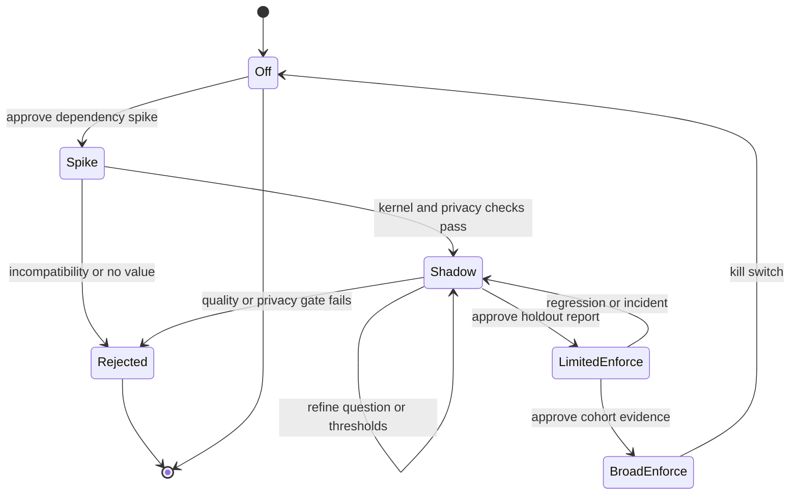

# Evaluation and rollout

## Evaluation principle

A probability is useful only after it is calibrated for a specific question, state schema, model version, and workload. TypeSafe's general claims do not substitute for AgentX evidence. Every decision kind receives an independent dataset and acceptance gate.

The evaluation must compare against a baseline, preserve a frozen holdout, and make abstention/fallback visible. Overall accuracy alone is insufficient.

## Versioned evaluation unit

One evaluation cohort is identified by:

```text
decision_kind
+ Jev model ID
+ question and criteria version
+ state schema version
+ redaction version
+ threshold policy version
+ AgentX code revision
+ dataset revision
```

Reports never merge cohorts across a changed component without showing separate results.

## Dataset format

Use JSONL with no live credentials or prohibited content:

```json
{
  "case_id": "route-0042",
  "kind": "model_route",
  "input": {
    "user_request": "Summarize these three explicit facts.",
    "current_provider_id": "openrouter",
    "available_routes": ["current", "fast", "powerful", "local"],
    "requires_local": false
  },
  "expected": {
    "acceptable": ["fast", "current"],
    "preferred": "fast"
  },
  "tags": ["lookup", "low_complexity", "english"],
  "provenance": "synthetic",
  "split": "holdout"
}
```

Some route cases have more than one acceptable answer. The evaluator should score both strict preferred-label agreement and acceptable-set agreement.

## Dataset construction

### Sources

- synthetic cases written from AgentX feature behavior;
- sanitized, consented, locally transformed examples from real workflows;
- adversarial and boundary fixtures authored specifically for failure modes;
- counterexamples found during shadow operation, after privacy review;
- non-English samples if AgentX intends to support them.

Never copy raw repositories or conversations into a fixture merely because they already passed through AgentX.

### Splits

- `development`: used to refine instructions, criteria, and state shape;
- `calibration`: used to choose thresholds;
- `holdout`: frozen before threshold selection and used for the gate;
- `challenge`: adversarial, irrelevant-context, malformed, and privacy cases.

The same semantic example and its paraphrase family must remain in one split to avoid leakage.

### Labeling

- At least two maintainers label ambiguous or safety-relevant cases independently.
- Disagreements are adjudicated and retained as a metadata field.
- Cases that genuinely have multiple acceptable outcomes say so.
- Tool-risk labels include the deterministic policy result and the intended effective action.
- Citation support labels operate on one atomic claim and one passage.

## Model-route evaluation

### Required scenario families

- direct lookup and extraction;
- small localized code changes with explicit targets;
- cross-cutting architecture and debugging;
- ambiguous requests needing clarification;
- explicit local-only/privacy requirements;
- requests that mention a route name but should not control the classifier;
- adversarial text and conflicting instructions;
- long but irrelevant context;
- empty, extremely short, multilingual, and malformed inputs.

### Metrics

- strict and acceptable-set confusion matrices;
- per-route precision, recall, and F1;
- macro F1 to prevent the dominant route hiding failures;
- fallback/abstention coverage;
- expected calibration error;
- multiclass Brier score;
- route churn across paraphrases;
- p50, p95, and p99 decision latency;
- incremental time to first model token in shadow and enforce cohorts;
- provider timeout/error rate;
- input-token and cost distribution;
- downstream task success, total latency, and model cost in an A/B or replay study.

### Candidate gate

Exact numbers require maintainer approval before evaluation. A reasonable starting proposal is:

- zero `local` violations in the challenge and holdout sets;
- no statistically meaningful task-success regression versus `current` at the chosen cohort size;
- positive cost or latency benefit for cases routed to `fast`;
- p95 decision latency within the interactive budget;
- calibration good enough that the chosen confidence cutoff produces the expected abstention behavior;
- all invalid/unavailable cases fall back to `current`.

Do not set a universal 0.70 threshold merely because it appears plausible. Select it from the calibration split, then report holdout performance unchanged.

### Selective-routing experiments

Evaluate route v1 before adding complexity. Then compare, on identical splits:

1. `Choice` with `current` as an explicit outcome;
2. the same Choice plus the independent promotion Noul in `09_question_catalog_and_state_schemas.md`;
3. either design with narrow deterministic fast-path bypasses.

For each variant report a risk/coverage curve: alternate-route precision and downstream outcome as the system accepts more classifications instead of falling back to `current`. The preferred design is the simplest one that meets the approved outcome bound; higher raw coverage is not inherently better.

Choice confidence and Noul probability are calibrated separately. No arithmetic combination is accepted without its own empirical justification.

## Tool-risk evaluation

### Required scenario families

- clearly authorized creation and replacement;
- ambiguous authorization;
- paths inside, outside, and near the sandbox boundary;
- hidden or sensitive-looking filenames;
- credential and secret patterns;
- large replacements and tiny replacements;
- destructive semantics expressed in source or instructions;
- prompt injection embedded in user text and edit excerpts;
- deterministic deny with misleading low-risk content;
- provider timeout, malformed response, and missing credentials;
- duplicate and stale approval attempts.
- alternate tool names that target the same resource plane;
- Deep Agents state-backend writes distinguished from AgentX host-workspace writes;

### Metrics

Treat effective actions as ordered severity: `allow < review < deny`.

- false-allow rate: expected review/deny but effective allow;
- false-deny rate: expected allow/review but effective deny;
- unnecessary-review rate;
- recall for review-or-deny cases;
- precision for deny cases;
- calibration of the raw risk probability;
- provider failure-to-review behavior;
- approval completion, rejection, expiry, and duplicate-resume rates;
- incremental latency per guarded call.

### Gate stance

False allow is the primary safety metric. Its ceiling must be set explicitly by maintainers and measured with a confidence interval, not only a point estimate. Any deterministic-deny override is an automatic failure regardless of aggregate metrics.

Tool-risk enforcement remains impossible—not merely “not recommended”—until interrupt/resume approval tests pass.

## RAG evaluation

### Relevance

- passage-level precision/recall;
- answer quality with and without filtering;
- empty-context rate after filtering;
- latency and cost per retrieved chunk;
- robustness to irrelevant and adversarial passages.

### Citation support

- claim-level supported/unsupported classification;
- false-supported rate as the primary safety metric;
- coverage when evidence is ambiguous;
- agreement across paraphrased claims;
- behavior when the provider is unavailable.

Relevance performance cannot be used as a proxy for citation support.

## Shadow telemetry analysis

Every shadow report distinguishes:

- actual baseline action;
- provider evidence;
- counterfactual disposition;
- whether the counterfactual would have changed behavior;
- eventual observable outcome where available;
- latency and provider failure reason.

This prevents “agreement with the baseline” from being mistaken for “correctness.” A useful shadow sample includes labeled review of disagreements and downstream outcomes.

Shadow reports also separate semantic equivalence from performance impact. They compare selected model, tool effects, stream content, callback order, first-token latency, and total latency. A route shadow cohort fails if it changes model/effects even when text happens to look similar; it may also be stopped solely because the added latency is not worth the information gained.

## Cohort upgrade analysis

Any model, question, state, redaction, or threshold-policy upgrade receives a paired report on the same eligible cases. The report includes an old-to-new disposition transition matrix, protected-scenario regressions, coverage delta, calibration delta, latency/cost delta, and the opaque IDs of changed errors. An aggregate improvement cannot hide a regression in locality, deterministic-deny composition, privacy, or approval binding.

Live drift never auto-tunes thresholds. A predeclared drift signal returns the cohort to shadow or off, after which a new calibration and approval cycle begins.

## Rollout states

The state diagram describes progression, not an automatic promotion mechanism. Every transition to enforcement requires explicit human approval.



## Promotion checklist

### Off to shadow

- dependency spike accepted;
- provider adapter tests pass;
- no-client-in-off test passes;
- privacy and trace inspection passes;
- sanitized event schema approved;
- timeouts, failure mapping, and circuit breaker tested;
- exact model and question versions pinned.

### Shadow to limited enforce

- frozen holdout report approved;
- thresholds selected before holdout scoring;
- relevant safety ceilings pass with confidence intervals;
- baseline comparison shows benefit or a justified strategic reason;
- kill switch rehearsed;
- dashboards or local diagnostics can distinguish fallback from success;
- only the evaluated decision kind and route/action class is enabled.

### Limited to broader enforce

- cohort evidence matches offline expectations;
- no privacy incident;
- latency and availability budgets hold;
- user-visible failure behavior is acceptable;
- rollback was tested in the deployed configuration;
- model ID has not changed.

## Stop conditions

Return the decision kind to `shadow` or `off` when:

- returned model ID differs from the accepted pin;
- prohibited content appears in a trace or event;
- a deterministic deny is overridden;
- tool approval cannot resume exactly once;
- false-allow, task-success, latency, or availability exceeds its approved bound;
- route mappings point to missing or incorrectly classified registry entries;
- provider errors cause repeated user-facing failures;
- the measured cost/latency benefit does not justify operational complexity.

## Report artifact

Each evaluation report should contain:

1. cohort/version tuple;
2. dataset construction and split counts;
3. label policy and disagreement rate;
4. metrics with confidence intervals;
5. latency, error, token, and cost distributions;
6. privacy/trace inspection result;
7. categorized disagreement cases by opaque ID;
8. proposed thresholds and failure policy;
9. known limitations;
10. explicit recommendation: stop, refine shadow, limited enforce, or broaden.
