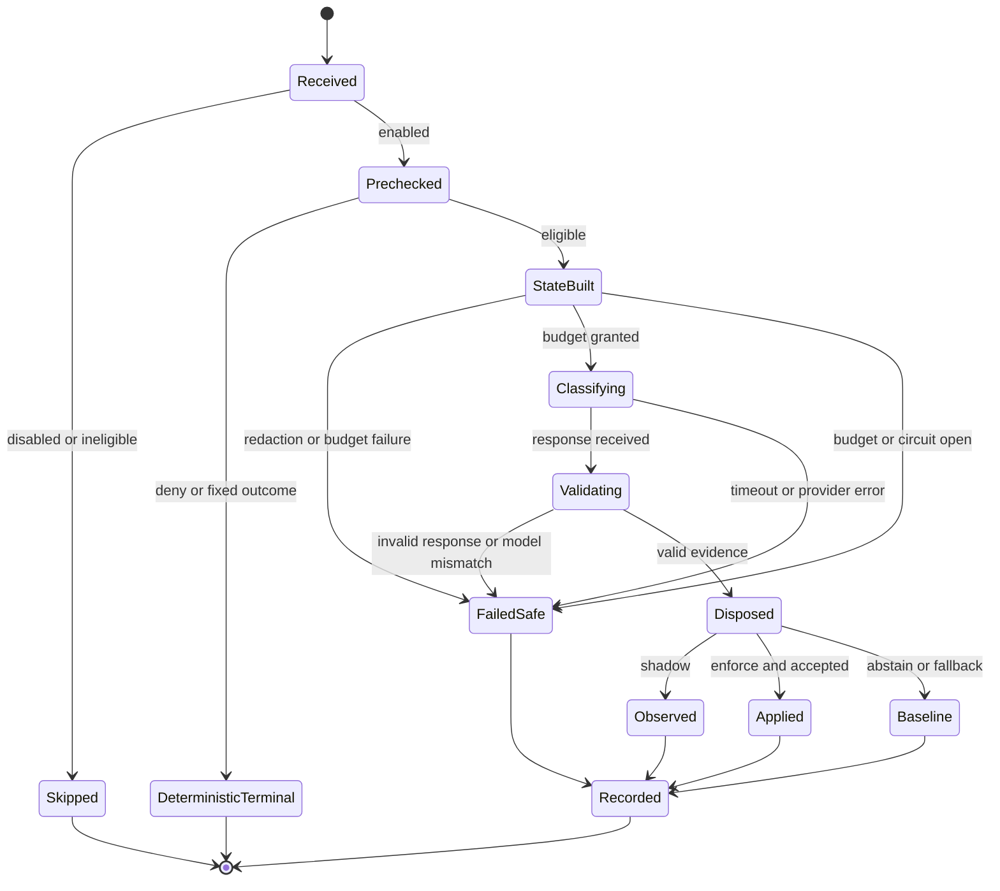

# Normative decision protocol

## Purpose

This document defines the run-time contract that every decision kind must follow. The words **MUST**, **MUST NOT**, **SHOULD**, and **MAY** are normative. Provider adapters, middleware, evaluation tools, and telemetry sinks may have different implementations, but they must produce the same observable protocol behavior.

The protocol exists to prevent a common architectural failure: treating a valid model response as permission to act. A provider response is evidence. Only an AgentX disposition can change behavior.

## Protocol objects

### Decision specification

A `DecisionSpec` is immutable application code, not remote configuration:

```python
@dataclass(frozen=True)
class DecisionSpec(Generic[InputT, AnswerT, EvidenceT]):
    kind: DecisionKind
    primary_question_id: str
    questions: tuple[ProviderQuestion, ...]
    question_version: str
    state_schema_version: str
    threshold_policy_version: str
    model_id: str
    answer_type: type[AnswerT]
    evidence_type: type[EvidenceT]
    deadline_ms: int
    state_budget_bytes: int
```

The specification MUST be reviewed and versioned as one unit. Changing question wording, criteria, state fields, answer labels, model ID, or threshold semantics creates a new cohort. A threshold value may change under a new threshold-policy version without changing the question version.

### Request, evidence, and disposition

```python
@dataclass(frozen=True)
class DecisionRequest(Generic[InputT]):
    decision_id: str
    run_id: str
    kind: DecisionKind
    input: InputT
    baseline_action: str
    requested_at: datetime
    cancel: CancellationToken

@dataclass(frozen=True)
class EvidenceMeta:
    model_id: str
    provider_request_id: str | None
    latency_ms: float

@dataclass(frozen=True)
class ChoiceEvidence(Generic[AnswerT]):
    meta: EvidenceMeta
    choice: AnswerT
    probabilities: Mapping[AnswerT, float]
    confidence: float

@dataclass(frozen=True)
class ProbabilityEvidence:
    meta: EvidenceMeta
    probability: float

@dataclass(frozen=True)
class DecisionDisposition(Generic[AnswerT, EvidenceT]):
    decision_id: str
    action: DispositionAction
    selected: AnswerT | None
    actual_action: str
    counterfactual_action: str | None
    reason_code: str
    evidence: EvidenceT | None
```

The request contains local typed input. The provider receives only the minimized state produced from that input. Choice and probability evidence remain different types because their confidence semantics and calibration differ. Evidence contains no authority. The disposition records both what really happened and, in shadow mode, what would have happened.

### Decision receipt

A `DecisionReceipt` is the stable join key between telemetry, approval, and replay:

```python
@dataclass(frozen=True)
class DecisionReceipt:
    decision_id: str
    run_id: str
    kind: DecisionKind
    cohort_id: str
    input_fingerprint: str | None
    disposition: DispositionAction
    reason_code: str
    created_at: datetime
```

The fingerprint MUST be a keyed local digest over the canonical minimized state. It MUST NOT allow recovery of the state, be comparable across installations, or replace explicit approval binding. If no local key is available, set it to `None` rather than use an unsalted public hash.

## End-to-end algorithm

All decision methods follow this order:

1. Resolve global and per-kind configuration.
2. If disabled, return `SKIP/disabled` without building state or constructing a provider.
3. Run deterministic prechecks. A terminal deterministic result returns immediately.
4. Build canonical minimized state through the kind-specific builder.
5. Enforce field, byte, token, and disclosure-tier budgets locally.
6. Acquire the per-run decision budget and circuit-breaker permission.
7. Call the provider once with the complete question set within the total deadline.
8. Validate response shape, primitive type, labels, probabilities, exact model ID, and the exact requested question-ID set.
9. Convert valid evidence through the kind-specific disposition policy.
10. Apply mode semantics: shadow preserves the baseline; enforce may apply only an allowed bounded action.
11. Emit a sanitized event and return the receipt. Telemetry failure never changes the disposition.

```python
def classify_model_route(request: ModelRouteRequest) -> RouteDisposition:
    cfg = config.model_route
    if config.mode is OFF or not cfg.enabled:
        return skipped(request, "disabled")

    baseline = request.current_provider_id
    state = route_state_builder.build(request.input)
    try:
        budget.acquire(DecisionKind.MODEL_ROUTE)
        evidence = validate(
            provider.evaluate(
                state=state,
                questions=ROUTE_V1.questions,
                model_id=ROUTE_V1.model_id,
                deadline_seconds=ROUTE_V1.deadline_seconds,
                cancel=request.cancel,
            ),
            expected=ROUTE_V1,
        )
        proposed = route_policy.disposition(evidence, request, cfg)
    except DecisionError as error:
        proposed = route_policy.on_error(error, baseline)

    final = apply_mode(proposed, baseline, config.mode)
    event_sink.emit(sanitize(final))
    return final
```

## Lifecycle

The lifecycle separates local preparation, remote classification, policy composition, and effects.



`FailedSafe` does not have one global meaning. Model routing falls back to `current`; tool risk defaults to review in enforce mode; RAG relevance preserves the unfiltered baseline. The fallback is part of each decision specification.

## Mode semantics

| Mode | Provider constructed | Provider called | Behavior may change | Event |
|---|---:|---:|---:|---|
| `off` | No | No | No | None or local disabled counter only |
| `shadow` | Yes, lazily | Yes | No | Actual baseline plus counterfactual |
| `enforce` | Yes, lazily | Yes | Only within kind-specific bounds | Actual disposition |

There is no implicit `enforce` default. Invalid or unknown mode values MUST fail configuration validation before application startup or be treated as `off` if configuration is loaded dynamically.

## Reason-code registry

Reason codes are a closed, stable diagnostic API. Human-readable text may change; codes do not change meaning.

| Family | Codes |
|---|---|
| Bypass | `disabled`, `kind_disabled`, `ineligible`, `deterministic_terminal`, `run_budget_exhausted` |
| Input | `invalid_input`, `state_too_large`, `redaction_failed`, `disclosure_not_allowed` |
| Provider | `timeout`, `rate_limited`, `provider_unavailable`, `missing_credentials`, `cancelled` |
| Response | `invalid_response`, `unknown_label`, `invalid_probability`, `model_mismatch`, `missing_question` |
| Policy | `shadow_only`, `below_threshold`, `abstained`, `route_unmapped`, `locality_violation`, `review_required`, `blocked` |
| Runtime | `circuit_open`, `approval_expired`, `approval_mismatch`, `duplicate_resume` |

Provider exception class names and raw messages MUST NOT become reason codes.

`telemetry_failed` is an operational counter/event, not a disposition reason. A sink failure occurs after the action is chosen and MUST NOT rewrite a successful or failed-safe decision receipt.

## Time and resource budgets

The decision call sits on an interactive path and therefore has multiple independent limits:

- per-call total deadline, including provider retries;
- per-run maximum number of calls by kind;
- per-run maximum serialized input bytes;
- process-wide concurrency limit;
- circuit breaker by provider and decision kind;
- optional session cost ceiling calculated from recorded input tokens.

The first route slice SHOULD allow one call per top-level run and no AgentX-level retry. SDK retry behavior must fit inside the total deadline. Tool-risk calls, if later enabled, require a separate per-run cap so an agent cannot amplify cost by proposing many guarded calls.

## Concurrency and idempotency

- `decision_id` is unique per attempted semantic decision.
- Repeating an identical classification after a transport failure receives a new `decision_id` and links to `retry_of`; it is not assumed idempotent remotely.
- A model-route decision is single-flight per `run_id`. Concurrent consumers await the same local future.
- `run_id` is created per accepted top-level user turn and MUST NOT be reused as the multi-turn LangGraph `thread_id`.
- Route disposition and any alternate `BaseChatModel` live only in the invocation context. They MUST NOT be stored in a module global, middleware instance field shared across runs, or checkpointed graph state.
- Cancellation of the parent run cancels any pending provider request when supported and discards late responses.
- Telemetry sinks MUST tolerate duplicate event delivery by `decision_id`.
- Approval consumption is compare-and-set: only `PENDING -> APPROVED` or `PENDING -> REJECTED` may win, and only one approved resume may invoke the tool handler.

## Cache policy

No cross-user or persistent response cache is allowed in the first milestone. Model routing MAY use a per-run memo because the v1 contract classifies once per run. Tool-risk evidence MUST NOT be reused across different normalized arguments, tool-call IDs, or authorization contexts.

A later cache experiment requires all of the following in its key: kind, canonical-state fingerprint, question version, state schema version, model ID, threshold-policy version, and disclosure tier. Cache hits remain evidence and pass through current disposition policy.

## Versioning and migration

The cohort identifier is derived from:

```text
kind + question_version + state_schema_version + model_id
+ threshold_policy_version + provider_adapter_version
```

Events from different cohorts MUST NOT be pooled for calibration without an explicit compatibility analysis. On model upgrade:

1. register the new exact model ID as a new cohort;
2. run paired shadow evaluation against the frozen holdout and a recent shadow sample;
3. choose new thresholds from calibration data;
4. approve the new cohort independently;
5. keep rollback to the prior cohort or `off` available.

## Provider replacement contract

A replacement provider is compatible only if it can return the AgentX evidence contract and pass the same validation and evaluation suite. Equivalent labels are insufficient: probabilities from different models are not assumed calibrated alike. Replacing Jev therefore changes the cohort and never inherits enforcement approval automatically.

## Implementation review checklist

- [ ] Provider construction is unreachable in `off`.
- [ ] Deterministic terminal outcomes skip external classification.
- [ ] The provider receives only a kind-specific canonical state.
- [ ] Total deadline includes SDK retry time.
- [ ] Exact model and complete question set are validated.
- [ ] Shadow preserves the baseline at the public boundary.
- [ ] Disposition actions are bounded by configuration and registry entries.
- [ ] Reason codes come from the closed registry.
- [ ] Telemetry failure cannot change execution.
- [ ] Cancellation, duplicate completion, and late response behavior are tested.
- [ ] Cohort identifiers change for every behaviorally material version change.
