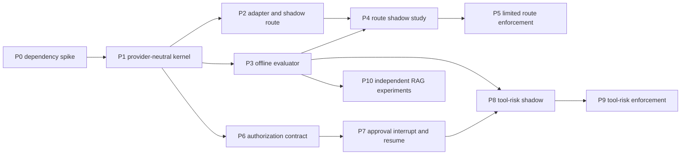

# Delivery backlog and traceability

## Delivery stance

This backlog converts the design into reviewable change packages. It deliberately separates dependency characterization, provider-neutral semantics, external shadow traffic, enforcement, and authorization work. Each package can stop without forcing the next one.

Sizes are relative (`S`, `M`, `L`, `XL`), not calendar estimates.

## Dependency graph

P6–P9 do not block route evaluation. P10 shares the kernel and evaluator but not route thresholds or approval.

## Package P0 — dependency/API spike (`M`)

### Deliverables

- isolated lock-resolution diff for `typesafe-sdk==0.7.0`;
- disposable sync/async client characterization;
- error, timeout, retry, cancellation, model-ID, usage, and lifecycle map;
- privacy/logging inspection;
- written go/no-go report selecting SDK, direct HTTP, LangChain upgrade, or stop.

### Exit

No LangChain-family upgrade, no raw payload in logs, deterministic test seam exists, and the full suite remains green. Failure ends the project or returns a new approved dependency alternative; it does not silently alter architecture.

## Package P1 — provider-neutral kernel (`L`)

### Deliverables

- `config.py`, `types.py`, `specs.py`, `provider.py`, `service.py`;
- kind-specific state builders and disposition policies;
- closed reason-code registry;
- decision budget interface;
- receipt and event schemas;
- fake provider, null sink, memory sink;
- question-spec linter.

### Exit

All off/shadow/enforce semantics pass against fakes, but no production composition point enables the feature. `off` performs no provider construction or state building.

## Package P2 — TypeSafe adapter and route shadow (`L`)

### Deliverables

- optional SDK adapter with lazy import and one owned client;
- non-persisting `ModelRegistry.create_llm(provider_id)` seam;
- Coding route preflight, typed per-invocation context, and request-local model middleware using `ModelRequest.override(model=...)`;
- ReAct and RAG v2 parity only after the Coding hook contract passes, with exact middleware-order assertions;
- append-only sanitized event sink or an explicitly approved alternate;
- operator configuration with global and per-kind switches.

### Exit

Shadow classification occurs once per top-level run, with a fresh `run_id` distinct from `thread_id`. Actual model selection, persisted provider selection, streaming content, callbacks, and tool effects remain baseline-equivalent; first-token latency overhead is measured and bounded.

## Package P3 — offline evaluation harness (`M`)

### Deliverables

- versioned JSONL schema and validator;
- semantic-family split leakage detector;
- confusion, calibration, coverage, latency, error, and cost metrics;
- bootstrap or exact confidence intervals appropriate to each metric;
- paired-cohort comparison report;
- redacted case-ID disagreement queue;
- deterministic fake-run golden tests.

### Exit

Given the same fixtures and fake responses, reports are byte-stable except declared timestamps. Holdout data cannot be used to select thresholds in the tool's ordinary workflow.

## Package P4 — route shadow study (`M`)

### Deliverables

- labeled development, calibration, holdout, and challenge sets;
- approved question wording and state schema;
- v1 baseline report;
- optional N1 promotion-gate and N6 deterministic-bypass comparisons;
- privacy inspection and latency/cost characterization;
- recommendation to stop, refine, or enforce a named route cohort.

### Exit

Maintainers explicitly approve or reject one immutable cohort. Approval names model, question, state, threshold policy, route mappings, supported services, and rollback.

## Package P5 — limited route enforcement (`M`)

### Deliverables

- explicit opt-in or bounded cohort;
- enforce only `fast` versus `current` initially;
- runtime cohort receipt and returned-model validation;
- kill switch and rollback rehearsal;
- sequential monitoring with predeclared stop conditions.

### Exit

Task success remains inside the approved bound, cost or latency benefit is demonstrated, and no locality, persistence, or provider-selection invariant is violated. `powerful` and `local` require separate unlocks.

## Package P6 — shared authorization contract (`XL`)

### Deliverables

- `AuthorizationResult` before tool execution;
- effective constructed-tool inventory, including framework-added and delegated tools;
- tool/action-class registry;
- normalized resource plane/scope and reason codes;
- composition with existing policy where applicable;
- coding-tool adapter while retaining `_resolve_safe_path` as defense in depth.

### Exit

Every guarded mutation has a deterministic pre-execution result. Existing containment and atomic-write behavior remains authoritative.

No alternate tool, backend capability, or subagent path can reach the same protected host resource without an equivalent authorization result. Unknown mutation capability fails readiness rather than defaulting to allow.

## Package P7 — approval interrupt/resume (`XL`)

### Deliverables

- persisted or explicitly restart-expiring `ApprovalRequest`;
- sanitized UI preview;
- exact tool-call binding and one-shot consumption;
- approve, reject, expire, cancel, reset, restart, and duplicate-resume behavior;
- end-to-end tests for all supported agent construction paths.

### Exit

Review suspends before side effects and resumes the exact call at most once. A denial `ToolMessage` is not counted as approval support.

## Packages P8–P10

| Package | Scope | Hard gate |
|---|---|---|
| P8 tool-risk shadow (`L`) | `file_edit` and `file_create`; actual deterministic action plus counterfactual | P6, P7, labeled risk dataset, privacy review |
| P9 tool-risk enforce (`L`) | approved action classes and thresholds only | false-allow ceiling with interval; approval E2E; kill switch |
| P10 RAG experiments (`L` each) | relevance, injection likelihood, citation support as separate cohorts | independent dataset/report and baseline-preserving failure policy |

## Suggested first implementation PR sequence

Keep review units smaller than delivery packages:

1. feature/design artifact and accepted P0 report;
2. core types, specs, config, and reason codes;
3. state builders, disclosure tiers, and leak tests;
4. service, disposition policy, budget, receipts, and fake provider;
5. TypeSafe adapter behind optional dependency;
6. event sink and offline evaluator foundation;
7. registry non-persisting construction seam;
8. Coding route shadow integration;
9. ReAct and RAG v2 parity after Coding evidence;
10. shadow report only; enforcement is a later approval.

No PR should combine a LangChain-family upgrade, decision kernel, tool approval, and enforcement.

## Requirement traceability

| Requirement | Design owner | Primary verification |
|---|---|---|
| No client or key in off | Protocol mode semantics | provider-factory and import tests |
| Evidence is not authority | Architecture and protocol | disposition unit tests |
| Deterministic deny wins | Authority composition | exhaustive composition table tests |
| Bounded closed outputs | Question catalog | response validation/property tests |
| No persistent provider mutation | Implementation plan | registry persistence spy test |
| No cross-run route leakage | Runtime blueprint | concurrent run-context isolation test |
| Shadow preserves semantic baseline | Protocol and route flow | service parity/golden stream plus latency-budget tests |
| Minimal external state | Security doc and disclosure tiers | recursive leak-sentinel tests |
| Exact model pin | Question specs and adapter | request/response model-ID tests |
| Bounded latency/cost | Decision budget | deadline, cap, and circuit tests |
| Approval resumes once | Tool lifecycle | concurrency/idempotency E2E tests |
| No alternate mutation bypass | Tool-surface completeness | constructed graph inventory test |
| Cohorts are not mixed | Protocol versioning | evaluator schema and report tests |
| Provider can be removed | Provider port | fake-provider suite and off rollback |

## Definition of ready for implementation

- [ ] Formal feature number and project/design location chosen.
- [ ] Alternative A dependency spike explicitly approved.
- [ ] P0 report accepted.
- [ ] Initial scope is route `off`/`shadow` only.
- [ ] Decision protocol and route v1 question wording reviewed.
- [ ] Event storage/retention and external-processing consent decided.
- [ ] Route dataset ownership and labeling process assigned.
- [ ] OMT major-feature/TDD artifacts declared.

## Definition of done for the first production-shaped slice

- [ ] `off` is indistinguishable from the pre-feature baseline.
- [ ] Shadow works in Coding, ReAct, and RAG v2 or explicitly documents phased parity.
- [ ] No alternate model is constructed in shadow.
- [ ] Every event has a complete cohort and stable reason code.
- [ ] Privacy, cancellation, timeout, and middleware-order tests pass.
- [ ] Full repository suite passes through `uv`.
- [ ] A versioned shadow evaluation report exists.
- [ ] The report recommends stop, refine, or separately approve limited enforcement.
- [ ] Global rollback to `off` is rehearsed.

## Explicitly deferred decisions

The first implementation need not decide:

- a general multi-provider capability system;
- persistent raw decision inputs;
- online threshold adaptation;
- tool-risk or RAG enforcement thresholds;
- approval persistence across application restart;
- multi-model voting;
- a generalized policy language.

Deferral is intentional. These decisions become concrete only after route shadow evidence shows the decision layer is worth retaining.
