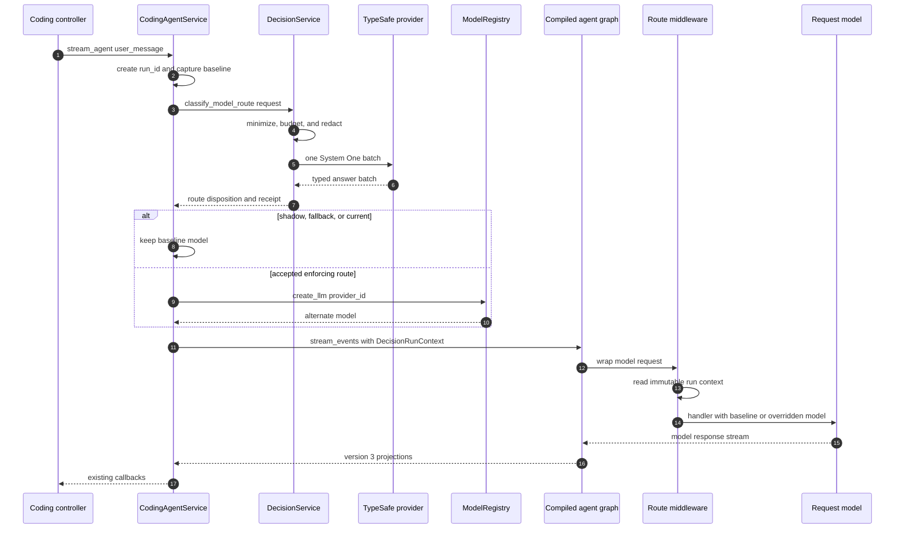

# Runtime integration blueprint

## Purpose and status

This document translates the design into concrete AgentX and pinned-framework seams. It is still a proposal: the classes and signatures below are implementation blueprints, not production code or approval to change dependencies.

The first implementation target is route `off`/`shadow` for the Coding agent. ReAct and RAG v2 reuse the same contracts only after the Coding slice proves model override, streaming, cancellation, checkpoint, and middleware-order behavior.

## Verified baseline

The blueprint is based on the repository and installed dependency surface inspected on 2026-09-20.

| Area | Current fact | Design consequence |
|---|---|---|
| Model selection | `ModelRegistry` persists one `_selected_id`; `create_current_llm()` constructs only that selection | Add a non-persisting `create_llm(provider_id)`; route enforcement must never call `select()` |
| Coding service | Constructs its LLM and compiled graph in `__init__`, before a user message exists | Route classification cannot be a constructor decision |
| Run identity | `thread_id` survives multiple turns | Create a distinct `run_id` for each accepted `stream_agent()` call |
| LangChain | Pinned `create_agent` accepts middleware/state/context schemas; `ModelRequest.override(model=...)` returns a replaced request | Use request-local model override, not registry mutation or graph reconstruction per tool call |
| Deep Agents | Pinned `create_deep_agent` accepts middleware/context schema and merges custom middleware with its built-ins | Assert the effective middleware stack; do not infer ordering from the list passed by AgentX |
| Streaming | Services use synchronous `stream_events(version="v3")` inside a controller-owned worker thread | Route preflight can be synchronous initially, but its deadline directly affects time to first token |
| Cancellation | AgentX sets a `threading.Event` and checks it while consuming stream deltas | Check before/after route preflight and discard late results; true in-flight HTTP cancellation is a spike item |
| Approval | Deep Agents can add human-in-the-loop interrupt middleware, but AgentX callbacks expose no interrupt/resume API | Tool-risk enforcement requires a new service/controller protocol, not only middleware configuration |
| Tool surface | AgentX passes `CODING_TOOLS`; Deep Agents also adds backend filesystem/subagent tools | Authorization readiness is based on the constructed tool inventory and resource plane |

## First-slice request path

The sequence below shows one user turn. Route preflight happens exactly once before the graph is invoked. The middleware only applies an already-computed disposition.



The baseline model is still the model with which the graph was constructed. In shadow mode the alternate model is not constructed. The route decision may be recorded, but middleware forwards the original request unchanged.

## Ownership and lifetime

### `DecisionRuntime`

One application-owned runtime should contain:

- validated `DecisionConfig` access;
- one lazy provider factory and eventual provider client;
- circuit breakers and process-wide concurrency limiter;
- decision service and event sink;
- explicit `close()` and, only if the async path is adopted, `aclose()`.

It must not contain the selected route for a user turn. Route state belongs to `DecisionRunContext`.

The current controllers construct services independently. The implementation must introduce an explicit composition owner—likely the application/provider layer that already wires controllers—or pass a `DecisionRuntime` factory to each controller. Importing a module-level singleton is discouraged because tests, shutdown, credential changes, and multiple application instances become ambiguous.

### Service lifetime

`CodingAgentService`, `ReactAgentService`, and `RagV2AgentService` may remain long-lived per screen/conversation. Each call to `stream_agent()` creates a short-lived run context. The context is released after the stream completes, errors, or is cancelled.

### Provider lifetime

The TypeSafe client is created lazily on the first eligible `shadow` or `enforce` request and reused. It is not constructed during imports, config validation, application startup in `off`, or test collection.

## Core runtime types

### Per-run context

```python
@dataclass(frozen=True)
class DecisionRunContext:
    run_id: str
    thread_id: str
    baseline_provider_id: str | None
    route_disposition: RouteDisposition
    override_model: BaseChatModel | None
```

Rules:

- `run_id` is unique per accepted top-level turn.
- `thread_id` is correlation only and may repeat across turns.
- `override_model` is `None` in `off`, `shadow`, fallback, and `current` outcomes.
- The object is passed through LangGraph runtime context; it is not added to message state or checkpoint persistence.
- `repr` and telemetry must not serialize `override_model`.

### Provider batch

```python
@dataclass(frozen=True)
class ChoiceQuestion:
    question_id: str
    instructions: str
    criteria: Mapping[str, str | None]

@dataclass(frozen=True)
class ProbabilityQuestion:
    question_id: str
    instructions: str
    true_criterion: str | None
    false_criterion: str | None

ProviderQuestion = ChoiceQuestion | ProbabilityQuestion

@dataclass(frozen=True)
class ProviderBatchResult:
    model_id: str
    request_id: str | None
    answers: Mapping[str, ProviderAnswer]
    input_tokens: int | None

class DecisionProvider(Protocol):
    def evaluate(
        self,
        *,
        state: Mapping[str, object],
        questions: tuple[ProviderQuestion, ...],
        model_id: str,
        deadline_seconds: float,
        cancel: CancellationToken,
    ) -> ProviderBatchResult: ...
```

The public `DecisionService` remains kind-specific:

```python
def classify_model_route(request: ModelRouteRequest) -> RouteDisposition: ...
def classify_tool_risk(request: ToolRiskRequest) -> ToolRiskDisposition: ...
```

No controller or middleware receives `ProviderBatchResult` directly.

## TypeSafe adapter mapping

`TypeSafeDecisionProvider.evaluate()` performs one `client.system_one(...)` call:

1. translate the canonical AgentX state without adding fields;
2. translate every tagged AgentX question to SDK `Choice` or `Noul`;
3. call with the exact configured model ID;
4. capture elapsed time outside the SDK;
5. translate SDK outputs into AgentX tagged answers immediately;
6. discard SDK response objects after validation;
7. sanitize exceptions into the closed error taxonomy.

The adapter must verify:

- returned model ID is exactly the requested pin;
- response question IDs equal the requested set;
- each result primitive matches the corresponding question;
- Choice labels equal the configured enum values exactly;
- probabilities are finite and inside `[0, 1]`;
- Choice distribution sum is within a documented tolerance;
- no SDK exception body or request state enters logs.

The adapter does not apply thresholds, resolve routes, or decide fallback.

## Model registry extension

The non-persisting method is intentionally small:

```python
def create_llm(self, provider_id: str) -> BaseChatModel:
    info = self.get_provider(provider_id)
    if info is None:
        raise UnknownProviderError(provider_id)
    return info.factory().create_llm()
```

Required tests spy on `_save()` and the selection file. `create_llm()` must not change `_selected_id`, write persistence, or fall back silently to the default for an unknown ID.

`AIService` may expose this method as a facade, but route validation should depend on `ModelRegistry` metadata so `local` mappings can require `ProviderInfo.kind == "local"`.

### Baseline identity capture

The route state must describe the model actually bound to the agent graph, not whatever provider happens to be selected later in the process-wide registry. When a service constructs its default LLM, it captures the provider ID and model as one logical result and retains both:

```python
baseline_info = registry.get_current()
baseline_model = registry.create_llm(baseline_info.id)
```

If provider selection changes while a long-lived Coding/ReAct/RAG service remains open, the current AgentX behavior is to keep that service's constructed model. Route v1 preserves that baseline rather than silently rebinding it. A future service-refresh feature may rebuild the graph, but it is a separate lifecycle change. Explicitly injected LLMs have `baseline_provider_id=None` unless the caller supplies trusted metadata.

## Route coordinator

The agent service should delegate preflight to a small coordinator instead of embedding configuration and fallback branches in `stream_agent()`:

```python
class ModelRouteCoordinator:
    def prepare_run(
        self,
        *,
        run_id: str,
        thread_id: str,
        user_message: str,
        baseline_model: BaseChatModel,
        baseline_provider_id: str | None,
        cancel_event: threading.Event,
    ) -> DecisionRunContext:
        ...
```

Algorithm:

1. Read one immutable config snapshot for the run.
2. If cold/hot off, return baseline context before building state.
3. If the service was constructed with an explicit LLM and has no trusted baseline provider identity, return `SKIP/ineligible_explicit_model`.
4. Build and classify the route request once.
5. Check cancellation before constructing any alternate model.
6. In shadow, return the receipt and no override model.
7. In enforce, validate route mapping and confidence, then construct the alternate lazily.
8. If construction fails, emit `route_model_construction_failed` and return baseline.
9. Return an immutable context.

Route model construction failure is distinct from Jev failure. It can reveal missing downstream provider credentials and must not be reported as classifier unavailability.

## LangChain middleware

The middleware is intentionally thin:

```python
class RouteModelMiddleware(AgentMiddleware[AgentState, DecisionRunContext]):
    name = "agentx_route_model"

    def wrap_model_call(self, request, handler):
        context = request.runtime.context
        if context is None or context.override_model is None:
            return handler(request)
        return handler(request.override(model=context.override_model))
```

It must not:

- call Jev;
- inspect or rebuild message history;
- mutate the registry;
- cache route state on `self`;
- emit raw decision state;
- construct a new model on every model call.

An async `awrap_model_call` is added only if an AgentX agent path actually uses async model calls. Sync and async implementations must share the same selection semantics.

## Service integration

### Construction

For enabled route observation/enforcement, construct the graph with:

- existing middleware in its current relative order;
- one `RouteModelMiddleware`;
- `context_schema=DecisionRunContext`;
- the same checkpointer and tools as before.

Cold `off` omits the middleware and context schema entirely. Hot `off` keeps an already-constructed wrapper inert until the service is recreated.

### Invocation

`stream_agent()` changes only around the existing `stream_events()` call:

```python
run_id = new_run_id()
context = route_coordinator.prepare_run(
    run_id=run_id,
    thread_id=self._thread_id,
    user_message=user_message,
    baseline_model=self._llm,
    baseline_provider_id=self._baseline_provider_id,
    cancel_event=self._cancel_event,
)

stream = self._agent.stream_events(
    agent_input,
    config=config,
    context=context,
    version="v3",
)
```

The existing message/tool-call projections and callbacks remain unchanged. A compatibility test must prove that `context=` reaches `request.runtime.context` in both `create_agent` and `create_deep_agent` paths at the pinned versions.

## Middleware ordering contract

The effective stack—not the passed list—is the contract. Tests should introspect or instrument named middleware to prove:

1. the route wrapper sees each model request;
2. it changes only `request.model` in enforce mode;
3. summarization and memory middleware retain their existing behavior;
4. subagents do not inherit top-level routing accidentally;
5. RAG chunk-analyst models remain their configured model unless separately evaluated;
6. fallback `create_agent` has the same route semantics as the Deep Agents path;
7. cold off produces the baseline stack exactly.

If Deep Agents injects custom middleware after core entries, tests pin the resulting name order for the exact dependency version rather than relying on undocumented assumptions.

## Cancellation and deadlines

The first slice is synchronous because AgentX's services already run on worker threads. The contract is:

- check cancellation before state building, before transport, after transport, and before alternate-model construction;
- provider total deadline is lower than the UI's accepted first-token budget;
- a cancelled or timed-out call cannot produce `actual_effect=True`;
- a late provider response is discarded and emits no applied disposition;
- controller `cancel()` may remain bounded by the provider deadline if the SDK cannot cancel a synchronous request;
- the spike records whether `AsyncTypeSafeClient` plus an async agent path is required for stronger cancellation.

No extra AgentX retry is added in the interactive path. SDK retry configuration must fit inside the same total deadline.

## Tool authorization integration blueprint

This is a later slice, but its integration boundary must be unambiguous.

### Effective action registry

```python
@dataclass(frozen=True)
class ToolActionDescriptor:
    tool_name: str
    action_class: str
    resource_plane: Literal[
        "host_workspace",
        "agent_state_backend",
        "remote_service",
        "process_or_sandbox",
        "unknown",
    ]
    mutating: bool
    deterministic_policy_id: str | None
```

At construction, compare all effective graph tools with the reviewed registry. In enforce mode, an unknown mutating capability is a configuration failure. Delegated subagents receive the same inventory check recursively.

### Approval path

The pinned Deep Agents API can add human-in-the-loop interrupts, but AgentX must still implement:

1. an interrupt event projection from the graph into the service callback API;
2. a sanitized `ApprovalRequest` DTO;
3. controller/view presentation;
4. `approve`, `reject`, and `cancel` commands;
5. resume through the graph's `Command(resume=...)` contract;
6. compare-and-set consumption bound to thread, run, tool call, normalized arguments, receipt, and expiry;
7. restart behavior: durable restore or explicit expiry;
8. at-most-once tool-handler execution tests.

Jev classification happens before the approval decision but after deterministic authorization. A human approval can satisfy the review requirement; it cannot override a deterministic deny.

## Data placement matrix

| Data | Runtime context | Checkpoint | Decision event | Approval store |
|---|---:|---:|---:|---:|
| `run_id`, `decision_id`, cohort ID | Yes | No | Yes | Yes when review exists |
| Raw user request | Only before minimization | Existing chat history already owns its message | No | Sanitized preview only |
| Canonical minimized provider state | Ephemeral inside decision call | No | No | No |
| Provider probabilities | In disposition | No | Yes | Optional bounded explanation fields |
| `BaseChatModel` override | Yes | No | No | No |
| Persisted selected provider ID | Read as baseline | Existing registry file | Sanitized ID may be recorded | No |
| Tool arguments | Ephemeral authorization input | Existing graph behavior | No | Keyed hash plus sanitized preview |
| API key | SDK/environment boundary only | No | No | No |

## Concrete first-slice file changes

The first production-shaped slice should be reviewable as these units:

1. `agentx.model.decision` types, specs, builders, validation, and fake provider;
2. batched provider port and TypeSafe adapter behind the optional dependency;
3. decision service, budget, receipts, and sanitized sink;
4. `ModelRegistry.create_llm(provider_id)` plus persistence-spy tests;
5. run context, coordinator, and thin route middleware;
6. Coding service integration and pinned middleware/context compatibility tests;
7. offline evaluator and route shadow report;
8. ReAct parity;
9. RAG v2 parity with explicit top-level versus subagent model rules.

Do not combine items 1–6 with tool approval or route enforcement.

## Implementation readiness checklist

- [ ] The dependency spike confirms SDK constructor, timeout, retry, cancellation, close, result fields, and fake-transport seam.
- [ ] The application composition owner for `DecisionRuntime` is selected.
- [ ] Route v1 question/state/disclosure specs are approved.
- [ ] Explicit-LLM behavior is fixed: bypass by default.
- [ ] `run_id` and `thread_id` semantics are accepted.
- [ ] `context=` propagation is proven on all pinned graph constructors.
- [ ] Effective middleware order is captured in golden tests.
- [ ] Cold and hot off behavior is accepted.
- [ ] Shadow time-to-first-token budget is approved.
- [ ] Event path, permissions, retention, and user disclosure are approved.
- [ ] Tool authorization remains out of scope until the effective action inventory and approval protocol are separately approved.
