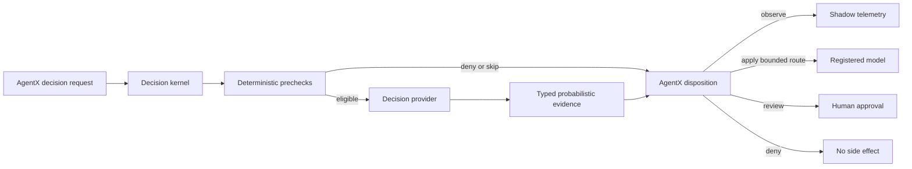

# TypeSafe Jev decision layer — detailed design package

- **Status:** proposed
- **Owner boundary:** AgentX model/runtime architecture
- **Prepared:** 2026-09-20
- **Implementation state:** no production code or dependency changes

## Purpose

This package turns the initial idea into an implementation-ready proposal. It defines what the decision layer is for, where it fits in the current AgentX codebase, what it must never control, how its data contracts work, and which evidence is required before any recommendation changes behavior.

The central design choice is deliberate: AgentX owns the decision semantics and lifecycle. TypeSafe Jev is one replaceable provider of typed probabilistic evidence.

## Document map

| Document | Question it answers |
|---|---|
| [`01_intent_and_scope.md`](01_intent_and_scope.md) | Why build this, for whom, and what is excluded? |
| [`02_architecture_and_contracts.md`](02_architecture_and_contracts.md) | What are the components, types, authority rules, and run-time flows? |
| [`03_implementation_plan.md`](03_implementation_plan.md) | Which files and seams change, in what order, and how? |
| [`04_security_privacy_operations.md`](04_security_privacy_operations.md) | What can go wrong and how is the feature operated safely? |
| [`05_evaluation_and_rollout.md`](05_evaluation_and_rollout.md) | How will quality, calibration, latency, privacy, and rollout be judged? |
| [`06_testing_and_acceptance.md`](06_testing_and_acceptance.md) | What tests and acceptance evidence are required? |
| [`07_dependency_spike_and_decisions.md`](07_dependency_spike_and_decisions.md) | Which dependency path is preferred and what still needs approval? |
| [`08_normative_decision_protocol.md`](08_normative_decision_protocol.md) | What exact run-time protocol, failure, versioning, concurrency, and receipt rules must every decision obey? |
| [`09_question_catalog_and_state_schemas.md`](09_question_catalog_and_state_schemas.md) | What candidate questions, criteria, disclosure tiers, and state budgets will be implemented and evaluated? |
| [`10_new_ideas_and_experiments.md`](10_new_ideas_and_experiments.md) | Which new ideas are adopted now, tested in shadow, deferred, or rejected? |
| [`11_delivery_backlog_and_traceability.md`](11_delivery_backlog_and_traceability.md) | How does the work split into reviewable packages, dependencies, PRs, and acceptance evidence? |
| [`12_runtime_integration_blueprint.md`](12_runtime_integration_blueprint.md) | What exact AgentX and LangChain seams implement the first slice, down to run context, middleware, provider batching, and ownership? |

## Current AgentX facts that constrain the design

- `AIService.get_current_llm()` delegates to a process-wide `ModelRegistry` with one persisted current provider.
- Coding and RAG v2 use `create_deep_agent` when available and fall back to `create_agent`; ReAct uses `create_agent` directly.
- Coding and RAG v2 already pass custom middleware lists, so middleware ordering is a compatibility surface.
- The pinned `create_agent` and `create_deep_agent` APIs both accept `middleware`, `state_schema`, and `context_schema`. The pinned LangChain `ModelRequest.override(model=...)` is the non-mutating run-time model substitution seam.
- `create_deep_agent` adds its own filesystem, subagent, and optional human-in-the-loop middleware. Its built-in filesystem tools operate through the configured backend and are a distinct action surface from AgentX's host-filesystem `file_edit` and `file_create` tools.
- Coding mutation tools enforce filesystem containment internally, but they do not currently pass through the domain-agent `PolicyEngine`.
- The domain-agent `PolicyEngine` is deterministic and has no direct LangChain tool-call integration.
- Deep Agents can construct interrupt middleware, but AgentX's current service/controller streaming contract does not expose interrupt events, `Command(resume=...)`, approval persistence, or one-shot resume semantics.
- Controllers construct their own agent services, and each service constructs its graph before receiving a user message. A shared decision runtime and an explicit per-invocation context therefore have to be injected; a process-global mutable “selected route” would be unsafe.
- AgentX pins the LangChain family exactly, including `langchain==1.3.14`, `langchain-core==1.5.3`, and `deepagents==0.7.5`.

## Refined target

The diagram shows the important distinction: the provider produces evidence; the AgentX disposition decides whether that evidence is observed or acted on.

## Recommended first milestone

The smallest coherent milestone is:

1. select `typesafe-sdk==0.7.0` for a disposable dependency/API spike;
2. define AgentX-owned typed contracts and a fake provider;
3. implement `off` and `shadow` modes only;
4. classify model routes from a closed enum for Coding first, with ReAct and RAG v2 parity added only after the hook contract is proven;
5. record sanitized evaluation events;
6. produce a holdout report and an explicit stop/continue recommendation.

The kernel also includes provider-neutral safety infrastructure: a one-call route budget, privacy disclosure tiers, stable reason codes, immutable decision receipts, and a structural question-spec linter. These do not broaden the first milestone's behavior.

Tool-risk and RAG code are not part of that milestone. Their contracts can exist as design artifacts, but their runtime adapters should not be added until their prerequisites and evaluations are separately approved.

## Definition of “done” for this proposal

This design package is complete when a reviewer can answer all of the following without rediscovering repository context:

- what the feature intends and explicitly does not intend;
- why the stable SDK path is preferred initially;
- which AgentX modules would be added or modified;
- how provider evidence differs from policy authority;
- what data may leave the process;
- what happens on timeout, invalid output, missing keys, and rate limits;
- how model routing, tool risk, and RAG are independently evaluated;
- what evidence unlocks each enforcement mode;
- how the entire layer is disabled and rolled back;
- which question/state/model/threshold versions form one evaluation cohort;
- how each requirement maps to a delivery package and a mechanical test;
- how one user turn becomes one run-scoped decision without mutating persisted model selection or checkpointed conversation state;
- which mutation-capable tool surfaces are guarded, bypassed, or explicitly disabled.

## Recommended reading paths

- Product decision: `01` → `07` → `10`.
- Implementation: `02` → `08` → `09` → `12` → `03` → `11`.
- Safety review: `04` → `08` → `06`.
- Evaluation approval: `09` → `05` → `10` → `11`.
