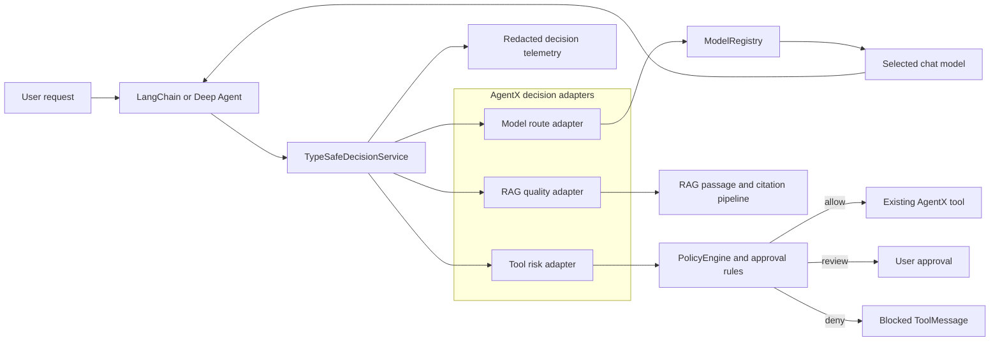

# Feature Idea: TypeSafe Jev Decision Layer for AgentX

**Status:** Idea for evaluation  
**Date:** 2026-09-20  
**Suggested feature slug:** `feature_typesafe_jev_decision_layer`  
**Likely task type:** `major_feature`  
**Decision requested later:** whether to open a formal AgentX project/feature and run the dependency spike

## Summary

Add an optional decision layer to AgentX using TypeSafe AI's Jev model through the first-party LangChain integration. Jev would make narrow, typed decisions around the existing generative agents instead of replacing their chat models.

The first useful decisions are:

1. Select an appropriate registered AgentX model for a user task.
2. Classify a proposed tool call by risk and authorization before execution.
3. Optionally classify RAG passages and citation support before content reaches the answering model.

The feature should launch in `shadow` mode, where AgentX records Jev's recommendation without changing behavior. Enforcement should remain unavailable until a repository-owned evaluation demonstrates acceptable routing quality, calibration, latency, privacy, and failure behavior.

## Why this belongs in AgentX

AgentX already has the seams this feature needs:

- `AIService` and `ModelRegistry` own the current provider selection and model construction.
- `CodingAgentService` and `RagV2AgentService` already pass middleware into `create_deep_agent`.
- `ReactAgentService` uses LangChain's `create_agent` and can accept the same style of middleware.
- `PolicyEngine` already provides deterministic rule evaluation, conflict resolution, and confidence. Jev can provide an additional probabilistic signal while the existing engine remains authoritative.
- Coding tools are already divided into read operations (`file_search`, `file_read`, `file_list`) and mutation operations (`file_edit`, `file_create`), giving the risk classifier a small initial scope.

This creates a clear boundary: ordinary code and the existing policy engine continue to own permissions and execution; Jev contributes a typed, probabilistic judgment at selected decision points.

## Product hypothesis

Jev can reduce the cost and latency of repeated classification calls that currently require a general chat model, while making uncertainty visible to AgentX. The value comes from inexpensive routing and checks, not from text generation.

The hypothesis must be tested with AgentX workloads. TypeSafe reports 70–500 ms response times and $0.042 per million input tokens for Jev 1.13, but its published speed and cost comparisons are vendor-produced. AgentX should measure its own end-to-end latency, decision quality, and failure rates before enabling behavior changes.

## Proposed architecture

The diagram shows Jev as an advisory service shared by three integration adapters. Existing AgentX components retain control over model construction, policy, approval, and tool execution.



### 1. Provider-neutral decision service

Introduce an AgentX-owned wrapper such as:

`src/agentx/model/decision/typesafe_decision_service.py`

Responsibilities:

- Construct and retain long-lived `TypeSafeClassifier` instances so HTTP connections are pooled.
- Expose narrow methods such as `classify_task_route`, `classify_tool_risk`, and later `classify_passage`.
- Convert provider responses into AgentX-owned decision records so application code does not depend directly on prerelease package models.
- Pin the deployed model ID, initially `jev-1.13.0`, for reproducibility. The moving `jev-latest` alias may be allowed only in explicit evaluation mode.
- Apply input minimization and redaction before sending state to TypeSafe.
- Emit metadata and probabilities without recording raw prompts, tool arguments, source text, or API keys.
- Implement explicit timeout and provider-error behavior for each decision type.

Suggested AgentX-owned result shape:

| Field | Purpose |
|---|---|
| `decision_id` | Correlates the decision with an agent run without exposing content. |
| `kind` | `model_route`, `tool_risk`, `rag_relevance`, or `citation_support`. |
| `label` | Selected closed-set outcome. |
| `probabilities` | Provider distribution when available. |
| `confidence` | Confidence for `Choice` or `Score`; absent for a `Noul`. |
| `model_id` | Versioned Jev model returned by the provider. |
| `mode` | `off`, `shadow`, or `enforce`. |
| `latency_ms` | End-to-end classifier latency. |
| `outcome` | `observed`, `allowed`, `reviewed`, `blocked`, `fallback`, or `error`. |

### 2. Model routing adapter

Use a Jev `Choice` question over a bounded set of models already available through `ModelRegistry`. Jev must never return or instantiate an arbitrary provider or model name.

Initial route labels could be semantic tiers instead of provider names:

| Route | Intended workload | AgentX behavior |
|---|---|---|
| `current` | Normal requests | Keep the user's selected provider. |
| `fast` | Lookup, extraction, or small localized work | Resolve to an explicitly configured inexpensive registered model. |
| `powerful` | Architecture, ambiguous debugging, or high-stakes reasoning | Resolve to an explicitly configured capable registered model. |
| `local` | Requests that must stay on-device | Resolve only to a configured local provider. |

In shadow mode, the route is logged but `AIService.get_current_llm()` remains authoritative. In enforce mode, low-confidence decisions fall back to `current`; they never guess another route.

The adapter should be AgentX-owned rather than directly binding the application to the experimental `ModelRouterMiddleware`. This keeps model choice consistent with the persistent registry and allows the user-selected provider to remain the default.

### 3. Tool risk adapter

Guard only mutation tools in the first iteration:

- `file_edit`
- `file_create`

Read-only tools should bypass Jev. Later iterations may add shell, network, external publishing, credential access, or destructive operations if those tools exist in AgentX.

The adapter should evaluate a compact state containing:

- The latest explicit user instruction relevant to the call.
- Tool name and normalized arguments.
- Tool description.
- Existing deterministic policy result.
- Whether the requested path is inside the configured sandbox.

Recommended execution matrix:

| Jev risk probability | Deterministic policy | Result |
|---|---|---|
| Low | Allow | Execute. |
| Uncertain | Allow | Request approval or keep shadow-only. |
| High | Any | Block or request approval according to configured action class. |
| Any | Deny | Deny; Jev cannot override deterministic policy. |
| Provider error or timeout | Any | Fall back to deterministic policy and approval rules; never broaden permission. |

Do not adopt the experimental `AutoModeMiddleware` unchanged. Its current Python implementation uses a fixed `0.5` threshold, blocks instead of requesting approval, and classifies as many as 30 recent messages. AgentX needs thresholds per action class, context minimization, and compatibility with its own approval semantics.

### 4. Optional RAG adapter

Add this only after model routing and tool-risk evaluation are complete. Candidate decisions are:

- Passage relevance before a chunk reaches the answering model.
- Prompt-injection likelihood for retrieved passages.
- Citation support after an answer is generated.

The adapter should run on already retrieved chunks, not whole repositories or full conversation histories. TypeSafe documents lower accuracy when the supplied state contains irrelevant material, so retrieval and deterministic filtering must happen first.

## Runtime modes

| Mode | Network behavior | Effect on AgentX behavior |
|---|---|---|
| `off` | No TypeSafe client is created. | Current behavior remains unchanged; no API key is required. |
| `shadow` | Calls Jev and records redacted outcomes. | Recommendations never change routing or tool execution. |
| `enforce` | Calls Jev at configured decision points. | Decisions may route, request approval, or block according to AgentX policy. |

`shadow` should be the default whenever the integration is enabled for the first time. `enforce` should require an explicit configuration change after evaluation.

## Configuration idea

Keep configuration outside the persisted model selection because the decision provider is orthogonal to the user's chat-model provider.

Possible settings:

```toml
[decision.typesafe]
enabled = false
mode = "off"
model = "jev-1.13.0"
timeout_seconds = 2.0

[decision.typesafe.routing]
enabled = false
minimum_confidence = 0.70

[decision.typesafe.tool_risk]
enabled = false
review_threshold = 0.35
block_threshold = 0.80
guarded_tools = ["file_edit", "file_create"]
```

The API key should only come from `TYPESAFE_API_KEY`; it must never be stored in AgentX configuration, persistence, traces, or session snapshots.

## Dependency and compatibility spike

The first-party Python package is currently `langchain-typesafe==0.0.1a2`, a prerelease published on 2026-09-17.

Its dependency requirements conflict with AgentX's exact pins:

| Package | AgentX today | Integration requirement |
|---|---:|---:|
| `langchain-core` | `1.5.3` | `>=1.6.2,<2.0.0` |
| `langchain` | `1.3.14` | Base classifier does not require it; experimental middleware requires `>=1.3.15,<2.0.0` |

The spike must resolve and test the complete LangChain family together, including `deepagents==0.7.5`, LangGraph, provider packages, event streaming, middleware ordering, and the existing fallback paths. It must not update only one exact pin and assume transitive compatibility.

If the dependency upgrade is too disruptive, an alternative spike can implement the small `/v1/systemone` HTTP contract behind the same AgentX-owned interface. That option trades dependency stability for more client, retry, validation, and tracing code owned by AgentX and should be chosen only with evidence.

## Privacy and security constraints

- TypeSafe receives every state sent for classification. Tool arguments may contain repository paths, source fragments, commands, or secrets, so minimize and redact inputs before transport.
- TypeSafe states that customer requests and responses are not used to train Jev. Zero-data-retention is described as an enterprise option, so ordinary accounts should not be assumed to have ZDR.
- LangSmith tracing must not capture the raw classification state. Provider metadata, probabilities, latency, and sanitized decision IDs are sufficient for evaluation.
- Jev is vulnerable to adversarial text in state. Its decision must be treated as an untrusted signal rather than an authorization authority.
- The existing path sandbox and deterministic policies remain mandatory even when Jev reports low risk.

## Known model limitations that shape the feature

Jev guarantees a typed response shape; it does not guarantee that the selected decision is correct. TypeSafe documents these Jev 1.13 limitations:

- Literal interpretation of instructions and boundary conditions.
- Weak counting, arithmetic, numeric comparison, and date reasoning.
- Reduced accuracy when state contains irrelevant context.
- Difficulty with indirect or multi-hop decisions.
- Susceptibility to adversarial content in the state.
- No guaranteed arithmetic relationship between separate probability questions.
- No text generation.

The feature should therefore ask atomic questions, keep computation in code, use one primitive consistently per decision, and calibrate thresholds separately for each decision kind.

## Delivery plan

### Phase 0: Dependency and API spike

- Resolve compatible LangChain, LangChain Core, Deep Agents, and provider versions.
- Exercise sync and async classifier calls using injected fake transports.
- Verify cancellation, timeouts, retries, and message serialization.
- Record the dependency diff and rollback path.

**Exit:** a written compatibility result and green AgentX test suite; no production integration.

### Phase 1: Decision service and shadow routing

- Add the AgentX-owned decision interface and TypeSafe implementation.
- Add `off` and `shadow` modes.
- Evaluate a closed set of model routes without changing the selected model.
- Record redacted metrics.

**Exit:** shadow results are reproducible and do not alter existing behavior.

### Phase 2: Repository-owned evaluation

- Create labeled AgentX scenarios covering straightforward, complex, ambiguous, local-only, and adversarial requests.
- Measure route confusion, confidence calibration, latency, provider failures, and token cost.
- Define per-route acceptance thresholds using the evaluation evidence.

**Exit:** explicit recommendation to stop, continue shadowing, or enable routing.

### Phase 3: Tool-risk shadowing and approval integration

- Classify `file_edit` and `file_create` calls.
- Compare Jev against existing sandbox and authorization outcomes.
- Add approval routing for uncertain decisions.
- Keep deterministic denies authoritative.

**Exit:** no tool execution can gain permission because of Jev, and classifier failures cannot broaden authority.

### Phase 4: Optional enforcement and RAG experiments

- Enable routing or risk enforcement only for evaluated decision classes.
- Add a kill switch that returns immediately to `off`.
- Evaluate passage relevance, injection risk, and citation support as separate experiments.

**Exit:** each enabled decision kind has its own quality, latency, and rollback evidence.

## Acceptance criteria

### Functional

- AgentX starts and operates normally with no `TYPESAFE_API_KEY` when the feature is `off`.
- Shadow mode never changes model selection, policy decisions, approvals, or tool execution.
- Model routing can select only preconfigured entries backed by `ModelRegistry`.
- Deterministic policy denial cannot be overridden by Jev.
- Tool-risk provider errors and timeouts cannot increase authority.
- Enforce mode has a single configuration kill switch.

### Quality and evaluation

- A labeled holdout report includes a confusion matrix, calibration analysis, false-allow rate, false-block rate, latency percentiles, and estimated cost.
- Thresholds are configured per decision kind and justified by the holdout report.
- `jev-1.13.0` behavior is evaluated separately from any future model version before changing the pin.
- Adversarial text and irrelevant-context scenarios are included.

### Privacy and observability

- Raw state, tool arguments, source text, and API keys are absent from application logs and traces.
- Decision telemetry retains only sanitized IDs, model version, probabilities, configured thresholds, outcome, latency, and token usage.
- Documentation explains that TypeSafe is an external processor and distinguishes no-training claims from ZDR availability.

### Regression safety

- Existing AgentX tests pass after dependency changes.
- New tests use mocked HTTP transports; ordinary test runs never call the live TypeSafe API.
- Middleware ordering is pinned for Coding, ReAct, and RAG v2 agents.
- Existing streaming and cancellation behavior remains intact.

## Testing strategy

- Unit-test state minimization, serialization, threshold boundaries, redaction, and provider-error mapping.
- Use injected fake sync and async HTTP transports for classifier tests.
- Add contract tests for `off`, `shadow`, and `enforce` modes.
- Add middleware-order tests for `create_agent` and `create_deep_agent` construction.
- Add adversarial fixtures where tool arguments or retrieved text contain instructions aimed at the classifier.
- Keep live API checks in a separate opt-in marker and exclude them from the default suite.

## Alternatives considered

### Use official experimental middleware directly

This is the smallest implementation, but it exposes AgentX to prerelease APIs, a fixed tool-risk threshold, large conversation-state forwarding, blocking without approval, and routing that does not understand AgentX's persistent model registry. It is suitable as reference code, not as the initial production boundary.

### Call the TypeSafe SDK without LangChain

The official `typesafe-sdk` avoids the LangChain integration's newer core dependency and may suit isolated decisions. It loses native Runnable composition and LangSmith integration. This should be compared during the dependency spike if the LangChain upgrade is costly.

### Continue using general chat models

This avoids another provider and dependency, but retains higher latency and cost for repeated structured decisions. It remains the fallback until Jev proves value on AgentX data.

### Keep all decisions deterministic

This remains preferable wherever ordinary code can decide correctly. Jev should be introduced only for semantic judgments that are too brittle to encode as deterministic rules.

## Recommendation

Proceed only with Phase 0 and Phase 1 initially. Build an AgentX-owned boundary around `TypeSafeClassifier`, pin the model version, and collect shadow-mode evidence. Do not make Jev an authorization authority and do not ship the experimental `AutoModeMiddleware` unchanged.

If shadow results are strong, the first enforceable feature should be low-stakes model routing. Tool-risk enforcement should follow only after approval integration and a false-allow evaluation. RAG classification is valuable but should remain a separate later experiment so its quality is measured independently.

## Primary references

- [LangChain TypeSafe integration guide](https://docs.langchain.com/oss/python/integrations/providers/typesafe)
- [LangChain announcement: Building a Harness with Jev](https://www.langchain.com/blog/building-a-harness-with-jev)
- [`langchain-typesafe` on PyPI](https://pypi.org/project/langchain-typesafe/)
- [Python integration package metadata](https://github.com/langchain-ai/langchain/blob/master/libs/partners/typesafe/pyproject.toml)
- [Python Auto Mode middleware source](https://github.com/langchain-ai/langchain/blob/master/libs/partners/typesafe/langchain_typesafe/experimental/middleware/auto_mode.py)
- [LangChain.js TypeSafe integration](https://github.com/langchain-ai/langchainjs/tree/main/libs/providers/langchain-typesafe)
- [TypeSafe Jev model limits and pricing](https://docs.typesafe.ai/models)
- [TypeSafe confidence guidance](https://docs.typesafe.ai/confidence)
- [Jev 1.13 documented limitations](https://docs.typesafe.ai/model-jaggedness/jev-1.13)
- [TypeSafe data-handling summary](https://docs.typesafe.ai/legal)

## Relevant AgentX seams

- `pyproject.toml`
- `src/agentx/model/ai/service.py`
- `src/agentx/model/ai/model_registry.py`
- `src/agentx/model/coding/coding_agent_service.py`
- `src/agentx/model/react/react_agent_service.py`
- `src/agentx/model/rag_v2/rag_v2_agent_service.py`
- `src/agentx/model/coding/coding_tools.py`
- `src/agentx/agent/model/policy/evaluator.py`

