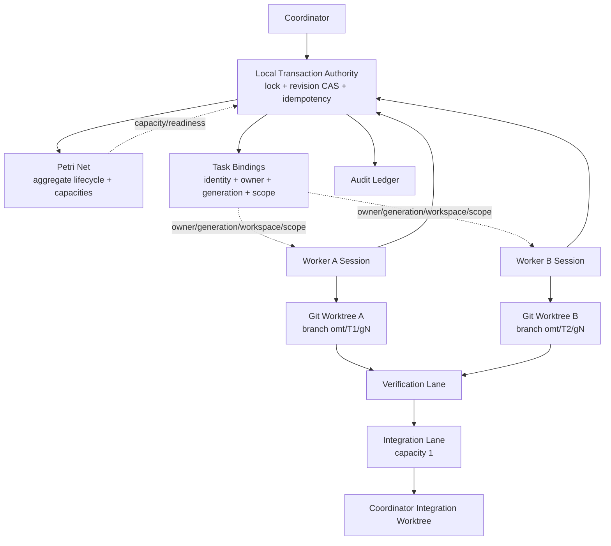
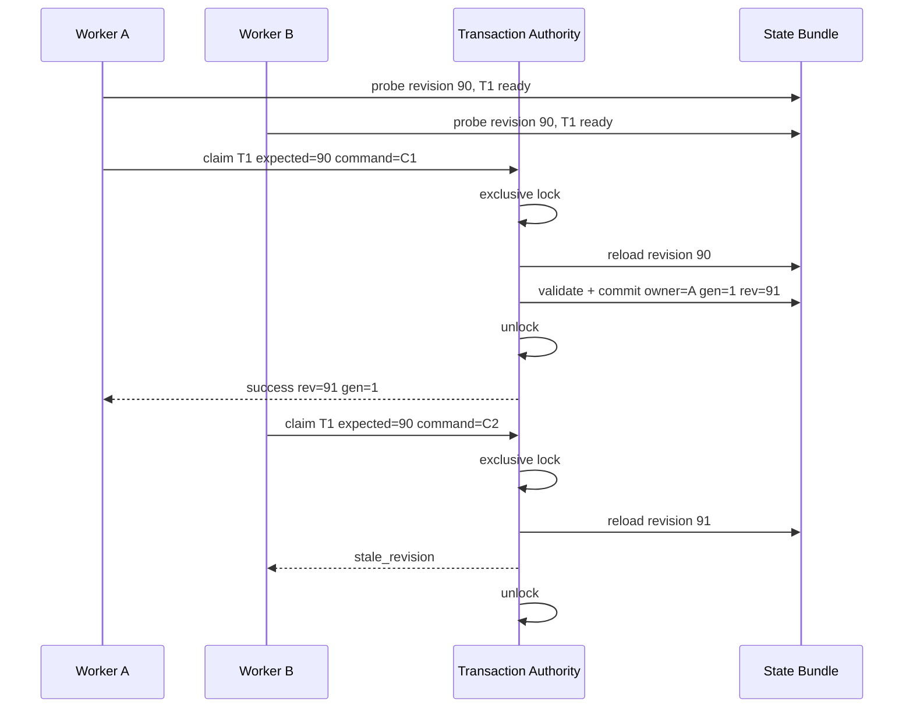
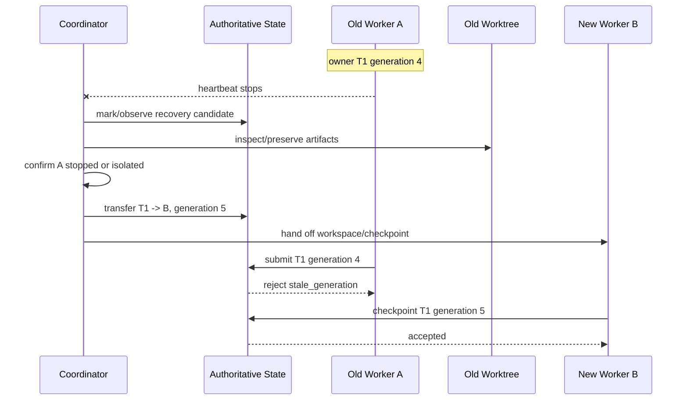

# META HARNESS Concurrent Development — Next Architecture Step

**Status:** Design proposal / iteration on the existing concurrency work  
**Target repository:** `oikumo/agentx`  
**Date:** 2026-09-12  
**Primary scope:** META HARNESS coordination of concurrent AgentX development on one machine  
**Recommended execution envelope:** one coordinator + up to two workers initially  

---

## Executive summary

The next meaningful step for META HARNESS concurrency is **not** to add a general scheduler and **not** simply to raise `agent_attention` from one token to two.

The repository already has most of the *observability* and *formal-control vocabulary* needed for concurrency:

- a Petri-net-backed concurrency state model;
- revisioned net mutations;
- a small WIP-limited work pool;
- `task_bindings` that give aggregate work tokens names and ownership metadata;
- session-start/probe views that expose actionable work;
- a net gate that can fail closed under concurrency;
- an audit ledger and derived human projection;
- explicit design work for a coordinator plus at most two workers.

The missing piece is a **trustworthy transaction and ownership protocol** that can connect this control plane to real parallel coding processes.

This proposal therefore evolves the earlier “lease + worktree” idea into a stricter model:

> **Use durable task claims, monotonic per-task generations, one local transaction authority, isolated Git worktrees, task-scoped gate authorization, and a coordinator-owned verification/integration lane.**

The most important refinement is terminology and semantics:

- A worker does **not** hold an expiring lease that another worker may automatically steal after a timeout.
- A worker holds a **claim** on a named task.
- Every ownership epoch has a monotonically increasing **generation**.
- A heartbeat reports liveness but does not itself revoke or transfer authority.
- A stale worker can continue modifying its isolated worktree, but it cannot checkpoint into authoritative state, submit a result, or integrate it once its generation is no longer current.

This prevents the classic split-brain failure where a paused process wakes up after its lease has expired and continues acting as though it still owns the task.

The second major refinement is that the repository’s existing `expected_revision` check is **necessary but not yet sufficient for multi-process concurrency**. A revision check performed outside a process-wide critical section can allow two processes to read the same revision, both pass the check, and both attempt to write revision `N+1`. Therefore the first implementation step should be a **single local mutation authority** that serializes the complete sequence:

```text
lock
  -> load current bundle
  -> validate expected revision
  -> validate task/owner/dependencies/capacity/scope
  -> apply Petri transition + binding mutation
  -> persist authoritative bundle
  -> append audit event
unlock
```

Only after that primitive is sound should the harness admit two real workers.

The recommended progression is:

1. **Transactional authority and idempotent mutations.**
2. **Task claim + generation enforcement.**
3. **Shared coordination root + isolated Git worktrees.**
4. **Two-worker capacity + scope arbitration + task-scoped gates.**
5. **Verification/integration lifecycle.**
6. **Crash recovery, transfer, transaction journal, and objective-level evidence.**

The existing Feature 064 work on named bindings and truthful observation should be treated as **Slice 1 already complete**, not reimplemented.

---

## 1. Why this is the next step

### 1.1 What the repository has already solved

The original `meta_harness_concurrent` project deliberately modeled concurrency without actually executing multiple workers. It established a single authoritative Petri-net bundle, resource places, revisioned operations, WIP limits, session-start navigation, and a human-readable `WORK.md` projection.

Later work strengthened that model:

- `net_enforced_harness` made the net a permission-to-act gate for relevant operations.
- `meta_harness_6` added a concurrency predicate so the net gate would only impose extra friction when the marking indicated real concurrency.
- `meta_harness_7` then introduced a focused direction for one coordinator plus at most two workers and implemented **Feature 064: named work + truthful observation**.

Feature 064 is important because it changes what the next step should be. The repository no longer needs a proposal for “how do we identify work?” Named task bindings already exist in the sidecar, with fields such as task ID, objective, dependencies, place, owner, generation, checkpoint, scope, resources, results, and block reason.

The repository’s own Feature 064 design explicitly defers:

- atomic task claims;
- generation fencing;
- worktree execution isolation;
- transfer/recovery;
- serialized integration;
- objective-level acceptance.

Those deferred areas are exactly where the next architecture step should concentrate.

### 1.2 What is still missing

At present, the control plane can say approximately:

> “There are N active work tokens and these names/owners are associated with them.”

It cannot yet safely guarantee:

> “Exactly this process owns task T at generation G, no other process can obtain the same claim, this process may edit only its assigned workspace/scope, and only a current claim can publish a result into the integration lane.”

That difference is the boundary between **modeled concurrency** and **real concurrent execution**.

---

## 2. Revisions to the earlier proposal

The earlier proposal was directionally correct—atomic ownership, worktree isolation, resource arbitration, coordinator-owned integration—but several concepts should be tightened before implementation.

### 2.1 Replace “lease” with “claim + generation”

A time-expiring lease sounds convenient:

```text
worker A owns task X until 14:05
```

but it is unsafe by itself. Suppose worker A is paused by the OS or loses access to the coordination directory. Its lease expires. The coordinator assigns X to worker B. Worker A later resumes and still has a live process with writable files. If authorization is based only on elapsed time, A may continue acting after B has become the legitimate owner.

The safer abstraction is:

```text
task X
  owner = worker-b
  generation = 7
```

Worker A may possess an old capability for generation 6. The authoritative state now says generation 7, so any mutation, checkpoint, submission, or integration attempt from generation 6 is rejected.

The heartbeat becomes observational:

```text
last_seen = 2026-09-12T18:22:10Z
```

It can trigger a recovery workflow, but **absence of heartbeat is not itself authority to transfer the claim**.

### 2.2 Separate global revision from task generation

These two counters solve different concurrency problems and should never be conflated.

#### Global net revision

Protects a *short coordination transaction*.

Example:

```text
probe -> revision 72
claim T1 --expected-revision 72
```

If another transaction commits first and revision becomes 73, the claim based on 72 must retry.

#### Task generation

Protects *long-lived ownership*.

Example:

```text
T1 owner=worker-a generation=4
```

While worker A is coding, other independent tasks can legitimately change the global net revision dozens of times. Those unrelated changes must not invalidate A’s authority over T1.

Therefore:

```text
Global revision = optimistic concurrency token for coordination mutations.
Task generation = fencing token for task ownership epoch.
```

This is one of the most important design decisions in the whole proposal.

### 2.3 Do not build a scheduler first

The harness should initially **admit** safe concurrent work, not try to optimize it.

A future scheduler can score enabled tasks by critical path, conflict probability, test cost, or dependency-unblocking value. But such a scheduler would depend on trustworthy claims, ownership, workspace isolation, and integration semantics.

Building scheduling logic first would optimize a protocol that is not yet safe.

---

## 3. Current-state architectural risks

The next design should be driven by concrete failure modes in the current implementation.

### 3.1 Revision checking is not a complete inter-process transaction

The current state layer conceptually performs:

```text
load state
check expected_revision
fire transition
revision += 1
save files
append ledger event
```

Even when the CLI performs a preliminary revision check, two local processes can interleave like this:

```text
Process A                       Process B
---------                       ---------
load rev 57
                                load rev 57
check == 57 OK
                                check == 57 OK
compute rev 58
                                compute rev 58
save rev 58
                                save rev 58
append ledger rev 58
                                append ledger rev 58
```

The last writer wins. Both processes may believe they committed successfully. The revision counter did not serialize them because the read/check/write sequence was not one protected transaction.

That is the first problem to fix.

### 3.2 Multi-file replacement is not the same as crash-atomic commit

The current bundle consists of multiple coordinated files. Writing temporary files and calling `os.replace()` is a useful local safety technique, but a process can still be terminated between replacements or before the audit event is appended.

The long-term design therefore needs to distinguish:

- **inter-process exclusion** — only one writer mutates authoritative state at a time;
- **logical atomicity** — Petri marking and binding change happen as one command;
- **crash consistency** — process death cannot leave an ambiguous partially committed bundle;
- **audit consistency** — committed state can be reconciled with the ledger.

The first two are prerequisites for Slice 2. Full crash recovery can be added in a later slice using a small transaction journal.

### 3.3 Current gate receipts are too ambient for real workers

The current net gate can accept a recent `_start` fire receipt and, by design, is relaxed when active work is not actually concurrent.

That was a reasonable friction tradeoff for the earlier single-session model. It is not strong enough for managed multi-worker execution.

Under real concurrency the authorization question is no longer:

> “Did someone start work recently?”

It is:

> “Does this session own this exact task at the current generation, is this file inside the task’s assigned workspace, and is the path inside the task’s allowed scope?”

The original behavior should remain available for ordinary solo sessions. Managed concurrency should opt into stricter claim-scoped authorization rather than silently changing the meaning of earlier completed features.

### 3.4 Runtime state cannot be duplicated per worktree

Git worktrees create separate working directories. If each worker worktree independently resolves `.meta/.omt` relative to its own root, the workers can accidentally observe or mutate different copies of ignored runtime coordination files.

Real concurrency requires exactly one shared coordination root for:

- authoritative net bundle;
- sidecar task bindings;
- ledger;
- transaction lock/journal;
- worker/session registry;
- integration state.

Worker source trees may be isolated; coordination state must not be.

---

## 4. Proposed authority model

The existing authority split is worth preserving and making more explicit.

```text
Petri net marking
    authoritative aggregate lifecycle/capacity state

Task bindings
    authoritative identity/ownership/generation/task-specific metadata

Gate layer
    enforcement authority at edit/tool boundaries

Ledger
    append-only audit authority

Git worktrees/commits
    execution artifacts and candidate change sets

WORK.md / dashboards / probes
    projections and observations only
```

### 4.1 What the Petri net should own

The net should answer questions such as:

- how many worker slots are free?
- how many tasks are pending/active/verifying/integrating/done?
- is the integration lane occupied?
- can a lifecycle transition occur structurally?

It should **not** encode each task identity as a dedicated place.

### 4.2 What task bindings should own

Bindings should answer:

- which task corresponds to a generic token?
- who currently owns it?
- what ownership generation is current?
- which workspace/branch represents its execution?
- what scopes/resources are reserved?
- what dependencies and acceptance requirements apply?
- what result/evidence has been produced?
- why is it blocked?

The key invariant is:

> **Binding lifecycle counts must be compatible with the aggregate Petri marking, and every managed active token must correspond to exactly one current active binding.**

### 4.3 What the ledger should not become

The ledger should not become a second operational state store.

It should record facts such as:

```json
{
  "event": "task_claimed",
  "command_id": "...",
  "task_id": "T-17",
  "owner": "worker-a",
  "generation": 3,
  "from_revision": 81,
  "to_revision": 82
}
```

but current ownership must be read from authoritative state, not reconstructed on every command by replaying audit history.

---

## 5. The foundational primitive: one local transaction authority

Before adding a second worker, all authoritative mutations should pass through one local critical section.

### 5.1 Transaction shape

Conceptually:

```python
with coordination_lock.exclusive():
    state = load_authoritative_bundle()

    if command_id_already_committed(command_id):
        return previous_result

    require(state.revision == expected_revision)
    validate_command(state, binding, caller)

    next_state, event = apply_command(state, command)
    validate_all_invariants(next_state)

    persist_transaction(next_state, event)
    return committed_result(next_state, event)
```

The lock must span **load through durable commit**.

Checking the revision before acquiring the lock is useful only as a fast rejection. It cannot be the authoritative check.

### 5.2 Lock implementation

For the initial “one machine” scope, a file-backed advisory exclusive lock is appropriate and simple.

A likely coordination file is:

```text
<coordination-root>/net.lock
```

On Unix-like systems this can use `flock(LOCK_EX)` through Python’s `fcntl` module.

Important limitations should be explicit:

- this is a **local coordination mechanism**, not a distributed lock;
- it is advisory, so all harness mutation paths must cooperate;
- unsupported/network filesystems should fail closed or be documented as out of scope;
- future cross-platform support should hide the implementation behind a small `CoordinationLock` abstraction.

### 5.3 Lock every authoritative mutation path

A common failure would be to lock only `claim` while leaving `fire`, `splice`, migration, or synchronization paths unlocked.

Instead, define one rule:

> **Any command that can change the authoritative net/bindings/revision must acquire the same mutation lock.**

This includes, as applicable:

- task-aware `fire`;
- generic `fire` where permitted;
- splice/restructure operations;
- state migrations;
- binding edits;
- recovery/transfer;
- integration lifecycle transitions;
- any synchronization operation that writes canonical state.

### 5.4 Idempotency is required, not optional polish

Subprocess tooling can commit a mutation and then lose the response. A coordinator may retry.

Without idempotency:

```text
claim T1
  -> commits
  -> caller receives timeout
retry claim T1
  -> might fire transition twice or produce misleading error
```

Every mutating command should carry a `command_id`.

Rules:

1. First use of a `command_id` may commit.
2. Retry of the same ID with the same canonical command returns the original committed result.
3. Reuse of the same ID with different payload is rejected as `command_id_conflict`.

The ledger can serve as the audit index for committed command IDs, with a small bounded recent-command index if lookup performance eventually matters.

---

## 6. Task claim protocol

### 6.1 Keep the existing top-level operation surface small

The current `omt_net` CLI uses a closed operation family. Rather than introducing a parallel `claim` state machine outside it, make the existing mutation path task-aware.

For example:

```text
omt_net fire \
  --transition work_start \
  --task-id task-api-1 \
  --owner worker-a \
  --session session-123 \
  --expected-revision 82 \
  --command-id 01K...
```

Internally this is not “just a Petri fire.” It is one transaction that:

1. confirms the task binding is pending/ready;
2. checks dependency evidence;
3. checks no current owner;
4. checks worker capacity;
5. checks scope/resource conflicts;
6. reserves/creates workspace identity;
7. increments task generation if this starts a new ownership epoch;
8. fires the aggregate Petri transition;
9. updates the binding to active/current owner/generation;
10. increments global revision;
11. writes state and audit event atomically enough for the current slice.

### 6.2 Generation semantics

Recommended rule:

- New task begins at generation `0` while unowned.
- First successful claim moves it to generation `1`.
- Ordinary checkpoints do not change generation.
- Normal release/reclaim may increment generation if authority is deliberately transferred.
- Recovery transfer always increments generation.
- A stale generation can never submit or integrate.

A capability tuple is therefore roughly:

```text
(task_id, owner/session, generation, workspace_id)
```

### 6.3 Stable refusal codes

Human prose is useful, but automation needs stable codes.

Suggested initial codes:

```text
stale_revision
command_id_conflict
task_not_found
task_not_ready
already_claimed
owner_mismatch
stale_generation
worker_capacity_exhausted
scope_conflict
dependency_unsatisfied
dependency_stale
workspace_mismatch
path_out_of_scope
integration_busy
verification_required
recovery_required
```

Responses can contain both:

```json
{
  "ok": false,
  "code": "scope_conflict",
  "message": "task T3 overlaps T1 on src/agentx/agent/model",
  "blocking_task": "T1"
}
```

### 6.4 Claim race example

Two workers may observe the same task and revision:

```text
Coordinator/Worker A              Worker B
--------------------              --------
probe rev=90                      probe rev=90
T1 ready                          T1 ready

claim T1 exp=90
acquire transaction lock
validate rev=90
commit owner=A gen=1 rev=91
release lock

                                  claim T1 exp=90
                                  acquire transaction lock
                                  current rev=91
                                  REFUSE stale_revision
```

After re-probing, B sees T1 is no longer available.

Exactly one claim wins.

---

## 7. Shared coordination root

### 7.1 Why it is mandatory

With worker worktrees, repository-relative paths no longer imply a common runtime location.

The harness should introduce an explicit resolved coordination root, for example:

```text
OMT_COORDINATION_ROOT=/path/to/main-worktree/.meta/.omt
```

All workers receive that path from the coordinator at launch.

### 7.2 Resolution strategy

A pragmatic priority order:

1. explicit `OMT_COORDINATION_ROOT` environment variable;
2. managed-session metadata supplied by the coordinator;
3. deterministic Git discovery of the shared/main worktree root;
4. legacy current-worktree behavior only for non-managed solo mode.

In managed concurrency, ambiguity should fail closed.

### 7.3 What belongs there

Recommended structure:

```text
.meta/.omt/
  META_NET.petri.json
  META_NET.sidecar.json
  META_NET.overlay.json
  net.lock
  net_txn.pending.json        # only when a transaction is in recovery
  ledger.jsonl                # or existing ledger location
  sessions/
    coordinator.json
    worker-a.json
    worker-b.json
  workspaces/
    task-T1-g1.json
    task-T2-g3.json
```

The files under `sessions/` and `workspaces/` are metadata/projections unless explicitly declared authoritative. Ownership remains in task bindings.

---

## 8. Git worktrees as execution isolation

Git already provides a useful local isolation primitive: linked worktrees have separate working directories, indexes, and `HEAD` state while sharing repository objects.

### 8.1 Recommended mapping

```text
one current task claim
    = one ownership generation
    = one task branch
    = one linked worktree
```

Example:

```text
branch:    omt/T17/g3
worktree:  .worktrees/T17-g3/
base:      <known integration commit>
```

The binding should record at minimum:

```json
{
  "workspace": {
    "id": "T17-g3",
    "path": "/abs/.../.worktrees/T17-g3",
    "branch": "omt/T17/g3",
    "base_commit": "abc123..."
  }
}
```

When result submission occurs it should additionally record:

```json
{
  "head_commit": "def456...",
  "patch_digest": "sha256:..."
}
```

### 8.2 Why worktrees are better than several agents in one checkout

They prevent many classes of accidental interference:

- independent indexes;
- independent unstaged/staged files;
- independent branch heads;
- clearer ownership of uncommitted artifacts;
- easier preservation of crashed worker state;
- integration can inspect exact commits rather than a shared dirty directory.

### 8.3 What worktrees do *not* solve

A stale process still has OS-level write access to its old worktree. A generation field cannot magically stop `write(2)`.

Therefore the security property is more precise:

> A stale worker may corrupt its own isolated stale workspace, but it must be unable to mutate authoritative coordination state or publish/integrate stale results.

This is why generation checks are most important at:

- checkpoint/update operations;
- harness-mediated source edits where enforceable;
- result submission;
- verification handoff;
- integration.

For stronger containment later, workers could run under OS-level sandboxing or narrower filesystem capabilities, but that is not necessary for the first local version.

---

## 9. Managed-concurrency gate semantics

### 9.1 Preserve historical solo behavior

The current active-count predicate was designed to avoid needless gate friction when concurrency is not actually present. That behavior should remain valid for normal single-session development.

Introduce an explicit concept such as:

```text
coordination_mode = legacy_solo | managed_concurrent
```

or equivalent project/session enrollment.

### 9.2 Managed mode must authorize from the first worker

A dangerous rule would be:

```text
only enforce task ownership when active_count > 1
```

because a second worker can arrive immediately after the first one starts. The first worker’s actions need to be attributable to a claim from the beginning.

Managed mode should therefore enforce:

```text
caller session
  -> task binding
  -> current owner
  -> current generation
  -> expected workspace
  -> permitted scope
```

regardless of whether the marking currently has one or two active workers.

### 9.3 Replace ambient recent-start permission

A task-scoped gate decision could conceptually be:

```python
def can_edit(path, session, task_id, generation):
    binding = current_binding(task_id)

    require(binding.place == "work_active")
    require(binding.owner_session == session)
    require(binding.generation == generation)
    require(path_is_inside(path, binding.workspace.path))
    require(path_matches_scope(path, binding.scope))

    return ALLOW
```

No eight-hour ambient start receipt should confer permission to unrelated workers/tasks in managed mode.

### 9.4 Break-glass

Break-glass should remain possible but explicit:

- named reason;
- session identity;
- affected task/path;
- audit event;
- optionally coordinator-only in managed mode.

A break-glass event should be obvious in later review, not indistinguishable from a normal claim-authorized action.

---

## 10. Capacity and Petri-net topology

### 10.1 Do not simply change `agent_attention = 1` to `2`

`agent_attention` expresses a single-agent metaphor. Real concurrent development needs distinct capacities:

- worker execution capacity;
- expensive verification/test capacity;
- integration capacity;
- possibly harness-structure mutation capacity.

The net should express those separately.

### 10.2 Do not rush to eight lifecycle places either

An earlier draft proposed:

```text
Pending
Ready
Active
Blocked
Verifying
IntegrationReady
Integrating
Done
```

That is understandable, but several of those states are more naturally task metadata than aggregate resource state.

A compact topology can preserve the ≤15-place constraint and still express the important structural boundaries.

### 10.3 Recommended mature topology

Lifecycle places:

```text
work_pending
work_active
work_verifying
work_integration_ready
work_integrating
work_done
```

Resource places:

```text
worker_slots        initial marking 2
test_slots          initial marking 1
integration_slot    initial marking 1
```

Optional objective boundary:

```text
goal_open
goal_satisfied
```

Total: 9–11 places depending on the objective representation.

This preserves headroom under a 15-place cap.

### 10.4 Treat “blocked” as task-specific metadata initially

A blocked task does not necessarily need a separate Petri place.

It can remain `work_pending` with:

```json
{
  "block_reason": {
    "code": "scope_conflict",
    "task": "T12",
    "detail": "overlaps src/agentx/agent/model"
  }
}
```

This is more informative than an aggregate `blocked` token and avoids consuming topology budget for heterogeneous causes.

### 10.5 Candidate transitions

A mature lifecycle could use:

```text
claim
  work_pending + worker_slot
  -> work_active

submit_verify
  work_active + test_slot
  -> work_verifying + worker_slot

verify_fail
  work_verifying
  -> work_pending + test_slot

verify_pass
  work_verifying
  -> work_integration_ready + test_slot

integrate_start
  work_integration_ready + integration_slot
  -> work_integrating

integrate_fail
  work_integrating
  -> work_pending + integration_slot

integrate_pass
  work_integrating
  -> work_done + integration_slot
```

The exact token-flow implementation may change depending on the existing Petri engine semantics, but the conceptual resource behavior is:

- worker capacity is occupied only during worker execution;
- test capacity is occupied only during verification;
- integration capacity is serialized;
- completed work does not retain resources.

### 10.6 Migration strategy

Do not combine topology migration with every other concurrency change in one large patch.

A safer sequence:

1. implement transaction authority using the current topology;
2. make existing `work_start`/`work_complete` task-aware;
3. prove two task claims cannot race;
4. introduce worktrees/gates;
5. migrate to richer verification/integration lifecycle.

This makes correctness bugs easier to localize.

---

## 11. Scope and conflict arbitration

### 11.1 Start simple: canonical path scopes

Do not begin with a complex glob language.

Normalize scope entries into canonical repository-relative path components, for example:

```text
src/agentx/agent/model/policy/
tests/agent/model/policy/
```

Define overlap structurally, not with raw string prefixes.

For example:

```text
src/foo
```

must not accidentally overlap:

```text
src/foobar
```

A component-aware ancestor/descendant test avoids that error.

### 11.2 First conflict rule

For initial concurrency, assume claimed scopes are write scopes.

Two tasks conflict when their canonical path trees overlap.

Examples:

```text
T1: src/agentx/agent/model/policy/
T2: src/agentx/rag/
=> compatible
```

```text
T1: src/agentx/agent/model/
T2: src/agentx/agent/model/policy/
=> conflict
```

The rejected claim should report the exact blocking task and scope intersection.

### 11.3 Later evolution: structured reservations

Once path-based concurrency is stable, the model can evolve toward:

```json
{
  "reservations": [
    {
      "kind": "path",
      "path": "src/agentx/agent/model/policy",
      "mode": "write_tree"
    },
    {
      "kind": "contract",
      "id": "controller.partner.events",
      "mode": "read",
      "version": "v3"
    }
  ]
}
```

This allows semantic dependencies—API/schema contracts—to be represented separately from physical path conflicts.

Do not make that complexity a prerequisite for two local workers.

---

## 12. Dependency and evidence semantics

### 12.1 “Dependency satisfied” must mean something durable

A dependency should not be considered satisfied merely because another worker says “done.”

A downstream task should depend on an accepted artifact/version, for example:

```json
{
  "need": "policy-contract",
  "satisfied_by": {
    "task_id": "T4",
    "head_commit": "abc...",
    "evidence_digest": "sha256:..."
  }
}
```

### 12.2 Staleness propagation

If an accepted upstream result changes, downstream evidence may become stale.

The harness should be able to report:

```text
dependency_stale:
  T9 was verified against T4@abc123
  current accepted T4 result is def456
```

This becomes especially important once multiple workers run in parallel and an integration repair changes one task after another has already verified against it.

### 12.3 Worker completion is not objective completion

A worker can produce:

- a commit;
- local test results;
- notes;
- generated artifacts.

That should move work toward verification, not directly to final `Done` in the semantic sense.

Recommended distinction:

```text
worker result produced
        !=
verified task result
        !=
integrated task result
        !=
objective accepted
```

The Petri lifecycle should encode enough of these boundaries that a self-report cannot accidentally satisfy the whole goal.

---

## 13. Coordinator-owned verification and integration

### 13.1 Why integration should remain serialized

Parallel implementation is valuable. Parallel mutation of the canonical integration branch is rarely worth the complexity for a two-worker local system.

Use:

```text
worker A result ─┐
worker B result ─┼─> integration_slot(capacity=1) -> integration branch
worker C result ─┘
```

The coordinator owns this lane.

### 13.2 Result handoff contract

A worker submission should be immutable enough to verify:

```json
{
  "task_id": "T17",
  "generation": 3,
  "owner": "worker-a",
  "base_commit": "abc...",
  "head_commit": "def...",
  "patch_digest": "sha256:...",
  "local_checks": [
    {"name": "pytest focused", "result": "pass"}
  ],
  "notes": "..."
}
```

The coordinator verifies that:

- the generation is still current;
- the commit belongs to the registered workspace/branch lineage;
- required local checks are present;
- the task has not been superseded;
- dependency evidence is still current.

### 13.3 Integration failure

If cherry-pick/rebase/merge or combined tests fail, do not silently discard the worker result.

Transition the task to a repairable state, usually pending with checkpoint/result preserved:

```json
{
  "place": "work_pending",
  "block_reason": {
    "code": "integration_conflict",
    "integration_base": "...",
    "result_commit": "..."
  }
}
```

A new claim/generation can perform the repair while retaining the prior artifact for diagnosis.

### 13.4 Objective-level acceptance

After required task commits are integrated, run combined acceptance checks against the integration state.

Only then should the overall objective become satisfied.

This directly prevents a subtle concurrency bug:

> Each worker passes its local tests independently, but their combined changes violate an architecture invariant or cross-module contract.

---

## 14. Recovery and ownership transfer

### 14.1 Heartbeat is evidence, not authority

A session record may contain:

```text
last_seen
pid
hostname
status
```

but a missed heartbeat must not automatically create a new owner.

Instead it makes the task a **recovery candidate**.

### 14.2 Recovery workflow

Recommended sequence:

1. Detect that the worker appears unavailable.
2. Freeze automatic progression for the affected task.
3. Confirm the old execution is stopped **or** its workspace is sufficiently isolated that it cannot publish authoritative results.
4. Preserve its worktree/branch/checkpoint.
5. Under the transaction lock, transfer ownership.
6. Increment task generation.
7. Assign the new owner/session/workspace policy.
8. Record an audit event linking old and new generations.
9. Continue from the preserved checkpoint/result where safe.

Example:

```text
T17 generation 3 owner worker-a
worker-a disappears

recovery authorized

T17 generation 4 owner worker-b
```

Any later submission from worker-a generation 3 is rejected as `stale_generation`.

### 14.3 Checkpoints

A useful checkpoint is not a chat transcript. It should be machine-readable enough for a fresh agent:

```json
{
  "task_id": "T17",
  "generation": 3,
  "base_commit": "...",
  "head_commit": "...",
  "checks_run": ["..."],
  "known_failures": ["..."],
  "remaining": ["..."],
  "next_action": "...",
  "artifacts": ["..."]
}
```

A core acceptance criterion should be:

> A fresh coordinator or worker can reconstruct what to do next from authoritative state + Git artifacts + ledger, without requiring the previous chat history.

---

## 15. Crash consistency and a transaction journal

Inter-process locking prevents two writers from racing. It does not by itself solve process death midway through a multi-file commit.

### 15.1 Incremental WAL-style approach

A later hardening slice can add a tiny transaction journal:

```text
net_txn.pending.json
```

Before replacing canonical files, write something like:

```json
{
  "txid": "...",
  "command_id": "...",
  "from_revision": 93,
  "to_revision": 94,
  "operation": "task_claim",
  "task_id": "T17",
  "payload_digests": {
    "net": "...",
    "sidecar": "...",
    "overlay": "..."
  },
  "event": {"...": "..."}
}
```

Possible commit protocol:

1. acquire exclusive coordination lock;
2. validate current state;
3. generate complete after-state payloads;
4. write and `fsync` transaction journal;
5. write/fsync temp payload files;
6. replace canonical payload files;
7. append/fsync ledger event;
8. mark transaction committed or remove journal;
9. release lock.

On startup, presence of a pending journal causes deterministic recovery or fail-closed diagnosis.

### 15.2 Why the journal is not a second SSOT

It exists only while a transaction is incomplete.

It is a **recovery mechanism**, not operational state.

That distinction preserves the existing authority model.

### 15.3 Alternative: generation directories + atomic pointer

A stronger future design could write every complete bundle under:

```text
state/rev-000094/
```

then atomically switch a tiny `CURRENT` pointer.

That can make multi-file bundle publication cleaner, but it is a larger migration. A transaction journal is the more incremental next step.

---

## 16. Proposed data model evolution

Feature 064 already provides a useful base. Extend it minimally.

### 16.1 Example binding

```json
{
  "id": "T17",
  "objective": "Add deterministic provider failover",
  "acceptance_refs": ["AC-1", "AC-3"],
  "deps": [
    {
      "need": "provider-contract-v2",
      "satisfied_by": {
        "task_id": "T12",
        "head_commit": "abc123",
        "evidence_digest": "sha256:..."
      }
    }
  ],
  "place": "work_active",
  "owner": "worker-a",
  "owner_session": "session-a7",
  "generation": 3,
  "checkpoint": {
    "head_commit": "def456",
    "next_action": "add error-path tests"
  },
  "scope": [
    "src/agentx/providers/",
    "tests/providers/"
  ],
  "resources": ["worker_slot"],
  "workspace": {
    "id": "T17-g3",
    "path": "/repo/.worktrees/T17-g3",
    "branch": "omt/T17/g3",
    "base_commit": "112233"
  },
  "results": [],
  "block_reason": null
}
```

### 16.2 Fields that should remain derived

Avoid storing redundant booleans like:

```text
is_ready
is_blocked
can_integrate
```

when they can be derived from authoritative fields, current dependency evidence, capacities, and conflicts.

Redundant flags create drift.

---

## 17. Proposed command protocol

The exact CLI can evolve, but the semantics should be explicit.

### 17.1 Probe

```text
omt_net probe --tasks
```

Returns:

- global revision;
- task observations;
- action menu;
- exact blockers;
- current capacities;
- current owner/generation where applicable.

### 17.2 Claim

Could remain under `fire`:

```text
omt_net fire \
  --transition work_start \
  --task-id T17 \
  --owner worker-a \
  --session session-a7 \
  --expected-revision 93 \
  --command-id CMD-001
```

### 17.3 Checkpoint

Checkpoint changes authoritative binding metadata and therefore needs transaction serialization, but it need not fire a lifecycle transition.

If the current CLI intentionally forbids a new top-level operation, expose it as a controlled sub-action under an existing write path or add it only after updating the formal command schema. The architectural point is that it must use the same transaction authority.

Required capability:

```text
T17 + worker-a + session-a7 + generation=3
```

### 17.4 Submit for verification

```text
submit-result
  task=T17
  generation=3
  head_commit=def456
  patch_digest=...
```

This should atomically release the worker slot and acquire/queue for verification according to the Petri topology.

### 17.5 Transfer/recover

Coordinator-only command:

```text
recover T17
  from generation 3
  to owner worker-b
```

Must explicitly increment generation and preserve prior artifacts.

### 17.6 Integrate

Coordinator-only:

```text
integrate T17 generation=4 result=<immutable result ref>
```

Current owner generation and accepted result must match.

---

## 18. Key invariants

These should become executable validation rules and tests, not just documentation.

### State invariants

1. Global revision increases monotonically by exactly one per committed authoritative mutation.
2. Binding counts never exceed matching aggregate work tokens.
3. In managed mode, every active task token has a named binding.
4. A task has at most one current owner.
5. A task generation never decreases.
6. Ownership transfer strictly increments generation.
7. Completed tasks hold no worker/test/integration capacity.
8. Integration occupancy never exceeds one.
9. Active worker occupancy never exceeds configured worker capacity.
10. A task cannot be both active and integrating.

### Authorization invariants

11. Only the current owner/session/generation can checkpoint or submit a task.
12. A stale generation can never publish into integration.
13. A worker may edit only inside its registered workspace and task scope when managed-mode gates apply.
14. Only the coordinator may mutate the canonical integration workspace/branch.
15. Break-glass actions are explicit and audited.

### Dependency/evidence invariants

16. A dependency marked satisfied refers to current accepted evidence.
17. Verification evidence records the exact result/commit it validated.
18. Objective acceptance records the exact integrated revision/commit tested.
19. Worker self-report alone cannot move an objective to satisfied.

### Transaction invariants

20. At most one authoritative mutation executes inside the local transaction authority at a time.
21. `expected_revision` is checked after acquiring the mutation lock.
22. Identical retry with the same `command_id` is idempotent.
23. Same `command_id` with different canonical payload is rejected.
24. A detected partial transaction causes recovery/fail-closed behavior, never silent continuation.

---

## 19. Acceptance tests that matter most

Ordinary unit tests are necessary but not enough. Concurrency behavior should be demonstrated under actual multi-process interleavings.

### 19.1 Same-task double-claim race

Start two OS processes at revision N. Both attempt to claim the same task.

Expected:

```text
exactly one success
exactly one stale/already-claimed refusal
one active binding
one owner
one generation increment
one consumed worker slot
```

### 19.2 Independent-task parallelism

Two processes claim two disjoint tasks.

Expected final state:

```text
active=2
worker_slots_free=0
T1 owner=A
T2 owner=B
```

The commands may serialize briefly through the transaction lock; the *work* runs concurrently afterwards.

This is an important distinction:

> Serialize coordination mutations, not worker execution.

### 19.3 Third worker waits with exact reason

With capacity two, a third eligible task is attempted.

Expected refusal:

```text
worker_capacity_exhausted
```

or, if its scope overlaps an active task:

```text
scope_conflict(blocking_task=T1)
```

The reason must be deterministic and visible to the coordinator.

### 19.4 Unrelated revision changes do not revoke worker authority

Worker A owns T1 generation 2.

Coordinator performs a legitimate mutation on T2, changing global revision from 100 to 101.

Worker A should still be authorized for T1 generation 2.

This test proves global revision and task generation are correctly separated.

### 19.5 Stale-generation rejection

Transfer T1 from worker A generation 2 to worker B generation 3.

Then A attempts:

- checkpoint;
- submit;
- integrate.

All must fail `stale_generation`.

### 19.6 Scope enforcement

Worker A owns a task scoped to:

```text
src/agentx/rag/
```

A managed gate should allow edits there and reject:

```text
src/agentx/agent/model/
```

### 19.7 Workspace enforcement

Even if the relative path is allowed, a worker should not use that claim to modify the same relative path in the canonical integration worktree.

Authorization must include workspace identity, not only repo-relative scope.

### 19.8 Coordinator-only integration

A worker invoking integration directly must be refused even for its own valid result.

### 19.9 Combined acceptance failure

T1 and T2 each pass local verification. After both are integrated, a combined architecture/e2e test fails.

Expected:

- objective remains unsatisfied;
- exact integrated state is recorded;
- implicated tasks/evidence remain inspectable;
- no automatic false `Done`.

### 19.10 Crash/recovery preservation

Terminate a worker process while its worktree contains useful committed or uncommitted work.

Recovery must preserve the workspace and allow an authorized new generation to continue without losing artifacts.

### 19.11 Lost-response idempotency

Commit a claim but intentionally drop the response before the caller receives it. Retry with the same `command_id`.

Expected:

- same successful result returned;
- no second transition;
- no extra generation increment;
- no duplicate resource consumption.

### 19.12 Transaction-crash recovery

Once the journal is implemented, kill the mutation process after each possible persistence step.

On restart, the system should either:

- deterministically finish the transaction;
- deterministically roll it back if designed to do so; or
- stop with a precise recovery-required diagnosis.

It must never silently accept a mixed bundle.

### 19.13 Fresh-agent reconstruction

Start a new coordinator with no conversational context.

From authoritative state + ledger + Git worktrees alone, it should correctly answer:

- active objective;
- task list;
- owners/generations;
- available capacity;
- blockers;
- candidate next claims;
- pending verification/integration;
- recovery needs.

---

## 20. Model-based / chaos testing

Concurrency bugs usually occur in interleavings humans did not think to write as examples.

Add a small state-machine test model that generates sequences such as:

```text
A probe
B probe
A claim T1
B claim T1
B re-probe
B claim T2
A checkpoint
C claim T3
A submit
coordinator verify A
B crash
coordinator transfer T2
stale B checkpoint
new B resume T2
coordinator integrate T1
...
```

After every generated step, assert all global invariants.

Useful properties:

```text
owner_count(task) <= 1
active_count <= worker_capacity
integration_count <= 1
generation(task) monotonically increases
binding_counts compatible with marking
stale_generation never changes authoritative state
command_id commits at most once
completed work owns no capacity
```

Use **multiprocessing/independent subprocesses**, not only coroutines in one interpreter, for lock/race tests.

A property-based test layer can sit above deterministic unit tests, but the first milestone should include at least one real two-process race test.

---

## 21. Recommended implementation roadmap

Feature numbers in the repository can change as other `meta_harness_7` priorities land, so use the next available numbers rather than binding this design to a specific integer.

### Slice 2A — `net_transaction_authority`

**Goal:** make revisioned mutations actually safe across local processes.

Deliverables:

- shared mutation lock abstraction;
- authoritative revision check inside the lock;
- all net/binding mutation paths routed through it;
- `command_id` idempotency;
- stable refusal/error codes;
- multi-process same-revision race tests.

Non-goals:

- no second worker required yet;
- no worktree automation required yet;
- no lifecycle topology expansion required yet.

This should be the immediate next implementation because every later slice depends on it.

### Slice 2B — `task_claim_generation`

**Goal:** convert named bindings into enforceable ownership.

Deliverables:

- task-aware `work_start`/claim transaction;
- owner/session/generation capability;
- atomic marking + binding update;
- explicit release/transfer semantics;
- generation enforcement for checkpoint/result mutation;
- no unbound managed `work_start`.

Acceptance:

- same-task claim race has exactly one winner;
- global revision changes on other tasks do not revoke current generation;
- stale generation cannot submit.

### Slice 2C — `worktree_execution_isolation`

**Goal:** make real worker execution safely separable.

Deliverables:

- one shared `OMT_COORDINATION_ROOT`;
- one branch/worktree per task generation;
- binding workspace metadata;
- coordinator-controlled worker bootstrap;
- task-scoped managed gate checks for owner/generation/workspace/scope;
- stale workspace cannot publish.

Acceptance:

- two task worktrees can be dirty independently;
- both observe the same authoritative coordination state;
- a claim cannot authorize edits in the integration worktree.

### Slice 2D — `two_worker_capacity_scope_arbitration`

**Goal:** turn modeled concurrency into the first real two-worker execution demo.

Deliverables:

- replace/migrate `agent_attention` semantics toward `worker_slots=2`;
- component-aware scope conflict detection;
- two disjoint tasks active concurrently;
- third task waits with an exact capacity/conflict reason;
- session-start/probe menu shows actionable parallel choices.

Acceptance demo:

```text
coordinator starts
T1 + T2 are eligible and disjoint
worker A claims T1
worker B claims T2
T3 cannot claim and reports why
A and B execute in separate worktrees
```

### Slice 3A — `verification_integration_lane`

**Goal:** make worker outputs safe to combine.

Deliverables:

- richer lifecycle (`verifying`, `integration_ready`, `integrating` or equivalent);
- test capacity;
- capacity-one integration lane;
- immutable result descriptors;
- coordinator-only integration;
- combined objective acceptance.

### Slice 3B — `recovery_and_transaction_journal`

**Goal:** survive process/session loss without split-brain or silent state corruption.

Deliverables:

- heartbeat/liveness observation;
- explicit recovery candidate state;
- generation-incrementing transfer;
- preserved worktree/checkpoint handoff;
- pending-transaction journal and startup reconciliation;
- kill-at-each-persistence-step tests.

### Slice 3C — `evidence_dependency_completion`

**Goal:** make “done” semantically trustworthy across concurrent work.

Deliverables:

- result/evidence digests;
- dependency satisfaction tied to exact accepted artifact versions;
- stale-evidence detection;
- combined acceptance evidence;
- objective completion only after integrated verification.

---

## 22. Dependency graph

```text
Feature 064 (DONE)
Named work + truthful observation
          |
          v
Slice 2A
Transaction authority + idempotency
          |
          v
Slice 2B
Claims + generation fencing
          |
          v
Slice 2C
Shared coordination root + worktrees + gates
          |
          v
Slice 2D
Two-worker capacity + scope arbitration
          |
          v
Slice 3A
Verification + integration lane
          |
          +-------------------+
          |                   |
          v                   v
Slice 3B                 Slice 3C
Recovery/journal         Evidence/dependencies
          \                   /
           \                 /
            v               v
          robust concurrent harness
```

The ordering intentionally establishes **correctness before throughput**.

---

## 23. Recommended project home

The repository already contains a draft project named roughly `agentx_concurrent_development`.

That is a reasonable home **if its scope is stated carefully**:

> META HARNESS functionality that coordinates concurrent development *of AgentX*, not concurrent execution *inside the AgentX runtime*.

That distinction prevents architectural confusion with future multi-agent runtime features.

The project can cite Feature 064 as predecessor work completed under `meta_harness_7`, then continue with the next slices without copying or reimplementing that feature.

Suggested scope statement:

> Build a local, formally governed concurrent development mode in which one coordinator can delegate at most two AgentX implementation tasks to isolated workers; every worker action is grounded in named Petri-net work, revision-safe task claims, generation-fenced ownership, scoped worktree execution, serialized verification/integration, and recoverable evidence.

---

## 24. Proposed architecture diagram



The critical property is that workers execute in parallel **outside** the short transaction lock. Only coordination mutations serialize.

---

## 25. Claim sequence diagram



---

## 26. Recovery sequence diagram



---

## 27. Security and trust boundaries

This design improves concurrency correctness, but it is important not to overstate its security properties.

### Trusted components

Initially trusted:

- coordinator process;
- transaction authority code;
- Petri/binding validation code;
- gate implementation;
- local filesystem/Git primitives.

### Semi-trusted workers

Workers are expected to cooperate with harness commands and gates but may crash, become stale, or produce incorrect code.

The design protects against:

- accidental double claims;
- stale-session publication;
- accidental shared-worktree interference;
- capacity overcommit;
- many scope conflicts;
- unverified integration;
- common retry/race failures.

It does **not** protect against a malicious process with unrestricted OS permissions deliberately editing coordination files or another worktree directly.

If adversarial worker isolation becomes a goal, the next layer would require OS-level sandboxing, separate users/containers, or capability-based filesystem mediation.

That is out of scope for the first local two-worker system.

---

## 28. Observability and UX

A concurrent harness is only useful if a coordinator can immediately understand why work is or is not progressing.

`probe`/session-start output should be able to express:

```text
Objective: O-17
Revision: 104
Mode: managed_concurrent
Capacity: workers 2/2 used, verification 0/1, integration 0/1

ACTIVE
  T1  worker-a  gen=2  scope=src/agentx/rag      checkpoint=commit abc...
  T2  worker-b  gen=1  scope=src/agentx/tools    checkpoint=none

WAITING
  T3  blocked: worker_capacity_exhausted
  T4  blocked: dependency T1 has no accepted evidence yet
  T5  blocked: scope_conflict with T2 on src/agentx/tools/schema

NEXT
  - wait for T1/T2
  - inspect T1 checkpoint
  - recover T2 if worker-b is unavailable
```

The harness should favor **specific blocker explanations** over generic states like `blocked`.

---

## 29. Decisions I would lock now

These decisions are stable enough to record before coding.

### D1 — Real concurrency remains local first

One machine, one coordinator, at most two workers.

No distributed lock service, message broker, or cluster scheduler in the first version.

### D2 — One authoritative coordination bundle

Workers in different worktrees share one coordination root.

### D3 — All authoritative mutations use one local transaction authority

Revision check occurs inside the lock.

### D4 — Global revision and task generation have different meanings

Revision = short optimistic transaction CAS.  
Generation = long-lived ownership fence.

### D5 — Ownership is a durable claim, not an auto-expiring lease

Heartbeats trigger recovery assessment, not automatic reassignment.

### D6 — Every task ownership generation has an isolated Git worktree/branch

Stale work can survive without gaining publication authority.

### D7 — Managed-mode gates are task/owner/generation/workspace/scope aware

Do not rely on a generic recent-start receipt.

### D8 — Integration is coordinator-owned and capacity one

Workers submit immutable candidate results; they do not mutate canonical integration state directly.

### D9 — Worker self-report cannot satisfy the objective

Verification + integration + objective acceptance are separate boundaries.

### D10 — Preserve the ≤15-place Petri topology discipline

Task identity stays in bindings rather than one place per task.

### D11 — Keep legacy solo behavior backward compatible

Stricter managed-mode authorization should not silently reinterpret previous single-session verdicts.

### D12 — Idempotency is part of the mutation protocol

Every authoritative mutation has a command ID.

---

## 30. Decisions I would intentionally defer

Avoid overdesigning these before the two-worker demo works:

- distributed coordination across machines;
- Redis/Postgres/etcd lock service;
- automatic priority scheduler;
- arbitrary glob/resource-expression language;
- dynamic worker counts greater than two;
- automated speculative execution of the same task by multiple workers;
- full adversarial sandboxing;
- multi-repository transactions;
- graph-optimized scheduling based on mined historical behavior;
- automatic merge-conflict resolution by another agent.

Each may become valuable later. None is required to validate the architecture.

---

## 31. Future scheduler, once the foundation is safe

After claims/workspaces/integration are trustworthy, the existing probe information can evolve into scheduling recommendations.

Candidate score:

```text
score(task) =
    dependency_unblocking_value
  + critical_path_weight
  + available_scope_fit
  + historical_success_probability
  - merge_conflict_probability
  - expected_verification_cost
  - scarce_resource_cost
```

The scheduler should still propose claims through the same transaction protocol rather than bypassing it.

In other words:

> Scheduling is a client of the concurrency protocol, not part of the protocol’s trust boundary.

---

## 32. Definition of success for the next “big step”

The next concurrency milestone should not be measured by how many new abstractions or Petri places exist.

It succeeds when the following end-to-end demonstration is reliable:

1. Coordinator starts from a fresh session and reads one authoritative state.
2. Two independent named tasks are reported as concurrently eligible.
3. Worker A and Worker B race/claim through the same transaction authority.
4. Each receives a unique current generation and isolated worktree.
5. Both execute concurrently.
6. A third task is refused with an exact capacity or scope-conflict reason.
7. One worker can disappear without losing its artifacts.
8. Recovery transfers ownership by incrementing generation.
9. The stale worker cannot publish after transfer.
10. Worker results enter a serialized verification/integration lane.
11. Combined tests can reject an otherwise locally successful pair of changes.
12. The objective reaches satisfied state only after integrated acceptance evidence exists.
13. A brand-new coordinator can reconstruct all of this from state, Git artifacts, and ledger alone.

If those thirteen behaviors work, META HARNESS has crossed from **concurrency modeling** into a credible **concurrent development control plane**.

---

## 33. Immediate recommendation

The immediate next feature should be **transaction authority**, not worker orchestration.

Concretely:

> Introduce a shared local mutation lock and command-idempotent transaction path around every authoritative net/binding mutation; move `expected_revision` validation inside that critical section; prove with a two-process test that two commands starting from the same revision cannot both commit as if they owned the same state.

Then build task claims/generation fencing on top of that primitive.

That sequencing avoids building two-worker orchestration on a race-prone state update mechanism.

---

## 34. Repository evidence used for this design

The proposal is based on the current repository state as inspected on 2026-09-12, especially:

- [`meta_harness_concurrent/PROJECT.md`](https://github.com/oikumo/agentx/blob/main/.projects/meta/meta_harness_concurrent/PROJECT.md) — original concurrency authority model, WIP pool, completed features, and explicit earlier exclusion of real concurrent execution.
- [`net_enforced_harness/PROJECT.md`](https://github.com/oikumo/agentx/blob/main/.projects/meta/net_enforced_harness/PROJECT.md) — net-as-gate state/enforcement split and fail-closed model.
- [`meta_harness_6/PROJECT.md`](https://github.com/oikumo/agentx/blob/main/.projects/meta/meta_harness_6/PROJECT.md) — concurrency predicate and deferral of full multi-session execution.
- [`meta_harness_7/PROJECT.md`](https://github.com/oikumo/agentx/blob/main/.projects/meta/meta_harness_7/PROJECT.md) — focused coordinator + two-worker direction and Feature 064 completion.
- Feature 064 design under `.projects/meta/meta_harness_7/...` — current `task_bindings` schema, observation model, and explicit deferral of atomic claims, generation fencing, transfer/recovery, and integration.
- [`scripts/omt/net/state.py`](https://github.com/oikumo/agentx/blob/main/scripts/omt/net/state.py) — current bundle load/save, revision, WIP pool, task bindings, and mutation mechanics.
- [`scripts/omt/net/cli.py`](https://github.com/oikumo/agentx/blob/main/scripts/omt/net/cli.py) — current closed CLI operation surface and `fire` path.
- [`scripts/omt/gates/net.py`](https://github.com/oikumo/agentx/blob/main/scripts/omt/gates/net.py) or current equivalent net gate — current recent-fire receipt and active-count predicate behavior.
- [`agentx_concurrent_development/PROJECT.md`](https://github.com/oikumo/agentx/blob/main/.projects/meta/agentx_concurrent_development/PROJECT.md) — current draft home for the next focused program.
- [Git `worktree` documentation](https://git-scm.com/docs/git-worktree) — linked-worktree isolation properties used in the execution design.
- [Linux `flock(2)` documentation](https://man7.org/linux/man-pages/man2/flock.2.html) and Python [`fcntl`](https://docs.python.org/3/library/fcntl.html) — basis for the initial local exclusive mutation lock.

---

## Final position

The architecture should evolve from:

```text
Petri net tells one agent what work exists
```

through the already-completed named-work slice into:

```text
Petri net + bindings define what may happen
local transaction authority decides who successfully claims it
per-task generation defines who still owns it
worktrees isolate where execution happens
gates enforce where that owner may act
verification establishes whether the result is acceptable
integration serializes publication
objective evidence—not worker assertion—defines Done
```

That is the smallest coherent architecture that preserves the strengths of META HARNESS—formal state, bounded topology, fail-closed gates, auditability, and deterministic navigation—while making **real concurrent coding-agent execution** possible.
