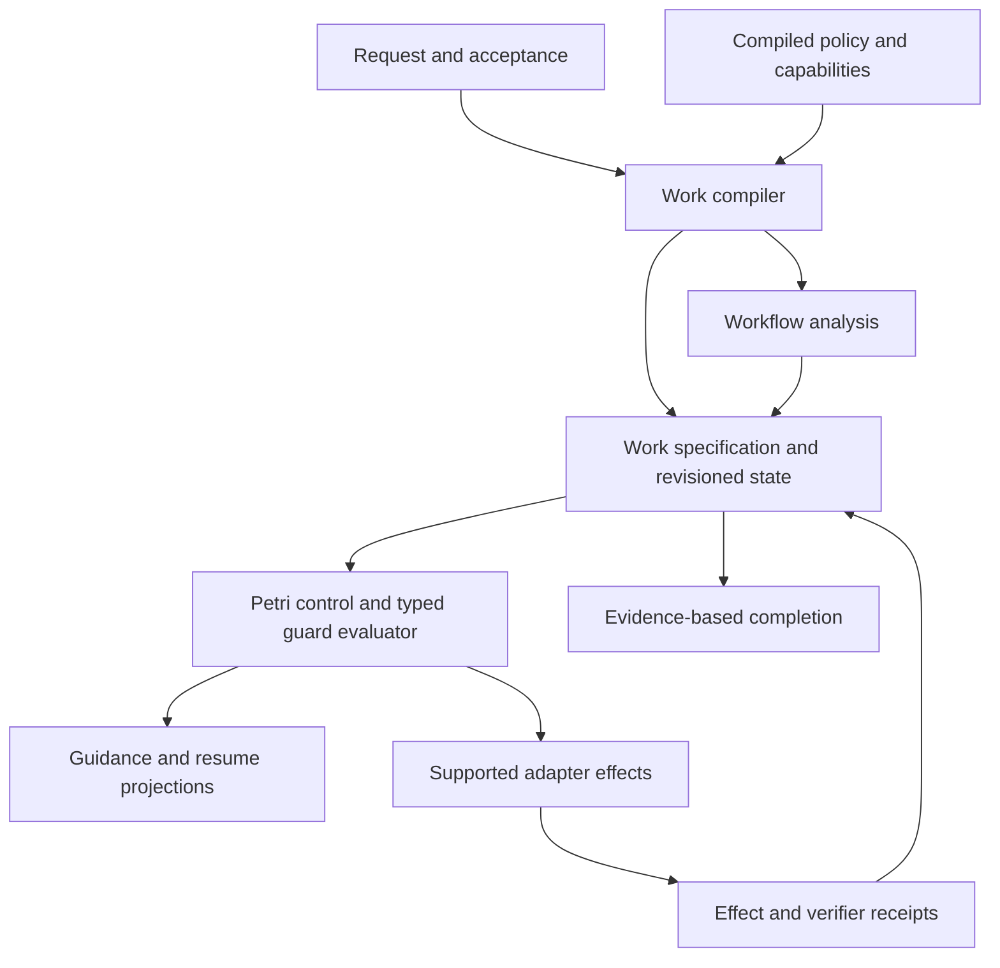

# META HARNESS roadmap

META HARNESS should help a coding agent finish the work requested by the user with less total effort and a result that is inexpensive to review. Its central architectural direction is **a compact executable work contract with a weighted Place/Transition Petri net as its formal control core**. The net governs workflow progression, resource ownership and synchronization; typed records preserve intent, task identity, permissions, repository state and evidence.

The immediate opportunity is to make the next useful action easier to choose and the completion claim more trustworthy. Build on the existing compiler, preparation, resume and coordination mechanisms. Measure their contribution before expanding the platform.

This is the single strategic roadmap. The [active project](../.projects/meta/meta_harness_8/PROJECT.md) remains the execution ledger for scheduled features and shipped work; it does not define a competing architecture. Proposed contracts and milestones below describe future work unless the current-state section explicitly identifies an implementation. Editing this roadmap does not activate a runtime capability or change repository permissions.

## 1. Intent, target and objectives

### 1.1 Product purpose

The initial target is a developer maintaining an existing repository with executable checks, using an agent for fixes, changes, investigations and interrupted work. The first useful product experience is:

**Request a change → receive concise guidance → work and resume without rediscovery → review the requested outcome and its current evidence.**

The agent should not need to learn feature identifiers, manually move tokens, repeat facts across process documents, or ask for permission already granted. The harness should perform deterministic bookkeeping and expose only information needed for the next decision. Complex work can require more structure; a small documentation edit should not inherit the ceremony of a concurrent integration.

The product has three distinct outcomes:

- **Request fulfillment:** the requested behavior, artifact or explanation was delivered within the authorized scope.
- **Verification:** named checks were evaluated against a named candidate, with explicit results and limitations.
- **User acceptance:** the user or independent task oracle accepted the outcome.

A workflow reaching its terminal state does not establish the other outcomes by itself.

### 1.2 Governing objectives

| Objective | Required outcome | Measurement |
|---|---|---|
| Productivity | More accepted requested work for the same resources. | Accepted tasks per elapsed time; acceptance rate; human intervention and review minutes. |
| Agent token economy | Lower total model usage across the entire task. | Input and generated tokens across all attempts, helpers, compaction, verification diagnosis and recovery. |
| Work guidance | The first action after guidance advances the requested outcome. | Tokens to first useful action, repeated refusals, avoidable retries, missing-context recovery. |
| Request fidelity | Requested outcomes survive interpretation, compaction, amendments and handoff. | Omitted outcomes, unauthorized additions, correctly retained constraints, independently checked acceptance cases. |
| Trustworthy completion | Reports reflect actual candidate-bound evidence. | Seeded false-success cases rejected; valid controls accepted; review effort recorded. |
| Petri value | Formal control reduces coordination errors or wasted action discovery. | Incremental benefit over equivalent preflight; model/runtime agreement; detected workflow defects; analysis cost. |

Token reduction is constrained by quality and user effort. Lower usage obtained by abandoning difficult tasks, weakening checks, or transferring recovery to the user is not an improvement. Report money, human minutes and elapsed time alongside tokens; do not conceal tradeoffs inside one score.

Initial research targets are **20% lower total tokens on resumed tasks** and **30% fewer repeated refusals on tasks where guidance is relevant**, with acceptance and authorization controls preserved. These are targets to test, not results or universal release thresholds. Routine trivial tasks may favor a minimal configuration.

### 1.3 Architectural ambition

Aim to exceed ordinary harness practice through the integration of four capabilities:

1. A request-linked work contract that drives guidance and completion.
2. A shared evaluator used for preparation, decisions, refusal explanations and replay.
3. An executable Petri model whose declared properties match the runtime it controls.
4. A measured improvement loop that removes mechanisms whose cost exceeds their demonstrated value.

This is an engineering hypothesis, not a claim of unique invention or established superiority. Petri nets, workflow verification, context selection and event-driven runtimes have substantial prior art. The advantage must appear in accepted repository work.

## 2. Current implementation state

### 2.1 Assessment baseline

Source inspection is anchored to clean checkout `81b3aa15287ac8da8899f6a3a66d4999c8b7d652`, dated 2026-09-13. The compiler and generated projections pass: **265 records, zero errors**. There is an existing unindexed self-evaluation workflow warning and three near-cap budget warnings. This establishes compiler consistency at that checkout, not product qualification.

| Area | What exists | Remaining implication |
|---|---|---|
| Policy compilation | `.meta/META_HARNESS.omt` compiles gates, predicates, tools, budgets and generated instructions. | This is a static Policy IR; it is not a complete executable representation of a user task. |
| Preparation and prediction | Features 055/062 provide preflight; 072 types part of policy; 073 assembles a bounded task-preparation response. | Preparation remains a standalone module. Dry evaluation can omit live checks; its policy note can assume a solo marking. |
| Resume | Feature 092 ships `omt_status{op:"resume"}` with a 2,048-byte cap and document anchors. | It reconstructs process state; a durable original-request and acceptance contract is still missing. |
| Context economy | Fast paths, consultation reuse, navigation caps, ceremony measurements and budget warnings exist. | Record/file byte counts are not end-to-end token measurements. |
| Petri engine | Weighted P/T firing, reachability, deadlock, invariant and liveness analysis; conformance machinery and independent implementations exist. | Engine agreement does not establish correctness of a particular workflow or coverage of every runtime mutation. |
| Coordination | Locks, revision checks, task claims/generations, scope arbitration, verification/integration lanes, recovery markers and dependency checks exist. | Several execution, evidence and crash-recovery boundaries remain incomplete. |
| Distribution | Tier/template initialization and local OpenCode plugins exist. | A minimal independently installable and qualified harness profile has not been established here. |
| Measurement backlog | Feature 093 is scaffolded and paused before implementation; T3-6 selective knowledge remains pending. | Finish a first measurement result instead of opening another broad redesign. |

The active project's latest record identifies **two unfinished backlog items: T3-4 task-cost benchmark and T3-6 knowledge pilot**, followed by the recurring T5-8 review. Features 089 conventions/lints, 090 scaffolds, 091 budget warnings and 092 resume are shipped. Earlier statements treating those features as pending are obsolete.

The resume report records a 432-byte digest replacing a roughly 58 KB reread set during one internal session. That is a promising observation about delivered bytes, not a controlled token saving, a reliability result, or evidence of general adoption. The recorded feature-092 suite result was 2,214 passing tests; the fresh verification record for this edit is in section 11.

Current representation budgets include `AGENTS.md` 2,918/2,944 bytes, argument descriptions 2,455/2,464, tool descriptions 1,840/1,856, navigation index 64,990/65,536 and IR 20,113/20,480. Budget pressure creates maintenance work, but index size only becomes model cost when content is actually delivered. Measure that path before tightening or raising limits.

Sources: [project state](../.projects/meta/meta_harness_8/CURRENT_STATE.md), [compiler](../scripts/omt/harnessc.py), [task preparation](../.opencode/lib/enforcer/task_prep.ts), [resume implementation](../.opencode/plugins/omt_status.ts), [resume test report](../.meta/software_development_process/6.testing/features/feature_092.resume_digest/test_report.md).

### 2.2 Reliability findings that still matter

The established finding identifiers are retained for traceability. “Source-confirmed” means the behavior is visible in this checkout; it does not mean a new live-host fault campaign was performed.

| Finding | Current disposition | Required closure |
|---|---|---|
| F01 — Mutation coverage | Source-confirmed: the before-hook extracts one scalar path; mediated tool/path forms are bounded. | Normalize complete effect/path sets. Publish a support matrix covering patches, moves, deletes, scripts and child processes. |
| F02 — Critical error handling | Source-confirmed: unexpected before-hook errors are caught and allowed through. | Distinguish optional advice failures from missing or invalid authority. Critical unknown/error cannot authorize a protected effect. |
| F03 — Independent obligations | Source-confirmed: a successful test-file gate returns `stop`; protected-file overrides can also stop the chain. | Satisfying one obligation must not suppress unrelated obligations. Retain allow and deny controls. |
| F04 — Authority lifetime | Partial mechanisms exist; a complete progress/consultation/grant lifetime contract remains a qualification requirement. | Scope permissions to subject, task, workspace and relevant generation; keep progress and consultation separate from authority. |
| F05 — Truthful completion | Source-confirmed: `omt_complete` substitutes `{"ok":true}` for empty verifier output and does not require successful process exit. | Nonzero, empty, malformed or incomplete verification results cannot create verified completion. |
| F06 — Stage lifecycle | Staging exists; a qualified owned finish/verify/consume lifecycle is not established by this assessment. | Qualify the lifecycle before relying on staged acceptance, or exclude it from the first verified profile. |
| F07 — Evidence validity | Content-related fields and dependency checks exist; lane success can still come from supplied verdicts. | Trusted execution of declared checks, complete candidate identity and explicit invalidation. |
| F08 — Transaction authority | Locking and revision fencing exist; the old “no lock” diagnosis is obsolete. | Close consistent reads, command replay and interrupted publication as one protocol. |
| F09 — Durable acknowledgment | Source-confirmed: TypeScript `appendJsonl` swallows write failures. | Authoritative write failure cannot acknowledge success; recovery must preserve intervening work. |
| F10 — Truthful prediction | Partial: dry net evaluation skips the live subprocess; task prep is not complete permission evidence. | Identical action and snapshot use identical decision semantics; unavailable facts remain unknown. |
| F11 — Context value | Partial: navigation limits record count, and resume can hard-cut to fit its cap. | Bound actual delivered content while retaining necessary facts and usable continuation. |
| F12 — Qualification | Extensive tests exist; feature tests are not an end-to-end release certificate. | Retained artifact-install, real-adapter, failure, recovery and acceptance evidence for each advertised profile. |

The [hook](../.opencode/plugins/omt_enforcer.ts), [gate driver](../.opencode/lib/enforcer/gate_driver.ts), [completion implementation](../.opencode/lib/enforcer/phase_gate.ts), [shared IO](../.opencode/lib/omt_shared.ts) and [completion tests](../tests/scripts/omt/test_completion_hardening.py) support these distinctions. The completion tests exercise the Python verifier, including failed feature behavior; that does not close its TypeScript caller's empty-output contract.

### 2.3 Remaining control and concurrency gaps

| Gap | Source evidence | Consequence |
|---|---|---|
| C1 — Commit and replay diverge | `_transact` clears its pending marker before recording command replay data; reconciliation does not reconstruct the original result. | A successful state advance can outlive the information needed to retry it safely. |
| C2 — Snapshot visibility | `save` replaces three files sequentially; `load` reads them separately. | Locking writers alone does not guarantee that readers observe one complete revision. |
| C3 — Workspace reality | `ensure_workspace` creates a directory and best-effort branch; it does not create a linked Git worktree. | Workspace metadata is insufficient evidence that isolated execution exists. |
| C4 — Execution identity | The live net gate passes path/session; task/generation/owner checks exist on other entry points. | Helper-level fencing does not establish identity propagation across every actual write path. |
| C5 — Verifier authority | Lane operations accept a verdict and a caller-supplied coordinator flag. | State movement does not prove that trusted checks ran on the candidate or integrated result. |
| **C6 — Executable model coverage** | `_move_pool_token` directly adjusts counters; absent lane places can be treated as binding-only occupancy by `validate_task_bindings`. | The current control net is not yet a complete executable specification of the advertised lifecycle. |

C6 is central to the Petri strategy. Checking that counts agree is weaker than checking that a state change is an enabled transition of the declared model. A certificate for the net cannot certify lifecycle behavior implemented outside that net.

Sources: [state and transaction implementation](../scripts/omt/net/state.py), [lock and journal helpers](../scripts/omt/net/lock.py), [workspace implementation](../scripts/omt/net/workspace.py), [net CLI](../scripts/omt/net/cli.py). Existing transaction, claim, recovery and lane tests remain useful; extend their coverage instead of recreating their features.

**Current defensible profile:** development assistance. Verified solo and managed local execution remain unqualified at the product boundary. This limits the claims made about the system; it does not prevent read-only guidance experiments.

## 3. State of the art and strategic choices

The following primary documentation was checked on 2026-09-13. This is a comparison of documented design, not a performance ranking; competing harnesses were not benchmarked during this assessment.

| Reference | Established practice | Decision for META HARNESS |
|---|---|---|
| OpenCode | Local/package plugins, tool hooks and an experimental compaction hook. [^opencode] | Reuse the host's execution loop and extension points. Qualify actual installed hooks and effect coverage. |
| Anthropic's long-running-agent work | Incremental work, explicit feature requirements, progress artifacts and end-to-end checks address context loss and premature completion. [^anthropic] | Task continuity and explicit checks are baseline expectations; demonstrate a cheaper, more faithful implementation. |
| Aider | A dependency-graph-ranked repository map selects relevant code within a token budget. [^aider] | Retrieve by relevance to the current change before applying size caps. Compare selected context against simpler retrieval. |
| OpenHands SDK | Typed action/observation events, separate tools/workspaces/server packages and context condensation. [^openhands] | Keep policy and work semantics outside a host adapter; avoid building another general agent SDK. |
| LangGraph | Checkpointed graph state supports continuation and inspection. [^langgraph] | Reuse the persistence principle; distinguish a checkpoint from an attested external effect. |
| mini-SWE-agent | A deliberately small agent loop is a serious design baseline. [^mini] | Include native/static/minimal comparisons so complexity must demonstrate incremental value. |

The proposed advantage is the **combination** of request-linked acceptance, compact state-derived guidance, model-checked control and evidence-bound recovery. No source review establishes that other systems cannot implement these capabilities. Claims of exclusive functionality or superiority should be replaced with comparative task results.

Three strategic corrections follow:

- **A richer preflight is not automatically a Petri advantage.** Compare joint Petri guidance with ordinary preflight given the same facts and presentation budget.
- **Semantic consolidation does not require a platform rewrite first.** A thin read model and one normalized action can prove or disprove value before a new store, SDK or adapter program.
- **Formal methods are mature tools, not product differentiation by themselves.** Compare P/T modeling with an explicit state machine plus resource counters on the same representative workflows. The useful distinction is clearer composition, reusable analysis and fewer implementation errors, not greater computational expressiveness.

## 4. Guidance for work requested by the user

### 4.1 Capture intent without an interview

At task entry, retain a durable request reference and a bounded exact extract, including the referents needed to interpret “this file,” “continue,” or “the previous change.” Derive observable acceptance cases with references to that request. A model-generated paraphrase is a working interpretation, not a replacement authority.

Proceed on clear requests and routine implementation choices. Ask only when missing information materially changes the requested outcome, authorized scope or a consequential action. Existing authorization persists. An automatic acceptance-confirmation round trip for every task would work against the product's purpose.

Keep the requested outcome separate from the anticipated file footprint. A supporting test or necessary caller update may be within the original task even when its path was not predicted. Scope checks should distinguish a justified implementation consequence from an unrelated product addition; otherwise strict path prediction produces needless clarification.

For investigations, acceptance is an evidenced answer. For documentation, it is the requested artifact with appropriate content/link checks. For code, it is the requested behavior with suitable verification. Do not turn every task type into a feature-development workflow.

### 4.2 One task view

Preparation and resume should expose one bounded view containing:

```text
request and acceptance references
current task, candidate and relevant scope
completed outcomes and unresolved obligations
next useful action, reason and required evidence
stale or unknown facts
detail references
```

The existing preparation and resume implementations are the starting point. They should eventually become projections of the same work state, with no independent authority stores. A digest is a navigation aid; it is never a permission grant.

The default response should fit an explicit budget, initially using the shipped 2 KB resume envelope where sufficient. Required constraints, acceptance coverage and uncertainty must survive. If they cannot fit, return a bounded summary plus an explicit required continuation; do not cut a constraint mid-sentence and label the result complete.

### 4.3 Progress, amendments and completion

An action is useful when it resolves an acceptance obligation, acquires necessary evidence or advances the relevant workflow. Merely making an allowed call is not evidence of progress. “Next” should rank such actions by expected value and cost after legality has been established.

User amendments create a new request/specification revision. Preserve the amendment trail and invalidate affected acceptance/evidence. Resume and handoff must retain completed work, unresolved failures, interpretation choices and the latest authorized intent.

Assemble completion facts from evidence, then let the agent explain them in user terms. Each requested outcome receives `verified`, `failed`, `waived` or `not_verified`, with omissions and scope additions visible. A waiver is not a pass. Record user acceptance separately.

Keep the user-facing report brief; detailed cost and control traces remain expandable. Do not require a cost dashboard or a repeated quotation of the request in every routine reply. Telemetry belongs on disk unless it explains a material tradeoff.

## 5. The executable work contract

### 5.1 Static policy and task execution

Preserve two stages:

```text
OMT policy source → Policy IR
request + acceptance + repository snapshot + Policy IR + capabilities → WorkSpec
WorkSpec + revisioned execution state → Work IR
```

The first stage already exists in substantial form. The second is a proposed contract built incrementally over existing mechanisms.

Language-model interpretation proposes outcomes, dependencies and a template. Deterministic compilation validates their structure and specializes policy. It cannot prove that an arbitrary natural-language request was understood correctly. Request traceability and independent acceptance remain necessary.

The diagram shows authority and derived views. External effects enter the work state through validated receipts.



### 5.2 One logical state, explicit owners

```text
WorkSpec = (Q, A, N, G, X, Vspec)
WorkState_r = (M_r, B_r, E_r, R_r, Vstate_r)
WorkIR_r = (WorkSpec, WorkState_r)
```

| Field | Owns |
|---|---|
| Q | Request reference, exact extract, referents and accepted amendments. |
| A | Observable acceptance cases, verification methods and permitted waivers. |
| N | Weighted P/T control topology and its semantic identity. |
| G | Typed policy guards, authorization rules and evidence requirements. |
| X | Supported effect contracts and runtime capability profile. |
| M | Aggregate control/resource marking. |
| B | Named tasks, lifecycle position, owner, generation, workspace, scope and dependency identities. |
| E | Candidate-bound verification evidence and acceptance mappings. |
| R | External-effect receipts and unresolved effect state. |
| V | Schema, compiler, policy, Petri semantics, adapter contract, specification and state revisions. |

A specification change creates a new identity; invalidate only the analyses and evidence whose declared dependencies changed. Execution revisions advance under one authority protocol. Physical files or database tables are implementation choices, not the public meaning of Work IR.

Keep the [Petri interchange format](../shared/petri-net/FORMAT.md) focused on structural nets and initial marking. Work IR can reference it without adding task identities, mutable evidence or repository policy to the generic Petri format.

### 5.3 Migration discipline

Start with a read-only projection of current state, labeling missing or inconsistent fields. Migrate one lifecycle action and its guard/evidence path at a time. During each slice, designate one writer and make legacy views derived or read-only. Dual writes with “eventual reconciliation” would recreate the authority ambiguity being removed.

Preserve current fixtures for compatibility, but do not let permissive legacy behavior inherit a verified claim. Unsupported schema/semantics versions must be explicit. Cross-language canonicalization and replay vectors matter before a second implementation becomes authoritative.

## 6. Petri nets as the control core

### 6.1 Why this core is useful

Weighted P/T nets provide a concise representation of concurrent activities, synchronization, resource acquisition and release. They make resource conservation and permitted lifecycle movement inspectable independently of agent prose. The current library already supplies relevant analysis primitives and explicitly represents incomplete results.

Use that foundation for three product mechanisms:

1. **Guidance:** compute the relevant legal-action frontier and explain missing prerequisites.
2. **Pre-execution analysis:** find modeled deadlocks, impossible goals and resource inconsistencies before expensive agent work.
3. **Recovery and replay:** reconstruct control progression and distinguish completed, reserved, stale and unresolved work.

A token has no knowledge of repository correctness. Paths, content hashes, identities, approvals and timestamps belong in typed state and guards. Every rule does not need a place.

### 6.2 Close the model/runtime gap first

For each lifecycle operation, publish its mapping to an enabled transition or a declared, checked transition sequence. The state update must satisfy:

```text
M_next = fire(N, M_current, transition)
projection(B_next) = M_next on all managed task places
resource invariants remain true
```

A direct counter update is acceptable only as an optimized implementation of that specified relation, with differential conformance checks. It cannot invent movement absent from the net. Ordinary reads or candidate edits may leave the control marking unchanged; such stuttering actions must have explicit phase/identity guards and evidence-invalidation semantics.

For managed task places:

```text
M[p] = number of bindings whose lifecycle place is p
```

Anonymous tokens and binding-only lanes are explicit compatibility modes. A profile claiming formal lifecycle coverage must instantiate the required places and transitions. It cannot satisfy projection equality by synthesizing an absent place's token count from its bindings.

This closes C6 and defines when the net becomes an authoritative executable model. Before then, expose it as a partial control abstraction and identify the omitted behavior.

### 6.3 Compact topology and held resources

Use a reusable pool topology and typed task bindings. Do not create a fresh collection of places for every otherwise identical task. A place-count cap is an implementation budget, not a mathematical proof of boundedness or affordable exploration.

A representative future template is:

| Transition | Consumes | Produces | Additional obligation |
|---|---|---|---|
| start | pending + worker_free | active | Current task claim, permitted workspace and scope. |
| submit | active | submitted + worker_free | Immutable candidate/input manifest. |
| verify_start | submitted + verifier_free | verifying | Eligible check contract and current inputs. |
| verify_pass | verifying | verified + verifier_free | Trusted passing receipt for that candidate. |
| verify_fail | verifying | pending + verifier_free | Recorded failure; preserve candidate and diagnostics. |
| integrate_start | verified + integration_free | integrating | Current dependencies and integration-base identity. |
| integrate_pass | integrating | done + integration_free | Evidence for the actual combined candidate. |
| integrate_fail | integrating | pending + integration_free | Failure recorded; candidate preserved. |

The table is a proposed template, not the current CLI or a mandatory path for every task. A solo/documentation profile can specialize away irrelevant lanes while preserving the meaning of remaining transitions.

For two worker slots and single verification/integration lanes, useful invariants are:

```text
M[worker_free] + M[active] = 2
M[verifier_free] + M[verifying] = 1
M[integration_free] + M[integrating] = 1
sum(task lifecycle tokens, including explicit cancellation) = admitted task count
```

These equations apply to this template and its defined admission/cancellation boundaries. Bindings identify which task holds each resource. A resource self-loop on one instantaneous transition checks availability at firing time; it does not hold the resource over external work. Start/finish transitions do.

Cancellation and recovery release resources only after the effect/worker lifecycle permits it. A missed heartbeat is a recovery signal, not proof that a process stopped. Generation fencing prevents stale output from entering current work; process containment determines whether stale physical writes can also be stopped.

### 6.4 The legal-action frontier

For a modeled action a and consistent state W:

```text
Legal(a, W) =
    control_enabled(a, N, M)
    AND typed_guards(a, G, B, E, R) = ALLOW
    AND supported_capability(a, X)
```

The evaluator returns `ALLOW`, `DENY`, `UNKNOWN` or `ERROR`. Only `ALLOW` authorizes a protected effect in a verified profile. All applicable obligations compose; one successful gate cannot terminate their evaluation. If a check depends on unavailable evidence, report that dependency rather than imply that it passed.

“Frontier” means a bounded set of relevant task actions, not an enumeration of every possible shell command. Its contract includes the candidate-action domain, revision, omitted count/continuation and evaluation completeness. A proposed action can always be checked directly; absence from a truncated list is not a denial.

A proposed response shape is:

```json
{
  "schema": "work-frontier/1",
  "spec": "sha256:...",
  "revision": 184,
  "candidate": "sha256:...",
  "task": "T17",
  "generation": 3,
  "workspace": "T17-g3",
  "domain": "proposed action: submit task T17",
  "complete": true,
  "actions": [
    {
      "action": "submit task T17",
      "transition": "submit",
      "decision": "DENY",
      "petri_status": "enabled",
      "guard_status": "DENY",
      "obligations": [
        {
          "code": "candidate_changed",
          "required": "current input manifest",
          "next_action": "refresh the candidate manifest"
        }
      ]
    }
  ],
  "omitted": 0
}
```

Generate remedies from failed guards, missing input tokens and dependency relations. Distinguish a remedy the agent may perform now from one needing information or authority. Never present an override invocation as if it creates user authorization.

Legality and ranking are separate. Rank legal alternatives by request relevance, expected progress and observed cost. Petri enabledness alone does not choose a good next action. Bounded backward analysis can suggest a prerequisite sequence; initially use short deterministic chains and label heuristic rankings. Do not claim a globally cheapest plan.

A read-only response is not a reservation. Recheck revision, generation, policy and actual candidate inputs at effect dispatch and commit. A cached frontier may become stale even when no recorded work revision changed, because external file edits can change reality.

### 6.5 What workflow analysis can establish

Engine conformance, workflow analysis and runtime qualification are three separate claims.

Classical workflow-net soundness includes an option to complete from every reachable marking, proper completion and absence of dead transitions. Merely finding one path to a goal is weaker. A terminal workflow also need not satisfy the library's global transition-liveness predicate: after completion, ordinary work transitions are intentionally disabled. For a resource pool, define its final task predicate and restored resources explicitly before adapting workflow-net criteria. [^soundness]

The certificate should state the checked property rather than return one broad `certified:true` flag.

| Analysis | Appropriate claim | Limit |
|---|---|---|
| Place/resource invariant | The stated conservation equation holds for modeled transitions and admitted initial markings. | Runtime updates outside the transition relation invalidate the connection. |
| Goal reachability | A witness reaches the declared goal in the analyzed model. | A path's existence does not prove inevitable completion or runtime feasibility. |
| Option to complete | Every reachable modeled state can still reach an allowed final state. | Requires complete applicable analysis; fairness and external-effect assumptions remain separate. |
| Proper completion | A final task state has no residual task work or held resources under the profile's definition. | A final marking does not prove acceptance checks passed on real content. |
| Deadlock analysis | A reachable nonterminal state has no permitted modeled continuation, or none exists in a complete search. | Expected terminal states and pending external responses must be classified correctly. |
| Runtime guard analysis | A specific action's typed obligations allow, deny or remain unresolved at this snapshot. | Arbitrary future data values and external services are not solved by P/T reachability. |

**Abstraction boundary:** dropping identity, scope, dependency or evidence guards generally permits extra behaviors. Under an established over-approximation relation, a concrete runtime execution projects to a path in that model. Unreachability in the complete over-approximation can then rule out a concrete goal, but a model witness may be spurious. Deadlock freedom in a guard-free model does not establish deadlock freedom after guards restrict choices. Report control-only results as control-only.

For an initial supported template, analyze finite representative task bindings and finite guard abstractions where feasible, and retain runtime guard checks. Explicitly identify properties not covered. Bounded identity expansion for analysis can be useful without changing the runtime to a colored-net engine.

Bind each certificate to the net digest, initial marking or certified parameter range, goal predicate, guard abstraction, capacities, compiler/policy/semantics identities and analysis limits. A topology-only cache key is insufficient. Store witnesses/counterexamples off-context and return the useful cause.

Use `PROVEN`, `DISPROVEN` and `UNKNOWN` per property. Truncation does not erase a valid discovered witness, but it cannot justify a universal safety or liveness claim. The generic analyzer's boundedness/liveness conventions are useful foundations; certification must add task/profile-specific meaning.

### 6.6 Concrete differentiator experiment

Use two tasks with independent editing scopes, one verification slot, one integration slot and a dependency-sensitive combined candidate. Exercise interruption after submission, an upstream change before integration and a stale worker retry.

Compare:

- Ordinary preflight with explicit task/dependency/resource facts.
- Joint Petri frontier using the same facts and output budget.
- Frontier plus bounded workflow analysis.

Useful expected behavior is concrete: identify the held verification slot, select another relevant permitted action, invalidate dependent verification when its input changes, and resume the correct task generation. A planted circular prerequisite should be surfaced before worker execution. A frontier that merely reproduces existing preflight text has not earned a separate runtime mechanism.

Measure avoided attempts, recovery accuracy, accepted throughput, all-agent tokens and analysis/query cost. On live workflows, distinguish naturally occurring avoided failures from intentionally seeded defects; seeded detection rates alone do not establish economic return.

### 6.7 Net roles and advanced features

| Role | Authority |
|---|---|
| Operational control net | Controls the supported lifecycle after model/runtime and authority qualification. |
| Synthesized workflow | Proposal until validated, analyzed as required and installed through the current authority. |
| Mined behavioral net | Describes observations; it can recommend changes but cannot authorize them. |

Compare mined and operational models only after aligning task, generation, event and abstraction semantics. Concurrent logs require causal/resource relations; an arbitrary timestamp order can invent sequential dependencies. Rarely used safety transitions are not useless merely because they rarely fire.

Keep weighted P/T semantics as the default. Investigate state-space reduction when measured analysis limits justify it; identity-rich nets only when repeated real workflows make binding/guard semantics harder to maintain than the alternative; timed semantics only for explicit temporal proof requirements. Heartbeats and leases alone do not require timed nets. Automatic policy or topology self-modification and distributed coordination remain outside the committed near-term scope.

## 7. Authority, evidence and recovery

### 7.1 One decision boundary

Normalize an action into its complete effect set, task/actor/generation, workspace, expected base/candidate, policy and command identity. The adapter observes and mediates supported effects; the shared evaluator owns their normative decision.

A hook on a named edit tool is not complete mediation of arbitrary shell writes. A verified profile must constrain unsupported mutation paths through host capabilities or a qualified broker. Publish what is supported and qualify it with actual allowed and refused effects. Missing integration must be visible, not a silent downgrade from verified to permissive behavior.

Reusing existing authorization reduces ceremony. Reversibility informs the decision but is not blanket authorization: local Git commands can discard uncommitted work or execute hooks. Any policy change must be implemented separately under the current authority; this roadmap grants no Git or publication allowance.

### 7.2 Candidate-bound evidence

A verification receipt must identify the candidate and relevant inputs, check identity, actual execution result, verifier/toolchain/policy identities, raw result reference, acceptance references and result time. Require process success, valid response shape and all required check results. Self-reported `pass` is insufficient.

Candidate identity includes relevant dirty/untracked files, deletions, modes, symlinks, tests and configuration. Keep runtime logs and evidence outside the input closure to avoid recursive invalidation. Begin conservatively; narrow reuse only after relevant source/test/configuration/toolchain changes demonstrably invalidate the right receipts.

Freeze or revalidate inputs around verification. A check that changes its own relevant inputs cannot certify the resulting candidate automatically. Recheck dependency identities and the actual combined candidate before integration acceptance.

Trust is defined by the profile: an enrolled verifier and protected authority store under a trusted local operator. Cryptographic hashes identify content; they do not make a caller's statement truthful or protect against an unrestricted process that can rewrite the authority and evidence.

### 7.3 State publication

Require one consistent authoritative revision for marking, bindings, command result and evidence/receipt references. Reconcile unresolved transactions before later mutation. Acknowledged commands must be replayable; the same command ID with a different payload must be rejected.

Evaluate two local storage implementations against that contract:

- Immutable revision generations, publishing a single current-generation pointer after complete writes.
- A local transactional store, with immutable larger artifacts referenced by digest.

The current multi-file replacement protocol needs improvement, but a generation directory is not the only correct design. SQLite supplies mature atomic-commit machinery under documented filesystem assumptions; choosing it would still require application-level effect and recovery qualification. [^sqlite]

Choose through a bounded implementation comparison, not storage aesthetics. Test actual interruption and failed writes before/after every authoritative boundary. Specify process-crash versus power-loss guarantees, read visibility, command retention, backup/migration and restoration of newer user content. Reclaimed command IDs must never silently become permission to repeat an old effect.

### 7.4 External effects

Use an explicit protocol:

```text
eligible → reserved → effect started → effect attested → logical commit
```

Do not hold the state lock while an agent works or a verifier runs. Reserve authority briefly, execute outside the lock, then validate receipt, identity and freshness before commit. The protocol must retain enough intent to distinguish an unperformed effect from an effect whose acknowledgment was lost.

A workspace claim becomes usable only after a real checkout at the expected repository/base is verified. A receipt for integration identifies the integrated candidate, not just a worker's individually passing branch.

Local state and arbitrary external effects are not one atomic transaction. Prefer idempotent effects or observable reconciliation. If an effect's occurrence is ambiguous, preserve the candidate and diagnose it; blind replay is inappropriate for non-idempotent effects. Recovery does not promise universal exactly-once execution.

## 8. Token economy and evaluation

### 8.1 Count accepted work correctly

Freeze benchmark task boundaries and acceptance cases before execution. Count an original task outcome once; splitting it into more subtasks cannot inflate throughput. Failed attempts, timeouts, abandoned branches and recovery consume resources even when the task never becomes accepted.

For A independently accepted outcomes:

```text
tokens_per_accepted_task = total_observed_model_tokens / A
accepted_throughput = A / elapsed_time
tokens_per_accepted_task =
    tokens_per_attempt × attempts_per_accepted_task
joint_cost_per_accepted_task =
    (billed_model_cost + compute_cost + h × human_minutes) / A
```

The factorization uses the same attempt population in both factors. Define attempt boundaries before runs. If A is zero, report no finite accepted-task cost. Report acceptance rate and cost over the entire assigned corpus as well, so refusals cannot improve the apparent economics.

Input usage includes repeated history, schemas and tool results every time they are supplied. Cached input is a subset of reported input, not an additional total. Reasoning tokens are added only if the host's output total excludes them. Include helpers/coordinator and summary calls where observable; missing usage is unknown.

The human-minute rate h is a declared sensitivity assumption, not a universal value. Show tokens, money, human minutes and latency separately even when using the joint score.

### 8.2 Start with a small useful instrument

Extend the existing ceremony/ledger measurement foundations in feature 093. First capture:

| Field group | Minimum record |
|---|---|
| Identity | Task/request, condition, candidate, model/effort/runtime/toolchain/policy pins. |
| Outcomes | Independent acceptance, verification result, omission/deviation, timeout or abandonment. |
| Usage | Per-call input/output/cache fields where available; explicit completeness; helper usage. |
| Friction | Refusals and causes, retries, tokens/time to first useful action, human interventions. |
| Provenance | Raw trace/result references and the independent oracle version. |

When the host lacks usage, record delivered bytes, calls and elapsed time as labeled proxies. Do not convert bytes to tokens with an assumed constant or treat the proxy baseline as proof of a token target.

Do not build every proposed metric before obtaining first numbers. Add context retrieval quality, cache behavior, advisory precision and maintenance payback only when they inform an active decision. A read or citation does not prove that the model used a fact; call such attribution a proxy and use omission/recovery controls.

### 8.3 Mechanisms worth testing

| Cost source | Candidate improvement | Countercheck |
|---|---|---|
| Repeated process discovery | One preparation/resume projection with exact task references. | Correct request, constraints and candidate recovered after real compaction. |
| Oversized results | Summary first, bounded excerpts, stable IDs and continuation. | Expansion/rediscovery cost included; critical facts recoverable. |
| Unnecessary context | Select by changed surface, contract and costly uncertainty. | Held-out omissions and stale-context cases do not increase. |
| Repeated refusals | Same-evaluator preflight, then Petri frontier. | First useful action and independent acceptance improve. |
| Repeated tests/diagnosis | Reuse only valid input-bound evidence; concise failure signatures. | Seeded relevant changes invalidate evidence; required checks remain. |
| Prompt/schema churn | Stable content before volatile task state where the host supports ordering. | Observe cache usage; do not assume host payload control or cache hits. |
| Repeated mistakes | Small verified lessons with source versions and expiry. | Avoided recurrence on held-out tasks pays for retrieval/maintenance. |
| Unproductive retries | Detect unchanged failure signatures and suggest a changed strategy. | Preserve legitimate transient retries and avoid premature abandonment. |
| Parallel overhead | Delegate only authorized, independent, substantial work. | Count every worker and integration cost; main-thread savings alone are insufficient. |

Safe-looking compression can still impose retrieval latency or hide a needed fact. Even lossless storage with a shorter default display changes the agent's interaction. Use a small paired smoke evaluation before promotion.

### 8.4 Comparators that identify the source of value

| Condition | Purpose |
|---|---|
| Native host | Product baseline with normal repository instructions and native permissions. |
| Static guidance | Same host plus equivalent compiled task/policy information, expressed without calls to unavailable harness tools. |
| Current harness | Measures the existing runtime's total benefit and burden. |
| Consolidated preflight | Same enforcement and facts, with one bounded task view. |
| Petri frontier | Same evaluator/enforcement and presentation budget, adding modeled control/dependency guidance. |
| Frontier plus analysis | Adds pre-execution property checking, with its cost included. |

Run comparisons sequentially by decision value, not as a large Cartesian product. Native/static/current establishes whether the runtime adds value. Preflight versus frontier isolates Petri guidance. Frontier versus analysis isolates certification. A later state-machine/resource-counter implementation is the architectural control for modeling and maintenance cost.

For assurance comparisons, match the promised outcome: compare a qualified harness with the native host plus the review needed to establish equivalent evidence. Assistance comparisons hold task acceptance constant without pretending that every configuration enforces the same workflow rules.

Begin with one routine fix and one interrupted/resumed task, paired across the conditions needed for the current decision. Two or three repeats are an instrumentation smoke check. Expand to multiple independent tasks across fix, cross-layer change, feature, investigation/documentation and resume; include non-AgentX held-out repositories before general claims. Repeated runs of one task estimate variability, not task diversity.

Freeze criteria, machine/model settings and retry limits; randomize paired order and isolate solutions. Separate cold and warm context. Re-pin when the host/model/policy changes. Broader model claims require a materially different model/configuration, not extrapolation from one pair.

Qualify the oracle with valid candidates and seeded omitted behavior, stale evidence, missing checks and false-success cases. The harness's Done event cannot judge its own success. Use mechanical checks where adequate and independent semantic review where needed. If an LLM judge is necessary, pin it, measure disagreement and count its cost.

### 8.5 Promotion and stopping

Promote an optional mechanism only when repeatable accepted-task benefit exceeds measurement noise without an unexplained quality, authority or human-burden regression. Report per-task-class results with a fixed workload mix. Small pilots justify another experiment, not rare-failure reliability claims.

Before each experiment, state the expected benefit, minimum meaningful effect, sample expansion rule and resource budget. Estimate payback as implementation/evaluation/maintenance cost divided by observed savings per eligible future task. Stop when realistic use cannot repay the mechanism.

If ordinary preflight matches the Petri frontier, merge the guidance surfaces and retain Petri mechanisms only where their modeling/analysis value is demonstrated. If the full runtime loses to static guidance on the target workload, offer the smaller compiler/resume/evidence product. If neither economy nor assurance improves, stop expanding scope and retain only individually useful components.

## 9. Delivery sequence and feasibility

### 9.1 One bounded execution queue

Use the existing project home. Preserve shipped feature records; add residual work with the relevant F/C identifiers when implementation is scheduled. These are recommended implementation slices, not permission to begin unrelated code changes during a documentation task.

Keep at most two implementation slices active, normally one correctness slice and one measurement slice. Complete an accepted result before expanding either. Roles below are responsibilities for a solo maintainer and agent, not a staffing requirement.

| Order | Slice and owner responsibility | Dependencies | Concrete exit | Effort and uncertainty |
|---|---|---|---|---|
| 1 | **Task-cost first result** — evaluation; finish feature 093. | Passing compiler snapshot; independent oracle. | Repeatable routine/resume native/static/current traces, honest usage fields, first waste ranking. | Medium; telemetry availability and actual run cost dominate. |
| 2 | **Truthful boundaries** — runtime; F05/F09, then F02/F03. | Small retained reproductions and positive controls. | Invalid verifier/write results cannot claim success; critical errors refuse; obligations compose on real supported edits. | Small per boundary; host qualification adds uncertainty. |
| 3 | **Thin work contract** — compiler/runtime; Q/A bindings, candidate identity, normalized action, common decision result. | Current-state map; reuse 072/073/092. | One task resumes with exact request and outcomes; unknown facts remain unknown; no duplicate authority store. | Medium; acceptance interpretation and migration need care. |
| 4 | **Read-only frontier experiment** — runtime/evaluation. | 1 and 3; frozen enforcement profile. | Preflight/frontier paired results, scoped completeness, stale-state controls and query-cost report. | Medium; existing hidden lifecycle behavior may limit modeled scope. |
| 5 | **Executable Petri closure** — control runtime; C6. | 3; one supported lifecycle template. | Claim/submit/verify/integrate/recover map to checked transitions; projection and resource invariants hold; hidden lanes excluded or migrated. | Medium to large; model/runtime equivalence is the main risk. |
| 6 | **Authority and evidence closure** — persistence/verifier; C1–C5 and affected F findings. | 2, 3 and supported action boundary. | Consistent revisions, crash-safe replay, real workspace receipts and current-candidate verification. | Large; implement as separate storage, workspace and verifier slices. |
| 7 | **Workflow analysis and solo qualification** — control/evaluation. | 5–6 for authoritative claims; read-only analysis can start earlier. | Property-scoped certificate, honest unknowns, fault matrix and accepted-task benefit on supported tasks. | Medium to large; bound analysis and supported effects. |
| 8 | **Minimal installation and knowledge pilot** — product/evaluation; T3-6. | A useful task view and measurements; trusted reuse for evidence claims. | Disposable non-AgentX installs work; selective lessons or packaging show measured value. | Medium; external adoption remains uncertain. |

Work on 1 and 2 first. A read-only control-analysis prototype need not wait for every reliability defect; a verified authority claim must. If slice 4 shows no incremental guidance value, revise its product scope before investing in broad frontier wiring. C6 remains necessary wherever Petri execution guarantees are claimed.

### 9.2 Milestones

| Milestone | Demonstrable outcome | Exit decision |
|---|---|---|
| M0 — Establish truth and cost | First benchmark result plus small truthful-boundary fixes. | Identify a measured next improvement; keep qualification limitations explicit. |
| M1 — Guide one real task | Request-linked preparation/resume and read-only frontier comparison. | Keep, merge or drop the incremental guidance mechanism. |
| M2 — Make control and evidence authoritative | One supported lifecycle with model/runtime agreement, consistent state and trusted receipts. | Qualify a narrow solo profile; no global “verified agent” claim. |
| M3 — Make the useful workflow adoptable | Minimal artifact, non-AgentX tasks, installation/recovery checks and cost report. | Expand only if benefits survive setup and support costs. |
| M4 — Optional managed local execution | At most two enrolled workers with real isolation, fenced effects and verified integration. | Promote only for workloads with better accepted throughput or joint cost than solo. |

One narrow path through M0–M3 is the committed product direction. Managed execution is conditional. A second adapter, SDK extraction and distributed execution are expansion decisions, not prerequisites for demonstrating solo value.

### 9.3 Feasibility judgment

**High feasibility:** finishing measurement plumbing, correcting completion response handling, removing early-stop composition defects, and joining existing preparation/resume surfaces. Existing implementations make these bounded engineering tasks, although their economic benefit still needs measurement.

**Moderate feasibility:** a compact typed Work IR, one shared evaluator, transition-based lifecycle closure and bounded template analysis. They reuse substantial code, but cannot be achieved honestly by renaming current sidecars or adding a schema alone.

**High execution risk:** complete effect mediation, durable external-effect recovery and trusted verification of integrated candidates. Limit supported operations and failure models; isolate storage and adapter qualification instead of placing a single “managed execution” feature in the queue.

**Unproven demand:** multiple adapters, broad deployment portability, remote workers, advanced Petri semantics and a self-optimizing platform. Delay them until repeated tasks demonstrate a limitation of the local product.

Do not assign a calendar date to the entire program. Estimate a slice after its reproducer, support boundary and oracle are concrete; include benchmark runtime and maintenance in the estimate. Completing feature 093's first result has greater decision value than another general architectural recon pass.

## 10. Qualification, expansion and maintenance

### 10.1 Profiles and release evidence

| Profile | Guarantee boundary | Required evidence |
|---|---|---|
| Assistance | Guidance and diagnostics; no complete effect-mediation claim. | Useful task outcomes, truthful unknowns, bounded outputs and documented limitations. |
| Verified solo | One trusted operator/writer, named adapter and supported effects. | Real allow/deny matrix; valid/current verifier results; durable acknowledgment; preserved work; clean install/resume/recovery. |
| Managed local | Enrolled workers, real isolated workspaces, generation/scope fencing and coordinated integration. | Solo requirements plus competing writers, stale workers, lane/resource invariants, dependency changes and combined-candidate checks. |

Installation tiers select features, not assurance. Every qualification report names exact candidate/input identity, policy/compiler/adapter/toolchain versions, scope, checks, raw evidence references and unresolved limitations. A failed or missing required check leaves the corresponding claim unqualified.

Minimum Petri/control regressions cover:

- Every managed lifecycle operation matches its declared transition relation.
- Bindings and marking agree; resources are conserved across pass, fail, cancel and recovery.
- Identical aggregate markings with different task identities resume differently.
- An enabled control transition with a denying/unknown guard cannot authorize an effect.
- A stale frontier or stale generation cannot commit current work.
- A net witness is not treated as acceptance evidence.
- Truncated analysis, guard abstraction and expected terminal states are reported correctly.
- Duplicate commands, interrupted publication and ambiguous external effects do not silently succeed.

These are requirements for later implementation and qualification, not a statement that this documentation edit added those tests.

### 10.2 Expansion gates

Introduce a second adapter only after the normalized contract works on the first and a real user/runtime need exists. Demonstrate equivalent decisions, receipt meanings, resume state and completion on a small shared corpus before advertising portability. Thin adapter boundaries can be designed now without funding a general SDK.

Require managed local execution to beat qualified solo on an actually parallel task class, counting coordinator, worker, verification and merge costs. More active agents are not a throughput result. A single current managed worker still requires identity checks; enforcement cannot depend solely on observing two active tasks.

Treat mining as an offline proposal tool. A proposed policy change must pass current-authority review, replay/differential checks, task evaluation and controlled promotion. Replay checks recorded actions; changed guidance can change future agent behavior, so replay alone cannot establish the performance of a new policy.

Remote execution adds identity, artifact transport, retry, partitions and coordinator recovery. A Petri model does not supply distributed consensus. Reconsider a single coordinator with disposable remote workers only after local semantics and demand are established.

### 10.3 Keep the harness cheaper to maintain

Every optional mechanism needs an observed problem, measurable outcome, bounded default surface and removal path. Merge duplicate checks or projections. Do not impose a literal one-new-gate/one-deleted-gate rule when a newly discovered correctness requirement warrants additional protection; control user-visible ceremony and redundant implementation instead.

Use feature 093's task data and T3-6's selective lessons to rank improvements. Low use alone does not justify removing a rare but necessary safeguard. Distinguish advice, correctness requirements and authority controls before ablation.

Keep this roadmap out of routine startup context. Use section-level retrieval and stable references. Maintain one current-state snapshot and one queue; retain historical narrative in project logs and Git history. A useful size budget is words and delivered payload, not lines that can be satisfied by making paragraphs arbitrarily long.

Self-initiated roadmap expansion should follow a completed slice or a concrete new observation. User-requested analysis remains legitimate work and needs no “unearned revision” ceremony. Evaluate the improvement loop by realized savings after its own analysis, implementation, verification and maintenance cost.

## 11. Evidence and verification record

### 11.1 Local evidence

| Evidence | Use |
|---|---|
| [Policy source](../.meta/META_HARNESS.omt) and [compiler](../scripts/omt/harnessc.py) | Static policy, generated surfaces, budgets and consistency checks. |
| [Project](../.projects/meta/meta_harness_8/PROJECT.md) and [state log](../.projects/meta/meta_harness_8/CURRENT_STATE.md) | Shipped features, two remaining backlog items and paused benchmark. |
| [Preparation](../.opencode/lib/enforcer/task_prep.ts), [preflight](../.opencode/lib/enforcer/preflight.ts), [typed policy](../.opencode/lib/enforcer/policy_decision.ts) and [status/resume](../.opencode/plugins/omt_status.ts) | Existing projections and limits of dry/live decision agreement. |
| [Petri model](../scripts/omt/net/model.py), [analysis](../scripts/omt/net/analysis.py), [conformance](../scripts/omt/net/conformance.py) and [interchange contract](../shared/petri-net/FORMAT.md) | Kernel semantics, completeness-aware analysis and format boundary. |
| [Runtime state](../scripts/omt/net/state.py), [journal/lock](../scripts/omt/net/lock.py) and [workspace](../scripts/omt/net/workspace.py) | C1–C6 and proposed control/effect closure. |
| [Completion tests](../tests/scripts/omt/test_completion_hardening.py), [transaction tests](../tests/scripts/omt/test_net_transaction_authority.py) and [recovery tests](../tests/scripts/omt/test_net_recovery_journal.py) | Useful existing behavioral coverage, with caller/crash-boundary limitations. |
| [Lane tests](../tests/scripts/omt/test_net_verification_integration_lane.py) and [dependency tests](../tests/scripts/omt/test_net_evidence_dependency.py) | State progression and dependency checks; supplied verdicts do not establish trusted execution. |
| [Harness boundary test](../tests/scripts/omt/test_omt_harness_e2e.py) and [live-host checks](../tests/scripts/omt/test_omt_live_opencode_guards.py) | Distinct module and real-adapter verification surfaces. |
| [Package](../pyproject.toml) and [plugin dependencies](../.opencode/package.json) | Current application coupling and declared plugin dependency identity. |

Assessment date: 2026-09-13. Fresh source findings are distinguished above from historical feature reports and future requirements. No accepted-task token benchmark, competing-harness runtime comparison, complete crash campaign or external adoption study was performed for this document update.

**Fresh checks:** compiler/projection validation passed with 265 records and zero errors; the existing workflow-index and near-cap warnings remain. Final document and required suite validation will be recorded after the consolidated edit is checked.

The illustrative table in section 6.3 was parsed into the repository's Petri library: 10 places, 8 transitions and two admitted tasks produced a complete 26-state reachability graph. Every state preserved the three resource equations and task count; there were no nonterminal deadlocks, and every reachable state retained a path to completion. This checks the example's control model only. Typed guards, external effects, cancellation and the production runtime were excluded; it is not a runtime qualification result.

### 11.2 External primary sources

[^opencode]: OpenCode, [Plugins](https://opencode.ai/docs/plugins/), documentation accessed 2026-09-13. Supports the plugin, tool-hook and experimental compaction integration comparison.
[^anthropic]: Anthropic, [Effective harnesses for long-running agents](https://www.anthropic.com/engineering/effective-harnesses-for-long-running-agents), November 26, 2025; accessed 2026-09-13. Supports the incremental-work, continuity and explicit-check comparison.
[^aider]: Aider, [Repository map](https://aider.chat/docs/repomap.html), documentation accessed 2026-09-13. Supports relevance-ranked, token-budgeted repository context.
[^openhands]: OpenHands, [Software Agent SDK architecture overview](https://docs.openhands.dev/sdk/arch/overview), documentation accessed 2026-09-13. Supports typed events, context condensation and package/workspace separation.
[^langgraph]: LangChain, [LangGraph persistence](https://docs.langchain.com/oss/python/langgraph/persistence), documentation accessed 2026-09-13. Supports checkpointed graph state and continuation.
[^mini]: mini-SWE-agent, [Overview](https://mini-swe-agent.com/latest/), documentation accessed 2026-09-13. Supports the minimal-loop comparator; published scores are not used as comparative evidence here.
[^soundness]: W. M. P. van der Aalst and coauthors, [Soundness of Workflow Nets: Classification, Decidability, and Analysis](https://www.vdaalst.com/publications/p628.pdf), author-hosted manuscript, especially section 5; accessed 2026-09-13. Supports the distinction between goal reachability and workflow soundness. Guard-abstraction and qualification recommendations here are applications to this repository.
[^sqlite]: SQLite, [Atomic Commit in SQLite](https://sqlite.org/atomiccommit.html), documentation accessed 2026-09-13. Supports transactional storage as an alternative with explicit filesystem/durability assumptions.
