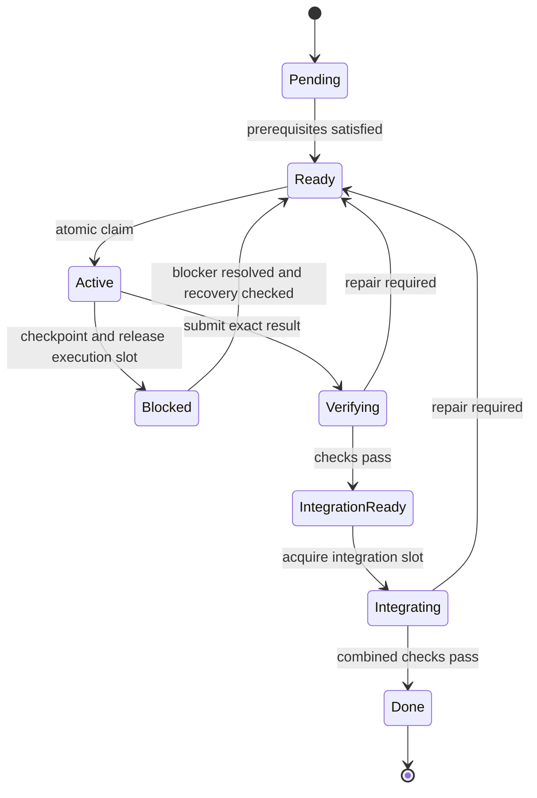

# AgentX development: Petri net as shared work state

Date: 2026-09-12. Status: focused design proposal; no runtime changes applied.

## Objective and scope

The user's refinement is the governing objective: make META HARNESS useful for an agent developing AgentX, with the Petri net managing global state across concurrent work.

Success means an agent can determine the current objective, relevant verified facts, its own commitment, other workers' commitments, available actions, blockers, and completion conditions from a shared durable state. This is the operational meaning of the agent's “state of mind.” Record decisions, assumptions, evidence, and resumable progress summaries; there is no need to store a transcript of private reasoning.

The work items are AgentX features and fixes. The manager remains harness tooling. Building AgentX's internal runtime goal system, feature 001, is a separate application task that this manager could later coordinate.

Initial proposed execution model: one coordinating agent and up to two delegated workers on one machine. This is an assumption pending the user's optional execution-model preference. The core contracts also support one agent switching tasks; independent sessions require additional ownership and runtime-integration validation. No distributed service is necessary for this first scope.

Keep one authoritative net bundle and the existing limit of at most 15 places. Reuse the current engine, CLI/tool entry point, revisions, and WORK.md projection where appropriate.

## What exists today

The read-only command `uv run scripts/omt/net_check.py probe` succeeded. At revision 57 it reports zero pending tasks, zero active tasks, seven done tokens, and no enabled transitions.

| Observation | Implication for the new objective |
|---|---|
| The live net has only `work_start` and `work_complete`. | It cannot express blocked work, handoff, verification, and integration as distinct lifecycle transitions. |
| `work_start` consumes the only `agent_attention` token; `work_complete` returns it. | Normal firing preserves `agent_attention + work_active = 1`; the current pool serializes work. |
| Source-edit, test, harness-round, and receipt places have no arcs in the live pool net. | Their presence does not establish task-specific resource reservations or parallel worker capacity. |
| The overlay has `subnets: {}` and no task/owner registry. | The inspected bundle holds aggregate counts without the named commitments an agent needs to act. |
| `work_complete` emits both `work_done` and `goal_satisfied`. | The net alone does not distinguish a finished worker patch from verified completion of the user's objective. |
| Probe advice reports bounds such as `work_done=0` while its live marking has `work_done=7`. | Advice needs to identify its analysis basis. Do not interpret this output as proof about the current live marking without establishing that basis. |

The serialized pool is intentional. Feature 053's implementation notes describe it as solo by construction and defer multi-session concurrency. The proposal extends that design to the newly emphasized use case; it does not claim the existing engine has failed its original specification.

Evidence: [live net](../../../.meta/.omt/META_NET.petri.json), [sidecar](../../../.meta/.omt/net_state.sidecar.json), [overlay](../../../.meta/.omt/supervisor.overlay.json), [feature 048](../../../.meta/software_development_process/2.requirements/features/feature_048.wip_limited_pool/FEATURE.md), [feature 053 implementation notes](../../../.meta/software_development_process/5.implementation/features/feature_053.net_gate_concurrency_predicate/implementation_notes.md), and [current concurrency project](../../../.projects/meta/meta_harness_concurrent/PROJECT.md). These runtime files are mutable; the values above are the inspected revision, not permanent repository facts.

## The agent-facing contract

One observation should answer these questions with a revision and evidence references:

| Question | Required state |
|---|---|
| What are we trying to accomplish? | User-approved objective, acceptance criteria, and relevant AgentX contracts. |
| What do we know? | Verified artifacts, explicit assumptions, unresolved questions, and their versions. |
| What am I responsible for? | Task, owner/claim, permitted write scope, expected output, and checkpoint. |
| What are other workers doing? | Named active tasks, owners, reservations, progress summaries, and outputs. |
| What can I do next? | Valid task-bound actions with dependency and capacity checks. |
| Why is something blocked? | Exact prerequisite, resource owner, failed check, or missing user decision. |
| Are we finished? | Required tasks integrated and objective-level acceptance verified. |

Preserve the existing NEXT / Other enabled / Blocked / Resources ordering, but render task-bound actions such as “implement session persistence” and “verify retrieval behavior.” `work_start` by itself is not enough guidance. An empty enabled list must distinguish idle, successful completion, unmet dependencies, exhausted capacity, and inconsistent state.

## One bundle, with identifiable work

Keep the compact Petri net for lifecycle and aggregate capacity. Add task bindings as part of the same authoritative, revisioned bundle. Each named task binds to exactly one lifecycle place; the marking must equal the count of bindings in each place.

A minimal task binding contains:

- Stable task ID, parent AgentX feature/objective, and acceptance references.
- Dependencies, including which verified output or contract version satisfies each dependency.
- Current lifecycle place, owner, claim generation, and last checkpoint.
- Write scope, required resources, and isolated workspace or patch identity.
- Result references, verification evidence, integration status, and block reason.

WORK.md and agent summaries are derived views. The ledger records accepted events for audit/recovery. All authoritative binding and marking changes pass through one transaction path; agents cannot update the task map independently of the net.

This is a binding layer over the existing P/T engine, not a claim that anonymous integer tokens already encode task identity. Raw net analysis establishes aggregate properties. The manager must additionally validate task dependencies, claim ownership, scope conflicts, and evidence. With a small generic net, those task-specific properties do not become structurally proven merely because the net is bounded.

## Proposed lifecycle

This diagram shows the lifecycle of one named task. Multiple task tokens can occupy different states simultaneously. It omits resource arcs and is a lifecycle sketch, not the final Petri-net specification.

These eight lifecycle places plus three resources—free worker slots, test slots, and an integration slot—fit within the existing 15-place limit. Resource acquisition/release arcs, cancellation, and ownership-transfer rules still require a precise operation specification and conservation checks before implementation. A worker slot is held only during actual execution; blocked or queued tasks do not consume it. Long test/integration operations reserve their own resources. Task-scoped file/contract reservations live in the binding layer and are validated jointly with firing.

The coordinator's attention is distinct from worker capacity. One coordinator can supervise two workers without giving itself two simultaneous reasoning threads. Merely changing `agent_attention` from one token to two would not establish safe concurrency.

## Ownership, concurrency, and recovery

A claim must atomically check the expected revision, task readiness, absence of an incompatible owner, capacity, and scope conflicts, then issue an owner-specific generation. Two contenders for one task must yield one winner. A global revision identifies the observation; an unchanged owner's claim generation remains valid when an unrelated task advances.

Use one local transaction authority. A revision check followed by an unlocked write is insufficient for competing writers. The implementation must serialize compare-and-update and provide crash recovery across the bundle and its audit record. This proposal does not assume that the current three-file update code already provides multi-process isolation.

For work enrolled in this manager, require a valid claim from the first writer. Current active-count-based gate activation is useful for today's solo pool, but an active count of one cannot prove that another worker will not arrive next. Claim validation and existing phase/test/knowledge gates have separate responsibilities.

Prefer isolated task workspaces for parallel source changes and a coordinator-owned integration workspace. All workers must address the same coordination root even if their repository worktrees differ. Reserve shared contracts and integration explicitly; disjoint filenames alone do not guarantee independent changes. Every supported mutation route must honor ownership, or be confined to an isolated workspace whose results the coordinator can reject.

Checkpoint on meaningful progress, block, or handoff. Record the result location, completed checks, remaining work, and the next action. A lost worker becomes a recovery candidate; an expired heartbeat alone must not authorize a second writer over its files. Verify isolation or that the old process has stopped, preserve its artifacts, advance the claim generation, and release resources exactly once. A stale worker cannot publish or integrate results under the old generation. Metadata fencing alone cannot stop a process with unrestricted filesystem access; workspace isolation and the actual mutation/integration boundary must enforce it.

## AgentX example

Consider an illustrative feature: expose retrieval progress in AgentX's UI. This is a design example, not a task newly added to the backlog.

1. Establish and verify the controller/partner event contract.
2. Worker A implements the retrieval-side event production; worker B implements its UI presentation against that versioned contract.
3. Each worker owns a task, permitted scope, workspace, and acceptance checks. Both can proceed if capacity and contract reservations permit.
4. If A needs to change the shared contract, the manager records that dependency change. B's completed checks against the previous version cannot silently qualify the new combination.
5. The coordinator integrates both outputs and verifies the combined behavior and AgentX's MVC++ boundaries.
6. The feature is satisfied only after the required integrated evidence passes.

The shared state makes responsibility and consequences explicit. The agent still exercises engineering judgment when decomposing the objective, selecting among valid actions, and interpreting failures.

## First implementation slice

Prioritize a complete small workflow over expanding the net's operation catalog:

1. **Named work and truthful observation:** task bindings, objective/dependency references, revisioned task-specific menu, and explicit idle/blocked/done meanings. Label live versus initial-marking analysis.
2. **Atomic ownership and two workers:** task claims, scope validation, capacity, shared coordination root, and isolated outputs. Exercise two workers on the same AgentX objective.
3. **Recovery and evidence-based completion:** checkpoints, ownership transfer, verification, serialized integration, and objective-level acceptance.

Proposed acceptance demonstration: two independent AgentX tasks proceed together; a conflicting third task waits with the exact reason; one worker is interrupted and resumed without losing its edits; a stale owner cannot integrate; a deliberate combined-behavior failure prevents goal completion; a fresh agent recovers the situation from shared state without reading the conversation.

Test joint state invariants and real adapter boundaries. In particular: named tasks equal token counts, each task has at most one effective owner, capacities are conserved, retries are idempotent, dependencies use current accepted evidence, and no task reaches Done on a worker's self-report alone. Report measured coordination overhead during this concrete AgentX scenario, rather than starting a separate generic harness benchmark program.

## Decision and evaluation boundary

Recommended direction: extend the current pool into a compact, identifiable and recoverable coordinator for AgentX development. This scope supersedes the broad improvement priorities in IMPROVEMENT_OPTIONS.md for the user's next discussion.

The historical project explicitly excluded AgentX work and deferred multi-session execution. The current user direction supplies a new purpose for evaluation and planning. A concrete implementation plan should record that scope update, the chosen execution model, and the jointly evaluated net/binding semantics; it should not silently reinterpret the old project decisions.

Evaluation used current design artifacts and a read-only live probe. The workflow's artifact-based analysis stage limits claims about implementation internals; transaction isolation, adapter enforcement, and crash recovery remain to be inspected and tested during implementation planning. The Mermaid-in-Markdown skill guided the lifecycle diagram's notation. No source, tests, live net, task queue, or existing project state was changed by this proposal.
